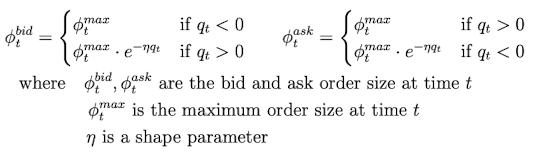

Following our [initial blog post](/blog/2021-04-avellaneda-stoikov-market-making-strategy/) on the new `avellaneda_market_making` strategy, we are back with deeper, more mathematical dive into ths strategy! Today we will explain how we modified the original Avellaneda-Stoikov model for the cryptocurrency industry, along with how we simplified the calculation of key parameters (greeks). 

The purpose of this article is to mathematically back assumptions and calculations that helped translate the authors' model into one more suitable for Hummingbot traders.

# Original model and our proposed extensions
First, let's briefly recap the core equations from the [Avellaneda-Stoikov paper](https://www.math.nyu.edu/faculty/avellane/HighFrequencyTrading.pdf):

## Original model

Reservation price (market price, adjusted toward your target inventory level):

$$
r(s,q,t,\sigma)=s-q\gamma\sigma^{2}(T-t)
$$

Optimal spread around reservation price:

$$
\delta^{a}+\delta^{b}=\gamma\sigma^{2}(T-t)+\frac{2}{\gamma}ln(1+\frac{\gamma}{\kappa})
$$

Where:
- s [quote asset] = current mid price
- q [no unit] = quantity of stocks in inventory of base asset (could be positive/negative for long/short positions)
- $\gamma$ [1/quote asset] = inventory risk aversion parameter
- $\sigma$ [quote asset] = volatility
- T [no unit] = closing time (conveniently normalized to 1)
- t [no unit] = current time (T is normalized = 1, so t is a time fraction)
- $\delta^{a}, \delta^{b}$ [quote asset]= Bid/Ask spread (they are symmetrical to reservation price → $\delta^{a}=\delta^{b}$
- $\kappa$ [1/quote asset]= Order book *liquidity* parameter

## Proposed extensions

The paper's model is built under the following assumptions:
1. Order amount is not defined
2. Volatility is constant
3. Order book statistical characterization is constant
4. The market maker intends to maximize profit using a total inventory _q_ during a limited _T_ time horizon

Since these assumptions may not be suitable for crypto trader, we propose the following changes:
1. Since Hummingbot enables traders to specify the order amount, we introduce an an additional parameter `order_amount_shape_factor` ($\eta$) that adjusts order amount given inventory position, as described in the 2018 [Optimal High-Frequency Market Making](http://stanford.edu/class/msande448/2018/Final/Reports/gr5.pdf) paper.
2. To account for the rapidly changing volatility that exists in crypto, we propose a volatility diff threshold which, if surpassed, will trigger recalculation of the strategy parameters `vol_to_spread_multiplier`.
3. Recalculation as in point 2.
4. Since running bot may have infinite time horizon, our solution is to have a finite `closing_time` (_T_) but with recycle of remaining time fraction _t_ together with parameter recalculation every time t=T.

# Calculation of $\gamma$, $\kappa$ and $\eta$

## Intro

With the original Avellaneda equations, we are faced with multiple degrees of freedom. We can pick any value for these parameters, so some constraints are needed. Since bid/ask spread to mid-price is one of the most important values for our bots, that should be a reasonable choice to build our criteria. Also, as the paper states, $\gamma$ acts like a risk aversion parameter to inventory risk. We want a *knob* parameter to control that factor while meeting the spread parameters set by the user.

## Calculation of $\gamma$

We will work under the assumption that user has set both `min_spread` and `max_spread` parameters when configuring the strategy. For the calculation of the maximum possible risk factor ($\gamma$), the author works with the initial spreads optimal bid/ask to mid-price ($\delta^{a}$ and $\delta^{b}$), which should not be smaller than min spread nor bigger than max spread (in relationship to the mid-price).

Note: As the delta between reservation price and mid price ($\Delta$) and optimal spreads are functions of (t-T), for decreasing absolute value of _q_ (approaching the target inventory level), it can be safely said that spreads of optimal bid and ask to mid-price will be decreasing as time goes by. Therefore, **the following calculations will be centered at the moment t=0 where spreads are the widest possible**.

The image below shows the distribution of price levels and spreads when there is an excess of inventory, so the reservation price is lower than the mid price and spreads are adjusted accordingly:

### q&gt;0 (inventory needed to be decreased)

First,

$$
Spread\ optimal\_ask\le Spread\ optimal\_bid
$$

To comply with maximum and minimum spreads:

$$
\begin{aligned}
Spread\ optimal\_ask_{t=0}&\ge Min\ Spread \\[0.1in]
Spread\ optimal\_bid_{t=0}&\le Max\ Spread
\end{aligned}
$$

We will now calculate an expression for these spreads at t=0. First, the ask spread:

$$
\begin{aligned}
Spread\ optimal\_ask_{t=0}&=optimal\ ask_{t=0}-s \\[0.1in]
Optimal\ ask_{t=0}&=r(s,0)+\frac{(\delta^{a}_{t=0}+\delta^{b}_{t=0})}{2}
\end{aligned}
$$

Replacing equations for r(s,t) and optimal spread...

$$
Spread\ optimal\_ask_{t=0}=s-\left[s+q\gamma\sigma^{2}+\frac{1}{2}\left[ \gamma\sigma^{2}+ln(1+\frac{\gamma}{\kappa})\right]\right] \ge Min\ Spread
$$

So expression reached is:

$$
(\frac{1}{2}-q)\gamma\sigma^{2}+\frac{1}{2}ln(1+\frac{\gamma}{\kappa})\ge Min\ Spread
$$

---

Similarly, with the bid spread, the limitation will be the maximum spread set by the user in this case:

$$
\begin{aligned}
Spread\ optimal\_bid_{t=0}&=s-optimal\ bid_{t=0} \newline\\[0.1in]
Spread\ optimal\_bid_{t=0}&=s-\left[ s-q\gamma \sigma^{2}-\frac{1}{2}\left(\gamma \sigma^{2}+ln(1+\frac{\gamma}{\kappa})\right)\right] \le Max \ Spread
\end{aligned}
$$

Which leads to the expression:

$$
(\frac{1}{2}+q)\gamma \sigma ^{2}+\frac{1}{2}ln(1+\frac{\gamma}{\kappa}) \le Max\ Spread
$$

Taking both inequalities and adding them up together the following result is reached:

$$
\begin{aligned}
(\frac{1}{2}-q)\gamma\sigma^{2}+\frac{1}{2}ln(1+\frac{\gamma}{\kappa})&\ge Min\ Spread \\[0.1in]
-(\frac{1}{2}+q)\gamma\sigma^{2}-\frac{1}{2}ln(1+\frac{\gamma}{\kappa})&\ge -Max\ Spread
\end{aligned}
\\[0.3in]
2q\gamma\sigma^{2} \le Max\ Spread - Min\ Spread
$$

---
### q&lt;0 (inventory needed to be increased)

In the same way, for the opposite case, if q&lt;0 the final expression reached is:

$$
-2q\gamma\sigma^{2} \le Max\ Spread - Min\ Spread
$$

So both cases can be treated using $\|q\|$, and then **the following inequality for $\gamma$ holds**

$$
\gamma \le \frac{Max\ Spread-Min\ Spread}{2\|q\|\sigma^{2}}=\gamma_{max}
$$

As `risk_factor` ($\gamma$) is non-negative, with this maximum threshold calculated, we now have a range for all possible $\gamma$ values. The previously mentioned *knob* will be a coefficient ranging from 0 to 1, which will define where within this range will $\gamma$ be. This coefficient will be called `inventory_risk_aversion` (IRA).

Final equation for $\gamma$:

$$
\gamma=\gamma_{max}*IRA=\frac{Max\ Spread-Min\ Spread}{2\|q\|\sigma^{2}}*IRA
$$

## Calculation of $\kappa((\delta_{a}+\delta_{b})_{max})$

`order_book_depth_factor` ($\kappa$) will selected so that the algorithm starts with the maximum possible spread at t=0. This decision appears arbitrary, but the argument behind it is to go through a wider range of spreads so as to maximize strategy profitability. So to start with the calculation, we will first determine the maximum possible spread at t=0.

$$
spread_{t=0}=\frac{\delta_{a}+\delta_{b}}{2}\pm \Delta
$$

The order furthest from the mid price will be the one where terms are added, so we calculate:

$$
\begin{aligned}
\frac{\delta_{a}+\delta_{b}}{2}+ \Delta&\le Max\ Spread \\[0.1in]
(\delta_{a}+\delta_{b})_{max}&=2Max\ Spread-2\Delta \\[0.05in]
&=2Max\ Spread-2\|q\|\gamma\sigma^{2} \\[0.05in]
&=2Max\ Spread-2\|q\|\sigma^{2}*\frac{Max\ Spread-Min\ Spread}{2\|q\|\sigma^{2}}*IRA \\[0.05in]
&=(2-IRA)*Max\ Spread+IRA*Min\ Spread
\end{aligned}
$$

Now, from this maximum optimal spread at time t=0, **$\kappa$ can be inferred as a function of this spread** using the paper's equation for $\delta_{a}+\delta_{b}$

Final equation for $\kappa$:

$$
(\delta_{a}+\delta_{b})_{t=0}=(2-IRA)*Max\ Spread+IRA*Min\ Spread \newline\\[0.1in]
\kappa\bigg((\delta_{a}+\delta_{b})_{t=0}\bigg)=\frac{\gamma}{exp\{\frac{(\delta_{a}+\delta_{b})_{t=0}\gamma-\sigma^{2}\gamma^{2}}{2}\}-1}
$$

## Calculation of $\eta$

Recall that `order_amount_shape_factor` ($\eta$) is a modifier to order amount, borrowed from the 2018 Fushimi paper (see References).

Basically from both orders submitted in the strategy proposal, the one going against reaching the target inventory will be decreased in size exponentially based on how far bot is from reaching target _q_. This is similar to the [inventory skew](https://docs.hummingbot.io/strategies/inventory-skew/) approach in Hummingbot's pure market making strategy.

Leveraging the `inventory_risk_aversion` (IRA) parameter defined earlier, the amount of decay in the exponential decay function will be controlled by IRA:

$$
q_{decay}=\frac{Total\,inventory\,in\,base\_asset}{IRA}\newline\\[0.1in]\eta=\frac{1}{q_{decay}}
$$

## What happens if $IRA \to 0 \implies \gamma \to 0$

We have seen what happens to reservation price and optimal spread when $\gamma=\gamma_{max}$. But what happens if $\gamma=0$?

If you read previous Avellaneda strategy post, you will know that if $IRA \to 0$ (which is equivalent to $\gamma \to 0$), then *knob* is set to no inventory risk aversion. That means that user simply sets spreads symmetrical to mid-price, but can you imagine what will be the final spread values? Lets do the math...

$$
IRA \to 0 \implies \gamma \to 0 \newline\\[0.1in]
t=0 \implies (T-t)=1 \newline\\[0.3in]
\lim_{\gamma \to 0} r(s,q,t=0,\sigma) = s \\[0.3in]
\lim_{\gamma \to 0} \delta^{a}+\delta^{b}(q,t=0,\sigma) = \lim_{\gamma \to 0} \frac{2}{\gamma}ln(1+\frac{\gamma}{\kappa})=\lim_{\gamma \to 0} \frac{2}{\gamma} \frac{\gamma}{\kappa}=\frac{2}{\kappa}\\[0.1in]
$$

So we know about reservation price that $r(s,q,t=0,\sigma) \xrightarrow{\gamma \to 0} s$ and that optimal spread $\delta^{a}+\delta^{b}(q,t=0,\sigma) \xrightarrow{\gamma \to 0} \frac{2}{\kappa}$. Lastly, we calculate $\kappa$,

$$
\begin{aligned}
\lim_{\gamma \to 0} \kappa((\delta_{a}+\delta_{b})_{max}) &= \lim_{\gamma \to 0}\frac{\gamma}{exp\{\frac{(\delta_{a}+\delta_{b})_{max}\gamma-\sigma^{2}\gamma^{2}}{2}\}-1}\\[0.1in]
&=\lim_{\gamma \to 0} \frac{\gamma}{\{1+\frac{(\delta_{a}+\delta_{b})_{max}\gamma-\sigma^{2}\gamma^{2}}{2}\}-1}= \lim_{\gamma \to 0} \frac{\gamma}{\gamma(\frac{(\delta_{a}+\delta_{b})_{max}-\sigma^{2}\gamma}{2})}\\[0.1in]
&=\lim_{\gamma \to 0} \frac{2}{((\delta_{a}+\delta_{b})_{max}-\sigma^{2}\gamma)} \\[0.1in]
&= \frac{2}{(\delta_{a}+\delta_{b})_{max}}
\end{aligned}
$$

This means, that if $\gamma \to 0$ spread around r = mid_price will be fixed

$$
r = s\\[0.1in]
If\ \gamma \to 0 \implies IRA \to 0\ \therefore\\[0.1in]
(\delta_{a}+\delta_{b})=(\delta_{a}+\delta_{b})_{max}=(2-IRA)*Max\ Spread+IRA*Min\ Spread=2*Max\ Spread
$$

So in the case $\gamma \to 0$ this is the same as a regular pure market making strategy with symmetrical spread = Max Spread around mid-price. **In this way, pure market making strategy becomes a special case of Avellaneda market making strategy.**

# References

[*High-frequency trading in a limit order book (Avellaneda and Stoikov, 2006)*](https://people.orie.cornell.edu/sfs33/LimitOrderBook.pdf)

[*Optimal High-Frequency Market Making (Fushimi, Gonzalez Rojas and Herman, 2018)*](http://stanford.edu/class/msande448/2018/Final/Reports/gr5.pdf)