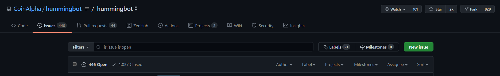
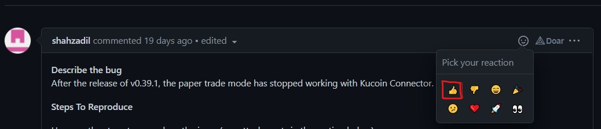

# Help us improve Hummingbot with a simple vote

by Paulo H. B. Rebouças

Since we released Hummingbot out on the wild, we have seen a steady increase in our community size.

Over time, we learned how important it is to listen to our community and what the Hummingbot users think we could improve on this fantastic trading tool.

Our team is constantly monitoring our [Discord channel](https://discord.com/invite/hummingbot) so that we can understand what is important to you.

As our community size increases, this task gets more significant, and we don’t want to miss anything, so we are proposing a new way to send your feedback: **Upvoting Github Issues**.

<!-- more -->

## Github is a great place to tell us what you think we can improve

And the best part is: you don’t need to know how to program to create an issue with your suggestion!

All you need is a Github account (which is free). After that, just click on “New Issue” with your feedback.

Some exciting ideas we implemented on the client originated from a Github issue created by our community.

As our user base increases, we need to answer the question:

**How should we prioritize ideas that will matter the most for Hummingbot users?**

Github Issues

At the time of writing, there are 446 open issues.

Although we have a great development team, there is not enough time to properly discuss and implement all details of all open issues.

Because of that, we are asking our community to help prioritize the critical issues by voting on the ones you think our team should address first.

## Cast your vote on which bug you think we should focus on fixing first

On [this link](https://vote.biglybt.com/CoinAlpha/hummingbot/bug?ref=blog.hummingbot.org), you can find list of all bug tickets we have currently open, and you can vote on which one affect you the most.

To be able to cast a vote using this page, you have to authorize your Github account.

But alternatively, you can also cast a vote directly on Github.

If you click on the bug’s title, you will be directed to the Github page and read all the comments.

From there, you click on the upvote reaction on the top of the description.

Voting this way will also count on the total number of votes shown on the [voting page](https://vote.biglybt.com/CoinAlpha/hummingbot/bug?ref=blog.hummingbot.org).

## This is only the starting point

When the next development cycle starts, the most voted bugs on the list will be brought to our team to discuss how to fix them.

This is the start of an experiment on finding better ways to listen to our community feedback and help our team figure out how to better prioritize the development of Hummingbot.

We expect to learn more about what improvements matter more to hummingbot users, and shortly, expand this process to other types of suggestions, like new features and new strategies.

A big thank you for this fantastic community, and always remember that your feedback is of great importance for us to build a better product every day!