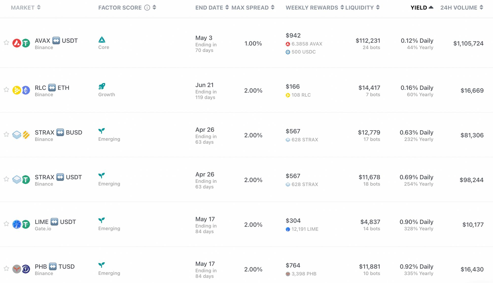

# Introduction to Hummingbot and Liquidity Mining Campaigns


## What is Hummingbot?

Hummingbot is a high-frequency algorithmic trading bot written in Python and Cython that allows users to run market making bots on its supported exchanges.

Everything you learned during the previous lessons such as creating an order, cancelling an order, and executing trades can be done with Hummingbot - but a lot of times faster even while you're doing other things.

To use Hummingbot, you can try out our online Test Drive (deprecated) or desktop [client app](../../../installation/index.md). We will go through the set up in Stage 2: Beginner level.

<!-- more -->

## Hummingbot Liquidity Mining Campaigns

The Hummingbot miner campaigns is a platform for market makers to earn extra rewards by providing liquidity to the markets listed in the platform. You **do not have** to use Hummingbot software to be able earn liquidity mining rewards.


## What is liquidity mining?

Liquidity mining is the action of providing liquidity by users through creating maker orders and contributing to the order book depth and liquidity of the market.

Liquidity mining **rewards** are earned by users for creating maker orders for specific tokens and trading pairs

<iframe style="width:100%; min-height:400px;" src="https://www.youtube.com/embed/ME5osB8sX_s?list=PLDwlNkL_4MMcocIaFMsnddm-T7nFV_zZM" frameborder="0" allow="accelerometer; autoplay; encrypted-media; gyroscope; picture-in-picture" allowfullscreen></iframe>

## Hummingbot Liquidity mining vs AMMs and other liquidity mining options

Unlike AMM (automated market maker) platforms like Uniswap, Hummingbot focuses on DMM (Decentralized Market Making) in which users can pick and adjust their own strategies to provide liquidity to the market instead of relying on automated market making algorithms. By doing so, you have more flexibility of the how you can adjust your orders in different markets by running your own bots.

### Hummingbot vs Uniswap

[https://hummingbot.io/en/blog/2019-04-hummingbot-vs-uniswap/?ref=blog.hummingbot.org](../2019-04-hummingbot-vs-uniswap/index.md)


### Hummingbot vs other liquidity mining options

[https://hummingbot.io/en/blog/2020-08-liquidity-mining-hummingbot-vs-defi/?ref=blog.hummingbot.org](../2020-08-liquidity-mining-hummingbot-vs-defi/index.md)

## How do Hummingbot liquidity mining campaigns work

In our market campaigns like, you will be able to see the market (token pairs) in which the rewards are given, the exchange you have to be on for market making, as well as the reward amount given to the users. Usually, more well established pairs (eg. with higher CoinMarketCap ranking) have more popularity hence more people mining on those pairs. Hence, the yield you will be able to get is usually smaller. The vice versa is also true: the riskier the pair, the less liquidity provided by the users, hence higher the yield.



### How are rewards allocated?

To learn more about how liquidity mining works on Hummingbot you can read the Liquidity mining whitepaper.

[Whitepaper](https://coinalpha.com/liquidity-mining.pdf)

To provide a brief overview: [Rewards](../2019-12-liquidity-mining-rewards/index.md)

Rewards are allocated according to three main factors **1) time, 2) spread, 3) order sizes.**

1. Weekly Rewards are first equally divided into per-minute snapshot intervals. The total amount allocated to all users for a campaign is the same every minute. The more miners and the bigger order size, the more competitive the market is. The money you get will be less.


2. **Rewards** are allocated into buckets according to spread, with higher rewards allocated for tighter spreads. **The tighter your spread is, the more the rewards exponentially**. Half of the rewards are allocated to the bid side, and half to the ask side.

HBOT uses a spread density function to reflect the spread into the return function. Higher spreads mean lower risks (fill order) and lower returns. Choosing the right spread is key to balancing risk and returns.


3. Rewards are finally distributed to users proportional to their open order sizes, **NOT filled orders**. Larger open orders mean higher returns and risks.
4. You do not need to use Hummingbot Miner to get the rewards. You can use any bot, or your own program.

**How can you maximize profits?**

We will discuss more in the beginner level section. It may seem lucrative to invest your entire capital in the currency pair with the highest daily yield and get a higher return by setting a small spread. However, please note that profit and risk are directly proportional. As a result of this aggressive approach, the gains made are likely to be far less than the trading losses caused by frequent trades and trading fees.

**A better choice:** choose a currency pair with low volatility but good returns; choose a suitable spread and avoid executing orders.

### Max spread, mid price, and spread requirements

**bid-ask spread**

The bid-ask spread is the difference between the highest price a buyer is willing to pay for an asset and the lowest price a seller is willing to accept. These prices are reflected as bids and asks on an order book, placed by market makers as limit orders.

Price takers will place market orders to buy or sell an asset, and in doing so they accept

 the best bid or best ask determined by the market maker.

If unclear, review Creating orders in an exchange, Maker and Taker Orders in [Basic Crypto Trading](https://www.notion.so/Basic-Crypto-Trading-90d150479ea34bddad07d68250b9fb70?ref=blog.hummingbot.org).

In Hummingbot, the `bid_spread` is the % how far from the mid price you want your buy orders are placed. While `ask_spread` is for your sell orders.

Mid price is **NOT** the price that you see in the middle of the orderbook - that's the last trade price.

Mid price is the average price of the best bid and ask. Which means:

```python
mid_price = (best_bid + best_ask) / 2
```

And your order prices are calculated as follows:

```python
hbot_bid_price = mid_price * (1 - bid_spread)
hbot_ask_price = mid_price * (1 + ask_spread)
```

**Max spread requirements**

To qualify for rewards on liquidity mining campaigns, your **open orders (NOT** filled orders, and filled orders do not have spread**) have to be placed with spreads lower than the max spread requirements listed in each campaign.

The max spread requirements is the **max spread for each of the bid and ask side**. For example, if the max spread in the campaign list is 1%, it means that max bid spread is 1%, and the max ask spread is also 1%.