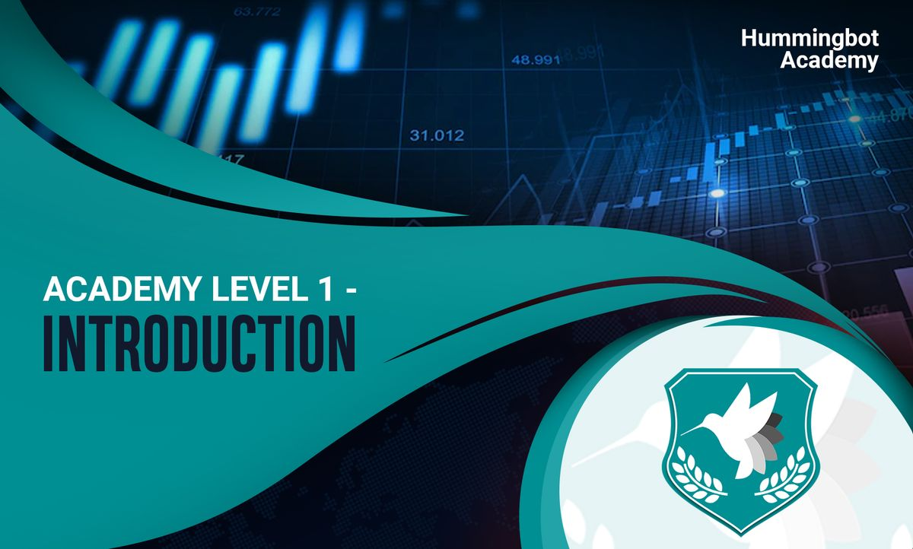

# Hummingbot Academy


Welcome to **Level 1** of Hummingbot Academy!

In this level, we’ve provide you with the basic concepts of crypto trading, introduce you to Hummingbot and our miner platform, and provide you with links to help navigate our resources online and through our community.

We recommend that you start with the Reading for Level 1. If you already have experience with crypto trading and understand what market making is, feel free to just skim through Level 1 A, and move on to level 1B.


<!-- more -->

### Reading for Level 1: Table of Contents

[**[Academy Level 1] A. Introduction — Basic concepts of Crypto Trading**](../2022-01-level-1-b-introduction-to-hummingbot-and-hummingbot-liquidity-mining/index.md)

[Basic Concepts](../2022-01-level-1-basic-concepts-of-crypto-trading/index.md)

- [Order Book](../2022-01-level-1-basic-concepts-of-crypto-trading/index.md#order-book)
- [Liquidity](../2022-01-level-1-basic-concepts-of-crypto-trading/index.md#liquidity)
- [Limit and market orders](../2022-01-level-1-basic-concepts-of-crypto-trading/index.md#limit-and-market-orders)
- [Bid-ask spread](../2022-01-level-1-basic-concepts-of-crypto-trading/index.md#bid-ask-spread)
- [Slippage](../2022-01-level-1-basic-concepts-of-crypto-trading/index.md#slippage)

[What is market making](../2022-01-level-1-basic-concepts-of-crypto-trading/index.md#what-is-market-making)

- Market makers and market takers
- Market Making vs Arbitrage
- [Trading terminologies 101](../2022-01-level-1-basic-concepts-of-crypto-trading/index.md#trading-terminologies-101)
- Trading pairs
- Base and quote assets
- Minimum order size
- Finding out minimum order size with Postmas
- Trading fees
- Stable coins, fiat currencies, and ERC20 tokens
- [How to trade crypto: an introduction](../2022-01-level-1-basic-concepts-of-crypto-trading/index.md#how-to-trade-crypto-an-introduction)
- [Helpful tasks](../2022-01-level-1-basic-concepts-of-crypto-trading/index.md#helpful-tasks)

[**[Academy Level 1] B. Introduction to Hummingbot and Hummingbot Liquidity Mining Campaigns**](https://www.notion.so/Academy-Level-1-B-Introduction-to-Hummingbot-and-Hummingbot-Liquidity-Mining-Campaigns-f937477650264fe9881d6381a3e95f58?ref=blog.hummingbot.org)

- [What is Hummingbot?](../2022-01-level-1-b-introduction-to-hummingbot-and-hummingbot-liquidity-mining/index.md#what-is-hummingbot)
- [Hummingbot Liquidity Mining Campaigns](../2022-01-level-1-b-introduction-to-hummingbot-and-hummingbot-liquidity-mining/index.md#hummingbot-liquidity-mining-campaigns)
- [What is Liquidity mining?](../2022-01-level-1-b-introduction-to-hummingbot-and-hummingbot-liquidity-mining/index.md#what-is-liquidity-mining)
- Liquidity mining explained
- How do Hummingbot liquidity mining campaigns work
- How are rewards allocated?
- Max spread, mid price, and spread requirements

### [**Resources to get started**](../2022-01-level-1-b-introduction-to-hummingbot-and-hummingbot-liquidity-mining/index.md)


Below are some of the resources you may find yourself using more often as you're learning more about Hummingbot and getting up to speed.

1. [Hummingbot Documentation](https://docs.hummingbot.org)
2. [Hummingbot Academy](https://docs.hummingbot.org)
3. [Hummingbot Help Center](https://docs.hummingbot.org)
4. [YouTube Channel](https://www.youtube.com/channel/UCxzzdEnDRbylLMWmaMjywOA?ref=blog.hummingbot.org)
5. [Blog Posts](https://docs.hummingbot.org/blog/)
6. [GitHub Repository](https://github.com/hummingbot/hummingbot)

### **Importance of Community**


The most important thing for you to do to get started is still joining our Discord community:

[Discord Server](https://discord.com/invite/hummingbot?ref=blog.hummingbot.org)

We’ve had conversations

 with many of the traders on Hummingbot and we’ve learned that for those who have been successful after onboarding, most of them were able to do so because they messaged on the Discord community and some community members shared with them tips and advice on market making.

Therefore, don’t hesitate to post and ask questions on Discord! Some helpful channels are #trader-chat and #liquidity-mining

### **Mission**


**Mission:** Join our community on Discord (WeChat for China)

- Join our community Discord: [https://discord.com/invite/hummingbot](https://discord.com/invite/hummingbot?ref=blog.hummingbot.org)
- Introduce yourself and post a question in #trader-chat or #liquidity-mining
- Read past chats on #trader-chat and $liquidity-mining. DM any members you find helpful to learn from them.
```