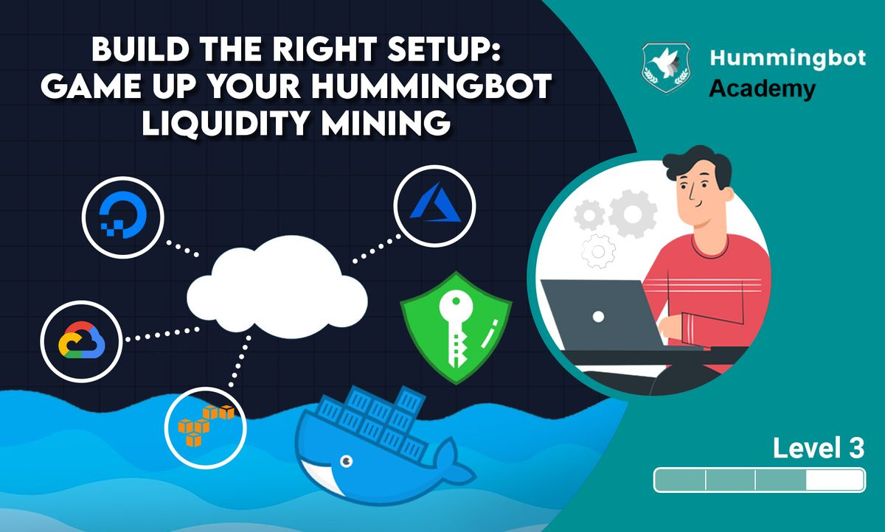

# Build the right setup: game up your Hummingbot liquidity mining


## Running Hummingbot 24/7 in the cloud

### **Why do we need to set up cloud servers?**

When running Hummingbot locally on your computer, closing the application or shutting down your machine also stops the bot from trading. Also, running locally relies on your computer's resources and internet connection.

<!-- more -->

It is important to get a proper set up for Hummingbot for long term success. By setting up Hummingbot on a cloud server, you’ll be able to run Hummingbot 24/7 and not miss out on any rewards. Some advanced users use cloud servers running on Linux to keep Hummingbot in the background.

### **What are cloud servers?**


<iframe width="200" height="113" src="https://www.youtube.com/embed/1ERdeg8Sfv4?feature=oembed" frameborder="0" allow="accelerometer; autoplay; clipboard-write; encrypted-media; gyroscope; picture-in-picture" allowfullscreen title="Cloud Services Explained - tutorial for beginners"></iframe>

### ***Picking the right cloud server***

**Comparing different cloud servers**

For users who are looking to run Hummingbot for prolonged periods of time, especially multiple bots simultaneously, local installation can be limiting. Currently, each bot requires its own docker image, which can use up local computing power, memory, and storage. Further, your bots can only be running for as long as your computer is in use, limiting your liquidity mining rewards if your computer has to be offline / shut down from time to time. With the cloud, you can solve all of these issues.

Review our blog post and documentation. It is also important to note that Hummingbot is not limited to running in the cloud providers mentioned. AWS, GCP and Azure are the ones we tested so far and we have seen users running Hummingbot on others.

This blog post examines the pros and cons of four major cloud hosting companies to host Hummingbot:

1. Google Cloud Platform
2. Amazone Web Services
3. Microsoft Azure
4. Digital Ocean

[How to run Hummingbot in the cloud: comparing different cloud providers](../2019-06-cloud-providers/index.md)

[Home - Hummingbot Foundation](/installation/index.md)

If you qualify to be a [Hummingbot Eagle Club member](../2020-04-hummingbot-eagle-club-launch/index.md) , you will be able to get US$5K free AWS credits as a start.

## Getting the right set up

### **Basic Linux commands**


If you are not familiar with Linux, it is important to get familiarized with the terminal commands starting from navigating the directories and making changes to a file.

You can practice in your Linux cloud server or in this web-based terminal.

[JSLinux](https://bellard.org/jslinux/vm.html?cpu=riscv64&url=buildroot-riscv64.cfg&mem=256&ref=blog.hummingbot.org)

### **SSH Keys**


Your SSH keys are required to gain access to the server. Follow the steps in the links below based on your operating system.

[How to install and use puttygen to create new key pairs and change passphrases. Installing keys on server, managing SSH keys.](https://www.ssh.com/ssh/putty/windows/puttygen?ref=blog.hummingbot.org)

[How to generate an SSH key pair in Mac OS?](https://www.siteground.com/kb/how_to_generate_an_ssh_key_pair_in_mac_os/?ref=blog.hummingbot.org)

[Ssh-keygen is a tool for creating new authentication key pairs for SSH. This is a tutorial on its use, and covers several special use cases.](https://www.ssh.com/ssh/keygen/?ref=blog.hummingbot.org)

### **Installing via Docker**

The [Hummingbot DockerHub](https://hub.docker.com/r/hummingbot/hummingbot?ref=blog.hummingbot.org) publishes Docker images for the `master` (latest) and `development` builds of Hummingbot, as well as past versions. Some advanced users prefer using Docker instead of installing from source. They find it easier and more convenient because of the following :

- You don't have to install locally all the dependencies e.g. anaconda/miniconda
- You don't have to compile it locally
- Easier to update compared to when updating from source
- Docker images are already pre-installed (environment, dependencies) and pre-compiled

We recommend this path for users who run Hummingbot on Linux, in the cloud, and/or multiple bots.

<iframe width="200" height="113" src="https://www.youtube.com/embed/_dfLOzuIg2o?feature=oembed" frameborder="0" allow="accelerometer; autoplay; clipboard-write; encrypted-media; gyroscope; picture-in-picture" allowfullscreen title="What is Docker in 5 minutes"></iframe>

### **Hummingbot Documentation: Install via Docker:**


Linux:

[Docker Documentation](https://docs.docker.com/desktop/install/linux-install/)

macOS

[Docker Documentation](https://docs.docker.com/desktop/install/mac-install/)

Windows

[Docker Documentation](https://docs.docker.com/desktop/install/windows-install/)

### **Basic Docker commands**


Here are some important Docker commands you will be using more as support and if not, you need to understand how they work and what each commands does. Look them up and see what each command does, better if you can test to see it in actual.

```
docker inspect ...
docker ps -a
docker stop ...
docker attach ...
docker run ...
docker rm ...
docker rm $(docker ps -a -q)
docker rmi ...
docker pull ...
```

If you want to learn more about it you can visit their documentation.

[Docker run reference](https://docs.docker.com/engine/reference/run/?ref=blog.hummingbot.org)

### **Installing from source**


This installation type is more for developers, both internal and external, who wants to contribute to the code base. It's just cloning from GitHub repo [https://github.com/hummingbot/hummingbot](https://github.com/hummingbot/hummingbot) → install → compile → run Hummingbot. You can also use the helper scripts and follow the instructions in the documentation.

- [Linux](/installation/linux.md)
- [macOS](/installation/mac.md)
- [Windows](/installation/windows.md)

### **Switching to development branch**


**Docker**

- Switching from the latest version (master) to development is easy. Just run the `create.sh` script and enter "development" during the prompt. This will pull/download the development image (if not found locally) and run the container using that image.

**From Source**

- Switching branches requires knowledge of some git commands.

```
git fetch origin
git checkout development
./uninstall && ./cleanimpo
./install && conda activate hummingbot && ./compile
./start
```

Hummingbot running in development branch has a prefix dev- in the version number.

## Managing multiple bots

### **Useful app: Termius**


Some users like to use Terminus to manage multiple bots:

[https://termius.com](https://termius.com/?ref=blog.hummingbot.org)

### **Tips: setting balance limit**


As mentioned in the beginner level, if you want to run multiple bots and they are all using up the same asset (eg. USDT), you can use the balance limit feature.

**Balance Limit**

Sets the amount limit on how many assets Hummingbot can use in an exchange or wallet. This can be useful when running multiple bots on different trading pairs with same tokens e.g. running a BTC-USDT pair and another bot on ETH-USDT using the same account.

[Home - Hummingbot Foundation](/global-configs/balance-limit.md)