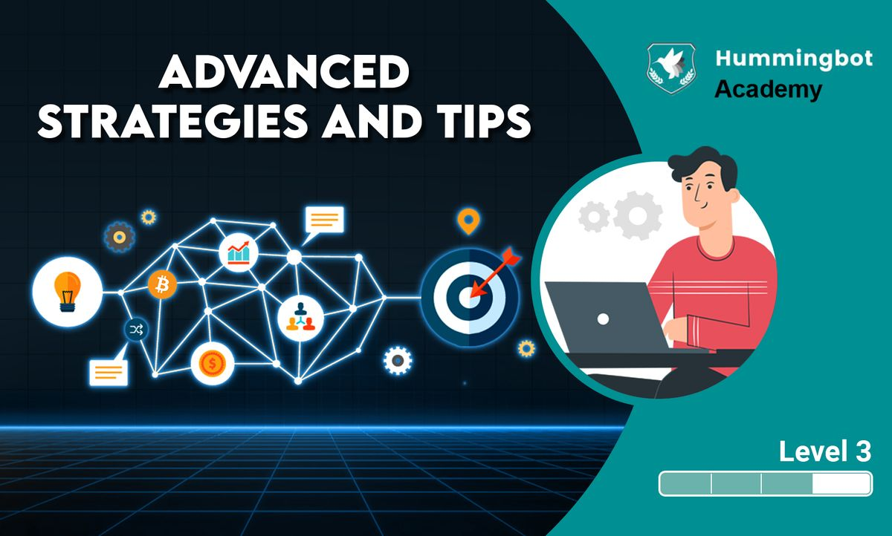

# [Level 3] Advanced strategies and tips

## **Key concepts in professional market making**

<iframe style="width:100%; min-height:400px;" src="https://www.youtube.com/embed/T336SGe-mwk" frameborder="0" allow="accelerometer; autoplay; encrypted-media; gyroscope; picture-in-picture" allowfullscreen></iframe>

## **Spot perpetual market making / arbitrage strategy**

### **Spot perpetual market making / arbitrage**

<!-- more -->

Similar to pure market making strategy, Hummingbot continually posts limit bid and ask offers on a market and waits for other market participants ("takers") to fill their orders. In addition to that, position management features are introduced to let users further configure the bot to make managing positions easier and remove the need to manually interact with the derivative exchange through other available platforms to close position. Two(2) position management features are currently available which are the Trailing_stop and Take_profit features. Each feature has different parameters which the bot uses to logically determine when positions would be closed when using that particular feature. In all, both features(Trailing stop and take profit) have the capability of securing profits. It should also be noted that only the trailing stop feature can stop-loss immediately when loss is detected even when trailing hasn’t begun. Unlike trailing stop, take profit feature places a limit order at a profitable price from position entry price which is determined by the spreads for each take profit sides.

Blog post:

Youtube video:

<iframe style="width:100%; min-height:400px;" src="https://www.youtube.com/embed/IclhZWtKiSA" frameborder="0" allow="accelerometer; autoplay; encrypted-media; gyroscope; picture-in-picture" allowfullscreen></iframe>

Documentation:

[Spot Perpetual Arbitrage - Hummingbot Foundation](/strategies/spot-perpetual-arbitrage.md)

## **Have better control of your bot: advanced liquidity mining features**

### **Advanced liquidity mining features**

**Have better control of your bot: advanced liquidity mining features**

<iframe style="width:100%; min-height:400px;" src="https://www.youtube.com/embed/SrJqPAhP40w" frameborder="0" allow="accelerometer; autoplay; encrypted-media; gyroscope; picture-in-picture" allowfullscreen></iframe>

[How to use advanced market making features](../2019-11-advanced-market-making/index.md)

### **Tips for handling different market situations**

**Tips for handling different market situations**

The following article provides some tips to users on how to handle different market conditions, including range-bound markets and trending markets. When market is volatile, you can set up guardrails such as kill switch. Price ceilings and price floors are also helpful in volatile markets so that your bot does not trade in the whisks (extremes) of the trading price range.

[Market Conditions](../2022-03-market-conditions/index.md)

### **Token Loans: great solution for dealing with thin order books and high volatility**

**Token loans** allow you to eliminate inventory risk as you are simply borrowing tokens from an exchange and you will return the tokens to the exchange after a period of time. By doing so, you will not have any loss due to the drop in value of the tokens and will only have to pay the interest for making the token loans. This is a risk-free approach that allows you to focus on making money through liquidity mining rewards on Hummingbot miner and through market making.

In fact, many professional hedge funds use token loans when they provide market making services. By doing so, the funds will not carry inventory risk.

Token loans are available on exchanges such as [Gate.io](http://gate.io/?ref=blog.hummingbot.org). Make sure you have enough collateral when you make the token loans. You can look for markets on [miner.hummingbot.io](http://miner.hummingbot.io/?ref=blog.hummingbot.org) where token loans are available on Gate.io and market make with the loaned tokens. The required market on miner.hummingbot.io does not have to be Gate.io as you can transfer the loaned tokens from Gate to other exchanges, do market making, and then transfer them back to Gate to return the tokens during expiration.

[Gate.io | Official Website of Gate.io | Bitcoin Exchange | Bitcoin Price | Crypto Exchange | Cryptocurrency Exchange](https://www.gate.io/cryptoloan/USDT?ch=ann210&ref=blog.hummingbot.org)

