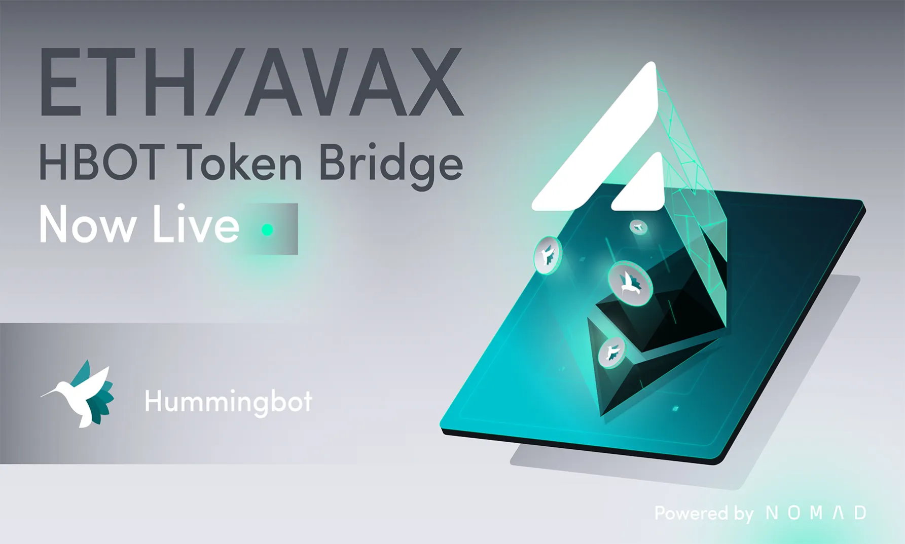
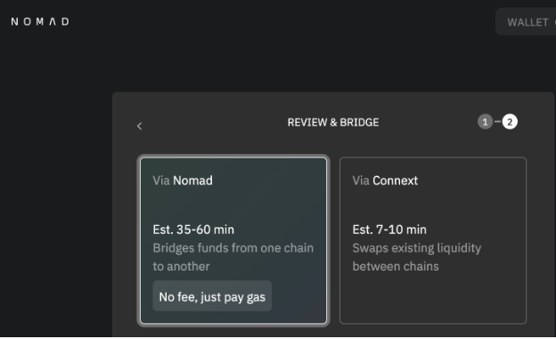

# HBOT Tokens Now on Avalanche C-Chain via Nomad

by Carlo Las Marias

In May, we proposed a governance proposal for the [Hummingbot Foundation](https://hummingbot.org) to bridge HBOT tokens to [Avalanche](https://www.avax.network/) using the [Nomad Protocol](https://www.nomad.xyz/).  You can find the Commonwealth discussion [here](https://commonwealth.im/hummingbot-foundation/discussion/4927-hgp16-ld-bridge-hbot-tokens-to-avalanche-cchain-with-nomadxyz) and the snapshot proposal [here](https://snapshot.org/?#/hbot.eth/proposal/QmTxj6WFu1r9BhEBmFXJtmmgctayvzYvi5ESMrR113m9c6).  The proposal has since been passed and adopted by the Hummingbot community.

<!-- more -->

Since proposing the bridge, the CoinAlpha and Hummingbot Foundation teams have been working with [Nomad Protocol](https://www.nomad.xyz/) and we are thrilled to announce that bridge is now live, with HBOT tokens being the first asset bridged between [Avalanche](https://www.avax.network/) and Ethereum via Nomad!

- Avalanche HBOT token contract: [0x38Dcf0532699b880E6a125F7d918380524CD60a6](https://snowtrace.io/address/0x38Dcf0532699b880E6a125F7d918380524CD60a6)
- [HBOT token on snowtrace](https://snowtrace.io/token/0x38Dcf0532699b880E6a125F7d918380524CD60a6)
- [Nomad Bridge app](https://app.nomad.xyz/)

As always, please be vigilant when using bridges to make sure you’re using the correct bridge and tokens.  All official information relating to HBOT tokens is posted on the [Hummingbot Foundation website](https://hummingbot.org).

## Adding Hummingbot Miner support for Avalanche HBOT tokens

CoinAlpha, Inc. will now be supporting the Avalanche HBOT tokens on the payouts module of its Hummingbot Miner platform.  Hummingbot Miners will now be able to choose Avalanche-HBOT to receive HBOT token distributions.

Due to the lower gas costs on Avalanche C-Chain, users opting to receive Avalanche-HBOT tokens are not subject to any minimum payout amount.  On the other hand, for those continuing to receive ERC20 HBOT tokens, those are subject to a minimum 1,000 token payout amount to receive HBOT tokens.

We encourage Hummingbot Miners to opt-in to receive Avalanche HBOT tokens.

We also plan on announcing new initiatives for Hummingbot Miner with the [Avalanche](https://www.avax.network/) ecosystem soon, so stay tuned!

## HBOT on Avalanche

Rising and volatile gas costs on the Ethereum blockchain are a major source of inefficiency, making even the most basic of operations (such as a simple transfer of tokens) at times cost-prohibitive.

Bridging to other chains enables access to lower-cost transactions, including the potential to create increasingly efficient and active liquidity pools that can help facilitate the dissemination, distribution, and transaction of HBOT tokens between community members and the broader crypto market.

As proposed in the governance proposal, the [Hummingbot Foundation](https://hummingbot.org) will also begin using the [Avalanche](https://www.avax.network/) chain for HBOT community token distributions.

## Choosing Nomad Protocol

Nomad is a security-first, cross-chain interoperability protocol, offering a bridge solution that aims to reduce gas costs by 90% as compared to a traditional header relay.

We suggested [Nomad Protocol](https://www.nomad.xyz/) as the base bridge for HBOT because of its optimistic security model, which optimizes for security and cost reduction.  Unlike other bridge solutions, whose security can be compromised through coordinated attacks, Nomad’s optimistic verification requires only one honest party to ensure the security of the entire system.

Additionally, Nomad’s bridge has the ability to stack on a fast liquidity layer (utilizing ConnextNetwork) included on top of the underlying bridge, which we believe makes it the most comprehensive bridging solution available today.

Background reading / additional resources:

- [https://medium.com/imperator-guide/nomad-a-cross-chain-interoperability-protocol-for-generalized-message-passing-2f7a916df3f0](https://medium.com/imperator-guide/nomad-a-cross-chain-interoperability-protocol-for-generalized-message-passing-2f7a916df3f0)
- [https://docs.nomad.xyz/](https://docs.nomad.xyz/)
- [https://blog.connext.network/optimistic-bridges-fb800dc7b0e0](https://blog.connext.network/optimistic-bridges-fb800dc7b0e0)
- [https://blog.li.fi/li-fi-with-bridges-trust-is-a-spectrum-354cd5a1a6d8](https://blog.li.fi/li-fi-with-bridges-trust-is-a-spectrum-354cd5a1a6d8)