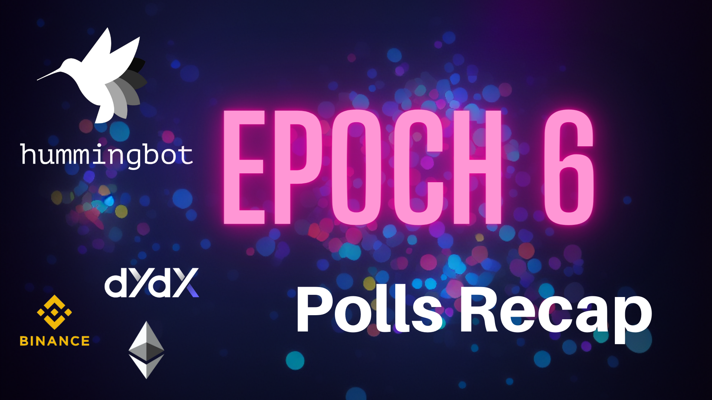
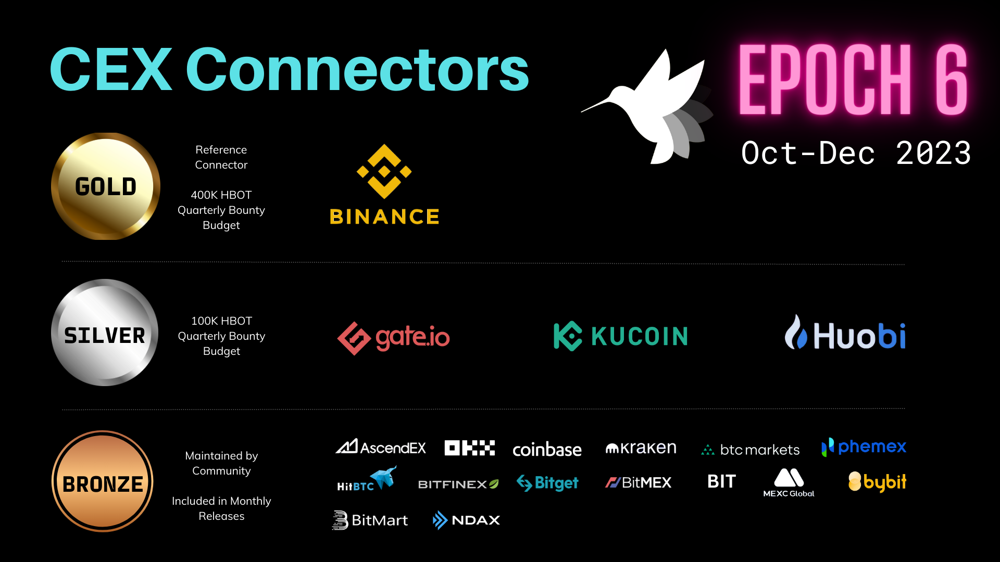

# Epoch 6 Polls Recap

Every quarter, Hummingbot Foundation organizes [Polls](https://hummingbot.org/governance/polls/), an on-going initiative that lets HBOT holders decide how the Foundation allocates its engineering bandwidth and developer bounties across the components in the Hummingbot codebase.

This week, we completed the Epoch 5 polls, which prioritize exchanges and strategies, in the Hummingbot codebase for the October, November, and December releases.

<!-- more -->

Starting from Epoch 5, we will be implementing two changes as outlined in the approved [HGP-43](https://snapshot.org/?ref=blog.hummingbot.org#/hbot.eth/proposal/0x63958a27907ef6efa072fc92566f91bcf5df7491523ffcc64ecb47f270df9bcd) proposal. Here are the summarized details:

Starting from Epoch 6, we have implemented three major changes as outlined in the approved **[[HGP-45] Proposed Epoch 6 Governance Changes](https://snapshot.org/#/hbot.eth/proposal/0x7807da661f09096db6aadb277051ed6defd580259fd8e503c2a77a83779a3fd5)** proposal. Here are the summarized details:

- **Chain Connector Voting Introduction**: Voting for Chain Connector inclusion and support
- **Bounty Allocations**: Allocation of 400K Gold and 100K Silver bounty amounts dedicated to connectors.
- **Adjustment of Connector Inclusion Threshold**: Proposed increase to 200K HBOT.

These changes aim to sustain our bounties program and facilitate further development of our codebases. We trust that they will aid in fostering a collaborative, productive, and beneficial environment for our community.

Below, we summarize the results of the Epoch 6 Polls and outline the changes we'll make over the next quarter.

## CEX Connectors

The CEX Connectors poll places [centralized exchange connectors](https://hummingbot.org/cex-connectors/) into Gold, Silver and Bronze tiers, which define the level of maintenance that the Foundation spends on each connector for the October-November 2023 release cycles.

The poll received 24 distinct votes, for a total of 49 million HBOT voting power spent.

[CEX Connectors Poll](https://snapshot.org/#/hbot.eth/proposal/0xb830acb389380f447a996ade4dd39120f5139256a6fa55448ff8d78ef9193de4)

Here are the results by tier:

**Gold:** [Binance](https://www.binance.com/en/register?ref=FQQNNGCD)

The top vote-getting CEX connector is the Gold exchange for the following quarterly epoch. Hummingbot Foundation will be the official maintainer for this exchange's spot and perpetual connectors, and the Foundation's own engineering team will build and maintain these connectors and improve them by keeping up with exchange upgrades and mapping new functionality added via API. These connectors serve as the "gold standard" template for all other connectors of that type.

**Silver:**  [Gate.io,](https://www.gate.io/signup/5868285) [Kucoin](https://www.kucoin.com/ucenter/signup?rcode=272KvRf), Huobi,

Hummingbot Foundation will be the official maintainer for the #2, #3, and #4 exchanges' spot and perpetual connectors. However, these exchanges' connectors will be maintained via community developer bounties, tracking improvements made to the Gold exchange connectors.

**Bronze:** Ascendex, OKX, Coinbase, Kraken, BTC-Markets, Phemex, HitBTC, Bitfinex, Bitget, Bitmex, BIT, MEXC, Bybit, Bitmart, NDAX

Bronze CEX connectors are not maintained by Hummingbot Foundation, but may be maintained by a community members. Each of the Bronze exchanges successfully garnered 200,000+ HBOT votes in the Epoch 6 poll and will have their connectors included and documented in the Q4 2024 Hummingbot releases.

## DEX Connectors

The DEX Connectors poll places [decentralized exchange connectors](https://hummingbot.org/gateway/) into Gold, Silver and Bronze tiers, which define the level of maintenance that the Foundation spends on each connector for the October-December 2023 release cycles. The poll received 18 distinct votes, for a total of 46 million HBOT voting power spent.

[DEX Connectors Poll](https://snapshot.org/#/hbot.eth/proposal/0x5fe34c66cefc6438070332d2ab0d807447a9c175eb5e975e5a9a7023cb3c5c83)

Here are the results by tier:

**Gold:** [dYdX](https://dydx.exchange/)

Similar to the CEX Connectors, Hummingbot Foundation will treat the Gold DEX Connector as the "gold standard" and map all of its swap and liquidity provision endpoints and support instances on all major chains.

**Silver:**  [Dexalot](https://app.dexalot.com/trade/?ref=blog.hummingbot.org), [Polkadex](https://polkadex.trade/), [Injective Helix](https://helixapp.com/markets/)

For Silver DEXs, the Foundation utilizes HBOT developer bounties to fund improvements and fixes.

**Bronze:** Uniswap, Pancakeswap, Sushiswap, Plenty, TraderJoe, Perpetual Protocol, Quickswap, OpenOcean, Pangolin, Mad Meerkat Finance, Ref Finance, Tinyman, VVS Finance, XSwap, Vertex

Bronze DEX connectors are not maintained by Hummingbot Foundation, but may be maintained by a community members. Each of the Bronze exchanges successfully garnered 200,000+ HBOT votes in the Epoch 6 poll and will have their connectors included and documented in the Q4 2023 Hummingbot releases.

## Chain Connectors

The Chain Connectors poll defines which [strategies](https://hummingbot.org/strategies/) should be Core (officially maintained by the Foundation) versus Community (maintained by community members or not maintained). There were 16 unique votes in the poll, and the total number of HBOT voting power tallied was 46 million.

[Chain Connectors Poll](https://snapshot.org/#/hbot.eth/proposal/0x46a1f7d13701d18a4382665631b90fcf52762c030547f643ff45548403bb96ca)

Here are the results by tier:

**Gold:** [Ethereum](https://ethereum.org/en/)

Similar to the CEX Connectors, Hummingbot Foundation will treat the Gold Chain Connector as the "gold standard" and map all of its swap and liquidity provision endpoints and support instances on all major chains.

**Silver:** [Avalanche](https://www.avax.network/), [Binance Smart Chain](https://www.bnbchain.org/en), [Polygon](https://polygon.technology/)

For Silver Chains, the Foundation utilizes HBOT developer bounties to fund improvements and fixes.

**Bronze:** Injective, Harmony, Tezos, XDC, Algorand, Cosmos, Cronos, Near

Bronze Chain connectors are not maintained by Hummingbot Foundation, but may be maintained by a community members. Each of the Bronze exchanges successfully garnered 200,000+ HBOT votes in the Epoch 6 poll and will have their connectors included and documented in the Q4 2023 Hummingbot releases.

Overall, we are excited about the continued support by the votes from the community, and we are excited to continue fleshing out Poll-based governance in the future!
