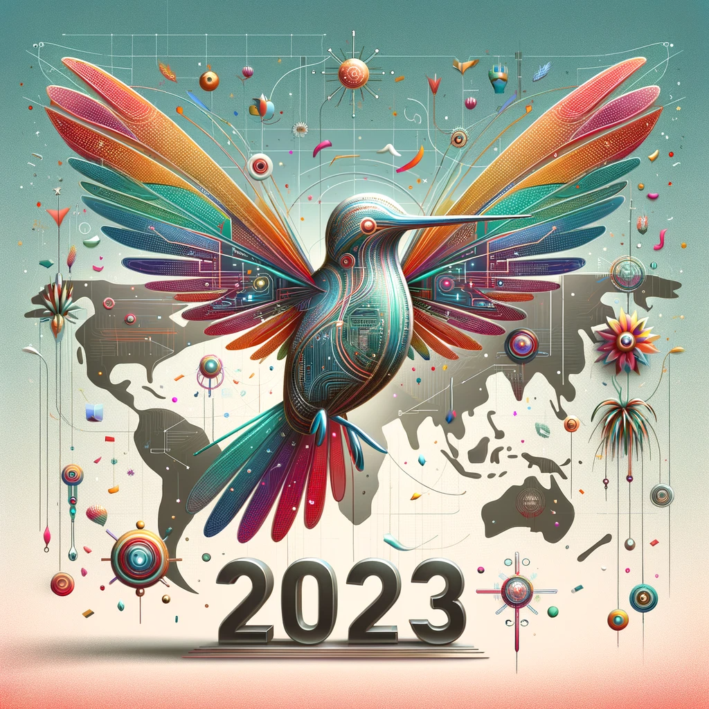

# 2023: A Year of Innovation at Hummingbot

As we are assembling the roadmap for the new year, it's important to reflect on the strides Hummingbot has made from an engineering standpoint in 2023. 

In the [2023 Technical Roadmap](/blog/hummingbot-2023-technical-roadmap/), we defined 4 key goals:

1. **Expand Top Exchange Connectors:** Update connectors to latest standards, support market orders and lending/staking
2. **Optimize Hummingbot codebase:** Streamline maintenance and move Gateway DEX connectors into a separate repo
3. **Expand Scripts Framework:** Integrate indicators into the Scripts framework, add more examples, and make them configurable
4. **Support External Modules:** Support community-built external modules like the [Brokers](https://github.com/hummingbot/brokers) orchestration repo

Let’s review each of these milestones versus the actual progress made in 2023:

<!-- more -->

## 1. Expand Top Exchange Connectors

Key enhancements to connectors in 2023 included:

- **Gold and Silver Connectors Revamp**: We upgraded the Gold and Silver connectors to the latest connector standards
- **Market Order Support**: We added Market Orders support to Gold and Silver connectors.
- **New Standard for CLOB DEX Connectors**: We added [Injective Helix](../../../exchanges/injective.md), Vertex, and [Hyperliquid](../../../exchanges/hyperliquid.md) as Python-based DEX connectors to the Hummingbot client, allowing for enhanced performance and efficiency.
- ⚠️ **Lending/Staking Support**: However, we deferred supporting staking and withdrawal functionalities in favor of the V2 framework as per community interest.

## 2. Optimize Hummingbot Codebase

To streamline operations, we accomplished two important objectives in 2023:

- **Gateway Separation**: We moved the [Gateway](https://github.com/hummingbot/gateway) DEX connectors into a separate Github repo, allowing for more agile development, although bandwidth limitations indicated a need for community involvement in 2024.
- **Codebase Streamlining**: We streamlined maintenance by removing connectors that did not meet the [Inclusion Threshold](/governance/polls/#inclusion-threshold) in quarterly Polls.

## 3. Expand Scripts Framework

In 2023, we greatly expanded the scripting capabilities in Hummingbot by adding the [V2 Strategy Framework](/v2-strategies/), which marked a revolutionary leap forward for Hummingbot:

- **Introduction of Controllers and Executor Handlers:** This enables running “sub-strategies” in the same Hummingbot instances and encapsulates the trading logic into a controller, which makes scaling the system easier.
- **Candles Feed**: Introduction of technical indicators via the `pandas_ta` library, enriching data-driven decision-making.ki
- **Order Level Builder**: To generate multiple order levels we created the order level builder and the distributions module. These modules work together to improve the user experience when creating multiple order levels.
- **Executors**: We added the following self-contained Executors:
    - **Arbitrage Executor:**: Component that implements DEX-CEX arbitrage
    - **Position Executor:** Component that implements the triple barrier method introduced in [Advances in Financial Machine Learning](https://www.wiley.com/en-us/Advances+in+Financial+Machine+Learning-p-9781119482086)

## 4. Support External Modules

The last big milestone for 2023 was to support external modules like [Brokers](https://github.com/hummingbot/brokers) to expand the multi-bot orchestration capabilities of Hummingbot.

This led to the introduction of [Dashboard](https://github.com/hummingbot/dashboard), an experimental repository to build a new graphical user interface for Hummingbot. With the help of community members, Dashboard added pages that supported:

- **Backtesting Capabilities**: Risk-free strategy testing with historical data, accessible to all user levels.
- **Automatic Optimization with Optuna**: Advanced parameter optimization, elevating trading bot performance.
- **Bot Deployment and Control**: The dashboard now supports deploying and controlling bots using the broker, streamlining the trading process.
- **Performance Visualization**: Users can now visually track and analyze the performance of their bots, making strategy assessment more intuitive and effective.

However, building Dashboard also taught us lessons that informs our 2024 roadmap. For example, we learned that Streamlit may be not be the ideal interface for real-time bot orchestration, since it is best used for static charts and graphs. 

Also, feedback from users trying out Dashboard was critical in helping us design the new [Backend API](https://github.com/hummingbot/backend-api) repo.

## Sharing Progress on Social Media

Finally, we leveraged Twitter to show the community how they can take advantage of these new features. Example tweets included:

- [D-Man V3 Performance: Insight 1](https://x.com/cardosofede/status/1736030285454581952?s=20)
- [D-Man V3 Performance: Insight 2](https://x.com/cardosofede/status/1732441955718611174?s=20)
- [D-Man V3 Performance: Insight 3](https://x.com/cardosofede/status/1730648385911214337?s=20)
- [Risk Management Guide](https://x.com/cardosofede/status/1729269035551117536?s=20)
- [Using Indicators with V2 Framework: Part 1](https://x.com/cardosofede/status/1722352380287533223?s=20)
- [Using Indicators with V2 Framework: Part 2](https://x.com/cardosofede/status/1704746730799910932?s=20)
- [Hummingbot AI Helper Features](https://x.com/cardosofede/status/1733185235532050753?s=20)
- [Hummingbot Screener Tool](https://x.com/cardosofede/status/1730687836226027752?s=20)

## Conclusion

The year 2023 was pivotal for Hummingbot, marked by growth and innovation. Each development significantly enhanced our platform's capabilities and user experience, laying a solid foundation 🤣 for 2024.