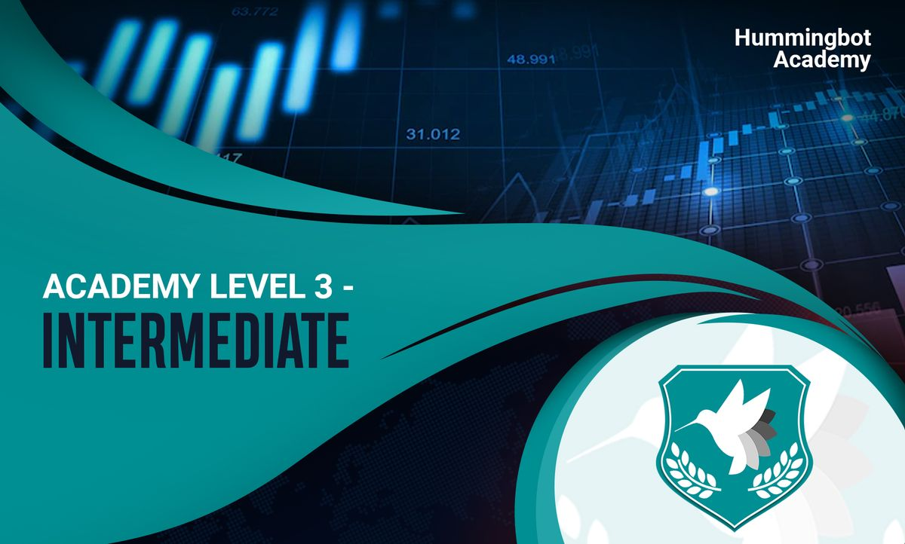

# Improve your Hummingbot Performance

### Welcome to **Level 3**!
In this level, we will teach you how to set up your Hummingbot in the cloud so that you can run Hummingbot 24/7 to maximize your profits and rewards. We will also teach you tips on managing your trading performance (P&L) and multiple bots, as well as advanced trading tips and strategies.

The goal of this level is to help you get breakeven PnL!

<!-- more -->

### Reading for Level 3 — Set up and advanced strategies

[Academy Level 3 - A. Intermediate — Build the right setup: game up your Hummingbot liquidity mining](../2022-01-level-3-a-intermediate-build-the-right-setup-game-up-your-hummingbot/index.md)

- Running Hummingbot 24/7 in the cloud
- Why do we need to set up cloud servers?
- What are cloud servers?
- Picking the right cloud server
- Getting the right set up
- Basic Linux commands
- SSH Keys
- Installing via Docker
- Hummingbot Installation: Install via Docker
- Basic Docker commands
- Installing from source
- Switching to development branch
- Managing multiple bots
- Useful app: Termius
- Tips: setting balance limit

**[Academy Level 3B. Intermediate — Managing your bot performance: Intro guide to managing P&L](../2022-01-level-3-b-intermediate-managing-your-bot-performance-intro-guide-to/index.md)**

- How does Hummingbot Measure PnL?
- Tips for capital deployment
- Managing your bots
- Simple performance Statistics: GitHub repo
- PnL analysis Jupyter notebook

**[Academy Level 3C. Advanced strategies and tips](../2022-01-level-3-c-advanced-strategies-and-tips/index.md)**
- Spot perpetual market making / arbitrage strategy
- Have better control of your bot: advanced liquidity mining features
- Advanced liquidity mining features
- Tips for handling different market situations
- Token loans: great solution for dealing with thin order books and high volatility

### Missions
---
**Set up a cloud server for Hummingbot**
- **Mission 3.1:** Set up a cloud server to run Hummingbot with the instructions in the reading list:
- If you face any issues, reach out to #miner-support channel in our Discord group:
- [https://discord.com/invite/hummingbot](https://discord.com/invite/hummingbot?ref=blog.hummingbot.org)

**Set up Telegram integration with Hummingbot**
- **Mission 3.2:** Set up Telegram integration with Hummingbot if you haven’t done so. It allows you to monitor your bot on Telegram and on-the-go and one of the popular features that our traders find helpful
- [Telegram Integration - Hummingbot Foundation](/global-configs/telegram.md)

**Set up a P&L jupyter notebook / github repo**
- **Mission 3.3:** Build your own processes to manage your P&L. You can take our suggestions as reference here:

**Use token loans to reduce inventory risk**
- **Mission 3.4:** One way to reduce inventory risk is to use token loans. Some exchanges such as [Gate.io](http://gate.io/?ref=blog.hummingbot.org) allow you to loan tokens: [https://www.gate.io/](https://www.gate.io/)
- If your main source of income is through miner rewards from Hummingbot miner, having token loans allow you to not own any of the asset traded and return the same assets to the exchange (eg. Gate.io) without being affected if the assets dropped in value.

**Get breakeven PnL through cross-exchange market making**
- **Mission 3.5:** Cross-exchange market making is one of the relatively ‘easier’ strategies for you to get breakeven PnL as you can reduce inventory risk. Try fine-tuning your cross-exchange market making strategy to get break-even PnL. To be successful in cross-exchange market making, the speed of servers also matter. Feel free to reach out to #trader-chat to learn more about the servers different members are using.
- As a recap, here’s more about the cross-exchange market making (XEMM) strategy:

- **[Academy Level 2 D. Beginner — Strategy #2: Use cross-exchange market making (XEMM) strategy to lower risk](../2022-01-level-2-d-beginner-strategy-2-use-cross-exchange-market-making-xemm/index.md)**

**Run spot perpetual market making strategy**
- **Mission 3.6:** Run a spot perpetual market making strategy and learn how to hedge

