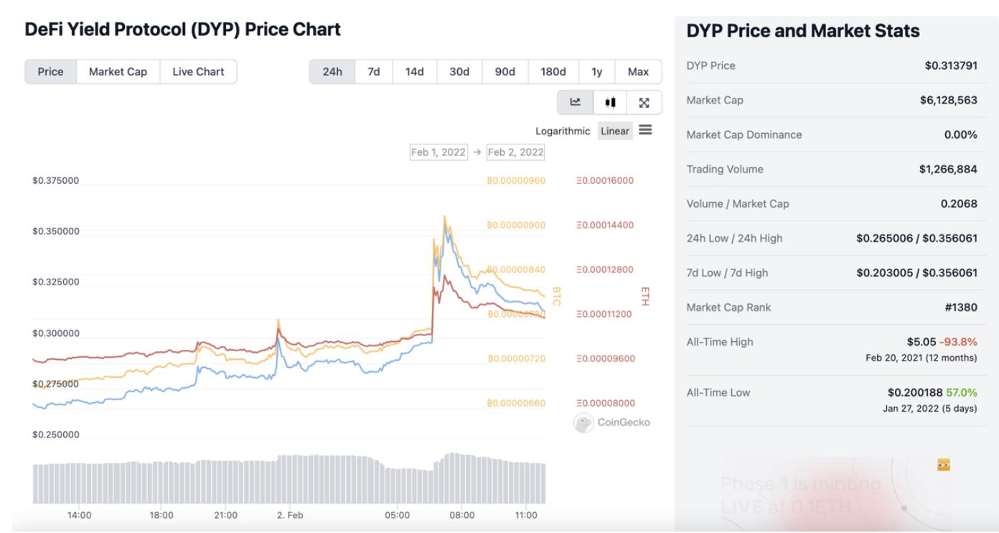

# Selecting markets, identifying trends, and reducing inventory risk

## Tips for Selecting Markets
Choosing the right market is the key to liquidity mining success. Here are some tips for selecting markets:
1. Select markets that are less volatile
   - Rapid changes in the exchange rate will cause frequent transactions that will make you lose a lot of money through transaction fees
   - The best trading period for market making is the period when the market trend is relatively mild and stable
2. Select markets that have enough liquidity
3. Select markets of which the tokens are in a gradually increasing price
4. Select markets with token pairs that you do not mind long-holding.
5. Currency pair correlation:
   - Some miners prefer trading on markets that are strongly correlated with core token pairs such as BTC or ETH so that they can hedge through these proxy core tokens.
   - We can observe the correlation of currency pairs through Coingecko ([https://www.coingecko.com/](https://www.coingecko.com/?ref=blog.hummingbot.org)) and choose the currency pair with stronger correlation.
   - If the base currency of the pair in the market on the Miner platform is BTC or ETCH, choosing a pair with a strong correlation with BTC or ETH makes the market more predictable.

<!-- more -->

**To learn more:** [https://youtu.be/AU7h7tQpbaM?list=PLDwlNkL_4MMekihXq7C-Nzx9YkivaZZ6r](https://youtu.be/AU7h7tQpbaM?list=PLDwlNkL_4MMekihXq7C-Nzx9YkivaZZ6r) [https://hummingbot.io/en/blog/2021-02-sharing/](../2021-02-sharing/index.md)

## Volatility Risk Factor Score
The Factor Score is a score created by Hummingbot to convey the risk faced by liquidity providers for a given token. It is important for miners to understand the risk involved in different pairs, not only the yields provided, before selecting them for market making.

The score is calculated based on publicly verifiable data points such as market capitalization rank and number of days since first publicly listed. To learn more:

[https://support.hummingbot.io/miner/factor-score-what-is-it-and-how-should-i-use-it](https://support.hummingbot.io/miner/factor-score-what-is-it-and-how-should-i-use-it)

You can use the volatility risk factor to select markets in **Core**, or **Growth** to start your market making strategies. Those markets are relatively more liquid.

## Identifying Trends
[https://hummingbot.io/en/blog/2021-03-identifying-trends/](../2021-03-identifying-trends/index.md)

In-depth tips on how you can identify crypto trends using:
1. **Fundamental Analysis** - researching on intrinsic value of the assets such as using On-chain analysis, NVT
2. **Intermarket Analysis** - comparing asset across markets
3. **Technical Analysis** - using historical prices to find patterns with indicators such as Bollinger Bands, RSI (Relative Strength Index), and TradingView Volume Profile

You can also run custom scripts on Hummingbot using these indicators.

## What is inventory risk?
Inventory risk is the risk of holding the assets that you market make on, which may fluctuate in value. It is one of the biggest risks market makers hold.

[https://hummingbot.io/en/blog/2020-10-inventory-risk/](../2020-10-inventory-risk/index.md)

This article explains the concepts of inventory risk and shows us how we can lower inventory risk using inventory skew, filled order delay, hanging orders, and ping pong.

[https://hummingbot.io/en/blog/2020-06-what-is-market-making-guest-post/](../2020-06-what-is-market-making-guest-post/index.md)

Explains mainly how spreads are related to inventory risk.
