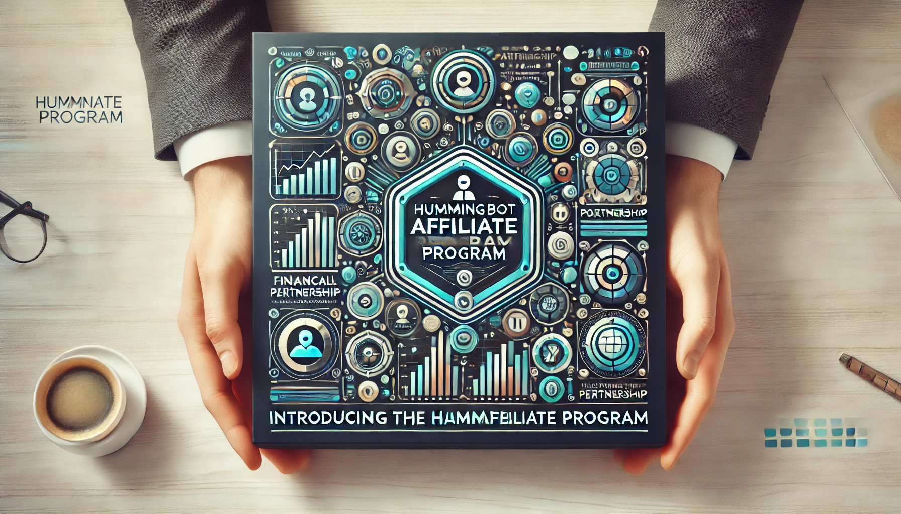

# Introducing the Hummingbot Affiliate Program

We're excited to announce the launch of our new Affiliate Program, allowing Hummingbot users to earn rebates on their trading fees while supporting the Foundation's work.

In our ongoing efforts to create value for the Hummingbot community, we've partnered with several leading cryptocurrency exchanges to offer fee rebates to our users. This program not only helps reduce your trading costs but also supports the continued development and maintenance of the Hummingbot open-source project.

<!-- more -->

## How It Works

The Hummingbot Affiliate Program is designed to be simple and beneficial for all parties involved:

1. **Sign Up**: Use our referral links to create accounts on partner exchanges.
2. **Trade**: Use Hummingbot to execute your trades on these exchanges.
3. **Earn**: Automatically receive rebates on your trading fees.

## Participating Exchanges and Rebates

We've secured partnerships with several top exchanges:

| Exchange | Your Fee Rebate | Referral Link |
|----------|-----------------|---------------|
| OKX      | 20%             | [Sign Up](https://www.okx.com/join/1931920269) |
| Huobi    | 20%             | [Sign Up](https://www.htx.com.pk/invite/en-us/1h?invite_code=re4w9223) |
| Gate.io  | 20%             | [Sign Up](https://www.gate.io/referral/invite/HBOTGATE_0_103) |
| Kucoin   | 20%             | [Sign Up](https://www.kucoin.com/r/af/hummingbot) |
| Binance  | 10%             | [Sign Up](https://accounts.binance.com/register?ref=CBWO4LU6) |

## How to Get Rebates

Getting started is easy:

1. Choose your preferred exchange from the list above.
2. Click the "Sign Up" link to create your account using our referral code.
3. Start trading and earning rebates!

For detailed instructions on how to join each exchange's program, please refer to our [Affiliate Program documentation](/about/affiliate).

The Hummingbot Affiliate Program represents another step in our commitment to creating value for our community while ensuring the sustainability of the Hummingbot project. By participating, you're not only reducing your trading costs but also contributing to the growth and development of the open-source tools you use. Happy trading!
