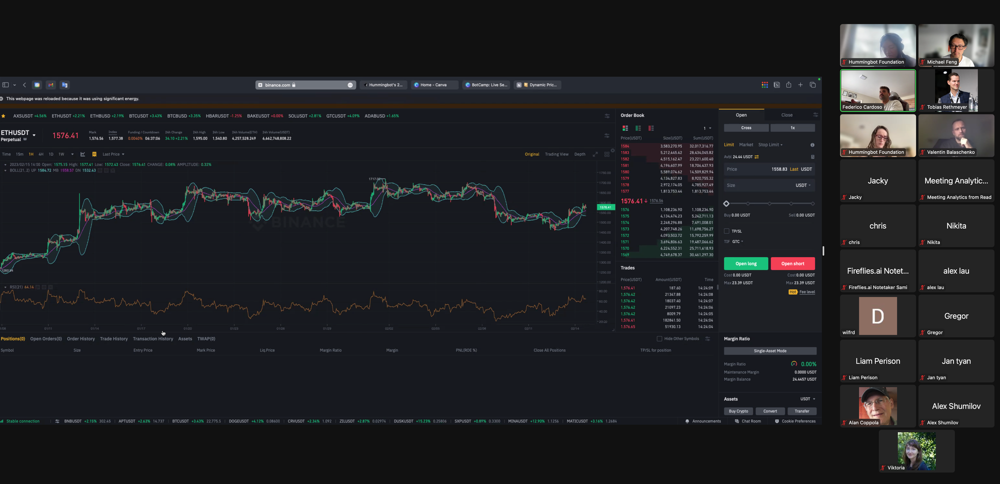
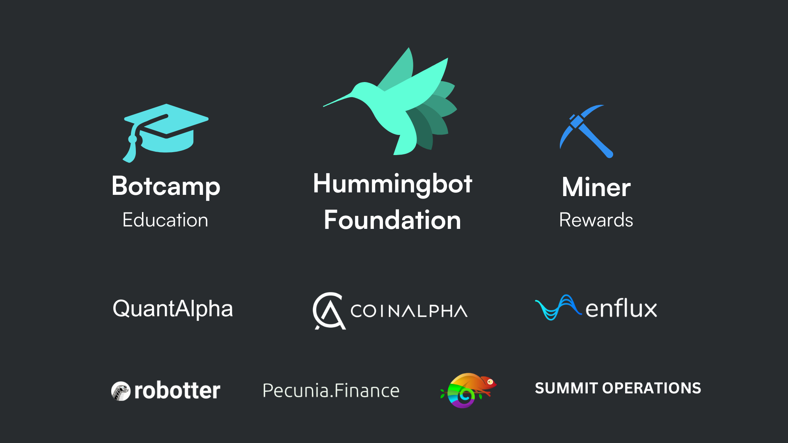
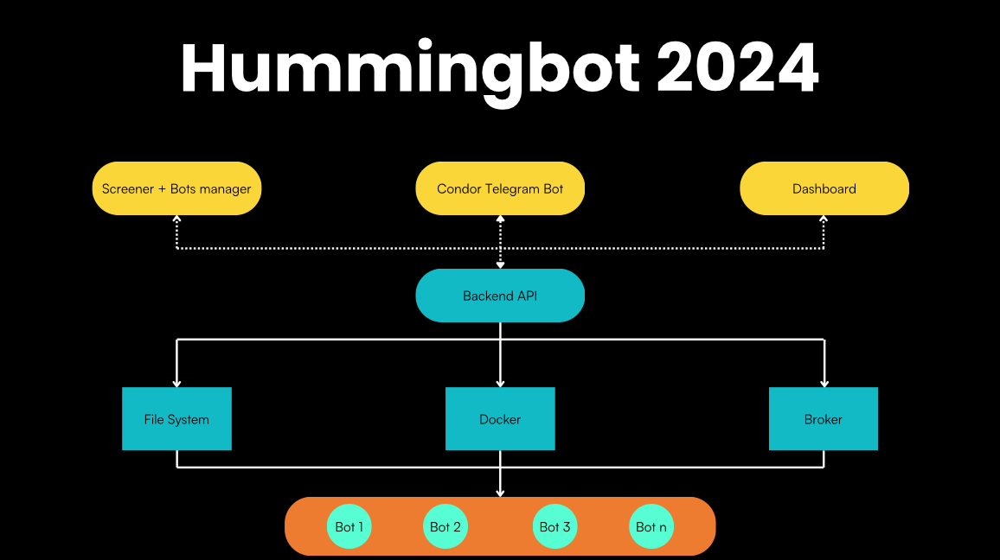

# Announcing Botcamp and the Expanding Hummingbot Ecosystem

In late 2021, Hummingbot Foundation was launched as an experimental decentralized autonomous organization (DAO) to build a self-sustainable, professional-grade, free and open source operating system for algo traders and market makers, owned by the community of HBOT token holders.

In an industry perceived by outsiders to be zero-sum and mercenary, Hummingbot aimed to prove that crypto algorithmic trading could be **positive-sum**, given the proper incentive structure. Our mission is to give everyone access to free tools and knowledge that help them make money by doing the same basic job, providing liquidity and making markets more efficient, as the world's most secretive, sophisticated quantitative hedge funds. 

It's been a long road filled with landmines and near-misses (like FTX!), but Hummingbot Foundation expects to be economically sustainable going forward, thanks to our [partnerships](/exchanges/) with leading exchanges and blockhain protocols. Economic viability allows the Foundation to focus on decentralizing governance and leveraging the community to expand the value of the Hummingbot codebase.

## Announcing Botcamp

Vitally, the Foundation is also sustainable in large part due to Botcamp, an educational side business that the Foundation team started to train algo traders and market makers using Hummingbot.

Botcamp's signature product is a 5-week intensive bootcamp that teaches students how to help them build their own custom trading strategies. Since October 2022, Over 200 students across five cohorts have taken Botcamp, and many of the [sample scripts](https://github.com/hummingbot/hummingbot/tree/master/scripts/community) in the open source Hummingbot repo were contributed by Botcamp students.

Today, we’re excited to formally announce [Botcamp](https://www.botcamp.xyz) as a separate for-profit company that provides education and training programs for market makers and algorithmic traders using the open source Hummingbot software framework. 

Botcamp's products include:

<!-- more -->

* **Cohorts**: 5-week bootcamps that teach students how to use the Hummingbot V2 framework to build, backtest, and deploy algo trading and market making strategies. Each cohort ends in a Demo Day where students present their custom strategies to earn Hummingbot certification. Register for the free [Info Session](https://www.botcamp.xyz/event/botcamp-info-session-4/register) if you'd like to learn more.

- **Courses**: Masterclasses with hours of videos and quizzes that students the theory and practice of algo trading, covering various types of strategies and how to design and deploy them with Hummingbot. These courses are currently hosted on the [legacy Botcamp platform](https://botcamp.hummingbot.org) and will be re-launched on the new platform in early March.

In the future, we also plan to organize hackathons and other events that mobilize the Hummingbot community, along with future offerings that advance the Hummingbot mission of making sophisticated trading strategies accessible to everyone.

Botcamp's founders are Federico Cardoso, Hummingbot Foundation CTO, and me. Sharing a passion for both education and open source, we believe that a company that supports and expands the Hummingbot ecosystem by providing training and education is the best way to make Hummingbot sustainable. Botcamp will be my primary focus going forward, while Fede will continue to operate as CTO of both Hummingbot Foundation and Botcamp.

In order to minimize potential conflicts of interest between Botcamp and Hummingbot Foundation, my focus as Foundation board member will be to promote further decentralization, transparency, and community governance.

## The Hummingbot Ecosystem

As a DAO, Hummingbot Foundation's goal has been to form an ecosystem that allows individuals and firms from the community to build sustainable businesses around the Hummingbot codebase, by performing valuable functions such as:

* Building custom exchange integrations and strategies
* Earning developer bounties and liquidity mining rewards
* Providing market making services
* Running a proprietary trading firm

In turn, these community members would be incentivized to contribute back modular components like connectors and strategies and help maintain a high-quality open source Hummingbot codebase. 

Today, I'm happy to report that the Hummingbot ecosystem has matured into a growing, decentralized constellation of entities:

### Botcamp

As mentioned above, [Botcamp](https://www.botcamp.xyz) is an education company that provides training and certification for market makers, trading firms, and other finance/crypto industry professionals using the open source Hummingbot framework.

### Miner and CoinAlpha

[Miner](https://miner.hummingbot.io) is a liquidity mining platform where Hummingbot users can earn rewards by running market making strategies. It is run by [CoinAlpha](https://coinalpha.com), the company that originally created Hummingbot. In addition to operating Miner, CoinAlpha provides bespoke liquidity solutions and services for top exchanges and token issuers on top of Hummingbot.

CoinAlpha contributed many of the connectors in the Hummingbot codebase, such as [Dexalot](../../../exchanges/dexalot.md) and [Polkadex](../../../exchanges/polkadex.md), and the recently approved [Bitrue](https://snapshot.org/#/hbot-ncp.eth/proposal/0x12d5a28f97e6ad6809f176a00fa665aa3fe2127dd1ccb72fe42a791bd8606761) connector.

### Enflux

[Enflux](https://www.enflux.io/) is restoring trust in crypto market making by providing transparent and collaborative market making services to tokenized projects.

Enflux has funded [Uniswap](../../../exchanges/uniswap.md) bug bounties and works with Botcamp to host educational events on liquidity and market making.

### Funttastic

[Funttastic Labs](https://www.funttastic.com) leads the blockchain innovation wave, mastering High-Frequency Trading (HFT), Market Making (MMing) via Hummingbot, and advancing in Machine Learning (ML) and Reinforcement Learning (RL). Our core strengths lie in developing Smart Contracts, leveraging Web3 technologies, and integrating GPT for financial analysis, offering a competitive edge in the cryptocurrency realm. With a profound command over blockchain, our team is adept at crafting strategic solutions that not only embrace the future of finance but also unlock unique investment opportunities.

Funttastic contributed the [Kujira](../../../exchanges/kujira.md) connector.

### Pecunia Finance

[Pecunia.Finance](https://pecuniafinance.com/) is a Web3 Project Management DAO that provides pseudo-anonymous, automated labor infrastructure in a fair and transparent way, which enables organizations and the builders within communities to successfully deliver projects. Since incorporating as a Non-Profit DAO LLC in 2023, Pecunia.Finance has gained over a dozen skilled contributors worldwide and received 3 separate grants working with organizations such as Hummingbot Foundation, Osmosis, and Sifchain to make high-frequency crypto-trading more accessible to the common user. 

Pecunia Finance is contributing the [Osmosis](https://snapshot.org/#/hbot-ncp.eth/proposal/0x2e159b270c17ac68f47774a7dc6741aab48b638274cfc6519d38b1847351901a) connector and is working on future Hummingbot integrations to the Cosmos ecosystem.

### Robotter

[Robotter.AI](https://robotter.ai) is decentralizing Financial ML & Trading Bot pipelines with the help of Hummingbot, Solana & Aleph.im. We believe in a firmly rooted, transparent, DeFi-centric market. We aim to produce a bleeding-edge, self-sustaining ecosystem for data, compute and capital to fuel a rising class of quantitative traders, AI enthusiasts and web3 developers establishing themselves as the new paragons of liquidity on markets where no institutional player dares to tread.

Robotter contributed the [XRP Ledger](../../../exchanges/xrpl.md) connector and is working on future Hummingbot integrations to the Solana ecosystem.

### QuantAlpha

Created by the founders of CoinAlpha and Hummingbot, [QuantAlpha](https://quantalpha.ai) is a trading and technology firm building “Quant Finance 2.0 for Digital Assets”. QuantAlpha creates investment and trading strategies based on quant methodologies that generate alpha by uncovering trading signals and market patterns, and works with investment managers and hedge funds to create custom investment products and trading solutions, including AMM liquidity staking management and CEX-DEX arbitrage. 

QuantAlpha has built its trading execution stack on top of Hummingbot.

### Summit Operations

[Summit Operations](https://summitoperations.co/) offers market making services for CEX and DEX opportunities. Hummingbot is an integral system for our capacity to easily integrate and deploy across markets and platforms. To date, Summit has traded over 2.2B in total volume through Hummingbot.

Summit contributed the [Vega](../../../exchanges/vega.md) connector.

## Toward a Community-Owned Codebase

These firms along with  hundreds of individual contributors, form the diverse Hummingbot ecosystem. We plan to leverage the bounties system to collaborate with these peers to help achieve the community-driven codebase that we outlined in the [Technical Roadmap](../hummingbot-2024-technical-roadmap/index.md).

This would unlock liquidity for the long tail of local, emerging markets and new financial assets, enabling experiments that we can't even imagine today. 

This is how we will **open source algo trading**.
