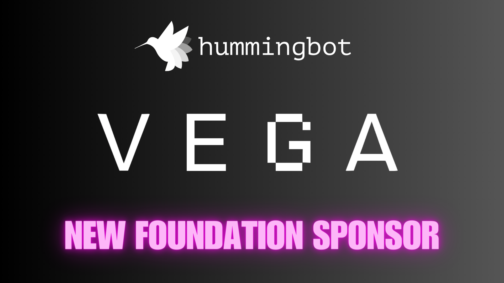

# Announcing the Vega Protocol Connector and Sponsorship

With the release of a new [connector guide](./../../../academy/posts/using-vega-protocol-with-hummingbot/index.md) for the Vega [DEX connector](/exchanges/vega), we are thrilled to officially welcome [Vega Protocol](https://vega.xyz) as a sponsor and partner of Hummingbot Foundation! 

As an open source foundation dedicated to democratizing algo trading, Hummingbot Foundation seeks to align with like-minded  organizations. We've known the Vega founding team since 2019 (an eternity in crypto!) and share their commitment to decentralized, permissionless trading. Built on a Layer 1 blockchain designed for derivatives trading, Vega Protocol stands out with its permissionless market creation feature, which enables any participant to launch a new market (trading pair) through governance.

That's why we're excited to warmly introduce Vega as a new Hummingbot Foundation [sponsor](/about/sponsors), which will support our efforts to maintain the Vega integration to Hummingbot and educate our respective communities on how to use it!

<!-- more -->

> "The Vega connector sponsorship marks a significant milestone for Hummingbot. Now, our community of individual market makers will truly be able to compete on a level playing field with professional firms. On Vega, they can provide liquidity to new markets, earn incentives, and help support a burgeoning ecosystem.” **— Michael Feng, Co-Founder of Hummingbot**

## Community Maintenance

Building and maintaining a Websocket connector to a new perpetuals DEX like Vega requires many hours of customization and hardcore technical development, and it would not be possible without Hummingbot's model of working with community developers.

We're happy to be working again with our friends at [Summit Operations](https://summitoperations.co/), who built the Vega connector, submitted the pull request, and worked with our QA and engineering teams to test and harden the integration. In addition to engineering services, Summit also offers CEX/DEX market making services and has traded over 2.2 billion in total volume through Hummingbot.

## Sponsorship at a Glance

Over the next few months, we plan to work with Vega Protocol to help new users successfully create and deploy trading algorithms on the Vega connector, with activities such as:

* Maintaining, updating, and documenting the Vega connector
* Creating connector guides and demo videos
* Running bots on Vega and analyzing their performance
* Designing custom dashboards and screeners for Vega

For instance, we just released the [Vega Connector Guide](/academy-content/using-vega-protocol-with-hummingbot), in which we detail creating a Vega wallet, adding credentials to Hummingbot, and how to configure Vega-compatible scripts.

## Looking Forward

> “We are really excited that the Hummingbot community has embraced Vega, especially because both projects share a very strong core belief in democratizing trading and so we have a philosophical alignment as well as a technical one.” **— Barney Mannerings, Co-Founder of Vega Protocol**

Stay tuned for more videos, tutorials, and announcements as we continue to democratize trading together! In the meantime, we invite you to join the Hummingbot and Vega communities on Discord:

* [Hummingbot Discord](https://discord.gg/hummingbot)
* [Vega Discord](https://discord.com/invite/3hQyGgZ)
