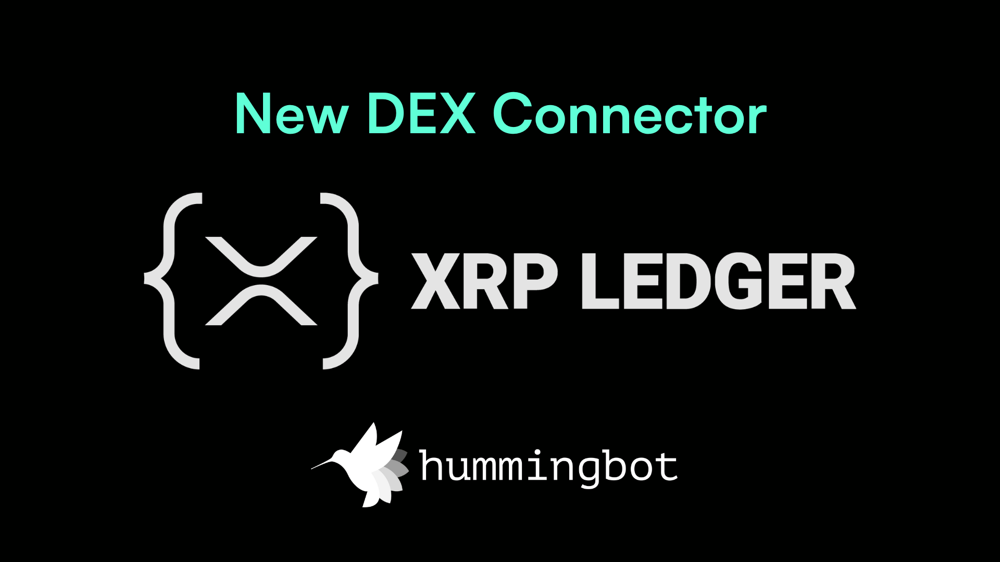

# Hummingbot Unveils New Connector to XRP Ledger in Version 2.0

Today, Hummingbot is excited to announce the release of a new connector to the XRP Ledger (XRPL), available in the latest [release 2.0](/release-notes/2.0.0/). The XRP Ledger (XRPL) is a decentralized, layer 1 blockchain with reliability and stability proven for over a decade, trusted by businesses and builders globally for the efficient tokenization and exchange of crypto-native and real-world assets.

Hummingbot 2.0 introduces the highly-anticipated [Dashboard](./../../../dashboard/index.md), a new entry point that makes the platform more accessible and user-friendly. Dashboard allows users to easily create, backtest, and deploy their trading bots through an intuitive visual interface, streamlining the strategy configuration and bot management process and enhancing the overall user experience.

This new XRPL connector cements Hummingbot as the open source exchange API connector standard across both centralized and decentralized crypto exchanges. Hummingbot users can now leverage the robust and decentralized infrastructure of XRPL to enhance their crypto trading and market-making strategies.

"The integration of the XRP Ledger in Hummingbot v2.0 marks a significant milestone for our community," said Michael Feng, Board Member at Hummingbot Foundation. "XRPL's origins in cross-border settlement align perfectly with Hummingbot’s mission to empower market makers across the world with open source standard software."

The XRPL connector is designed to seamlessly integrate with Hummingbot, allowing users to take advantage of XRPL's fast transaction times and low fees. This integration will enable traders to execute strategies with greater precision and speed, optimizing their performance across various markets.

**About Hummingbot**

Hummingbot is an open-source software framework that helps users create and deploy crypto algo trading and market making bots. By integrating with various exchanges and blockchains, Hummingbot provides both individual and institutional users with powerful tools to automate operations. In the past year, Hummingbot users have used the software to generate $27 billion of trading volume across 200+ centralized and decentralized exchanges. Learn more at [hummingbot.org](/).

**About the XRP Ledger**

The XRP Ledger (XRPL) is a decentralized layer 1 blockchain renowned for its decade-long reliability and stability in tokenizing and exchanging crypto-native and real-world assets. Designed to support businesses and builders, it is powered by XRP, a cryptocurrency purpose-built for payments trusted by over 1,000 visionary builders and businesses worldwide. Learn more at [XRPL.org](http://xrpl.org/).