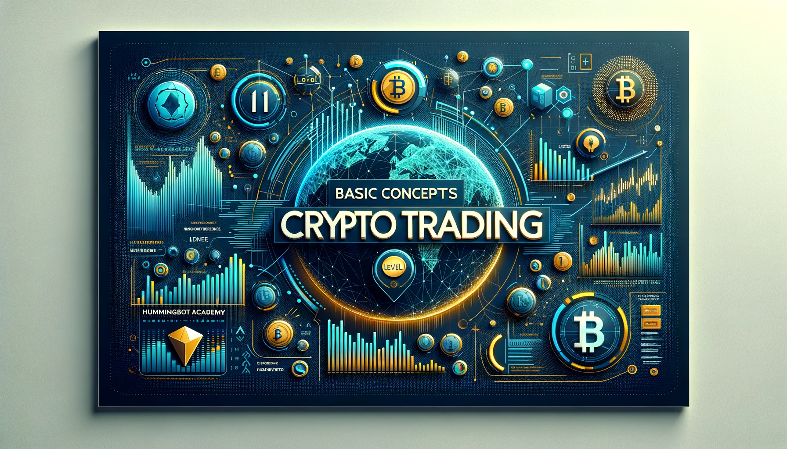
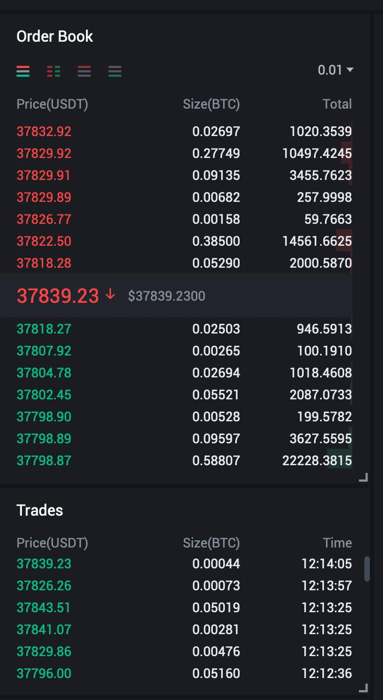
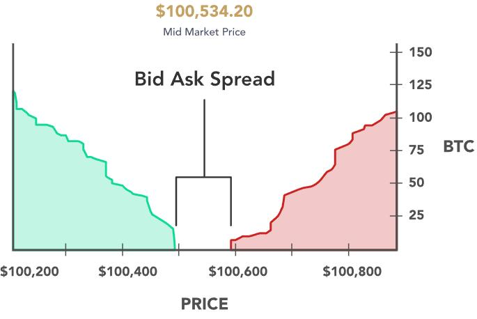
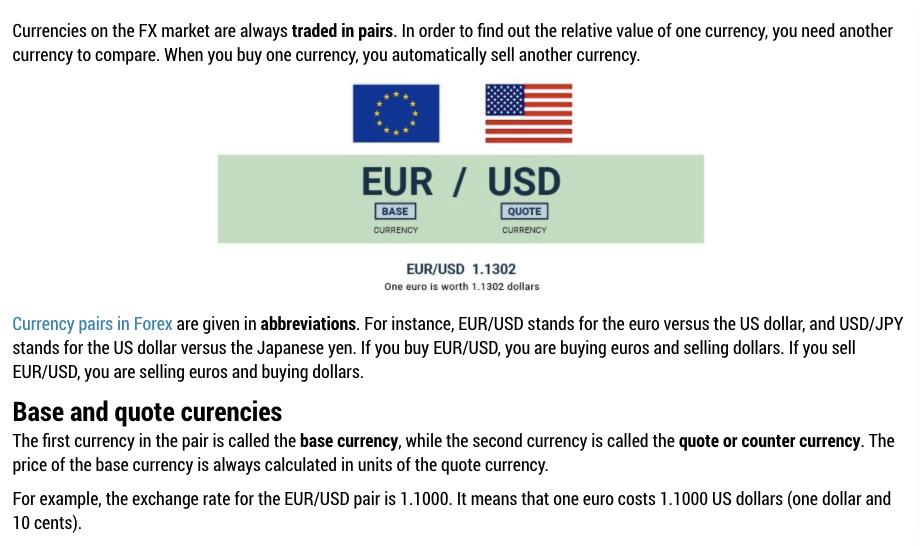
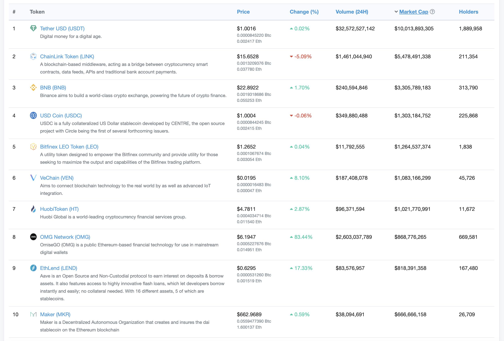

# Basic Concepts of Crypto Trading



### Order Book

An **order book** is the list of orders that an exchange uses to record the interest of buyers and sellers for a particular financial market. A matching engine uses the book to determine which orders can be fully or partially executed.

Example of an order book on AscendEx where the prices in red indicate sell orders and the prices in blue indicate buy orders.

<!-- more -->



### Liquidity

The order book is **very liquid** when a great amount of orders is stored in each buy and sell side of the order book. In such a situation a market order produces only a small price adjustment. On the contrary, if the order book is **not liquid**, there are only a few orders on the buy and sell side and there is a very large average gap in price between adjacent orders. In this case, even a market order with a small volume can produce a dramatic price fluctuation of several ticks. Markets perform better when they are more liquid.


### Limit and market orders

#### Limit orders

A **limit order** is an order that you place on the order book with a specific limit price. The limit price is determined by you. The trade will only be executed if the market price reaches your limit price (or better). Therefore, you may use limit orders to buy at a lower price or to sell at a higher price than the current market price.

[What is a Limit Order?](https://academy.binance.com/en/articles/what-is-a-limit-order?ref=blog.hummingbot.org)
[Limit Order Video](https://www.youtube.com/watch?v=pQMKqnzmydk&ref=blog.hummingbot.org)

#### Market orders

A **market order** lets you purchase or sell a financial asset instantly at best price currently available. Market orders take prices from limit orders on the order book. This means you can’t be 100% sure of the price you will get. Slippage can occur when you get a price different from what you expected.

[What is a Market Order?](https://academy.binance.com/en/articles/what-is-a-market-order?ref=blog.hummingbot.org)
[Market Order Video](https://www.youtube.com/watch?v=pQMKqnzmydk&amp;feature=emb_imp_woyt)

### Bid-ask spread



*Depth Chart of the buy (green) and sell (red) orders*

*Source: [Bid-ask spread](https://river.com/learn/terms/b/bid-ask-spread/?ref=blog.hummingbot.org)*

The bid-ask spread is the difference between the highest price a buyer is willing to pay for an asset and the lowest price a seller is willing to accept. These prices are reflected as bids and asks on an order book, placed by market makers as limit orders.

Price takers will place market orders to buy or sell an asset, and in doing so they accept the best bid or best ask determined by the market maker.

In Hummingbot, the `bid_spread` is the % how far from the mid price you want your buy orders are placed. While `ask_spread` is for your sell orders.

Mid price is **NOT** the price that you see in the middle of the orderbook - that's the last trade price.

Mid price is the average price of the best bid and ask. Which means:

```
mid_price = (best_bid + best_ask) / 2
```

your order prices are calculated as follows:

```
hbot_bid_price = mid_price * (1 - bid_spread)
hbot_ask_price = mid_price * (1 + ask_spread)
```

and spread equation is:

```
(|bid_price-mid_price|/bid_price)*100
or 
(|ask_price-mid_price|/ask_price)*100
```

where |x| is the sign of abosulte value.

### Slippage

Slippage is financial loss during trading as a result of market inefficiencies and illiquidity. Slippage occurs when an illiquid market experiences a sudden, large change in demand or supply, resulting in losses for the buyer or seller.

[Learn more about slippage](https://river.com/learn/terms/s/slippage/?ref=blog.hummingbot.org)


## What is Market Making?

### Market Makers and Market Takers

**Market Makers** add liquidity to an exchange’s order book by placing limit orders, or orders to buy or sell at a specific price that is not immediately filled. Makers place orders that are not immediately matched by an existing order. Without limit orders sitting on an order book, there would be little liquidity for a given pair as an exchange would be trying to match buy and sell market orders as they are placed. These Market Makers are crucial for maintaining price stability, as they fill up an order book with limit orders at different levels. Makers are typically rewarded with lower fees for providing liquidity to the market in the form of buy/sell limit orders.

**Market Takers** take liquidity, as in they place market orders to immediately buy or sell. Market orders are orders to take the best available price in the current market. Takers take the price that they want and in doing so, they are “taking” volume off of an order book. They place orders that are filled immediately by buy or sell orders already sitting on the books. Taker market orders are designed to never land on an exchange’s order book, as they are filled by the exchange’s matching engine as they are placed. Thus, taker fees are typically higher because their orders are filled immediately.

[](https://www.youtube.com/embed/vw7iBwcFB9c)

It can be assumed that every taker’s market order is filled by a maker’s limit order but this is not always the case. You can place a limit order to "cross" and take an order from the orderbook so it becomes a taker.


**For example:**

In this orderbook, the best bid is 405.49 and 405.54 best ask price.

Placing a limit order would normally put your orders in the book and wait for someone to fill that order.

But if you place a limit **buy** order with the price of 405.54, since it has a matching **sell** order it would immediately take it.

You can try doing this on your own to see it

In short,

A **market maker** is

 any person that posts a buy or sell offer on the order book, providing liquidity to that specific market.

A **market taker** is any are accepting the prices offered on the order book is called a market taker.

[](https://www.youtube.com/embed/vsBoyW-M0Aw)
[](https://www.youtube.com/embed/jmq9TkoXN_o)

### Market Making vs Arbitrage

To learn more about the difference between Market Making and Arbitrage:

[What is Arbitrage?](../what-is-arbitrage/index.md)

### Market Making vs Bitcoin Mining vs Liquidity Pools

How is market making different from bitcoin mining and liquidity pools?

- **Bitcoin mining** is the most traditional sense of it. You use computing power to produce hashes, or solve hard math problems. This expense of energy proves to the world that a transaction was real.
- **Market making** is similar to liquidity mining. Market making is traditionally done by larger firms in large exchanges. Traditionally, market makers add liquidity to an exchange’s order book by placing limit orders, or orders to buy or sell at a specific price that is not immediately filled. Market making in liquidity pools is very different (see below).
- **Liquidity pools** are found only in decentralised exchanges. Uniswap is an example. This is how decentralised exchanges solve the issue of market making. The first generation of decentralized exchanges still have order books, but newer ones like Uniswap use other methods such as automated market making. The market makers in exchanges with order books constantly put in bids to buy or sell. However, since there is no order book in many modern decentralised exchanges with liquidity pools, liquidity providers simply put their assets into the pool and this allows for people to buy and sell from that pool.
- **What is liquidity mining then?**
- Liquidity mining is essentially performing the role of a market maker, however, it uses a computer to constantly change the orders. That is where it got the name mining from, as it uses computational power like mining bitcoin does – but far far less so don’t worry too much about your power bill! As opposed to liquidity pools, it’s more active. You need a machine to be running to execute the commands and then you also need to give it instructions on how to set orders. However, the returns can also be greater as well though there are greater risks.

That is where the **Hummingbot software** comes in. The software acts as a layer to automatically execute an algorithm that you set for trading. It sounds complicated but it can be as easy as “set buy orders at 1% below the current price and sell orders 1% above”. There are far more options, but this is just the jist.


## Trading terminologies 101

### Trading Pairs

In cryptocurrency, the term “trading pairs” describes a trade between one type of cryptocurrency and another. For example, the “trading pair” ETH/BTC.

With ETH/BTC you can buy Ethereum with Bitcoin, or sell Ethereum for Bitcoin.

[What are "Trading Pairs" in Cryptocurrency?](https://cryptocurrencyfacts.com/what-are-trading-pairs-in-cryptocurrency/?ref=blog.hummingbot.org)

### Base and Quote Assets



[Currency pairs: base and quote currencies, and types of pairs.](https://fbs.com/analytics/guidebooks/currency-pairs-base-and-quote-currencies-majors-and-crosses-15?ref=blog.hummingbot.org)

### Minimum order size

Minimum order size is the smallest amount of cryptocurrency that you can buy or sell in the exchange.

[Trading Rules | Binance](https://www.binance.com/en/trade-rule?ref=blog.hummingbot.org)

Hummingbot's minimum order size is denominated in base asset. If a certain exchange uses quote asset in their list of minimum order size, you may also find this crypto converter calculator useful.

[Cryptocurrency Converter and Calculator Tool | CoinMarketCap](https://coinmarketcap.com/converter/?ref=blog.hummingbot.org)

### Figuring out minimum order size with Postman

Some exchanges have no web pages where you can view the minimum order size. For example in KuCoin, you have to use an application like Postman to get REST API data. See doc below :

[KuCoin - hummingbot docs](../../../exchanges/kucoin/index.md)
[https://hummingbot.org/exchanges/kucoin/](../../../exchanges/kucoin/index.md)

[](https://www.youtube.com/embed/FjgYtQK_zLE)

### Trading Fees

Whenever you execute trades (taking an order or when someone fills your orders) there are corresponding fees deducted from the total amount. Fees vary from exchanges.

[Fee Schedule | Binance](https://www.binance.com/en/fee/schedule?ref=blog.hummingbot.org)

### Stable Coins, Fiat Currencies and ERC20 Tokens

#### Stablecoins

Stablecoins are cryptocurrencies that attempt to peg their market value to some external reference. Stablecoins may be pegged to a currency like the U.S. dollar or to a commodity's price such as gold.

Examples:
- USD Tether / USDT
- True USD / TUSD
- Paxos Standard / PAX
- USD Coin / USDC
- Binance USD / BUSD


#### Fiat currencies

A fiat currency is a national currency that is not pegged to the price of a commodity such as gold or silver

. The value of fiat money is largely based on the public’s faith in the currency’s issuer, which is normally that country’s government or central bank.

Examples :
- US Dollar / USD
- Australian Dollar / AUD
- Euro / EUR
- Pound Sterling / GBP
- Russian Rubble / RUB
- Turkish Lira / TRY

[What Is Fiat Currency? | Binance Academy](https://academy.binance.com/en/articles/what-is-fiat-currency)

#### ERC20 Tokens

[An Introduction to ERC-20 Tokens | Binance Academy](https://academy.binance.com/en/articles/an-introduction-to-erc-20-tokens)



## How to trade crypto: an introduction

Now, we can get into some practical tips on crypto trading in general as an introduction. The following article by Hummingbot trader Tsalkapone is a good starting point. In the article, you will learn about practical tips for:
- Make Create an account in a crypto exchange
- Determine your trading method
- Fund your account
- Pick a token to invest in
- Analyze market trends and indicators
- Choose your strategy

[How to trade crypto: an introduction by trader Tsalkapone](https://www.notion.so/How-to-trade-crypto-an-introduction-by-trader-Tsalkapone-42f0aa9be23f421a9bc2906e7e218323?ref=blog.hummingbot.org)

## Helpful Tasks

Here are some helpful tasks for you to understand the basics of crypto trading. If you find it helpful, feel free to go through these tasks.
- Sign up for a Binance, Ascendex, KuCoin, or Gateio account
- Create a LIMIT buy order of a cryptocurrency (eg.ETH) using USDT and notice where your orders are placed in the order book
- Create a LIMIT buy order with the best price in the orderbook and allow the order to get filled
- Execute a MARKET sell order of a cryptocurrency (eg. ETH) for USDT
- Create a LIMIT order to "cross" the orderbook and take existing orders