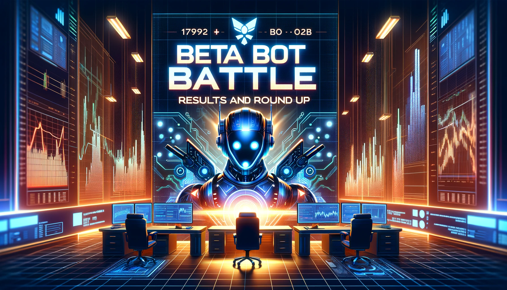
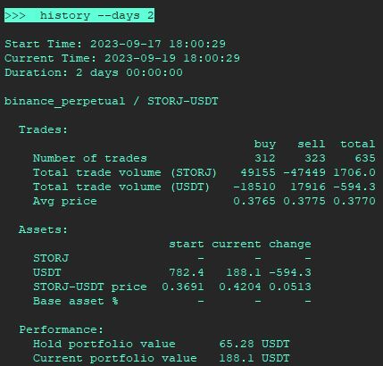

# ⚔️ Beta Bot Battle Results and Roundup!

The [Beta Bot Battle](../join-the-beta-bot-battle/index.md) has concluded, and we're thrilled to present the outcomes to the broader Hummingbot community!

Over a 48-hour period in September, Hummingbot users competed to see whose bots could earn the most profits and trade the highest volume, starting with an 100 USDT initial balance on Binance.

This inaugural experiment was, in our view, a resounding success. Though the participation was limited due to it being the first edition, the energy and camaraderie displayed on the **#competitions** Discord channel were palpable. We celebrated numerous triumphs, empathized with the setbacks, and eagerly anticipated the insights from participant write-ups about effective strategies.

Let's delve into the results:

<!-- more -->

## Competition Results

| Discord Handle | Battle Score | USDT Volume (30%) | USDT Profit (70%) | Exchange |
| --- | --- | --- | --- | --- |
| doi_doi | 1.00 | 35,698 | 134.72 | binance_perpetual |
| WeGotGame | 0.36 | 32,562 | 11.24 | binance_perpetual |
| nikita7970 | 0.13 | 15,968 | -5.40 | binance_perpetual |
| fengtality | 0.05 | 3,843 | -1.00 | binance |
| cgambit | 0.00 | 398 | -3.61 | binance |
| dolm5415 | NA | 49,133 | 11.8 | gate_io_perpetual |

Of the contenders, five met the eligibility criteria and traded with <100 USDT on Binance or Binance Futures. Regrettably, the trades on Gate.io by one participant disqualified them. Moreover, two additional participants encountered issues while submitting their bot data and weren't able to be included in the results, signaling a need for process refinement.

For a comprehensive breakdown of each participant's score and detailed trading metrics, refer to this [Google Sheet](https://docs.google.com/spreadsheets/d/1ODmPtEOPmYRSpK9l0s0uey425VCVMI-G1eNpAFrWVmQ/edit?usp=sharing). 

Also, check out this [Python script](https://gist.github.com/fengtality/8970b8ce67bc84dc5047ab729922d44d) used to compute the trading metrics from the participants' submitted trade CSV files.

## A Stellar Win for doi_doi!

Kudos to **doi_doi** for clinching the top spot in the Beta Bot Battle and bagging the First Place prize of 100,000 HBOT!

Starting with less than 100 USDT on Binance Futures, doi_doi **realized 100 USDT+ profit and generated 35K+ USDT of volume in just two days**.

We also laud WeGotGame for securing the Second Place prize of 50,000 HBOT. With a volume of 32,562 USDT and a profit of 11.24 USDT, their performance was commendable.

Hats off to the other qualified participants who each earned 10,000 HBOT.

## Spotlight on WeGotGame's Writeup

A huge round of applause for WeGotGame, the deserving winner of the 50,000 HBOT Best Writeup prize! [WeGotGame's writeup](https://harmless-bowl-7ee.notion.site/Bot-Battle-Write-Up-3408e78a0273427797c792e77a54a587) was distinguished not only by the success of the strategy but also by the depth of detail and precision of the parameters provided. In recognition of their effort in sharing insights with the community, all other participants who submitted write-ups will be awarded 10,000 HBOT.

Let's delve deeper into the highlights from WeGotGame's winning strategy:

WeGotGame employed a refined version of the [`market_making_dman_v2`](https://github.com/hummingbot/hummingbot/blob/master/scripts/market_making_dman_v2.py) script. Here's a breakdown of the enhancements made:

* Transitioned the mid-price shift from half of NATR to three-quarters of NATR.
* Integrated dynamic stop loss and take profit mechanisms.
* Set the take profit and stop loss based on NATR multiplied by a certain multiplier.
* Configured for only two order levels on either side.
* The second-level order's size is designed to be a multiple of the first-level order, employing a martingale approach.

A slight short bias was introduced, characterized by tighter spread factors on sell orders and augmented sell order amounts.

## All Submitted Write-ups

- **wegotgame**: [Read the Write-Up](https://harmless-bowl-7ee.notion.site/Bot-Battle-Write-Up-3408e78a0273427797c792e77a54a587)
- **cgambit** : [Read the Write-Up](https://www.notion.so/A-Journey-Through-Hummingbot-s-Beta-Competition-Lessons-Insights-6d86e0325c8e48f6bfcb5f55d9c89d4d?pvs=4)
- **dolm5415**: [Read the Write-Up](https://www.notion.so/Bot-Battle-Write-Up-02f747fe92644ac5b5f86906fa0ace1b?pvs=4)
- **fengtality**: [Watch the Video Submission](https://www.youtube.com/watch?v=3cWoS3Yk6EE)

<iframe style="width:100%; min-height:400px;" src="https://www.youtube.com/embed/3cWoS3Yk6EE" frameborder="0" allow="accelerometer; autoplay; encrypted-media; gyroscope; picture-in-picture" allowfullscreen></iframe>

## Lessons Learned

The Beta Bot Battle was a comprehensive learning journey:

- **Enthusiastic Participation:** The fervor of the participants was evident, with many voicing their positive experiences.
- **Improvement Needed:** We've taken note of the feedback regarding the signup and submission processes and will work on enhancing them.
- **Expansion on the Horizon:** The demand for more eligible exchanges is clear, and we're keen on expanding our offerings.
- **Clarifying the Rules:** We aim to provide clearer guidelines on starting amounts, eligible pairs, and strategies in subsequent editions.

## Upcoming Bot Battles

The Beta Bot Battle was a testament to our community's skill and commitment. While this edition served as a precursor to monthly Bot Battles that are reserved for [Botcamp](/botcamp) members, we're excited about opening certain future editions to the overall Hummingbot community.
