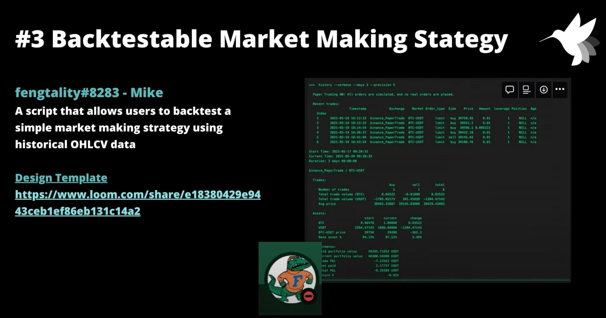
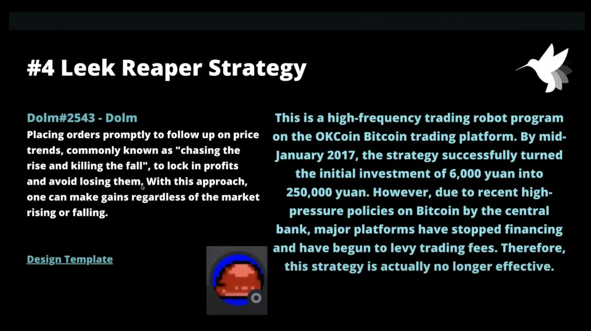

# Botcamp Cohort #4 Demo Day Recap

We recently finished our **fourth cohort** of [Hummingbot Botcamp](https://www.botcamp.xyz) with Demo Day, where participants showcased the custom trading scripts they developed over the course of the Botcamp intensive 6-week online core course!

The Botcamp participants in this cohort were a dynamic mix of enthusiastic software developers, enterprising startup founders, and adept quant traders, all keen on honing their own unique trading strategies and skills. Botcamp is a professional community with regular events, and numerous participants have forged strong bonds well beyond the program's duration.

Let's take a look at what Botcamp participants presented for Demo Day #4!

### **Index Portfolio (Roland)**

Roland wrote a script that creates a self-rebalancing portfolio based on a 1/N strategy, ensuring ideal diversification without the need for specific parameters, thus offering a satisfactory baseline performance.

<!-- more -->

Specifically, the strategy allocates equally across N different assets. This approach promotes a broad diversification that can effectively mitigate risks associated with individual investments. By adopting this straightforward strategy, investors can sidestep the often complex task of predicting future asset performance or understanding intricate asset correlations. Moreover, it provides a reasonable baseline performance, making it an excellent choice for those new to investing or for those preferring simplicity over more complex, possibly riskier strategies.

Explore and use the script: [https://github.com/hummingbot/hummingbot/blob/master/scripts/1overN_portfolio.py](https://github.com/hummingbot/hummingbot/blob/master/scripts/1overN_portfolio.py?ref=blog.hummingbot.org)

Run this script in Hummingbot (development branch): `start --script 1overN_portfolio.py`

### Spot Perp Arbitrage (Alex)

Alex created a simpler version of the [Spot-Perpetual Arbitrage](/strategies/spot-perpetual-arbitrage/) strategy, since the original strategy was found to have certain issues, including executing redundant trades. To address these issues and cater to those who lean towards a script-based format, the original code has been reformatted and improved. Now, users who favor a script-based approach can implement the strategy more efficiently.

This strategy monitors prices on spot and derivative connectors, starting trades when price differences exceed a **min__divergence** threshold and closing positions when the spread drops below a **min__convergence** threshold, hence exploiting market inefficiencies for profit.

Explore and use the script: [https://github.com/hummingbot/hummingbot/blob/master/scripts/spot_perp_arb.py](https://github.com/hummingbot/hummingbot/blob/master/scripts/spot_perp_arb.py?ref=blog.hummingbot.org)

Run this script in Hummingbot (development branch): `start --script spot_perp_arb.py`

### Backtestable Market Making (Mike)

Since the recently added Candles Feed feature introduces new possibilities for script types, Hummingbot co-founder Mike created a sample script that implements a simple backtest of a market making strategy.

Backtesting with historical OHLCV data provides a rough way for users to assess the potential performance and efficacy of a market making strategy based on past market conditions.

Explore and use the script: [https://github.com/hummingbot/hummingbot/blob/master/scripts/backtest_mm_example.py](https://github.com/hummingbot/hummingbot/blob/master/scripts/backtest_mm_example.py?ref=blog.hummingbot.org)

### Leeks Reaper Strategy (Dolm)

Dolm, OG leader of the Hummingbot WeChat group and Botcamp mentor, created a strategy that swiftly places orders to track price movements, termed in Mandarin as "chasing the rise and killing the fall", designed to enable profit locking and loss prevention.

In 2017, this strategy enjoyed widespread popularity among Chinese traders, who took advantage of low or non-existent trading fees at exchanges during the earlier days. However, due to its high-frequency nature, the strategy's efficacy waned with the rise of trading fees. Nevertheless, maintaining this script could prove advantageous, should any exchanges decide to roll out no-fee promotions in the near future.

Explore and use the script: [https://gist.github.com/whoareyou40/c1d2568eda067f224e278e969e1530b6](https://gist.github.com/whoareyou40/c1d2568eda067f224e278e969e1530b6?ref=blog.hummingbot.org)

---

Learn how to create custom trading strategies like these by joining our next cohort of Botcamp, which starts on **June 27, 2023.**

We cap the number of students in order to deliver a high quality experience to all participants, so [reserve your spot](https://botcamp.hummingbot.org/?ref=blog.hummingbot.org) today before they are all gone!

At Hummingbot Foundation, our mission is to **democratize quantitative trading**. Botcamp provides hand-on training that helps students learn to create sophisticated trading strategies using Hummingbot, while at the same time creating **open source examples** for future Hummingbot users!