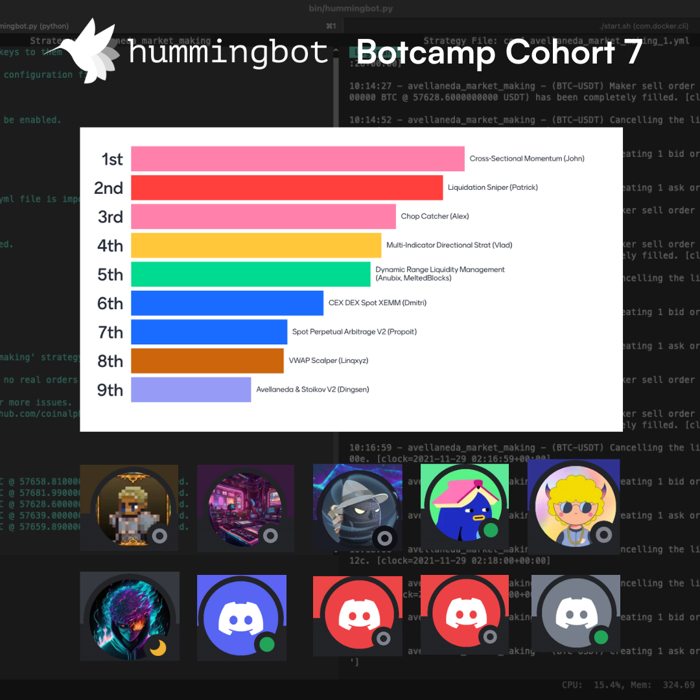
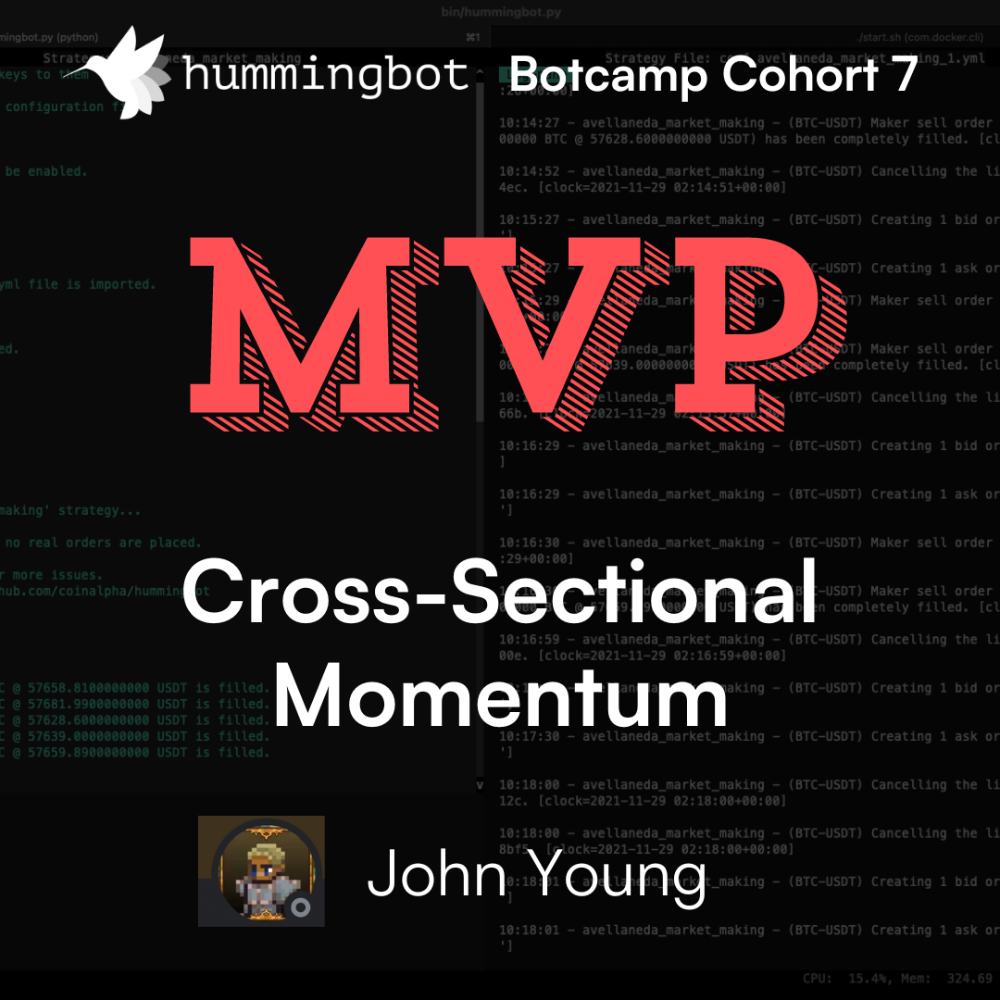

# Hummingbot Botcamp Cohort 7 Demo Day Recap

The seventh cohort of Hummingbot Botcamp recently finished with a milestone Demo Day that showcased the innovative strategies developed by our talented cohort participants. Here’s a detailed recap of the exciting strategies presented and the alpha-filled insights shared!

<!-- more -->

### Cohort 7: Certified StrategyV2 Developer

In Cohort 7, participants embarked on an intensive 5-week journey to become **Certified StrategyV2 Developers**. Throughout the program, they learned to design, code, and deploy custom algorithmic trading strategies using the [Strategy V2 Framework](./../../../v2-strategies/index.md). The cohort culminated in a Demo Day, where participants presented their strategies and voted for the best ones.

<iframe style="width:100%; min-height:400px;" src="https://www.youtube.com/embed/TAulqoSenmk" frameborder="0" allow="accelerometer; autoplay; encrypted-media; gyroscope; picture-in-picture" allowfullscreen></iframe>

By completing the cohort, participants gained official recognition with [Hummingbot certification](./../../../certification/index.md) to showcase their skills on social media and professional platforms. In addition, each Demo Day presenter received a limited edition [Cohort 7 NFT](https://opensea.io/assets/ethereum/0x59072271620d3528cb6d7565158b11492b25a4e5/1), commemorating their participation and achievement.

### Strategy Presentations

#### Spot-Perpetual Arbitrage V2 (Propoit)

[:simple-youtube: Watch presentation](https://youtu.be/TAulqoSenmk?si=1nttdR48YnOUePjk&t=335)

Propoit created a V2 Framework version of the spot-perpetual arbitrage strategy, which capitalizes on price differences between spot and futures markets. It begins by buying on the spot market and selling on the futures market when a price divergence is detected. The strategy aims to lock in profits when conditions are favorable, also benefiting from positive funding rates.

#### Cross-Sectional Momentum (John)

[:simple-youtube: Watch presentation](https://youtu.be/TAulqoSenmk?si=s6ra_RR0aHUk2UQa&t=615)

John presented a sophisticated strategy that uses a rebalancing Executor and EMA crossover Controller. It rebalances a portfolio into top-performing assets based on recent performance, utilizing both short-term and long-term EMA indicators. The strategy adapts dynamically, making it a robust tool for different market conditions.

#### Liquidation Sniper (Patrick)

[:simple-youtube: Watch presentation](https://youtu.be/TAulqoSenmk?si=56eyGO46CvI0qHPg&t=1225)

This strategy listens to liquidation events in crypto markets. When significant liquidations occur, it places buy orders to catch rebounds, taking advantage of the temporary market imbalance caused by liquidations. The strategy has potential for further enhancements with high block and other integrations.

#### Multi-Indicator Directional Strategy (Vlad)

[:simple-youtube: Watch presentation](https://youtu.be/TAulqoSenmk?si=nq9RQcdCKNVgB2S4&t=1575)

Vlad’s strategy is based on a time-series model that identifies short-term reversion and medium-term trends. Using linear regression and different moving averages, it adjusts positions dynamically to capture profitable trades while managing risks associated with inventory.

#### Dynamic Liquidity Management (Nicolas and Melted Blocks)

[:simple-youtube: Watch presentation](https://youtu.be/TAulqoSenmk?si=wwqp6eIK7OJr9VuA&t=1895)

Nicolas and Melted Blocks teamed up to build a strategy that manages liquidity provision in Uniswap V3 pools. It adds liquidity within specified price ranges and rebalances positions when prices move outside these ranges. The strategy aims to minimize impermanent loss and maximize fee earnings by keeping positions always within active ranges.

#### Avellaneda & Stoikov V2 Strategy (Dingsen)

[:simple-youtube: Watch presentation](https://youtu.be/TAulqoSenmk?si=KSTU4XRo1ZLfyr9M&t=2315)

Dingsen revisited the classic Avellaneda Stoikov paper and implemented it as a V2 script. The strategy adjusts the reservation price based on current and target inventories and adjusts spreads dynamically, aiming to mitigate losses during market trends.

#### VWAP Scalping (Linus)

[:simple-youtube: Watch presentation](https://youtu.be/TAulqoSenmk?si=gMU3PwOSdFF9Lnsq&t=2710)

Linus’ strategy uses VWAP with standard deviation bands to execute mean reversion trades. By placing limit orders based on VWAP deviations, it aims to capture small market movements. The strategy incorporates DCA executors to spread out entries and exits, enhancing its efficiency.

#### CEX DEX Spot XEMM (Dmitri)

[:simple-youtube: Watch presentation](https://youtu.be/TAulqoSenmk?si=GBtkNKxNebh4tPyE&t=2910)

Dmitri’s strategy focuses on cross-exchange market making between centralized exchanges (CEX) and decentralized exchanges (DEX). This innovative approach provides liquidity on DEXs while hedging impermanent loss on CEXs, demonstrating a sophisticated understanding of market dynamics..

#### Perpetual Mean Reversion with Bollinger Bands (Alex)

[:simple-youtube: Watch presentation](https://youtu.be/TAulqoSenmk?si=c-F0ORtB3HMtYQUB&t=3195)

Alex's "Chop Catcher" strategy uses Bollinger Bands to identify reversion points in perpetual markets. It places leveraged limit orders at the bands' edges and avoids trading during high volatility periods. This strategy leverages the DCA executor and triple barrier config for better risk management.

### MVP Voting

The audience, including Hummingbot Foundation staff, participated in voting to rank the strategies. The winner was **John’s Cross-Sectional Momentum** strategy, which was awarded the [Most Valuable Strategy NFT for Cohort 7](https://opensea.io/assets/ethereum/0xaa9b60c14d92ed02da6daaac6c5354402816584b/1). Ina ddition, all participants who presented a strategy received the [Cohort 7 NFT](https://opensea.io/assets/ethereum/0x59072271620d3528cb6d7565158b11492b25a4e5/1) as a token of recognition.

### Next Cohort: Certified Market Maker

Cohort 7 Demo Day was a resounding success, and we are now accepting registrations for the next public cohort of Botcamp, which will offer the new [Hummingbot Market Maker certification](/certification/#hummingbot-market-maker)!

Compared to prior Botcamp cohorts, this cohort will focus on market-making strategies on centralized and decentralized exchanges, rather than general algorithmic trading. This cohort will emphasize theory and deployment over coding, making it ideal for students without Python experience.

Early bird registration ends soon. [Sign up on the Botcamp website](https://www.botcamp.xyz/) and learn how to market make like the pros!

