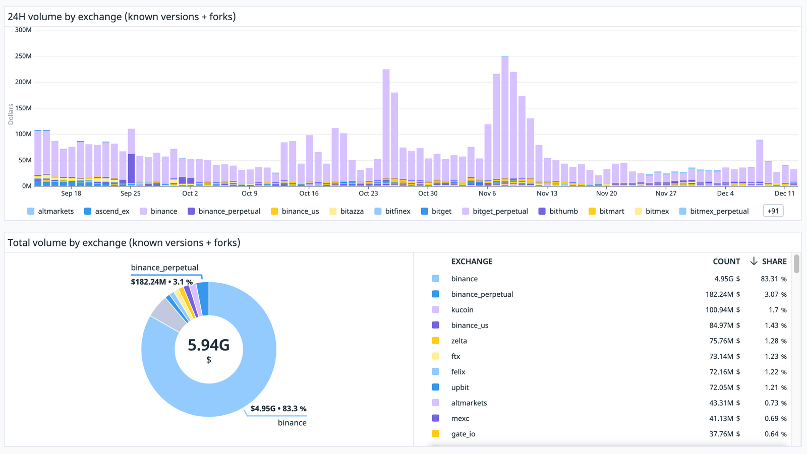

# Changes to Hummingbot Maintenance and Governance

)

Almost exactly one year ago, Hummingbot Foundation [launched the HBOT token](../introducing-the-hummingbot-foundation/index.md) as an experiment in decentralized governance over a publicly shared, community maintained open source project.

Inspired by [Linux](https://www.linuxfoundation.org/), we believe that a bazaar-style, distributed model of software development, powered by a decentralized, community-owned governance token, would allow us to maintain and grow a large, complex, open source codebase like Hummingbot.

## Highlights

Here are some of our proudest achievements over the past 12 months:

- Executed **220+ governance proposals** on our [Snapshot governance portal](https://snapshot.org), an average of 4.7 votes per proposal and a 92% acceptance rate. We believe this spread fairly represents what Hummingbot is today: an organic, global community of quant traders and developers who use different aspects of a shared, modular codebase.
- Awarded more than **40 developer bounties** to 20+ unique community developers for fixing bugs, adding new CEX/DEX connectors, strategies and other enhancements to the codebase (see HBOT Distributions in [HBOT Tracker](https://docs.google.com/spreadsheets/d/1UNAumPMnXfsghAAXrfKkPGRH9QlC8k7Cu1FGQVL1t0M/edit#gid=285483484))
- Held 23 weekly developer and community calls, with agendas and recording links posted in the pm repository
- Launched the public Hummingbot Reported Volumes dashboard to report real-time aggregated volume metrics from Hummingbot users. Over the past 3 months, Hummingbot users have generated $6 billion in trade volume.

<!-- more -->

In addition, we have shipped [11 Hummingbot releases](https://docs.hummingbot.org/release-notes/) thus far this year (12 after December), which have introduced:

- The new [Gateway module](https://docs.hummingbot.org/gateway/) that provides standardized middleware for connecting to DEXs on various blockchains
- The new [Scripts module](https://docs.hummingbot.org/scripts/) that allows you to create customizable, lightweight strategies that utilize the full power of Hummingbot
- Upgrades, fixes, and improvements to many exchange connectors in Hummingbot.

Finally, we're incredibly excited about [Botcamp](/botcamp/), our new developer bootcamp that teaches participants how to design and create their own custom algo trading strategies using Scripts. We're currently in the midst of the first official, sold-out cohort and plan to offer more capacity next year.

## Lessons learned

Yet just like for everyone else in crypto, 2022 has also been a year of hard lessons for us:

- When we first started the Foundation, as described in the original [whitepaper](https://docs.hummingbot.org/governance/whitepaper/), we believed that adding more exchange connectors would grow the user base and fees collected from fee share partnerships with these exchanges, and that these fees would scale exponentially with the number of exchanges and users.
- Unfortunately, we found that the effort entailed in adding and maintaining exchange connectors didn't match the usage and fee share value received. From efforts with now-defunct exchanges like FTX and CoinFlex, we learned that integrating with more exchanges haphazardly doesn't benefit us nor our community.
- Currently, the effort that the Foundation spends on maintenance doesn't match connector usage by the community. **80%+ of the trading volume generated by the community, as well as the fees share we receive, comes from only two exchanges: Binance and KuCoin.**
- Yet each release, the bulk of our maintenance bandwidth is spent reviewing and approving new connectors into the codebase, as well as other community pull requests. In the last release alone, we merged in [10 new CEX/DEX connectors and connector uprades.](https://docs.hummingbot.org/release-notes)
- From the pull request proposals submitted via Snapshot, we can see that inclusion in the Hummingbot codebase is a desired commodity for external exchanges who may already have built Hummingbot forks for their own use (our[ Reported Volumes dashboard](https://p.datadoghq.com/sb/a96a744f5-a15479d77992ccba0d23aecfd4c87a52?tpl_var_environment%5B0%5D=%2A&tpl_var_exchange%5B0%5D=%2A&tpl_var_instance_id%5B0%5D=%2A&tpl_var_version%5B0%5D=%2A&from_ts=1689737409792&to_ts=1692329409792&live=true) shows 100+ forks out in the wild). By getting their connector integrated into the official Hummingbot codebase, exchanges get an implicit stamp of approval along with the side benefit of free community QA and technical support by the Foundation.
- Unfortunately, each new connector included the codebase extracts a maintenance burden from the scarce resources in the Foundation team. We run unit tests for each connector, maintain documentation that lists each exchange in the codebase, and answer questions from users about every aspect of the Hummingbot codebase. Because there are now 40+ exchanges in the codebase, Docker image sizes are getting bloated, and Github CI/CD tests continually fail.
- Finally, avoiding connectors to exchanges like FTX that turn out to be active scams, as well as other security risks, should be the purpose of the governance process. While we tried to start something along these lines with the [exchange certification process](https://snapshot.org/#/hbot.eth/proposal/0x1f84875fb764d697a106e07fa5a7b6584a418cf5634aa94f4d9a8c5852455f4e) started in Epoch 2, it was unclear what certification represented, and since the initial process resulted in FTX being certified, it clearly could use some changes 🤦‍♂️

In the past few weeks, we have discussed these issues with the community on Discord and on weekly community calls. Below, we present the changes to the governance and maintenance processes that Hummingbot Foundation plans to implement, starting later this month.

## Governance changes

To enable the community of HBOT holders more control over the Hummingbot codebase, Hummingbot Foundation will hold regular monthly Snapshot polls that allow HBOT holders decide how the Foundation allocates our maintenance bandwidth and HBOT developer bounties.

There will be three types of polls:

- **Issues (1 poll per month)**: A monthly poll where HBOT holders can prioritize the Github issues and pull requests that the Foundation will address and review in the upcoming month. The first vote will be later this month, in late December 2022.
- **Exchanges (2 polls per quarter)**: A poll for each exchange type (CEX, DEX) that lets HBOT holders can pick which exchanges should be included in the codebase, and rank how much maintenance effort the Foundation should put into each one. Each exchange type will be tiered into Gold, Silver and Bronze connectors with different levels of service/maintenance for each tier. The first vote will be in January 2023 and take effect over the following quarter.
- **Strategies (1 poll per quarter)**: A quarterly poll where HBOT holders can pick which strategies should be included in the codebase and of those, which ones should considered core strategies maintained and improved by the Foundation, versus that are community strategies maintained by the community. The first vote will be in January 2023 and take effect over the following quarter.
Each poll will allow HBOT holders to allocate their voting power across various exchanges/strategies/issues. Unlike the [first exchange certification poll](https://snapshot.org/#/hbot.eth/proposal/0x1f84875fb764d697a106e07fa5a7b6584a418cf5634aa94f4d9a8c5852455f4e), we plan to use the Quadratic Voting feature in Snapshot this time around.

We believe this process will allow us to allocate our scarce maintenance bandwidth toward the exchanges that the community uses and trusts the most. Similarly, we hope that this process that ensure that we are improving the strategies and fixing the issues that they care about the most.

## Poll types

Below, we describe each of the three poll types in more detail.

### Issues

- A monthly poll that selects the **5 issues and pull requests** that the Foundation will prioritize next month
- This week, the Foundation will create a thread in the new **#governance-polls **Discord channel, where anyone can nominate any open Github issue or pull request. These issues can be for any connector, strategy, or component in the codebase.
- Next week, the Foundation will create a Snapshot poll that includes all the issues listed in the thread above. Any HBOT holder can allocate their tokens across these issues.
- Voting ends 7 days later, and the 5 top vote-getters using the quadratic voting method will be the **Priority Issues** for the Foundation in January 2023.
- This means that the Foundation will focus on resolving the issues and/or reviewing the pull requests chosen by the community, prior to any net new improvements. The Foundation may implement and review bug fixes as needed, but will prioritize the **Priority Issues** above any enhancements, new connectors, or other issues approved via HIP and PRPs.

### Exchanges

- Two quarterly polls that selects which exchanges should have connectors in the codebase. Since Hummingbot standardizes connectors for various exchange types, we believe there should be two general types of exchanges up for voting: (1) (CEX) Centralized Exchanges and (2) (DEX) Decentralized Exchanges
- CEXs are centralized exchanges like Binance, Coinbase, and Kucoin. Currently, each CEX has  `spot` and `perpetual` connectors. In the future, the connector(s) for a given exchange should map all major API endpoints available to API users.
- DEXs are decentralized exchanges that connect via Gateway like Uniswap and TraderJoe, as well as those that connect via the client like dYdX and Loopring. Similar to CEXs, future connectors will try to map every endpoint for a DEX, like how the Uniswap connector supports both the swap `uniswap` and the liquidity provision `uniswaplp` endpoints.
- Around the middle of January 2023, Hummingbot Foundation will create two Snapshot HGP polls that allow users to select the top CEX and DEX connectors in the codebase, from the ones currently in the codebase as of the v1.11 release. Similar to Issues (see above), each poll will use Quadratic Voting and allow HBOT holders to allocate their tokens across one or more exchanges.
- The #1 vote-getting exchange in each type will be the **Gold** exchange. This exchange's connectors will be maintained by Hummingbot Foundation and serve as the "gold standard" template for all other exchanges of that type.
- The #2, #3, and #4 exchanges in each type will be the **Silver** exchanges. These exchanges' connectors will be maintained via community developer bounties, tracking improvements made to the Gold exchange connectors. The Foundation will provide technical and QA support for Gold/Silver exchanges/
- Other exchanges in the codebase will be Bronze and not be maintained by Hummingbot Foundation. In order to attain Bronze status remain in the codebase after each quarterly Exchange poll, each exchange will need to attain a minimum threshold of HBOT votes from the community. Exchanges that don't meet this threshold will be removed from the codebase.
- The Foundation will not create developer bounties for **Bronze** exchanges, nor provide technical and QA support for them. Instead, Bronze exchanges may have a Maintainer that is responsible for their maintenance at their discretion, listed in the documentation. An Exchange Maintainer may submit enhancements and bug fix pull requests to connectors that skip the normal Pull Request Proposal process.

### Strategies

- Similar to Exchanges, there will be a quarterly poll on Strategies that selects the ones that the Foundation should actively maintain for the following quarter.
- The Foundation will create the first such poll at the same time as the Exchanges polls, in January 2023.
- The Strategies poll allows HBOT holders to pick `5 Core Strategies`, which are actively maintained and improved by Hummingbot Foundation. For these strategies, the Foundation will fix bugs and incorporate new features added to exchange connectors.
- Other strategies are considered Community Strategies and not actively maintained by the Foundation. Similar to exchanges, a Strategy Maintainer may submit enhancements and bug fix pull requests that skip the normal Pull Request Proposal process.

## Anticipated effect of these changes

These polls should have a significant impact on the day-to-day operations of Hummingbot Foundation. By limiting the time allocated to maintenance, we will have more time to improve the codebase. **Later this week, we will publish a follow-up post that outlines the technical roadmap for 2023.**

In addition, we will adjust the Hummingbot client software, Github repo, documentation site, and website to reflect the changes made to Gold/Silver/Bronze exchanges, as well as Core/Community strategies. In particular, we plan to add a Governance section to the website that makes it simpler for community members to vote their HBOT tokens.

We look forward to enhancing the governance value of HBOT tokens while enabling the community to help us steer the evolution of the codebase!