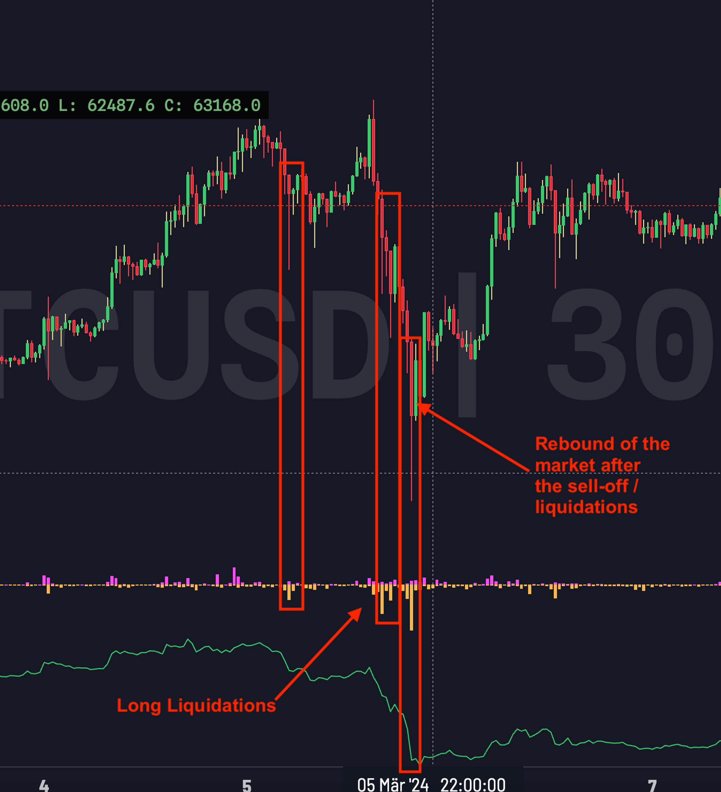
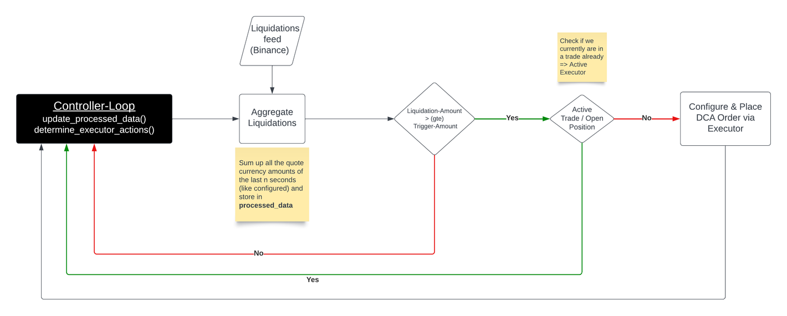
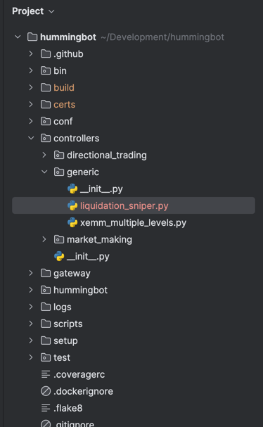
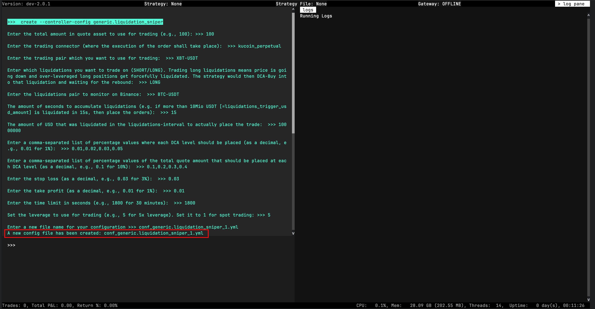
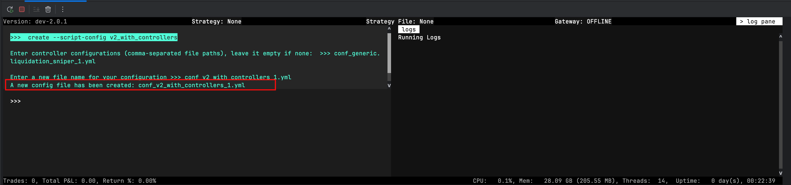
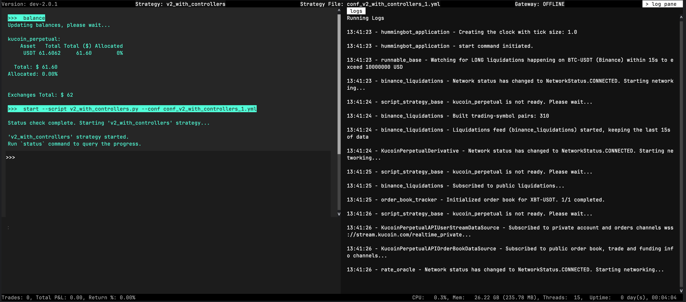
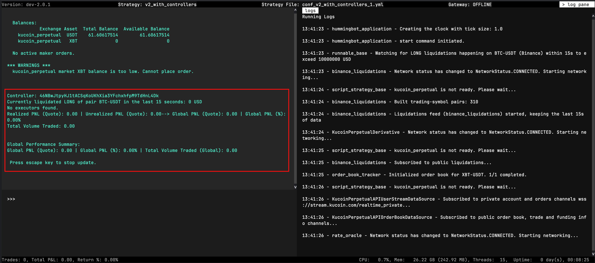

# Coding a Liquidation Sniper V2 Strategy Controller


*by Patrick Meier*

In this article, we'll explore how to create a custom V2 Controller for Hummingbot to snipe future liquidations on Binance. We'll use a generic controller to demonstrate the correct usage and implementation of this strategy.

## Liquidation Sniper Strategy

This strategy shall be able to exploit liquidations that happen regularly in Crypto Futures Markets. When they happen there is a tendency to have a quick rebound of the market that this strategy aims to catch with different order levels used (DCA). 

The goal of this trading strategy is to capitalize on the quick rebounds that often follow liquidation events in the cryptocurrency futures market. These liquidations, caused by traders being forcibly closed out of their leveraged positions, create sharp price movements that can temporarily disrupt market equilibrium.

<!-- more -->

### Example

On this 30-minute BTC/USDT chart, the sharp downward price movements indicated by the red candles coincide with a spike in long liquidations, suggesting a cascade of forced closures of leveraged long positions. Directly following this event is a marked price recovery, highlighting a rebound where the price corrects upwards as the market absorbs the impact of the liquidations.



## Coding the Strategy

I intentionally omit the imports here for better readability. You can download the full source-code here: [liquidations_sniper.py](liquidations_sniper.py)

### Control flow

Let's quickly understand the high-level control flow of the controller we are going to build.



- We monitor the liquidations that happen on binance and aggregate them for the specified amount of seconds
- If a specific amount in quote currency (usually USDⓈ-M) is reached within that time interval and no active position exists we open a DCA-Trade

### Define the configuration

First we need to define the variables that can be configured by the user. They are grouped together for a better overview...

#### Liquidations Configuration

- **trading_connector**: Connector where the order shall be placed (default: kucoin_perpetual)
- **trading_pair:** the pair you want to use for trading on the chosen exchange (default: XBT-USDT)
- **liquidation_side**: which side you want to trade on, long or short liquidations (default: LONG, valid: LONG / SHORT)
    - e.g. trading long liquidations means the price is going down and long positions that are over-leveraged get liquidated. If that happens (when trigger amount in given interval is reached) we place the DCA orders to trade the rebound
- **liquidations_pair**: pair to monitor for liquidations on Binance (default: BTC-USDT)
    - **Important**: the strategy assumes to deal with USDⓈ-M Futures
- **liquidations_interval_seconds**: The amount of seconds to accumulate liquidations (default: 15)
- **liquidations_trigger_usd_amount**: The amount of USD that was liquidated in the liquidations-interval to actually place the trade (default: 10,000,000)

#### DCA Configuration

- **total_amount_quote**: the total amount in quote asset to use for trading (default: 100)
    - normally this is USD
- **dca_levels_percent**: Comma-separated list of percentage values for each Dollar Cost Averaging (DCA) level as a decimal, e.g., 0.01 for 1%(default: 0.01, 0.02, 0.03, 0.05)
- **dca_amounts_percent**: Comma-separated list of percentage values from the total_quote_amount for each DCA level as a decimal, e.g., 0.1 for 10% (default: 0.1, 0.2, 0.3, 0.4)
    - the sum should be 1 = 100%, if not it is summed up and treated as 100%
- **stop_loss**: The stop loss as a percentage (default: 0.03)
- **take_profit**: The take profit as a percentage (default: 0.01)
- **time_limit**: The time limit in seconds (default: 1800 ⇒ 30m)

#### Perpetual Contracts Configuration

- **leverage**: The leverage to use for trading (default: 5). Set 1 for SPOT-Trading
- **position_mode**: The position mode (default: HEDGE, valid: HEDGE / ONEWAY)

### Code the configuration class

The config class for our custom controller extends from `ControllerConfigBase`, which is a Pydantic model that provides standard attributes like `controller_name`. We then use [Pydantic](https://docs.pydantic.dev/latest/) to define fields with built-in validation and to provide descriptions (which are shown in the Hummingbot CLI to the user). Finally, we add custom validators to ensure the configuration is robust and to prevent potential runtime errors.

```python

...

class LiquidationSniperConfig(ControllerConfigBase):
    """
    This controller executes a strategy that listens for liquidations on Binance for the given pair
    and executes a DCA trade to profit from the rebound. The profitability is highly dependent on the 
    settings you make. 

    Docs: https://www.notion.so/hummingbot-foundation/Liquidation-Sniper-V2-Framework-739dadb04eac4aa6a082067e06ddf7db
    """

    controller_name: str = "liquidations_sniper"
    candles_config: List[CandlesConfig] = []  # do not need any candles for that

    # ---------------------------------------------------------------------------------------
    # Liquidations Config
    # ---------------------------------------------------------------------------------------

    trading_connector: str = Field(
        default="kucoin_perpetual",
        client_data=ClientFieldData(
            prompt=lambda msg: "Enter the trading connector (where the execution of the order shall take place): ",
            prompt_on_new=True
        ))
    trading_pair: str = Field(
        default="XBT-USDT",
        client_data=ClientFieldData(
            prompt=lambda msg: "Enter the trading pair which you want to use for trading: ",
            prompt_on_new=True
        ))
    liquidation_side: LiquidationSide = Field(
        default="LONG",
        client_data=ClientFieldData(
            prompt=lambda msg: "Enter which liquidations you want to trade on (SHORT/LONG). Trading long liquidations "
                               "means price is going down and over-leveraged long positions get forcefully liquidated. "
                               "The strategy would then DCA-Buy into that liquidation and waiting for the rebound: ",
            prompt_on_new=True
        ))
    liquidations_pair: str = Field(
        default="BTC-USDT",
        client_data=ClientFieldData(
            prompt=lambda msg: "Enter the liquidations pair to monitor on Binance: ",
            prompt_on_new=True
        ))
    liquidations_interval_seconds: int = Field(
        default=15,
        client_data=ClientFieldData(
            prompt=lambda msg: "The amount of seconds to accumulate liquidations (e.g. if more than 10Mio USDT "
                               "[=liquidations_trigger_usd_amount] is liquidated in 15s, then place the orders): ",
            prompt_on_new=True
        ))
    liquidations_trigger_usd_amount: int = Field(
        default=10_000_000,  # 10 Mio USDT
        client_data=ClientFieldData(
            is_updatable=True,
            prompt=lambda msg: "The amount of USD that was liquidated in the liquidations-interval to "
                               "actually place the trade: ",
            prompt_on_new=True
        ))

    # ---------------------------------------------------------------------------------------
    # DCA Config
    # ---------------------------------------------------------------------------------------

    total_amount_quote: Decimal = Field(
        default=100,
        client_data=ClientFieldData(
            is_updatable=True,
            prompt_on_new=True,
            prompt=lambda mi: "Enter the total amount in quote asset to use for trading (e.g., 100):"))
    dca_levels_percent: List[Decimal] = Field(
        default="0.01,0.02,0.03,0.05",
        client_data=ClientFieldData(
            prompt_on_new=True,
            is_updatable=True,
            prompt=lambda msg: "Enter a comma-separated list of percentage values where each DCA level should be "
                               "placed (as a decimal, e.g., 0.01 for 1%): "))
    dca_amounts_percent: List[Decimal] = Field(
        default="0.1,0.2,0.3,0.4",
        client_data=ClientFieldData(
            prompt_on_new=True,
            is_updatable=True,
            prompt=lambda msg: "Enter a comma-separated list of percentage values of the total quote amount that "
                               "should be placed at each DCA level (as a decimal, e.g., 0.1 for 10%): "))
    stop_loss: Decimal = Field(
        default=Decimal("0.03"), gt=0,
        client_data=ClientFieldData(
            is_updatable=True,
            prompt=lambda msg: "Enter the stop loss (as a decimal, e.g., 0.03 for 3%): ",
            prompt_on_new=True))
    take_profit: Decimal = Field(
        default=Decimal("0.01"), gte=0,
        client_data=ClientFieldData(
            is_updatable=True,
            prompt=lambda msg: "Enter the take profit (as a decimal, e.g., 0.01 for 1%): ",
            prompt_on_new=True))
    time_limit: int = Field(
        default=60 * 30, gt=0,
        client_data=ClientFieldData(
            is_updatable=True,
            prompt=lambda msg: "Enter the time limit in seconds (e.g., 1800 for 30 minutes): ",
            prompt_on_new=True))

    # ---------------------------------------------------------------------------------------
    # Perp Config
    # ---------------------------------------------------------------------------------------

    leverage: int = Field(
        default=5,
        client_data=ClientFieldData(
            prompt_on_new=True,
            prompt=lambda msg: "Set the leverage to use for trading (e.g., 5 for 5x leverage). "
                               "Set it to 1 for spot trading:"))
    position_mode: PositionMode = Field(
        default="HEDGE",
        client_data=ClientFieldData(
            prompt=lambda msg: "Enter the position mode (HEDGE/ONEWAY): ",
            prompt_on_new=False
        )
    )

    # ---------------------------------------------------------------------------------------
    # Validators
    # ---------------------------------------------------------------------------------------

    @validator('liquidations_pair', pre=True, always=True)
    def validate_usdm_pair(cls, value):
        if "usd" in value.lower():
            return value
        raise ValueError("Liquidations pair must be a USDⓈ-M Future contract!")

    @validator("time_limit", "stop_loss", "take_profit", pre=True, always=True)
    def validate_target(cls, value):
        if isinstance(value, str):
            if value == "":
                return None
            return Decimal(value)
        return value

    @validator('dca_levels_percent', pre=True, always=True)
    def parse_levels(cls, value) -> List[Decimal]:
        if value is None:
            return []
        if isinstance(value, str):
            if value == "":
                return []
            return [Decimal(x.strip()) for x in value.split(',')]
        return value

    @validator('dca_amounts_percent', pre=True, always=True)
    def parse_and_validate_amounts(cls, value, values, field) -> List[Decimal]:
        if value is None or value == "":
            return [Decimal(1) for _ in values[values['dca_levels_percent']]]
        if isinstance(value, str):
            return [Decimal(x.strip()) for x in value.split(',')]
        elif isinstance(value, list) and len(value) != len(values['dca_levels_percent']):
            raise ValueError(
                f"The number of {field.name} must match the number of levels ({len(values['dca_levels_percent'])}).")
        elif isinstance(value, list):
            return [Decimal(amount) for amount in value]
        raise ValueError("DCA amounts per level is invalid!")

    @validator('position_mode', pre=True, allow_reuse=True)
    def validate_position_mode(cls, value: str) -> PositionMode:
        if isinstance(value, str) and value.upper() in PositionMode.__members__:
            return PositionMode[value.upper()]
        raise ValueError(f"Invalid position mode: {value}. Valid options are: {', '.join(PositionMode.__members__)}")

    @validator('liquidation_side', pre=True, always=True)
    def validate_liquidation_side(cls, value: str) -> LiquidationSide:
        if isinstance(value, str) and value.upper() in LiquidationSide.__members__:
            return LiquidationSide[value.upper()]
        raise ValueError(
            f"Invalid liquidation side: {value}. Valid options are: {', '.join(LiquidationSide.__members__)}")

    # ---------------------------------------------------------------------------------------
    # Market Config
    # ---------------------------------------------------------------------------------------

    def update_markets(self, markets: Dict[str, Set[str]]) -> Dict[str, Set[str]]:
        if self.trading_connector not in markets:
            markets[self.trading_connector] = set()
        markets[self.trading_connector].add(self.trading_pair)
        return markets

... 
```

### Code the actual V2 controller

Let's break down the tasks for the actual controller:

- Initialize the liquidations feed for Binance 
- Calculate and store the current liquidations in `update_processed_data()`
- Check if the conditions are met and initiate a trade in `determine_executor_actions()`
- Write a helper method for configuring the `DCAExecutor` based on the strategy configuration
- Add log information to `to_format_status()` for getting realtime information when the controller is running

```python
...
class LiquidationSniper(ControllerBase):

    def __init__(self, config: LiquidationSniperConfig, *args, **kwargs):
        super().__init__(config, *args, **kwargs)
        self.config = config  # only for type check in IDE
        self.liquidations_feed = None
        self.initialize_liquidations_feed()
        # Make the configuration more forgiving, by calculating the real percentages if not done already
        self.dca_amounts_pct = [Decimal(amount) / sum(self.config.dca_amounts_percent) for amount in
                                self.config.dca_amounts_percent]

    def initialize_liquidations_feed(self):
        liquidations_config = LiquidationsConfig(
            connector="binance",  # use Binance as the most liquid exchange (currently the only feed supported!)
            max_retention_seconds=self.config.liquidations_interval_seconds,
            trading_pairs=[self.config.liquidations_pair]
        )
        self.liquidations_feed = LiquidationsFactory.get_liquidations_feed(liquidations_config)

    def on_start(self):
        self.liquidations_feed.start()
        self.logger().info("Watching for {} liquidations happening on {} (Binance) within {}s to exceed {} USD"
                           .format(self.config.liquidation_side,
                                   self.config.liquidations_pair,
                                   self.config.liquidations_interval_seconds,
                                   self.config.liquidations_trigger_usd_amount))

    def on_stop(self):
        self.liquidations_feed.stop()

    async def update_processed_data(self):
        df = self.liquidations_feed.liquidations_df(self.config.liquidations_pair)
        df['usd_amount'] = df['quantity'] * df['price']
        df = df[df['side'] == self.config.liquidation_side]
        self.processed_data['liquidated_usd_amount'] = df['usd_amount'].sum()

    def determine_executor_actions(self) -> List[ExecutorAction]:
        executor_actions = []
        liquidated_usd_amount = self.processed_data['liquidated_usd_amount']
        trading_executors = self.filter_executors(
            executors=self.executors_info,
            filter_func=lambda executor: executor.is_active and executor.controller_id == self.config.id
        )

        # Only initiate a trade when both criteria is met
        if liquidated_usd_amount >= self.config.liquidations_trigger_usd_amount and len(trading_executors) == 0:
            self.logger().info("The current liquidation-amount ({} USD) in the last {}s is above threshold "
                               "of {} USD => entering trade!".format(liquidated_usd_amount,
                                                                     self.config.liquidations_interval_seconds,
                                                                     self.config.liquidations_trigger_usd_amount))
            executor_actions.append(CreateExecutorAction(
                executor_config=self.get_dca_executor_config(),
                controller_id=self.config.id))
        return executor_actions

    def get_dca_executor_config(self) -> DCAExecutorConfig:
        trade_type = TradeType.BUY if self.config.liquidation_side == LiquidationSide.LONG else TradeType.SELL

        # Use the mid-price to calculate the levels, sl and tp
        price = self.market_data_provider.get_price_by_type(self.config.trading_connector,
                                                            self.config.trading_pair,
                                                            PriceType.MidPrice)
        if trade_type == TradeType.BUY:
            prices = [price * (1 - level) for level in self.config.dca_levels_percent]
        else:
            prices = [price * (1 + level) for level in self.config.dca_levels_percent]

        amounts_quote = [self.config.total_amount_quote * pct for pct in self.dca_amounts_pct]

        return DCAExecutorConfig(
            controller_id=self.config.id,
            timestamp=time.time(),
            connector_name=self.config.trading_connector,
            trading_pair=self.config.trading_pair,
            mode=DCAMode.MAKER,
            leverage=self.config.leverage,
            side=trade_type,
            amounts_quote=amounts_quote,
            prices=prices,
            take_profit=self.config.take_profit,
            stop_loss=self.config.stop_loss,
            time_limit=self.config.time_limit,
        )

    def to_format_status(self) -> List[str]:
        return ["Currently liquidated {} of pair {} in the last {} seconds: {} USD".format(
            self.config.liquidation_side,
            self.config.liquidations_pair,
            self.config.liquidations_interval_seconds,
            self.processed_data['liquidated_usd_amount'])]
...
```

## Run the strategy

Now that we did all the coding it's time to actually run it. Assuming you have connected to an exchange already (in this case KuCoin).

### Add controller to your Hummingbot

Add the file [liquidations_sniper.py](liquidations_sniper.py) to your Hummingbot installation like this:



### Create the controller configuration

Now start Hummingbot and create a configuration with this command:

```
create --controller-config generic.liquidation_sniper
```



Here you see the result using all the default values. A file named `conf_generic.liquidation_sniper_1.yml` is created.

### Run the controller with generic-script 

In the last and final step we need to create a very simple configuration for the generic strategy (shipped with Hummingbot) to actually run the controller. 

If you are unsure about the reason for this, just read the docs: [Strategies V2 Architecture](/v2-strategies/)

#### Create the strategy configuration

Next we have to create the script config for the `v2_with_controllers` strategy to run our newly created controller. 

```
create --script-config v2_with_controllers
```

**Important**: use the name of the config file of the controller that you created in the last step as input here for everything to work!



Finally the script config `conf_v2_with_controllers_1.yml` was created and we can run our controller.

#### Run the strategy

Let's run the strategy live on KuCoin...

```
start --script v2_with_controllers.py --conf conf_v2_with_controllers_1.yml
```



#### Monitor live status

You can monitor the actual execution with the command: `status --live`



## Conclusion

Now you are equipped with all knowledge required to code controllers with the new V2 framework and run them within your instance of Hummingbot.

For further information about the V2 framework just visit the documentation or check the source code of the samples delivered with Hummingbot.