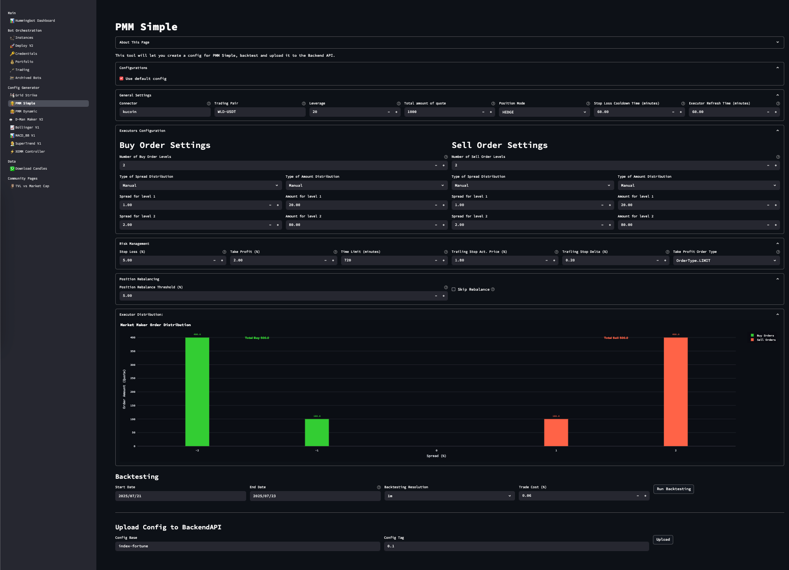
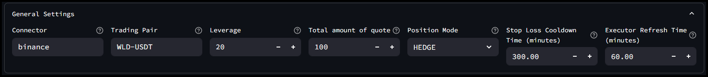
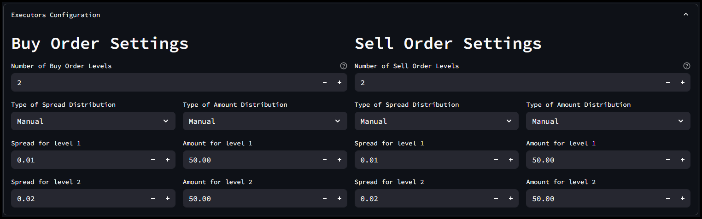
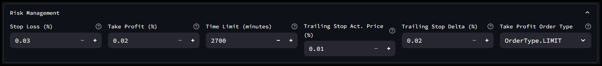
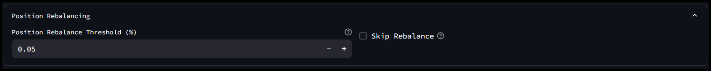
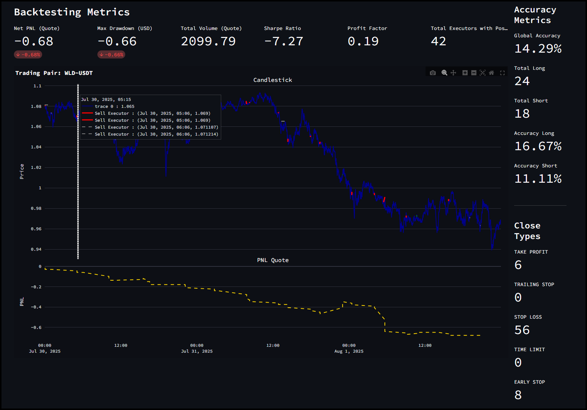
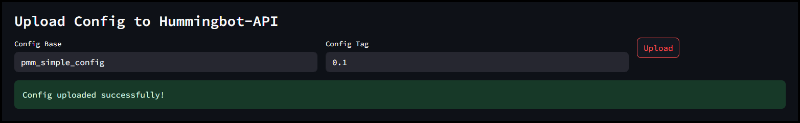
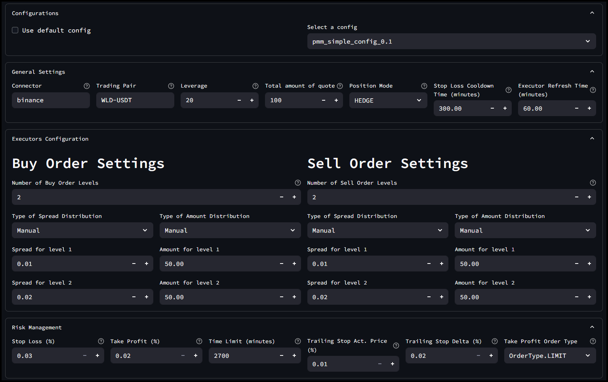
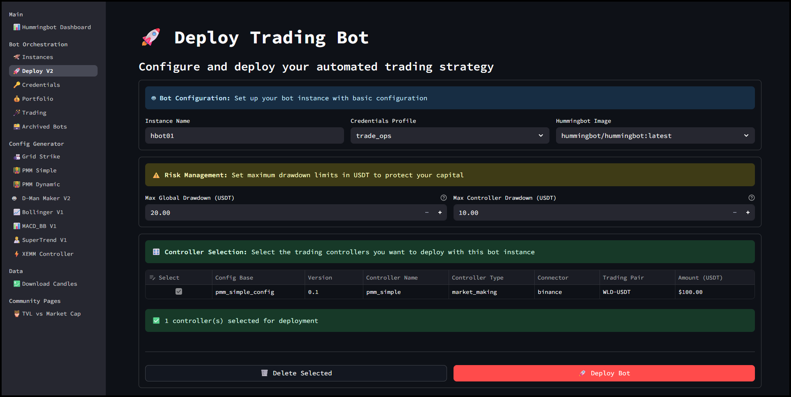
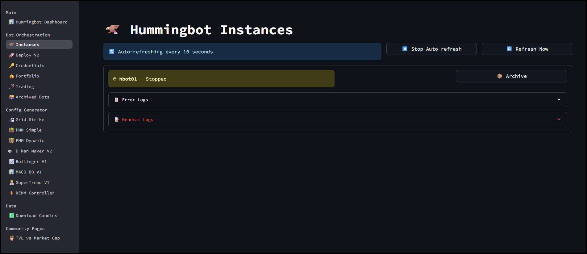

# Dashboard Tutorial: PMM Simple V2


Welcome to the **Dashboard Tutorial: PMM Simple V2 Strategy** — a step-by-step guide designed to help you understand, configure, backtest, and deploy the PMM Simple V2 strategy using the Hummingbot Dashboard.  

In this tutorial, you’ll learn how to set up the strategy’s parameters, test its performance through backtesting, fine-tune order spreads and risk controls, and finally save and deploy your configuration for live trading.


<!-- more -->

## 🔍 How PMM Simple Differs From Other Strategies

**PMM Simple V2** is a foundational **market making strategy** implemented as a controller in Hummingbot V2. Its purpose is to continuously provide liquidity on both sides of the market and profit from capturing the **bid-ask spread** by placing symmetric buy and sell orders around the mid-price.  

Unlike more complex strategies in the Hummingbot V2 codebase, **PMM Simple** does **not use any technical indicators** or price forecasts. It places limit orders at fixed spreads around a reference price (typically the mid-price), aiming to consistently earn from spread capture. 

Strategies like `pmm_dynamic` adapt spread and pricing using MACD and volatility metrics (NATR), while `bollinger_v1` and `dman_v3` follow directional or mean-reversion logic with Bollinger Bands. PMM Simple stays always in the market, using clean, fixed parameters with minimal logic, making it ideal for stability, simplicity, and extensibility.


- **Compared with v2 simple_pmm script**

Both strategies place symmetric buy and sell orders around a reference price, but `simple_pmm` is a minimal script best for quick tests and basic setups. **PMM Simple V2**, as a controller, offers a more structured and maintainable design. Use `pmm_simple` if you plan to run your bot long-term, want better modularity, or intend to build on top of it in the future.

- **Compared with v1 Pure Market-Making**

V1 **Pure Market Making** is reliable and works well out-of-the-box, making it ideal for users who want a simple, ready-to-go strategy. However, its monolithic design makes it harder to modify if you want to add new features or customize behavior. **PMM Simple V2**, with its modular controller architecture, is much easier to extend and adapt—perfect for experimentation and long-term development.

## 🔧 Configuration Parameters

Navigate to **PMM Simple** from the sidebar in your Hummingbot Dashboard.

[](image1.png)

## General Settings

| Parameter                | Description                                                  | Example       |
|--------------------------|--------------------------------------------------------------|---------------|
| `connector_name`         | Exchange name (e.g. binance, binance_perpetual)              | binance       |
| `trading_pair`           | Market symbol                                                | WLD-USDT      |
| `leverage`               | Leverage (set to 1 for spot)                                 | 20            |
| `total_amount_quote`     | Total amount to allocate in quote currency                   | 100           |
| `position_mode`          | Derivatives only: HEDGE or ONEWAY                           | HEDGE         |
| `executor_refresh_time`  | Seconds before replacing inactive orders                     | 300           |
| `cooldown_time`          | Wait time after stop-loss before re-entering                 | 60            |

[](image2.png)

### Buy/Sell Order Settings

Configure number of levels, spreads, and allocation per level:

| Parameter            | Description                             | Example     |
|----------------------|-----------------------------------------|-------------|
| `buy_spreads`        | % below mid-price for buy orders        | [0.01, 0.02]|
| `sell_spreads`       | % above mid-price for sell orders       | [0.01, 0.02]|
| `buy_amounts_pct`    | Relative sizes for buy orders           | [50, 50]    |
| `sell_amounts_pct`   | Relative sizes for sell orders          | [50, 50]    |


[](image3.png)


### 🛡️ Risk Controls

| Parameter                | Description                                              | Example     |
|--------------------------|----------------------------------------------------------|-------------|
| `stop_loss`              | Maximum allowed loss from entry (%)                      | 0.03        |
| `take_profit`            | Profit target from entry (%)                             | 0.02        |
| `time_limit`             | Max holding time before forced close (in seconds)        | 2700        |
| `take_profit_order_type`| LIMIT or MARKET (or LIMIT_MAKER on some connectors)       | LIMIT       |
| `trailing_stop`          | Activation delta and trailing delta (optional)           | 0.01, 0.002 |


[](image4.png)


### 🔄 Position Management (Spot Only)

| Parameter                         | Description                                               | Example |
|-----------------------------------|-----------------------------------------------------------|---------|
| `position_rebalance_threshold_pct`| Auto market order to rebalance if threshold exceeded      | 0.05    |
| `skip_rebalance`                  | Disable automatic rebalance (true/false)                  | false   |


[](image5.png)


## 🧠 How the Strategy Works

The PMM Simple V2 strategy places a symmetric grid of limit orders around the mid-price using your configured spreads. For example, a spread of `0.002` is interpreted as 0.2%. The total quote balance is automatically distributed across these levels—either equally or according to your custom weightings (`buy_amounts_pct`, `sell_amounts_pct`).

Each filled order is handled by a `PositionExecutor`, which manages the exit using a **triple-barrier system**:

- **Stop-loss**: Protects against unfavorable price moves.

- **Take-profit**: Locks in gains once a target is hit.

- **Time-limit**: Closes stale positions after a defined period.

- *(Optional)* **Trailing stop**: Activates once a position is in profit and trails the price.

Behind the scenes, the controller monitors for stale or inactive orders and replaces them based on `executor_refresh_time`. If an order hits stop-loss, the strategy enforces a cooldown (`cooldown_time`) before placing it again.

### 🔁 How Rebalancing Works (Spot only)

If you're running the strategy on a spot connector and enable rebalancing, it will track your quote/base asset ratio. If the balance deviates beyond your `position_rebalance_threshold_pct`, the bot submits a market order to restore your original asset split. You can disable this behavior entirely by setting `skip_rebalance: true`.


## 📊 Backtesting Your Strategy

Use the **Backtesting** section to simulate strategy performance over historical data.

### Steps:

1. Set your start and end date

2. Choose resolution (e.g. 1m, 5m)

3. Input expected trade cost %

4. Click `Run Backtesting`

[](image6.png)


### Metrics Displayed:

| Metric            | Meaning                                                  |
|-------------------|----------------------------------------------------------|
| `Net PnL`         | Total quote profit/loss                                  |
| `Max Drawdown`    | Largest single drop from peak                            |
| `Total Volume`    | Total traded amount                                      |
| `Sharpe Ratio`    | Return vs risk metric                                    |
| `Profit Factor`   | Total gains / total losses                               |
| `Executors`       | Number of executed positions                             |
| `Accuracy`        | Overall success rate                                     |


[](image7.png)


## 💾 Saving Your Config

Once satisfied with backtest results:

1. Scroll down to **Upload Config to Hummingbot-API**

2. Name your config base and add a config tag

3. Click `Upload`

[](image8.png)


To **reuse saved configs**, uncheck “Use default config”  

➡️ Dropdown will show saved configs  

➡️ Loading one auto-fills all fields.

Saved YAML files are stored under:
```
/bots/conf/controllers/
```

➡️ You can also tweak an existing config, then save it under a new name for versioning.

[](image9.png)


## 🚀 Deploying Your Config

To launch your trading bot using the saved configuration:

1. Enter an **Instance Name**

2. Select your **Credentials Profile**

3. Choose the appropriate **Hummingbot Image**

4. Configure **Risk Limits** – global and per controller

5. Select the saved **Controller Config**

6. Click **Deploy Bot**

[](image10.png)

🎉 **Congratulations!** You've just deployed a `pmm_simple` trading bot.

To monitor your bot, go to the **Instances** page —  
Status may take a few seconds to reflect after deployment.

[](image11.png)

## ✅ Summary

PMM Simple V2 is a well-structured, clean market making strategy with customizable order levels, robust risk control, and integrated backtesting. It's a great tool for those looking to:

- Capture consistent spread-based profits  

- Start with simple logic  

- Build on a modular controller-based system for long-term improvements

