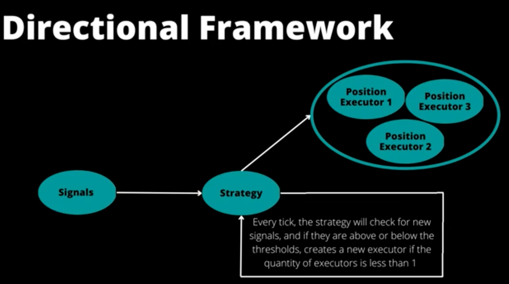
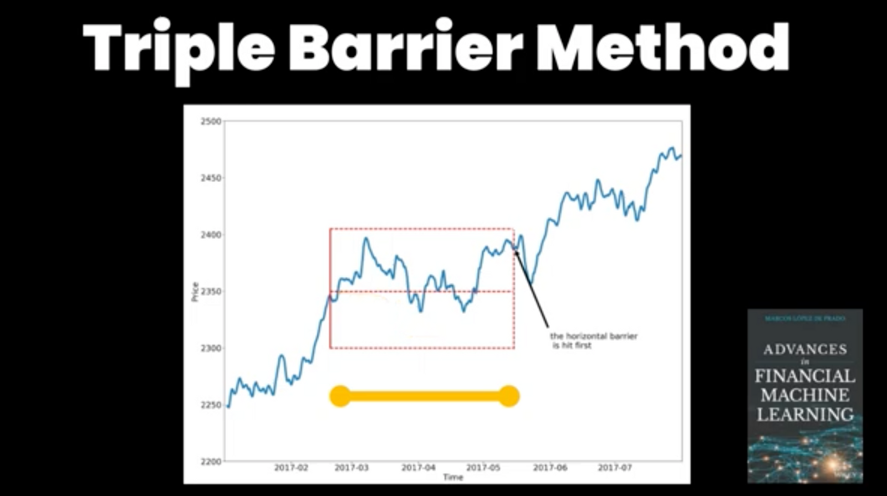
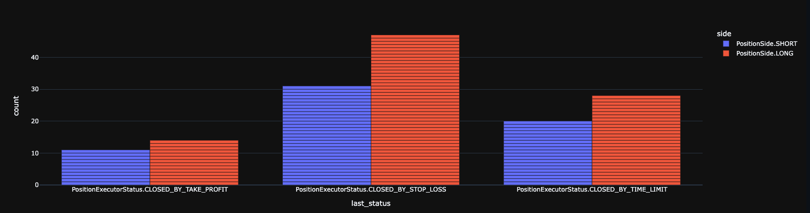

# Directional Trading with MACD and Bollinger Bands

Welcome to the inaugural post in our Strategy Experiments series, where we publish hypotheses, code, and performance analyses of live bot strategies.

We're thrilled to return to the Hummingbot blog with an exciting experiment: developing a crypto trading bot using the open-source Hummingbot platform. This bot employs an **indicator-based directional strategy** on the Binance Futures exchange, leveraging MACD and Bollinger Bands.

Sign up for Binance Futures using our [Hummingbot referral code](https://www.binance.com/en/futures/ref?code=hummingbot) to receive a **10% fee rebate**!

## Introducing Strategy Experiments

As the first entry in our **Strategy Experiments** series, we aim to foster a collaborative environment where users can share their strategic insights with the community, enhancing growth and knowledge exchange among quantitative traders.

We invite everyone to contribute their Strategy Experiments, regardless of outcome, as there is valuable learning in each experience. Through sharing insights and discussing novel concepts, we aspire to cultivate a vibrant ecosystem for continual improvement and refinement of trading strategies.

Below is a detailed account of our first experiment. You can watch the accompanying video or read the following description.

<!-- more -->

<iframe width="560" height="315" src="https://www.youtube.com/embed/uKFBu2bSU1Y" title="YouTube video player" frameborder="0" allow="accelerometer; autoplay; clipboard-write; encrypted-media; gyroscope; picture-in-picture; web-share" allowfullscreen></iframe>

## Strategy Description

We devised a trading strategy utilizing the [MACD](https://www.investopedia.com/terms/m/macd.asp) and [Bollinger Bands](https://www.investopedia.com/terms/b/bollingerbands.asp) indicators to trade the APE-BUSD pair. A detailed performance analysis is provided below.

## Custom Indicator

Our experiment integrates MACD and Bollinger Bands to create a custom indicator for potential mean reversion points in the market. This indicator aims to identify when the market reaches an overextended state, either overbought or oversold, and capitalize on the ensuing price reversals.

The strategy combines these indicators as follows:

1. **Bollinger Bands**: Comprising a moving average (middle band) and two additional bands set at a specific standard deviation from the moving average, Bollinger Bands adapt to market volatility. Prices often revert to the mean (middle band) over time. Our strategy employs the %BB value to gauge the current price in relation to the bands, with 0 indicating the lower band (buy), 1 the upper band (sell), and 0.5 the middle band.
2. **MACD**: The Moving Average Convergence Divergence (MACD) indicator tracks the relationship between two moving averages, typically 12-day and 26-day exponential moving averages. The MACD line is the difference between these averages, while the signal line is a 9-day exponential moving average of the MACD line. The histogram represents the difference between the MACD line and signal line, with positive values suggesting buy signals and negative values indicating sell signals.

By merging these indicators, we seek to pinpoint potential mean reversion points when the market is overextended. Our custom decision rules for Long and Short positions are based on %BB and MACD histogram values, and the current value of the MACD line:

- **LONG**: % BB < 0.2 | MACD Histogram > 0 | MACD < 0
- **SHORT**: % BB > 0.8 | MACD Histogram < 0 | MACD > 0

## Directional Framework

Our strategy employs the Directional Framework, which combines two novel features in Hummingbot: [Candles Feed](../../../v2-strategies/data) and [PositionExecutor](../../../v2-strategies/executors.md).

These components enhance the creation of custom indicators and self-executing positions, leading to a more efficient trading strategy.

1. **CandlesFeed**: This feature enables the generation of custom indicators using historical and real-time exchange data. In our experiment, CandlesFeed calculates the MACD and Bollinger Bands values, forming our custom indicator that signals potential mean reversion points.
2. **PositionExecutor**: This tool enables Hummingbot to execute positions autonomously based on custom indicator signals. It manages Long and Short positions, considering the decision rules derived from the %BB and MACD histogram values, and the current MACD line value. Integrated with the [Triple Barrier Method](https://www.mlfinlab.com/en/latest/labeling/tb_meta_labeling.html) from [Advances in Financial Machine Learning](https://www.amazon.com/Advances-Financial-Machine-Learning-Marcos/dp/1119482089?ref=hummingbot.org), our strategy effectively manages positions while maintaining a defined risk profile.

We set dynamic Take Profit and Stop Loss based on the standard deviation of the last 100 periods, multiplied by 1.5 for TP and 0.75 for SL, adapting to market conditions. The time limit was established at 55 minutes.

The [strategy code](https://gist.github.com/cardosofede/54d31cae1d9bb0e6d70ead6191ca05d6?ref=blog.hummingbot.org) is available for further customization.

## Selecting the Right Market

Choosing an appropriate exchange platform and trading pair is crucial for a successful trading bot. It's important to opt for markets where one might have a fee or speed advantage, rather than competing against large trading firms or dealing with unreliable exchanges.

To minimize fees, we chose a BUSD-quoted pair on Binance Futures, opting to pay fees with BNB for additional discounts.

Binance Futures, a Gold connector in Hummingbot, ensures high-standard maintenance of WebSocket integration and continual support for new API endpoints and capabilities. Sign up using the [Hummingbot referral code](https://www.binance.com/en/futures/ref?code=hummingbot) to receive a **10% fee rebate**!

- **Exchange**: Binance Perpetual
- **Trading Pair**: APE-BUSD
- **Initial Balance**: 40.3 USD
- **Order Amount**: 15 USD

## Performance Analysis

- **Start Date**: 03/11/2023 | **End Date**: 03/22/2023
- **Total Uptime**: 11 days, 16:42:14
- **Number of Trades**: 334
- **Trading Volume**: 4,498 USD
- **Net Return**: -0.62 USD | **PNL (%)**: -1.538%

During this 11-day experiment, our bot maintained a low-risk profile with minimal losses and gains. However, fee costs impacted profitability. Future enhancements could include adjusting the three-barrier thresholds, exploring other trading pairs and venues, and employing simulation/backtesting.

## Participate and Earn Rewards

We're pleased to announce that by contributing your Strategy Experiments, you're eligible for rewards from our 1 million HBOT token pool, allocated through the [HGP-33: Event & Content Incentives 2023](https://snapshot.org/?ref=blog.hummingbot.org#/hbot.eth/proposal/0x743f6d94a36dd4a70ab0bb64648c229f538ae0ff3ddd56da0fe47d90d2d920f7) governance proposal.

To participate, contact our community manager Carlito in public channels like #general or #content on our [official Discord](https://discord.gg/hummingbot)!

Your contributions not only earn you rewards but also significantly contribute to the Hummingbot community's growth and success. We eagerly await your submissions!

## Learn to Build Your Own Custom Strategies

Join the [Hummingbot Botcamp](https://www.botcamp.xyz/), an intensive, 6-week developer bootcamp. You'll learn about crypto market making and quantitative trading using Hummingbot's open-source software.
