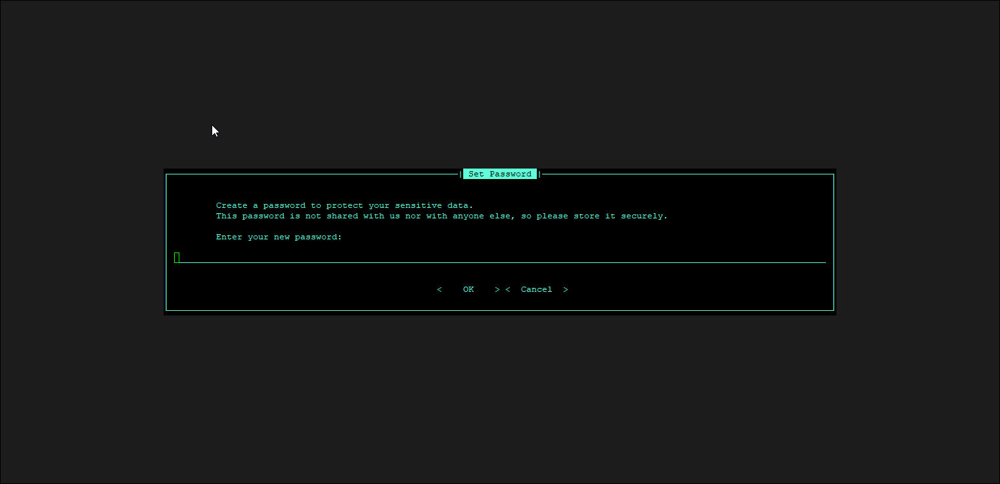
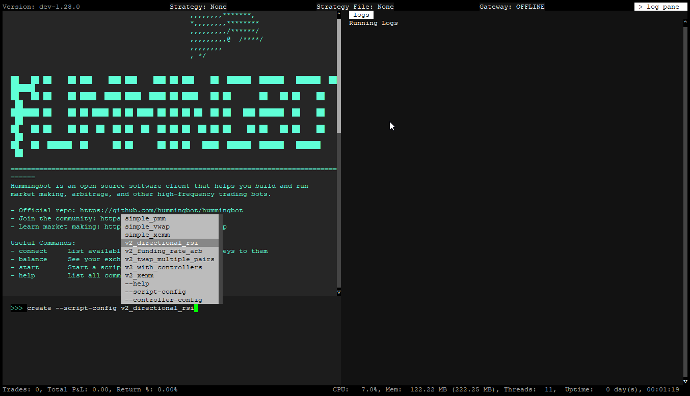
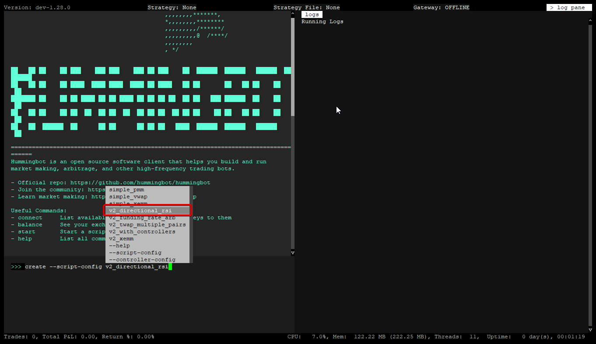
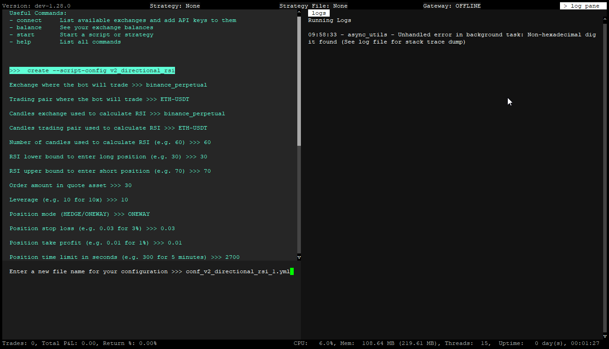
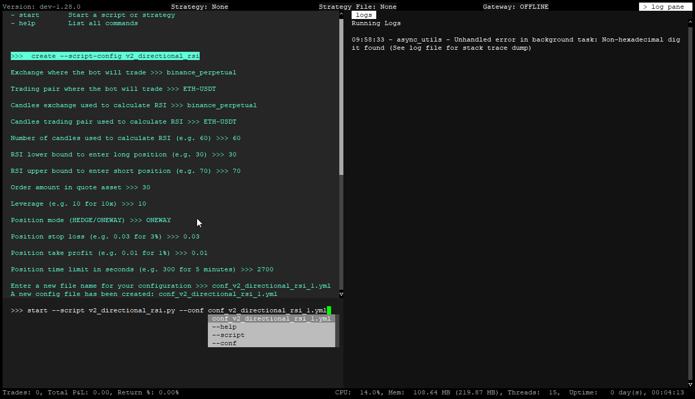
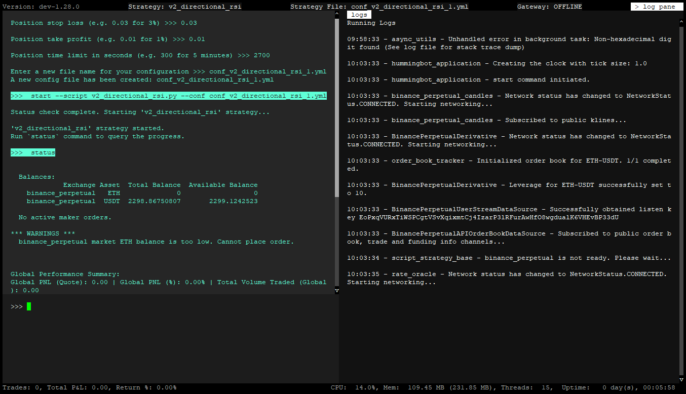
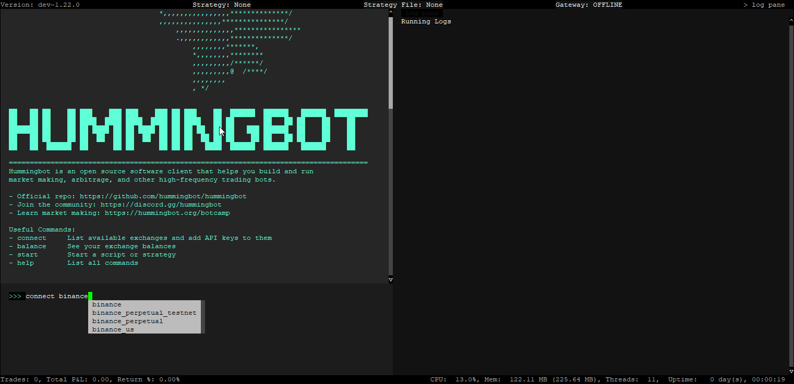
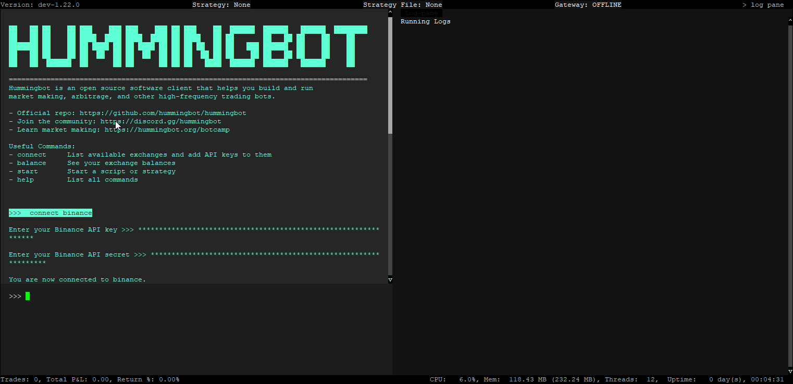
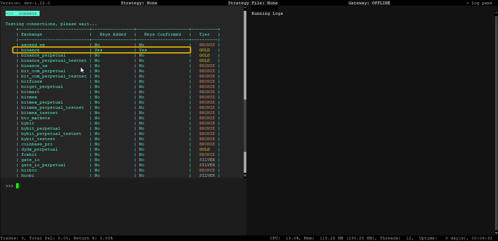

# Hummingbot Docker Quickstart Guide

## Introduction

This brief guide will introduce you to the process of installing and deploying Hummingbot using Docker. You will learn step-by-step how to set up Hummingbot using [Docker Compose](https://docs.docker.com/compose/), a tool for defining and running multi-container Docker applications, and then run your first algo trading strategy!


## What You Will Learn

1. **Install Docker**: Step-by-step instructions to installing Docker and Docker Compose,

2. **Hummingbot Interface**: Uncover the essentials of the Hummingbot interface, including layout and navigation.

3. **Running a Script**: Learn how to run an algo trading strategy as a Hummingbot script.

4. **Connecting API Keys**: Master the crucial process of integrating API keys with Hummingbot, ensuring secure API-based bot trading across various exchanges.

<!-- more -->

## Let's Begin!

With all the groundwork in place, it's time to unlock the full capabilities of your trading tools. Let's dive in!


## Installation

### System Prerequisites

#### Cloud server or local machine

| **Component**      | **Specification**                                     |
|--------------------|-------------------------------------------------------|
| **Operating System** | Linux x64 or ARM (Ubuntu 20.04+, Debian 10+)                   | 
| **Memory**           | 4 GB RAM per instance                                 |
| **Storage**          | 5 GB HDD space per instance                           |
| **CPU**              | at least 1 vCPU per instance / controller             |

#### Docker Compose

Hummingbot uses [Docker Compose](https://docs.docker.com/compose/), a tool for defining and running multi-container Docker applications. [Docker Desktop](https://www.docker.com/products/docker-desktop/) already includes Docker Compose along with Docker Engine and Docker CLI, which are Compose prerequisites.

!!! note "For Windows users"
    To install Docker on Windows, [Windows Subsystem for Linux 2](https://learn.microsoft.com/en-us/windows/wsl/about) is needed. Follow [this link](https://learn.microsoft.com/en-us/windows/wsl/install) to install WSL2 on your Windows system. 


### Clone Hummingbot Repo

In your terminal, clone the Hummingbot Github repository:

```bash
git clone https://github.com/hummingbot/hummingbot
cd hummingbot
```

### Launch Instance

The `docker-compose.yml` file contains the basic instructions to deploy Humminggbot:

Use the following command to create the Docker container:

```bash
docker compose up -d
```

This will start the container in the background and we'll need to `attach` to it to be able to send commands to it. Run the following command below:

### Attach to Container

```bash
docker attach hummingbot
```

We should now have Hummingbot running and in the next section we'll go over the Hummingbot Interface 


## User Interface

Hummingbot operates through a **Command Line Interface (CLI)**, a text-based system ideal for automated cryptocurrency trading. Unlike graphical interfaces, CLIs rely on text commands to function. Let's dive into how to use it effectively.

### Create a Password



If you are using Hummingbot for the first time, the system will prompt you to create a password. There are no character requirements, although we recommend using a strong password for additional security.

The password in Hummingbot encrypts sensitive data such as API keys, secret keys, and wallet private keys. For security reasons, the password is only stored locally in encrypted form, and we do not have access to it.

After you set a password you should now be in the main Hummingbot screen

### User Interface Guide


The CLI is organized into several key areas:

- **Input Pane (Lower Left)**: Here, you input your commands.

- **Output Pane (Upper Left)**: This displays the results of your commands.

- **Log Pane (Right)**: Here, you can view log messages.

- **Top Navigation Bar**: Shows the version, current strategy, and strategy file.

- **Bottom Navigation Bar**: Displays trades, CPU usage, memory, threads, and duration.

For a more in-depth look, visit [User Interface](../../../client/user-interface.md)

### Useful shortcuts    
      
- <kbd>CTRL</kbd> + <kbd>P</kbd> + <kbd>CTRL</kbd> + <kbd>Q</kbd> - This exits the bot but keeps it running in the background

- <kbd>CTRL</kbd> + <kbd>X</kbd> - Exits config

- Double <kbd>CTRL</kbd> + <kbd>C</kbd> - Exits the bot completely

- `CTRL + V` to paste in Hummingbot does not work, to paste try one of the following commands:

    - <kbd>CTRL</kbd>+<kbd>SHIFT</kbd>+<kbd>V</kbd>

    - <kbd>SHIFT</kbd> + RMB (right-mouse button)

    - <kbd>SHIFT</kbd> + <kbd>INS</kbd>


Next, let's learn about running a simple PMM script in Hummingbot


## Running a Script

### Simple Directional RSI Example

Let's use the `v2_directional_rsi.py` script. This is a configurable script that uses the Relative Strength Index (RSI) to trade cryptocurrency futures contracts. For configurable scripts, the first step is to create a config file. Here's how to create one:

```
create --script-config v2_directional_rsi.py

```

When you enter the `create --script-config` command and press <kbd>SPACE</kbd> Hummingbot will display available scripts in the scripts folder, as shown below.

[](create-script-config.png)

Select the `v2_directional_rsi.py` script and press <kbd>ENTER</kbd>. 

[](create-script-config2.png)

You will then be guided to configure the settings. At this stage, you may modify the options or simply hit <kbd>ENTER</kbd> to accept the default values. 

[](config-script.png)

Give the config a name and press press <kbd>ENTER</kbd> to save it.

Once the config is saved we can now launch the script. Enter the command below to launch the script!

```
start --script v2_directional_rsi.py --conf conf_v2_directional_rsi_config_1.yml
```

Note that the autocomplete will popup after pressing <kbd>SPACE</kbd> after both the `--script` and `--conf` parameters so you can just select the correct script / config file from the list and then press <kbd>ENTER</kbd>

[](load-config-script.png)

After pressing <kbd>ENTER</kbd> you should be able to see activity in the log pane. Use the `status` command for more details or press <kbd>CTRL</kbd> + <kbd>S</kbd>. It should resemble the screen below.

```
status
```

!!! tip "Default Configs"
    Please note that the default values for the script config may not work for each and every exchange / scenario. You may need to tweak the script config in order for the bot to be able to place orders. If you encounter any issues check the log pane and the log files for more information on what the issue may be. 


[](script-status.png)

To stop the script from running, type the `stop` command in the Hummingbot terminal

```
stop
```

Congratulations! You've successfully run your first scripts Next, we'll learn how to connect API keys for live trading.

## Adding API Keys

While paper trading in Hummingbot doesn't require API keys, live trading does. This guide will help you connect your exchange API keys to Hummingbot for real-time trading.

### Generate API Keys
 
First, you need to generate API keys from the exchange you wish to connect. Each exchange has its own setup process.

In this example, we'll connect **Binance API** keys. Head over to the [Binance Connector Docs](https://docs.hummingbot.org/exchanges/binance/#generate-api-keys) for instructions on how to generate API keys for [Binance](../../../exchanges/binance/index.md).

Check the [Connectors list](../../../exchanges/index.md) for a list of exchanges that are currently integrated with Hummingbot

!!! Warning
    Please always keep your API keys secure and do not share them. 

### Connect API keys to Hummingbot

In the Hummingbot run the `connect` command for the exchange we want to connect to. In this case for Binance use the command below - 

```
connect binance
```



You should get a prompt to enter in your API keys - you can use the following commands below to paste them into the Hummingbot terminal. Note that `CTRL + V` doesn't work and you'll get a `Pyperclip error` in the log panel if you try to use it. 

  - <kbd>CTRL</kbd>+<kbd>SHIFT</kbd>+<kbd>V</kbd>

  - <kbd>SHIFT</kbd> + RMB (right-mouse button)

  - <kbd>SHIFT</kbd> + <kbd>INS</kbd>



After entering your API keys you should get a success message if everything went through okay. You can also confirm by running the `connect` command again and check that both columns next to Binance are showing `Yes`. 




Now your Binance API keys are connected to Hummingbot. Repeat these steps for other exchanges as needed.

## What's Next?


If you're serious about delving deeper and enhancing your trading bot capabilities, consider [Botcamp](/botcamp/), a professional training program for market makers and algo traders. This comprehensive program combines new content modules and live sessions each month to help you understand the intricacies of the market. You'll learn to create and backtest market making strategies, directional trading, and other strategies using Dashboard. 

Most importantly, you'll gain hands-on experience with Bot Battles, Botcamp's monthly bot trading competitions. It's a great opportunity to measure your progress and learn from others. In addition, joining the Botcamp community allows you to expand your professional network, form teams to compete together, and share insights.

--- 
Thank you once again for joining us on this journey. I hope the knowledge you've gained here serves you well in your trading endeavors. All the best with your future trading bot projects!


