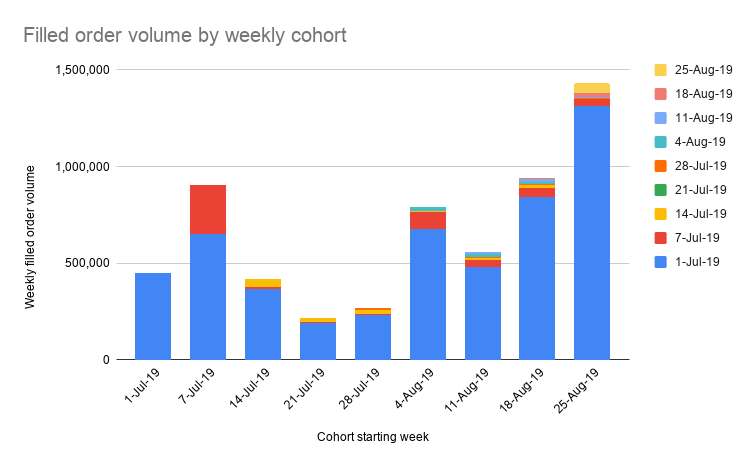

# Does Community-Based Market Making Work?

### Analyzing 2 months of data from $ONE Makers

Two months ago, in conjunction with our friends from Harmony Protocol, we started an [experimental program](../introducing-harmony-liquidity-bounties/index.md) called **$ONE Makers** to see if ordinary individuals using Hummingbot to run market making bots could effectively provide the same level of liquidity as professional market makers.

Both we and Harmony viewed $ONE Makers as an experiment. In particular, we wanted to answer the following questions:

* Could people actually make money or would they get destroyed by more sophisticated players? 
* How many people are needed to effectively replace a professional market maker?

Read on and find out!

<!-- more -->

## Motivation

Crypto exchanges and token projects spend an estimated $3 billion annually on [market making](https://hackernoon.com/a-guide-to-market-making-for-crypto-startups-jydr387v), in the form of rebates, fees, and cost of inventory.

This crypto-native industry stems from an supply and demand imbalance caused by a structural feature of crypto: **anyone can create a token, and anyone can create an exchange where tokens are traded**. Today, there are over 5,000 tokens and 300 exchanges, leading to over 35,000 unique markets (trading pairs) across a highly fragmented exchange landscape. These markets compete with one another based on liquidity, which measures how easily people can buy and sell something without losing money due to the bid-ask spread.

Despite a huge increase in the demand for liquidity, there hasn't been a commensurate increase in supply. Liquidity is supplied by market makers, a job that requires both inventory of capital dedicated to a particular market, as well as trading software that can rapidly and automatically create and cancel orders in response to fast-moving crypto markets.

Due to these financial and technical requirements, crypto market makers are typically quantitative hedge funds who charge hefty fees and may require millions worth of inventory. These costs can be prohibitive for even the largest projects and exchanges, while the long tail of smaller projects and new exchanges can't afford them at all.

If a set of individuals could do the same thing, projects and exchanges would finally have another option for liquidity. Instead of hiring a hedge fund, they could incentivize their community to run market making bots using their own capital. By rewarding liquidity providers per-trade based on hard, quantifiable metrics, the impact of each dollar spent can be measured.

## Overall Statistics

Below are the total metrics for $ONE Makers from July 1 through September 4:

We were  surprised to find that only 68 participants accounted for 143,000+ filled orders totalling $6.4 million in volume. With an average filled order size of $44, these folks seemed to be individual $ONE token holders, not professionals.

There was also a power law distribution in the volume per user; the top 10 participants accounted for 88% of the total filled order volume.

## Can people make money running market making bots?

One of the most important questions we wanted to answer was whether or not ordinary people could successfully make money running market making bots. 

Hummingbot isn't a smart contract protocol nor a hosted web application; instead, it's an open source software client similar to blockchain clients like Geth and Parity that users download and run locally. That allows users to ensure that their API keys, wallet private keys, and secret strategies aren't exposed to 3rd parties, but it also means that we can't inspect the trading performance of our users directly. 

However, we can infer whether people are making money from looking at [retention rate](https://andrewchen.co/retention-is-king/), which measures whether users continue to use a product over time.

As with most products, there is a usage dropoff in usage after the first week, but the fact that almost 40% of new users are still running bots after one month indicates a high likelihood that these users are making money.

**Engagement over time** is another critical factor: are people risking more capital as their proficiency grows, or are they decreasing usage?

To measure engagement over time, we tracked filled order volume for each weekly cohort of users that participated in $ONE Makers:

The vast majority of volume came from the initial weekly cohort, and this cohort significantly increased its filled order volume over time.

Since Hummingbot carries a steep learning curve and we conducted limited marketing for $ONE Makers, it's not surprising that the number of users didn't increase much, but the retention and engagement data gives us confidence that ordinary people can successfully run market making bots.

Finally, we also conducted two interviews ( [Interview 1](../interview-with-liquidity-miner-david-salter/index.md) | [Interview 2](../interview-with-liquidity-miner-dominator008/index.md) ) with $ONE Makers participants, in which they reported making profits.

## Can a set of individuals replace a professional market maker?

While we thought that a sufficiently large number of individuals could approximate the volume of liquidity provided by a professional market maker, we weren't sure how many people would be needed. In addition, how would individuals behave in a bear market? Would they provide the same level of uptime and consistency?

We analyzed trading volume that resulted from Hummingbot users' orders as a percentage of overall Harmony trading volume on Binance:

During a two month span during which $ONE price dropped by 60%, Hummingbot users who participated in $ONE Makers greatly increased how much liquidity they provided. With only 43 active participants, Hummingbot users generated $1.4 million in filled order volume in the last week of August, almost 8% of total $ONE trading volume on Binance.

Professional market makers typically generate 20% of a token's trading volume on larger exchanges. While we're not there yet, it gives us confidence that a set of individuals can replace a professional market maker as our user base grows.

## Next steps

While the data is promising, there's a lot that we can do to improve the experience for both individual participants and our project partners. 

### Real-time leaderboard

We have launched a real-time `leaderboard` so that any participant can see how much rewards they have earned and where they rank versus others.

### Developer forum

In addition, more strategies and market connectors increases the number of exchanges and projects we can support, and it also gives users more ways to make money. 

We have launched a `developer forum` where Hummingbot users can discuss how to hack on Hummingbot and request new features.

### Gitcoin bounties

Finally, incentivizing members of our community to contribute to Hummingbot is another way that we can expand the ecosystem. 

We have partnered with Market Protocol to sponsor a 1,250 DAI [Gitcoin bounty](https://gitcoin.co/issue/MARKETProtocol/MARKETProtocol/230/3417) for a custom market making strategy for leveraged and short tokens. We are working with other projects and exchanges on similar Gitcoin bounties.

The most scarce and precious resource in crypto is **liquidity**, and projects and exchanges spend billions today paying hedge funds for it. Hummingbot is building a different liquidity solution, powered by a decentralized army of individuals running our open source software.

For smaller projects who can't afford to hire a hedge fund for market making, Hummingbot levels the playing field and provides the liquidity they need to build their business. For larger projects that already utilize market makers, Hummingbot provides a more economical, transparent, and community-driven alternative.
