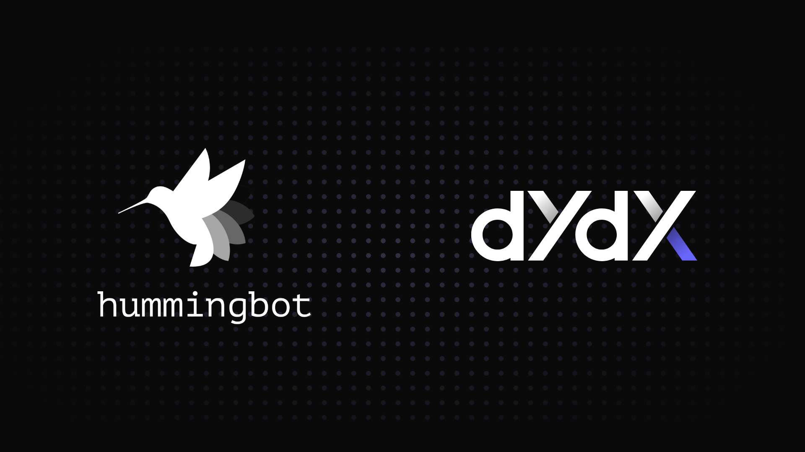

# Announcing the New dYdX V4 Connector in Hummingbot!



We're thrilled to introduce the brand-new dYdX V4 connector in the Hummingbot v2.0.1 release! This update integrates Hummingbot with the dYdX V4 Chain, enabling users to run advanced market-making and algo trading strategies on dYdX!

This release marks a significant milestone in the collaboration between the [Hummingbot Foundation](/about/) and the dYdX ecosystem. Earlier this year, we awarded a grant from the [dYdX Grants Program](https://dydxgrants.com/) to support the development of the dYdX V4 connector and to evangelize usage.

<!-- more -->

## Key Benefits

- **Access to a Leading Perp DEX**: This connector opens the door for thousands of market makers and algo traders who build on top of the Hummingbot framework to access and trade on dYdX, a leading decentralized perpetual contract exchange. This access empowers traders to tap into dYdX's deep liquidity and innovative trading features.
- **Supported by the Latest Hummingbot V2 Framework**: The connector is fully integrated with the latest [Hummingbot V2 framework](/v2-strategies/), which includes powerful tools for backtesting and multi-bot deployment. This means traders can now optimize and deploy multiple trading strategies simultaneously, all while utilizing the advanced capabilities of the Hummingbot V2 infrastructure.
- **Community-Driven Strategy Sharing**: The Hummingbot community now has the opportunity to develop and share dYdX-specific trading strategies and dashboard pages. This collaboration fosters innovation and helps traders leverage collective knowledge, making it easier to succeed on the dYdX platform.

## Installation Instructions

Due to some dependency conflicts with other Hummingbot connectors, we have created a custom Docker image and custom scripts to help users install Hummingbot with dYdX.

### Docker

1. **Open your `docker-compose.yml` file** (usually located in your Hummingbot project directory).
2. **Update the image line** under the Hummingbot service:
    - For the latest stable version, use:
        ```yaml
        image: hummingbot/hummingbot:latest_dydx
        ```
    - For the development version, use:
        ```yaml
        image: hummingbot/hummingbot:development_dydx
        ```

### Source

1. **Clone the Hummingbot repository**:
    ```bash
    git clone https://github.com/hummingbot/hummingbot.git
    ```
2. **Navigate to the Hummingbot directory**:
    ```bash
    cd hummingbot
    ```
3. **Run the install command with the `-dydx` flag**:
    ```bash
    ./install --dydx
    ```
4. **Activate the Hummingbot environment**:
    ```bash
    conda activate hummingbot
    ```
5. **Compile the code**:
    ```bash
    ./compile
    ```

## Additional Resources

This sponsorship underscores dYdX and Hummingbot's commitment to empowering the crypto ecosystem with robust tools for traders and developers. We are proud to contribute to this initiative by providing a powerful and reliable connector that enhances the trading capabilities of our community.

For more detailed information on how to get started with the dYdX connector, please visit our [dYdX Connector Documentation](/exchanges/dydx/). We are also working on a more detailed connector guide and a YouTube tutorial video, which will be available shortly to help you maximize your trading experience on dYdX.

We hope this update empowers you to make the most of the advanced trading opportunities on dYdX. Happy trading! 🚀

---

If you have any questions or run into issues, feel free to reach out to our support team or visit the [community forum](https://discord.gg/hummingbot).
