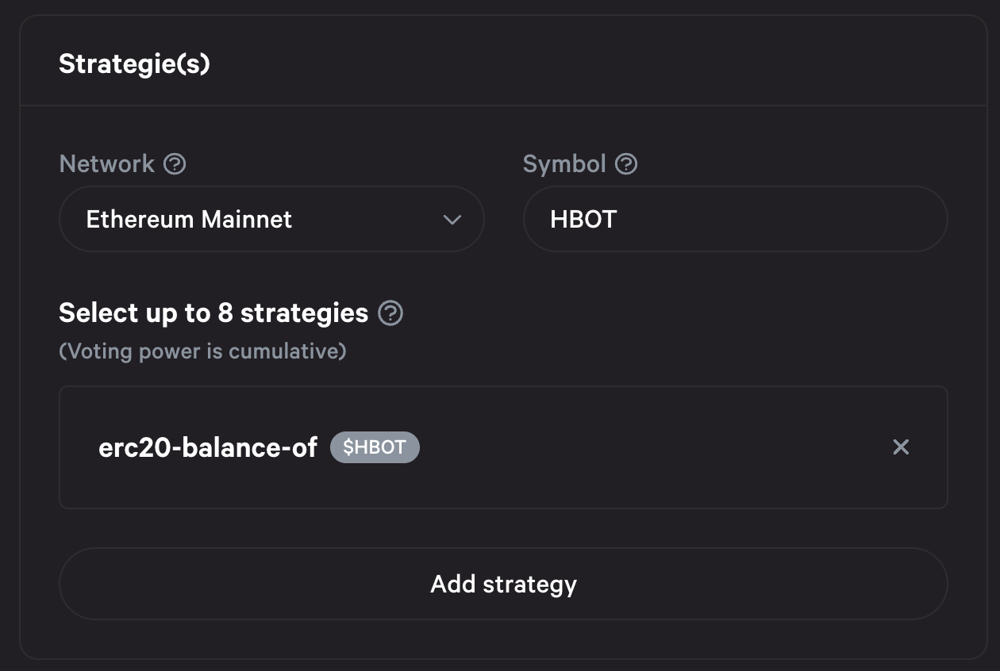

# End of HBOT delegation

Per HGP-24, we have ended the HBOT delegation system

In Hummingbot Governance proposal [HGP-24](https://snapshot.org/?ref=blog.hummingbot.org#/hbot.eth/proposal/0xbc73a6b7c04751c9296adfd9ec8bf0377f093bbe6d2ce617c5460b890690851b), Hummingbot Foundation proposed to terminate the HBOT delegation system that was initially created to allow locked-up token holders to be able to vote their tokens. Since the lockup period has expired and these token holders are able to release the tokens into their wallets, the delegation system is no longer needed to enable voting participation.

<!-- more -->

Since the goal of Hummingbot Foundation is to enable a decentralized community-maintained open source codebase, we believed this change will give the community more governance power. The Hummingbot community agreed, and HGP-24 passed with 93% approving votes.

---

On February 28, 2023, Hummingbot Foundation ended the HBOT delegation system. Now, the only Snapshot strategy used to calculate HBOT voting power is the balance of HBOT in a voter's Ethereum Mainnet wallet:

This change applies to proposals in all three HBOT Snapshot spaces:

- Hummingbot Governance Proposals: [https://snapshot.org/#/hbot.eth](https://snapshot.org/#/hbot.eth)
- Hummingbot Improvement Proposals: [https://snapshot.org/#/hbot-prp.eth](https://snapshot.org/#/hbot-prp.eth)
- Pull Request Proposals: [https://snapshot.org/#/hbot-ip.eth](https://snapshot.org/#/hbot-ip.eth)

We believe that this change will help to foster a more robust and engaged community around our project, and we are committed to continuing to improve our governance processes in the future. We would like to thank our community for their support of this change, and we look forward to working with you all to build a brighter future for our project.