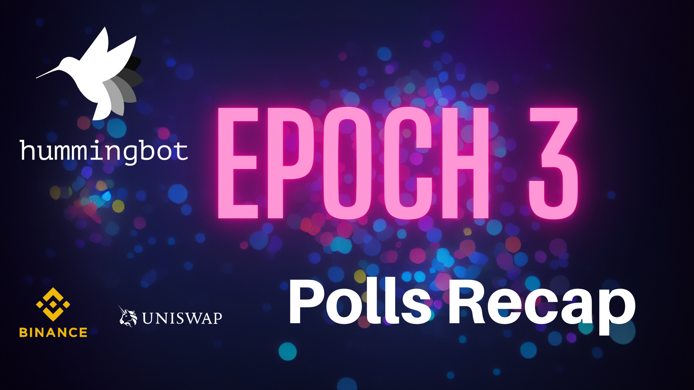
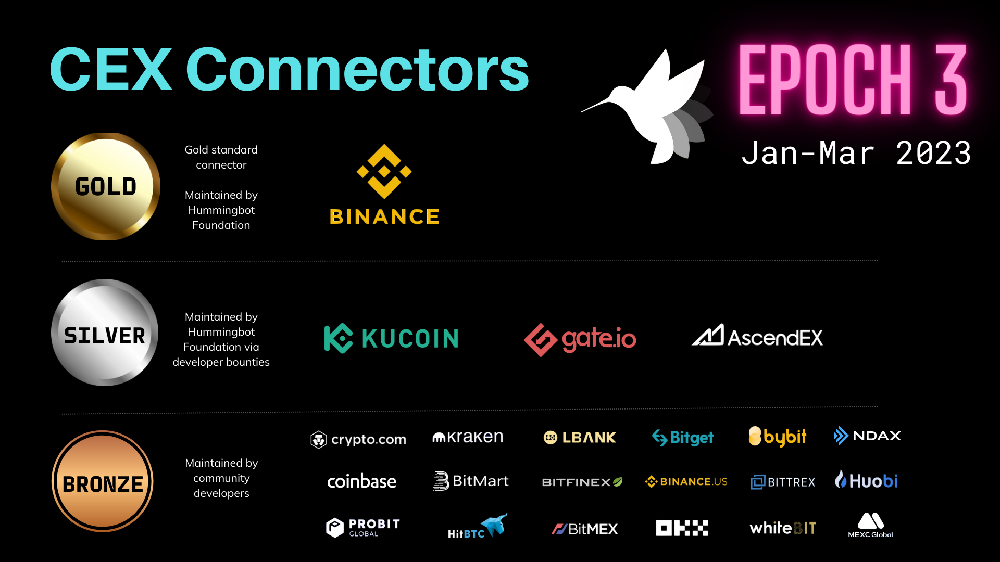

# Epoch 3 Polls Recap

Epoch 3 polls prioritizes maintenance of exchanges, strategies, and issues in the Hummingbot codebase

Recently, we finished the first set of Polls, a new initiative that lets HBOT holders decide how the Foundation allocates its engineering bandwidth and developer bounties across the components in the Hummingbot codebase. We believe regular Polls will ensure that we can continually improve the aspects of Hummingbot that are the most important to the community.

Below, we summarize the results of the Epoch 3 Polls and outline the changes we'll make over the next quarter.

<!-- more -->

## CEX Connectors

The CEX Connectors poll places [centralized exchange connectors](/connectors/) into Gold, Silver and Bronze tiers, which define the level of maintenance that the Foundation spends on each connector for the January-March 2023 release cycles. The poll received 39 distinct votes, for a total of 22 million HBOT voting power spent.

[CEX Connectors Poll](https://snapshot.org/?ref=blog.hummingbot.org#/hbot.eth/proposal/0x6a8146ebc68c3145e29309c1c90a2457a0fd57e806b50d2e0c71bd0543d374a0)

Here are the results by tier:

**Gold:** [Binance](https://www.binance.com/en)

The top vote-getting CEX connector is the **Gold** exchange for the following quarterly epoch. Hummingbot Foundation will be the official maintainer for this exchange's spot and perpetual connectors, and the Foundation's own engineering team will build and maintain these connectors and improve them by keeping up with exchange upgrades and mapping new functionality added via API. These connectors serve as the "gold standard" template for all other connectors of that type.

**Silver:** [Kucoin](https://www.kucoin.com/), [Gate.io](https://www.gate.io/), [AscendEx](https://ascendex.com/en/global-digital-asset-platform)

Hummingbot Foundation will be the official maintainer for the #2, #3, and #4 exchanges' spot and perpetual connectors. However, these exchanges' connectors will be maintained via community developer bounties, tracking improvements made to the Gold exchange connectors.

**Bronze:** Crypto.com, Kraken, LBank, Bitget, Bybit, NDAX, Coinbase, Bitmart, Bitfinex, Binance US, Bittrex, Huobi, AltMarkets, HitBTC, Bitmex, ProBit Global, OKX, WhiteBit, MEXC

Bronze CEX connectors are not maintained by Hummingbot Foundation, but may be maintained by a community members. Each of the Bronze exchanges successfully garnered 100,000+ HBOT votes in the Epoch 3 poll and will have their connectors included and documented in the Q1 2023 Hummingbot releases.

## DEX Connectors

The DEX Connectors poll places [decentralized exchange connectors](/gateway/connectors/) into Gold, Silver and Bronze tiers, which define the level of maintenance that the Foundation spends on each connector for the January-March 2023 release cycles. The poll received 32 distinct votes, for a total of 20 million HBOT voting power spent.

[DEX Connectors Poll](https://snapshot.org/?ref=blog.hummingbot.org#/hbot.eth/proposal/0xbe9aba533e1eba58ff90672c506e47b87fd5a8dfccf612143ef834e9b984b5a5)

Here are the results by tier:

**Gold:** [Uniswap](https://uniswap.org/)

Similar to the CEX Connectors, Hummingbot Foundation will treat the Gold DEX Connector as the "gold standard" and map all of its swap and liquidity provision endpoints and support instances on all major chains.

**Silver:** [PancakeSwap](https://pancakeswap.finance/), [SushiSwap](https://www.sushi.com/), [dYdX](https://dydx.exchange/)

For Silver DEXs, the Foundation utilizes HBOT developer bounties to fund improvements and fixes.

**Bronze:** TraderJoe, QuickSwap, OpenOcean, Pangolin, Defira, Perpetual Protocol, MM Finance, Defi Kingdoms, Loopring, Ref Finance, VVS Finance

Bronze DEX connectors are not maintained by Hummingbot Foundation, but may be maintained by a community members. Each of the Bronze exchanges successfully garnered 100,000+ HBOT votes in the Epoch 3 poll and will have their connectors included and documented in the Q1 2023 Hummingbot releases.

## Core Strategies

The Core Strategies poll defines which strategies should be Core (officially maintained by the Foundation) versus Community (maintained by community members or not maintained). There were 33 unique votes in the poll, and the total number of HBOT voting power tallied was 20 million.

[Core Strategies Poll](https://snapshot.org/?ref=blog.hummingbot.org#/hbot.eth/proposal/0x2a19044bd517c3c952a38dbf9da227d1dbbee8c34bcd69310b9f408bdf1c592d)

**Core:**

[Pure Market Making (PMM)](/strategies/pure-market-making/)

[Cross Exchange Market Making (XEMM)](/strategies/cross-exchange-market-making/)

[AMM Arbitrage](/strategies/amm-arbitrage/)

Hummingbot Foundation will be the official maintainer for these strategies, prioritize updates and fixes to them, and maintain their documentation pages. The Foundation also supports Core strategies by running long-term testing bots for them and providing HBOT rewards to users who answer community questions related to them.

**Community:** Avellaneda Market Making, UniswapV3 LP, Hedge, Cross-Exchange Mining, Perpetual Market Making, Aroon Oscillator, Liquidity Mining, TWAP, Spot Perpetual Arbitrage

Community strategies are not maintained by Hummingbot Foundation, but may be maintained by a community members. Each of the Community strategies successfully garnered 100,000+ HBOT votes in the Epoch 3 poll and will have their connectors included and documented in the Q1 2023 Hummingbot releases.

## Priority Issues

In addition to the Epoch 3 polls, we also conducted the first Priority Issues Poll, a monthly process that lets the community select the top five (5) open issues and pull requests that the Foundation should prioritize. There were 29 unique votes in the poll, and the total number of HBOT voting power tallied was 8.4 million.

[Priority Issues Poll](https://snapshot.org/?ref=blog.hummingbot.org#/hbot.eth/proposal/0x885b0ad9b47c645152bfd8a4603b3a8fd3ee07c0082ee5e8770f8368056f8286)

The top 5 issues that the community selected for prioritization are:

- [5866 - DEX orders failing on Polygon](https://github.com/hummingbot/hummingbot/issues/5866)
- [5795 - Upgrade Binance perpetual connector](https://github.com/hummingbot/hummingbot/issues/5795)
- [5981 - Custom API feature not working in PMM](https://github.com/hummingbot/hummingbot/issues/5981)
- [5497 - Running duration bug](https://github.com/hummingbot/hummingbot/issues/5497)
- [4428 - Remove pause/remove](https://github.com/hummingbot/hummingbot/issues/4428)

The community has made some excellent choices with these poll results. Hummingbot Foundation will prioritize addressing these issues over the next month, and we'll allow the community to nominate and vote on more issues next month.

Overall, we are excited about the community participation and discussion generated the first set of Polls, and we are excited to continue fleshing out Poll-based governance in the future!

