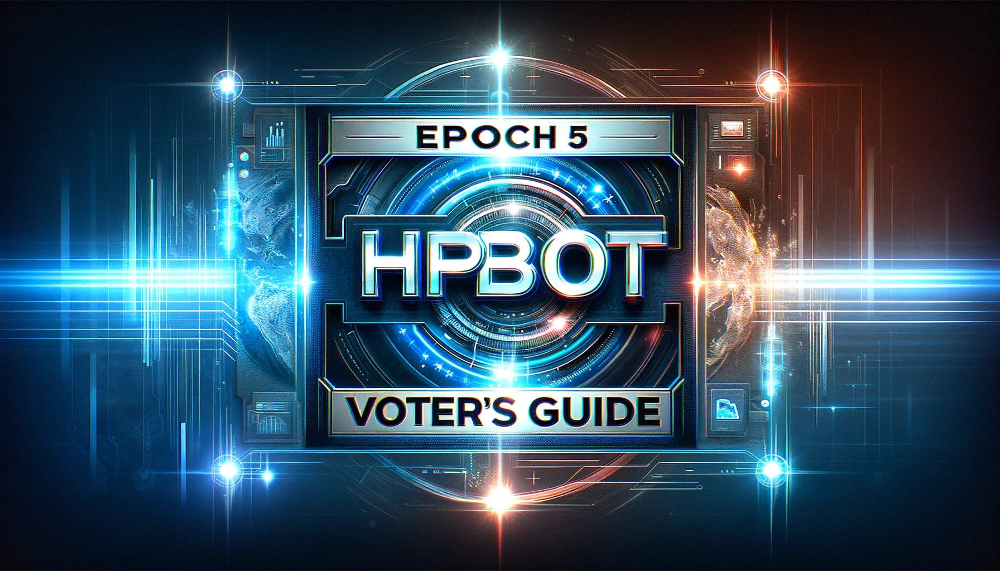

# Epoch 5 HBOT Voter's Guide

Hummingbot Foundation's quarterly [Polls](/governance/polls/) have successfully driven greater participation in Hummingbot governance. Last quarter, each poll received 30+ votes and 20+ million HBOT voting power allocated!

But more importantly, polls have also allowed our community to decide which exchange connectors should be included in the Hummingbot codebase and how they should be prioritized. There are now 44 CEX and DEX connectors in the Hummingbot codebase, and each new connector requires maintenance, testing, and documentation time that imposes a cost on the overall Hummingbot user base.

<!-- more -->

Polls have enabled us to differentiate and improve the top exchange connectors. During Epoch 4, we have funded bounties improve the Gold CEX connector (Binance) and Silver CEX connectors (Kucoin, Gate.io, AscendEx) with:

- Upgraded connectors to perpetual futures markets
- Added Candles Feed that enables users to access historical OHCLV candles data
- Support for market orders and other order types
- Content bounties that show strategies run on these venues

In addition, we have funded a [bounty](https://github.com/hummingbot/gateway/issues/112?ref=blog.hummingbot.org) to significantly revamp the Gold DEX connector (Uniswap) and will fund matching bounties for Silver DEX connectors afterwards.

---

To help HBOT holders decide how to vote for Epoch 5, we summarize each new proposal and poll below:

## Epoch 5 Governance Changes Proposal

To start, please vote on [this proposal](https://snapshot.org/?ref=blog.hummingbot.org#/hbot.eth/proposal/0xe2dd81f481f6bd84d207a7a4453c5ae820a5c2b64dab63ae746f8ce38a47a434) that proposes two changes to the governance system:

- Allocates **7M HBOT** to fund previously allocated bounties and new ones for Epoch 5 bounties
- Adds a **New Connector Proposal** type that imposes a 200,000 HBOT minimum balance to propose new CEX/DEX connectors.
We believe that these changes will make the process more transparent and streamlined.

## CEX Connectors Poll

The nominees for this poll are the centralized exchange (CEX) connectors in Hummingbot as of the May release, while Connectors added in the June release are grandfathered for Epoch 5. HBOT voters holders allocate a number of votes equal to their wallet balance (1 token = 1 vote) toward each choice.

After voting ends, the top vote-getting exchange is the Gold exchange for the following epoch. The Foundation will be the official maintainer for this exchange, we will continually improve them, and these connectors serve as the gold standard template for all other connectors of that type.

Exchanges ranked #2, #3, #4 are the Silver exchanges. The Foundation will be the official maintainer, but will maintain them by funding bounties for community developers to track improvements made to the Gold exchange connectors.

Exchanges that receive at least 100,000 HBOT Minimum Voting Power are the Bronze exchanges for the next epoch and remain in the codebase, while exchanges that don't meet this threshold will have their connectors removed from the official codebase.

Here are the 26 [CEX Connector](/connectors/) nominees for Epoch 5:

- AltMarkets
- [AscendEx](https://ascendex.com/register?inviteCode=UEIXNXKW) (Epoch 4 Silver)
- [Binance](https://www.binance.com/en/register?ref=FQQNNGCD) (Epoch 4 Gold)
- Binance.us
- Bybit
- Bitfinex
- Bitget
- Bitmart
- Bitmex
- BIT
- BTC Markets
- Coinbase
- Crypto.com
- Foxbit
- [Gate.io](https://www.gate.io/signup/5868285) (Epoch 4 Silver)
- HitBTC
- Huobi
- [Kucoin](https://www.kucoin.com/ucenter/signup?rcode=272KvRf) (Epoch 4 Silver)
- Kraken
- LBank
- MEXC
- NDAX
- OKX
- ProBit
- Phemex
- Whitebit

This poll and the other below will be created in [Snapshot](https://snapshot.org/?ref=blog.hummingbot.org#/hbot.eth) on Wednesday June 28, and voting will be open for 7 days.

## DEX Connectors Poll

Nominees for the DEX Connector poll are the decentralized exchange (DEX) connectors in Hummingbot and Hummingbot Gateway as of the May release, while DEX connectors added in the June release are grandfathered for Epoch 5.

Similar to the one above, this poll also lets the community pick the Gold, Silver, and Bronze exchanges for Epoch 5, while exchanges that receive less than 100,000 HBOT Minimum Voting Power will have their connectors removed from the official codebase.

Here are the 19 [DEX Connectors](/gateway/connectors/) nominees for Epoch 5:

- Uniswap (Epoch 4 Gold)
- DeFi Kingdoms
- Defira
- Dexalot
- dYdX (Epoch 4 Silver)
- Injective
- Loopring
- Mad Meerkat
- OpenOcean
- Pancakeswap
- Pangolin
- Quickswap (Epoch 4 Silver)
- Ref
- Sushiswap
- Tinyman
- Trader Joe (Epoch 4 Silver)
- VVS
- XSwap
- Zigzag

## Core Strategies Poll

The Core Strategies poll selects the top 3 [strategies](/strategies/) in the Hummingbot codebase, which are maintained by Hummingbot Foundation. We will run these strategies to test Hummingbot ad fund bounties to fix bugs discovered during the next Epoch.

Strategies that receive more than 100,000 HBOT Minimum Voting Power are Community Strategies and not maintained by the Foundation, while those that receive less will be removed from the codebase.

Here are the Core Strategies nominees for Epoch 5:

- [AMM-Arbitrage](/strategies/amm-arbitrage/) (Epoch 4 Core)
- [Avellaneda Market Making](/strategies/avellaneda-market-making/)
- [Cross-Exchange Market Making](/strategies/cross-exchange-market-making/) (Epoch 4 Core)
- [Cross-Exchange Mining](/strategies/cross-exchange-mining/)
- [Hedge](/strategies/hedge/)
- [Liquidity Mining](/strategies/liquidity-mining/)
- [Perpetual Market Making](/strategies/perpetual-market-making/)
- [Pure Market Making](/strategies/pure-market-making/) (Epoch 4 Core)
- [Spot Perpetual Arbitrage](/strategies/spot-perpetual-arbitrage/)
- [TWAP](/strategies/twap/)
- [AMM-V3 LP](/v1-strategies/) (Epoch 4 Core)

---

The polls above will be created in [Snapshot](https://snapshot.org/?ref=blog.hummingbot.org#/hbot.eth) on Wednesday June 28, and voting will be open for 7 days, so vote now!