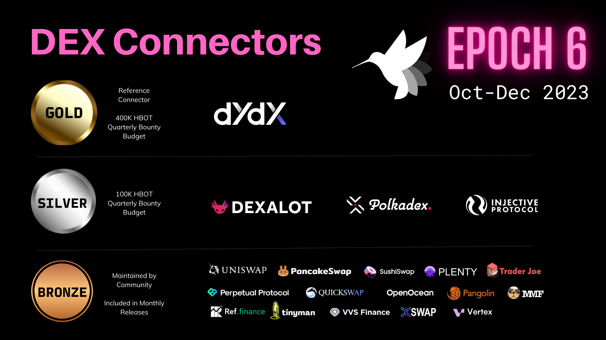
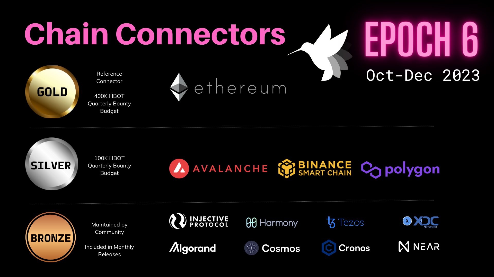

# Epoch 6 Polls Recap

Every quarter, Hummingbot Foundation organizes [Polls](../../../governance/polls.md), a quarterly process that lets HBOT holders vote on how the Foundation distributes its maintenance resources and bounty budgets across the 50+ CEX, DEX, and blockchain network connectors in the Hummingbot codebase.

This week, we completed the Epoch 6 polls which decide which connectors will be included in the Hummingbot codebase for the October, November, and December 2023 releases.

Read on to learn about which connectors made the cut!

<!-- more -->

For Epoch 6, we implemented three major changes approved in **[[HGP-45] Proposed Epoch 6 Governance Changes](https://snapshot.org/#/hbot.eth/proposal/0x7807da661f09096db6aadb277051ed6defd580259fd8e503c2a77a83779a3fd5)** proposal. Here are the summarized details:

- **Chain Connector Voting Introduction**: Added Chain Connector voting
- **Bounty Allocations**: Formalized quarterly HBOT bounty allocations of 400K for Gold connectors and 100K for Silver connectors
- **Adjustment of Connector Inclusion Threshold**: Increased threshold to 200K HBOT to keep connectors in the codebase for the next quarter.

These changes aim to sustain our bounties program and facilitate further development of our codebases. We trust that they will aid in fostering a collaborative, productive, and beneficial environment for our community.

Below, we summarize the results of the Epoch 6 Polls and outline the changes we'll make over the next quarter.

## CEX Connectors

The CEX Connectors poll places [centralized exchange connectors](../../../cex-connectors/index.md) into Gold, Silver and Bronze tiers, which define the level of maintenance that the Foundation spends on each connector for the October-December 2023 release cycles.

The poll received 24 distinct votes, for a total of 49 million HBOT voting power spent: [CEX Connectors Poll](https://snapshot.org/#/hbot.eth/proposal/0xb830acb389380f447a996ade4dd39120f5139256a6fa55448ff8d78ef9193de4)

Here are the results by tier:

**🥇 Gold:** [Binance](../../../exchanges/binance/index.md)

As the #1 vote-getting CEX, Binance will serve as the reference CEX connector for Q4 2023, which means that the we will seek to improve and upgrade its integration with Hummingbot over the quarter. In addition, this connector is awarded a 400K HBOT bounty budget, which we will use to supplement our own efforts with bug, improvement, and content bounties that allow the community to help maintain and upgrade it over the next quarter.

The Binance connector code serves as the reference template for other CEX connectors of the same type.

**🥈 Silver:**  [Gate.io](../../../exchanges/gate-io/index.md), [Kucoin](../../../exchanges/kucoin/index.md), [Huobi](../../../exchanges/huobi/index.md)

The #2, #3, and #4 vote-getting CEX connectors are each awarded a 100K HBOT bounty budget, which we will use to fund, bug, improvement, and content bounties that allow the community to help maintain and upgrade these connectors over the next quarter.

**🥉 Bronze:** Ascendex, OKX, Coinbase, Kraken, BTC-Markets, Phemex, HitBTC, Bitfinex, Bitget, Bitmex, BIT, MEXC, Bybit, Bitmart, NDAX

Bronze CEX connectors are not maintained by Hummingbot Foundation, but may be maintained by a community members. Each of the exchanges above successfully garnered 200,000+ HBOT votes in the Epoch 6 poll and will have their connectors included and documented in the Q4 2024 Hummingbot releases.

## DEX Connectors

The DEX Connectors poll places [decentralized exchange connectors](/gateway/connectors/) into Gold, Silver and Bronze tiers, which define the level of maintenance that the Foundation spends on each connector for the October-December 2023 release cycles. 

The poll received 18 distinct votes, for a total of 46 million HBOT voting power spent: [DEX Connectors Poll](https://snapshot.org/#/hbot.eth/proposal/0x5fe34c66cefc6438070332d2ab0d807447a9c175eb5e975e5a9a7023cb3c5c83)

Here are the results by tier:

**🥇 Gold:** [dYdX](../../../exchanges/dydx.md)

As the #1 vote-getting DEX, dYdX will serve as the reference DEX connector for Q4 2023, which means that the we will seek to improve and upgrade its integration with Hummingbot over the quarter. In addition, the connector is awarded a 400K HBOT bounty budget, which we will use to supplement our own efforts with bug, improvement, and content bounties that allow the community to help maintain and upgrade it over the next quarter.

The dYdX connector code serves as the reference template for other CLOB DEX connectors.

**🥈 Silver:**  [Dexalot](../../../exchanges/dexalot.md), [Polkadex](../../../exchanges/polkadex.md), [Injective Helix](../../../exchanges/injective.md)

The #2, #3, and #4 vote-getting DEX connectors are each awarded a 100K HBOT bounty budget, which we will use to fund, bug, improvement, and content bounties that allow the community to help maintain and upgrade these connectors over the next quarter.

**🥉 Bronze:** Uniswap, Pancakeswap, Sushiswap, Plenty, TraderJoe, Perpetual Protocol, Quickswap, OpenOcean, Pangolin, Mad Meerkat Finance, Ref Finance, Tinyman, VVS Finance, XSwap, Vertex

Bronze DEX connectors are not maintained by Hummingbot Foundation, but may be maintained by a community members. Each of the exchanges above successfully garnered 200,000+ HBOT votes in the Epoch 6 poll and will have their connectors included and documented in the Q4 2023 Hummingbot releases.

## Chain Connectors

New for Epoch 6, the Chain Connectors poll places [Layer 1 blockchains](../../../chains/index.md) into Gold, Silver and Bronze tiers, which define the level of maintenance that the Foundation spends on each connector for the October-December 2023 release cycles. There were 16 unique votes in the poll, and the total number of HBOT voting power tallied was 46 million.

[Chain Connectors Poll](https://snapshot.org/#/hbot.eth/proposal/0x46a1f7d13701d18a4382665631b90fcf52762c030547f643ff45548403bb96ca)

Here are the results by tier:

**🥇 Gold:** [Ethereum](../../../chains/ethereum.md)

As the #1 vote-getting Chain, Ethereum will serve as the reference Chain connector for Q4 2023, which means that the we will seek to improve and upgrade its integration with Hummingbot Gateway over the quarter. In addition, the connector is awarded a 400K HBOT bounty budget, which we will use to supplement our own efforts with bug, improvement, and content bounties that allow the community to help maintain and upgrade it over the next quarter.

The Ethereum connector code serves as the reference template for other Chain connectors.

**🥈 Silver:** [Avalanche](../../../chains/avalanche.md), [Binance Smart Chain](../../../chains/bnb-chain.md), [Polygon](../../../chains/polygon.md)

The #2, #3, and #4 vote-getting Chain connectors are each awarded a 100K HBOT bounty budget, which we will use to fund, bug, improvement, and content bounties that allow the community to help maintain and upgrade these connectors over the next quarter.

**🥉 Bronze:** Injective, Harmony, Tezos, XDC, Algorand, Cosmos, Cronos, Near

Bronze Chain connectors are not maintained by Hummingbot Foundation, but may be maintained by a community members. Each of the chains above successfully garnered 200,000+ HBOT votes in the Epoch 6 poll and will have their connectors included and documented in the Q4 2023 Hummingbot releases.

Overall, we are excited about the continued support by the votes from the community, and we are excited to continue fleshing out Poll-based governance in the future!
