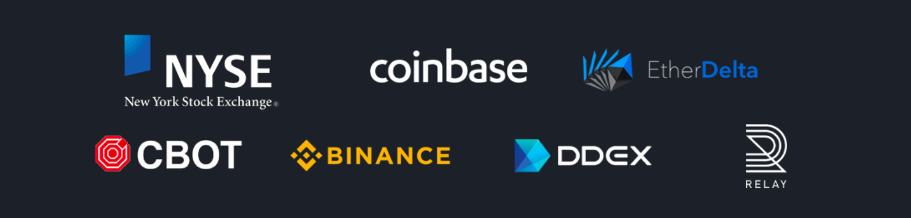
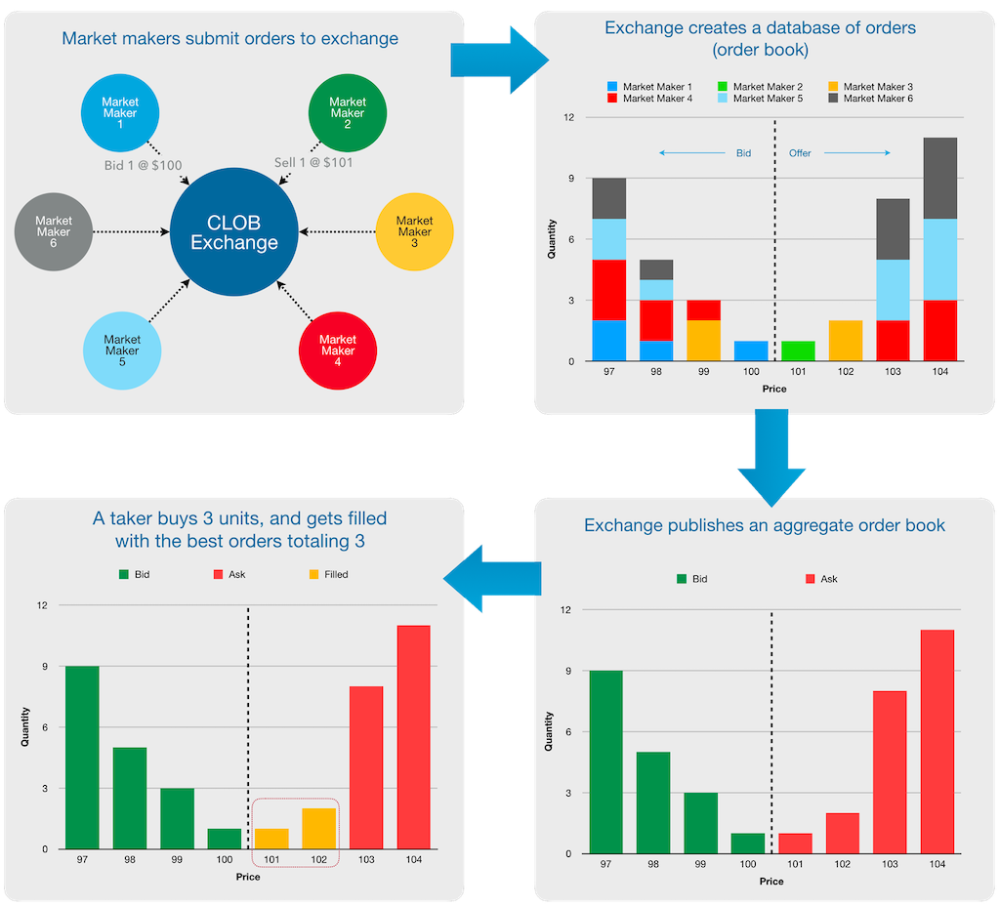
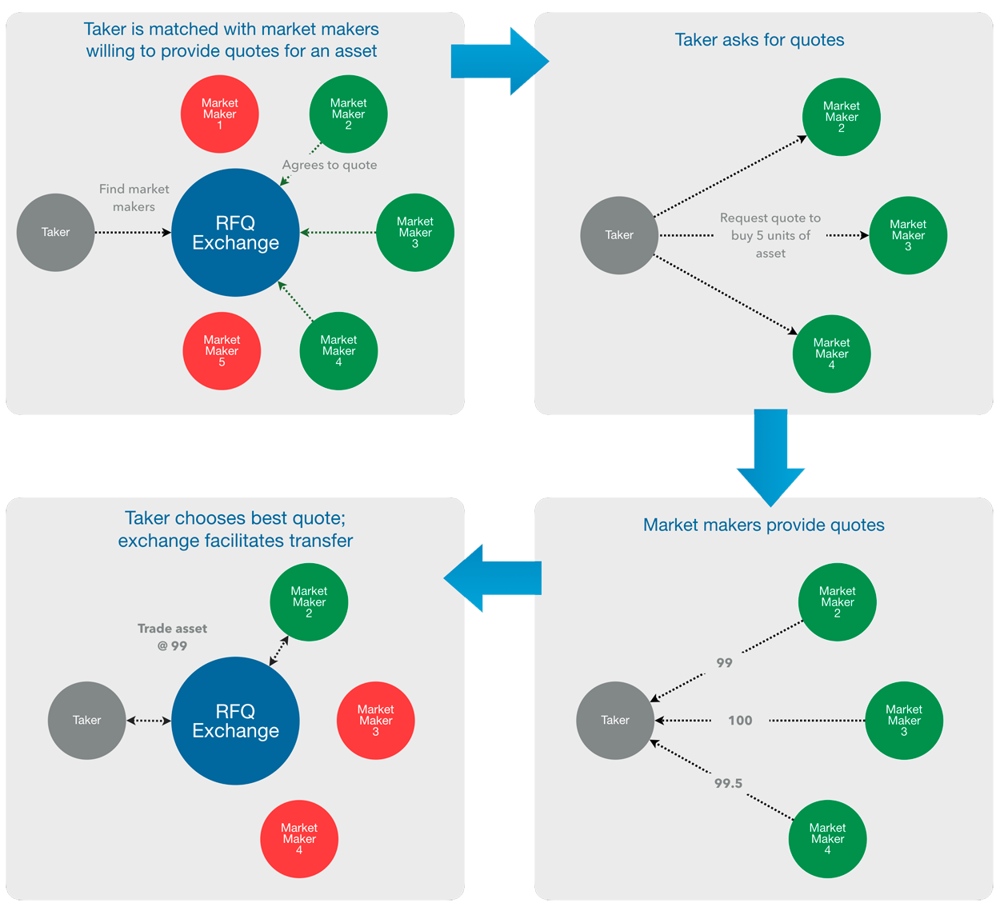
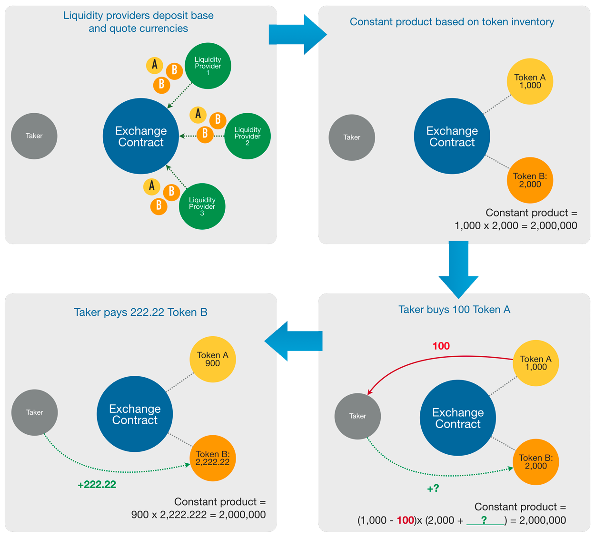
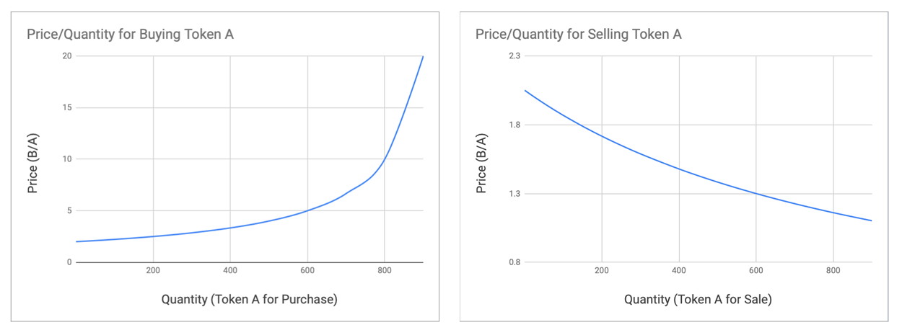

# Exchange Types Explained: CLOB, RFQ, AMM

Since Hummingbot is an open source bot platform that connects to many different exchanges, we have developed a deep understanding of the nuances between various exchange types.

In this post, we discuss the three main methodologies that digital asset exchanges use to facilitate asset transactions. We hope that this post helps crypto traders and developers choose the right exchange for their needs.

### TLDR

Exchanges perform the fundamental role in free markets of bringing together and coordinating buyers and sellers. Exchanges provide a venue for these parties to discover one another, negotiate and agree terms, and ultimately transact. Exchanges have adopted multiple methodologies to achieve this:

<!-- more -->

| Exchange Types | Examples |
|---|---|
| [**Central Limit Order Book (CLOB)**](#central-limit-order-book-clob)  <small>Most commonly used exchange methodology</small>  <small>Exchange collects orders from market makers and then publishes an aggregate order book</small>  <small>Orders are made available for other parties (“takers”) to accept the terms and transact</small>   | <small>NYSE, CBOT, Coinbase, Binance, EtherDelta, DDEX, Radar Relay</small> |
| [**Request for Quotation (RFQ)**](#request-for-quotation-rfq-exchanges)  <small>Pricing on demand: A taker initiates a transaction by querying a known set of market makers with a specific demand (e.g. “buy 10 ETH”)</small>  <small>Taker receives a quote from each, and decides which (if any) to accept</small>   | <small>Airswap, Kyber</small> |
| [**AMM**](#automated-exchange)  <small>A form of exchange enabled by blockchain technology where an exchange smart contract calculates prices using a predetermined formula referencing the contract’s inventory of assets</small>  <small>This requires third party actors (arbitrageurs) to keep asset prices in-line with other markets</small>   | <small>Bancor, Uniswap</small> |

We also discuss the degrees of decentralization of each methodology.  CLOB exchanges, as the name suggests, are centralized (even "decentralized exchanges" using CLOB have some degree of centralization) since exchange operators can control the flow of order information and access, whereas RFQ and automated exchanges allow for more or nearly full decentralization.

### Central Limit Order Book (CLOB) Exchanges

Central limit order books are the most widely used exchange methodology.  If you have transacted on Coinbase, Binance, Kraken, or any centralized exchange, you have transacted on a CLOB.  Not limited to digital asset exchanges, this methodology is also used by traditional exchanges such as the New York Stock Exchange (NYSE) and Chicago Board of Trade (CBOT), which trades commodity futures. This method of exchange is rooted in the “trading pits” associated with the early days of Wall Street and commodities markets: chaotic, crowded venues with people yelling and shouting orders.

#### Coordinating buyers and sellers on a CLOB exchange

1. Market makers submit their intent to transact assets to the exchange, specifying basic information such as prices, quantities, and direction of their intent (buy or sell).
2. The exchange collects all of these intents (**orders**) into a database (the **order book**).
3. The exchange then organizes and publishes the order book to all of its users.
4. In order to consummate a transaction, another party (a **taker**) must accept the prices and quantities available on the order book. The exchange operator matches the taker's acceptance (its **market order**) with the corresponding orders in the order book that fulfill the taker’s order at the currently available best prices.

#### CLOB explained in pictures

#### Order matching on a CLOB exchange

When it comes to **order-matching**, most CLOB exchanges take an active approach and match orders whenever buyers' and sellers' orders overlap.  In the case where there are multiple orders entered at the same price, CLOB exchanges also implement algorithms aimed to prioritize orders in a fair and objective way.  Most centralized exchanges and some DEXs (e.g. DDEX, IDEX, and Paradex) use **[Price/Time priority](https://en.wikipedia.org/wiki/Order_matching_system)** (or **first in, first out "FIFO"**), where filling orders is prioritized based on 1) the best price, and then 2) the time in which those orders were submitted (for discussion and examples, check out this [stack overflow post](https://stackoverflow.com/questions/13112062/which-are-the-order-matching-algorithms-most-commonly-used-by-electronic-financi)), while to a lesser degree, some exchanges can use a [**pro-rata**](https://en.wikipedia.org/wiki/Order_matching_system) algorithm.

On the other hand, some other DEXs (e.g. 0x relayers) take a less involved approach in order to allow for order matching to occur between users in a trustless way, free from influence or involvement from the exchange operator.  In the most widely used "**open orderbook**" relayer strategy, the relayer broadcasts submitted orders and leaves them for any takers to fill.

> Another distinguishing feature of CLOB exchanges is their ability to administer order matching, though some relayers take more hands-off approach (e.g. open orderbook) to allow users to match orders themselves.

#### Is a CLOB exchange centralized or decentralized?

CLOB exchanges are generally **centralized**, in that there is a central authority, the exchange operator, who (1) controls the flow of information, (2) controls who can use and access the exchange, and (3) maintains ownership or custody of users' assets.

**Control of information**: when collecting and processing users' orders, the exchange operator has the ability to choose what and when to broadcast. This gives exchanges the ability to censor information as well as even front run users' orders (although of course, you wouldn't expect them to). These exchanges are also susceptible to outages or service disruptions if the exchange operator's servers go down.

**Exchange access**: due to regulatory and compliance requirements, exchanges typically control who can access their systems by requiring KYC/AML processes for onboarding and limiting availability to certain jurisdictions.

**Asset custody and control**: most widely used (currently) CLOB exchanges also hold custody of users' assets, which helps facilitate the settlement of asset transfers.  For example, if you are trading on Binance, Binance maintains custody of your assets; your assets are susceptible to hacks into Binance's accounts or any wrongdoing by Binance.

>For anyone who has had to deal with Binance support to re-enable withdrawals, or anyone unlucky enough to have had accounts on [Mt Gox](https://www.coinbureau.com/news/mt-gox-redux-controversy-continues/), [Coincheck](http://fortune.com/2018/01/31/coincheck-hack-how/), QuadrigaCX... you know full well what it means to have to deal with a centralized exchange!

#### But what about decentralized exchanges? 🤔

Most DEXs operate CLOB exchanges, such as EtherDelta, 0x Relayers, and DDEX. These exchanges achieve some level of decentralization, but only when it comes to asset custody; they enable users to self custody or retain control of their assets using escrow contracts. 0x Relayers and DDEX allow users to maintain ownership of their assets, but use signed transactions and asset exchange protocols to facilitate direct settlement of assets between a taker and maker's wallets.  Meanwhile, EtherDelta uses escrow smart contracts to temporarily hold assets to be traded. Both **achieve decentralization in that they do not relinquish control of assets to the exchange operator**.

However, these exchanges still control the information of the order book, maintaining the ability to censor and front run, and are susceptible to service disruptions.  Also, some DEXs control access to their exchange.  Some DEXs are adopting or have already adopted some degree of KYC/AML procedures, while some restrict user access through geofencing (e.g. DDEX prevents access to the U.S.).

### Request for Quotation (RFQ) Exchanges

Request for quotation is a common practice used in daily life and business and can simply be thought of as price comparison shopping or pricing on demand. Some activities involving RFQs include:

- buying or selling a car
- buying goods or services
- hiring contractors

In each case, assuming the end product (the asset or service) is exactly the same and interchangeable (**fungible**), you request quotes from multiple dealers or service providers and choose the one that provides the best price.

This practice is already used in cryptocurrency trading as well as in traditional financial products (stocks, derivatives), specifically when a party requests quotes from multiple **OTC (over-the-counter) market makers** and trades with the best one.

> The relatively new development is the use of blockchain technology to automate and bring the RFQ form of exchange to more users as an alternative form of everyday asset exchange.

One distinction of an RFQ type of business process is that you will typically know who the counterparty is; after all, you deliberately chose and asked that party for a quote. This contrasts with a CLOB exchange, where the only party that knows who all the actors are is the exchange operator, so a taker may not know who the maker on the other side of a trade is.

In RFQs, the role of the exchange operator (or smart contract) is to organize and keep track of quotation providers for a taker, assist in the coordination of requesting and receiving quotes, and finally provide a method for effecting (settling) the transaction once agreed.

### RFQ and decentralization

RFQ exchanges clearly offer a higher degree of decentralization and enable true "peer-to-peer" transactions.  Once established, the direct access between takers and makers eliminates the control and influence of a central exchange operator.

In practice, technical complexities must be overcome to fully enable more widespread adoption and use.  Currently, the role of maker is limited to only sophisticated and technologically capable parties, since makers need to setup the infrastructure to be able to provide quotes and supply inventory on demand.

> At Hummingbot, we are planning to add integrations to RFQ exchanges in the future, to obfuscate the technical complexity and make the role of market maker accessible to more users.

## Automated Market Makers (AMM)

A relatively new form of exchange that has emerged in the cryptocurrency markets is the automated exchange such as Bancor and Uniswap. These exchanges do away with order books altogether and instead use a smart contract and its inventory to determine prices for exchange. 

To understand numerically how automated market maker pricing works, this [spreadsheet](http://bit.ly/2VhceZT) may be helpful.

### AMMs and decentralization

The elegance of the AMM is its simplicity: a simple contract, using basic arithmetic, that is free of control from any party.  Automated exchanges rely on natural market forces to establish pricing.

Since it's simply a smart contract, once deployed, the exchange can be accessed by anyone at any time, and not even the original creator of the exchange may be able to influence the exchange's behavior.

Hummingbot users can act as arbitrageurs to generate profits but also help the exchanges keep pricing in-line with the market; it's a win-win.

## Footnotes

1. Exchanges may also allow for the specification of additional parameters for additional complexity and customization, such as order duration/expiration or other conditions (stop, limit).
2. Unlike other market places, when applied to digital assets, the counterparty in an RFQ transaction facilitated by an RFQ protocol may only be *known* by their wallet address.
3. Note that for decentralized exchanges, the operator or platform may not know who the actual party is, however the operator and the taker will know the maker’s Ethereum wallet address.
