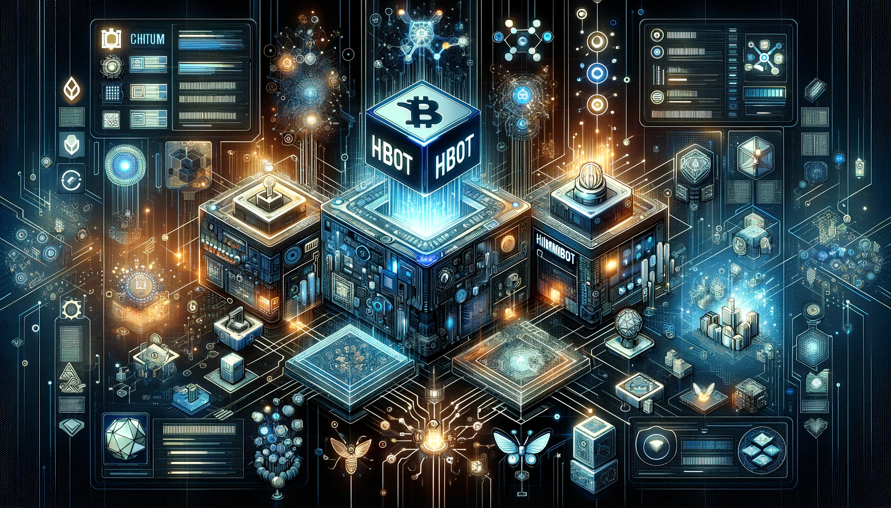

# FAQ on HBOT and Hummingbot Governance

Ever since the birth of the Hummingbot ecosystem, we've strived to ensure a decentralized approach to governance and maintenance of the Hummingbot codebase. Let's take a brief journey through some key milestones:

* **Oct 2021**: Launch of the Hummingbot Foundation
* **Jan 2022**: Introduction of the HBOT Token
* **Dec 2022**: Introduction of Polls for CEX and DEX Connector Voting
* **Sep 2023**: Addition of Chain Connector Voting and Bounty Budgets

HBOT holders are now empowered to dictate how the Foundation distributes its maintenance resources and bounty budgets across the 50+ CEX, DEX, and chain connectors in the codebase. This post updates HBOT holders on how the governance system works.

<!-- more -->

## What is the HBOT token?

[HBOT](https://etherscan.io/address/0xe5097d9baeafb89f9bcb78c9290d545db5f9e9cb) is the native utility token of the Hummingbot ecosystem. It is a standard ERC-20 Ethereum token that lets holders to decide how the Hummingbot codebase changes through voting on [Snapshot](https://snapshot.org/#/hbot.eth).

The sole use case of the HBOT token is **governance**. HBOT tokens empower holders to govern many aspects of the Hummingbot Foundation, including approving pull requests, allocating bounties toward various connectors, and electing Board of Directors.

## How is the HBOT token distributed?

The total supply of HBOT was fixed at genesis at 1,000,000,000 tokens, and the entire supply is designed to be distributed to stakeholders for contributing meaningful work to the Hummingbot ecosystem.

At [inception](../introducing-the-hummingbot-governance-token-hbot/index.md), 64.0% of the total HBOT supply was distributed to Github code contributors, Hummingbot users that provided liquidity to the Miner platform, and investors and team members from CoinAlpha, the company that originally open-sourced Hummingbot.

From January 2022 through August 2023, 4.2% of the total HBOT supply was distributed across 468 transactions to 102 unique wallets for bug fixes, new connectors, content bounties and other uses approved via Polls and Proposals.

Currently, 31.8% of the total HBOT supply remains available and earmarked for future distributions to the community. See [HBOT Tracker](https://docs.google.com/spreadsheets/d/1UNAumPMnXfsghAAXrfKkPGRH9QlC8k7Cu1FGQVL1t0M/edit#gid=285483484) for more information.

## Who should acquire HBOT tokens?

The HBOT token gives stakeholders a voice in the evolution of the Hummingbot codebase. Anyone with a keen interest in deciding which exchanges and blockchains Hummingbot supports should think about obtaining HBOT tokens. Here's a breakdown:

**Exchanges (Centralized and Decentralized)**: Exchanges can benefit from ensuring that their platform is readily accessible and optimized within the Hummingbot ecosystem. By holding HBOT tokens, exchanges can cast votes to prioritize their development of spot/perpetual connector and historical candles feeds. Exchangs can also create bounties that incentivize community members to fix bugs and create guides that potentially drives more trading volume and user activity to their platforms.

**L1/L2 Blockchain Networks**: As the crypto space evolves, different Layer 1 and Layer 2 solutions emerge and compete for dominance. These networks, aiming to ensure seamless interaction with Hummingbot, should consider acquiring HBOT tokens. This way, they can influence the addition or prioritization of their respective chain connectors, facilitating better integration with Hummingbot and consequently, promoting more efficient trading on DEXes operating on their network.

**Traders and Trading Firms**: Individual traders and firms, especially those who rely on specific exchanges or blockchains, should acquire HBOT to have a say in which connectors are maintained and optimized. This allows them to ensure that their trading activities on their preferred platforms are uninterrupted and continually enhanced.

In essence, acquiring HBOT tokens is an investment in the future trajectory of the Hummingbot platform, ensuring it aligns with your specific needs and preferences.

## What can I do with HBOT tokens?

**Voting on Polls and Proposals:**

* **Connector Voting**: One of the primary utilities of the HBOT token is the ability to vote in quarterly [Polls](../../../governance/polls.md) on which Centralized Exchanges (CEX), Decentralized Exchanges (DEX), and Chain Connectors are integrated and supported within the Hummingbot codebase. As the crypto landscape evolves, it's essential to keep the Hummingbot platform updated with the most demanded and relevant connectors. HBOT token holders can weigh in on this.

* **Governance System Parameters**: Apart from connectors, there are several other governance decisions to be made, such as bounty allocations for specific connectors and adjusting the connector inclusion thresholds. By holding HBOT, you can voice your opinions on these matters and help steer the ecosystem in a direction that best aligns with your preferences.

* **Board Elections**: In addition, HBOT holders have the power to re-elect the Hummingbot Foundation Board of Directors each year.

**Funding Bounties:**

* **Bug Fixes and Improvements**: Encountered a bug or see room for improvement in a connector? With HBOT tokens, you can fund bounties to incentivize community developers to address these issues. By doing this, you're not only enhancing the user experience for yourself but also for the broader Hummingbot community.

* **New Features**: Have an idea for a novel feature that could benefit the community? You can propose and fund a bounty to bring this feature to life. By compensating developers with HBOT tokens, you can encourage and foster innovation within the ecosystem.

* **Bounties Board**: The Hummingbot platform has a dedicated [Bounties Board](https://github.com/orgs/hummingbot/projects/7/views/1), a place where token holders can list bounties for specific tasks, and community developers can pick them up. Whether it's a bug fix, a new connector, or an innovative strategy, the bounty board serves as a bridge between token holders and developers, aligning interests and fostering collaboration.

In summary, HBOT tokens are not just a means of investment or holding; they're a tool that grants you an active role in the Hummingbot ecosystem's development and trajectory. Whether you're voting on key decisions or funding development work, the HBOT token ensures your voice is heard and your needs are addressed.

## How can I earn HBOT tokens?

Those involved with Hummingbot, whether as developers or users, primarily earn HBOT tokens through [Bounties](../../../bounties/index.md). These rewards are a token of appreciation given to those who actively contribute to refining the Hummingbot platform. Whether it's bug fixes, connector enhancements, formulation of new trading strategies, or crafting educational content, each task can be a gateway to earning HBOT tokens.

Furthermore, our Bounties Board is a testament to the community-driven ethos of our ecosystem. It's an arena where every connector, including those categorized as Bronze, can tap into the rich pool of expertise that our community offers. This interactive platform connects connectors in need of upgrades with seasoned Hummingbot developers. The result is a dynamic system where tasks find swift resolutions by experts, ensuring the consistent growth and improvement of the Hummingbot platform.

## How does demand and supply for HBOT reach equilibrium?

The trajectory of the Hummingbot ecosystem is largely shaped by our community maintainers. As the ecosystem thrives, we foresee a linear escalation in maintenance expenses, primarily due to development bounties. Conversely, as our user base grows, both the fees and the volume accumulated by the Foundation are poised to experience exponential growth. Our objective is to achieve an equilibrium where HBOT tokens disbursed to developers as bounties align closely with the HBOT garnered from connector affiliations. Should there arise a scenario where the fee share income overshadows operational expenses, the excess will be redirected to fuel more HBOT bounties, preserving a harmonious demand-supply dynamic.

## What was changed in Epoch 6?

Epoch 6, marked by [HGP-45](https://snapshot.org/#/hbot.eth/proposal/0x7807da661f09096db6aadb277051ed6defd580259fd8e503c2a77a83779a3fd5), ushered in the following transformations:

* **Introduction of Chain Connector Voting:** This system was established to support and green-light Chain Connector endorsements.
* **Delineation of Bounty Allocations:** Provisions were made for 400K Gold and 100K Silver bounty funds, reserved solely for connectors.
* **Redefining the Connector Inclusion Threshold:** The bar for Connector Inclusion was elevated, now set at 200K HBOT, a significant jump from the earlier benchmark of 100K HBOT.

## Conclusion

HBOT is your passport to actively shaping the Hummingbot ecosystem. With HBOT in hand, you hold the reins – deciding which connectors thrive, endorsing critical bounties, and guiding our platform's trajectory. As the Hummingbot community grows, the scope and impact of HBOT will undoubtedly expand.