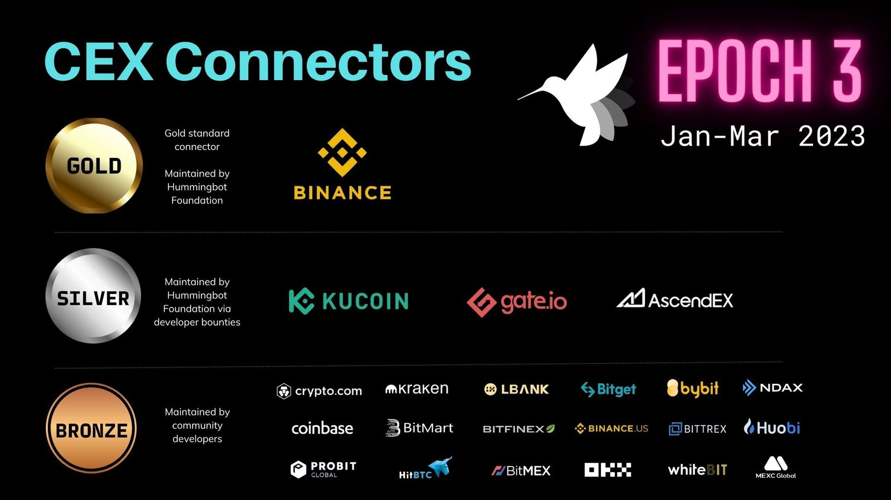

# FAQ on Hummingbot Polls for Exchanges

## What are Polls?
Hummingbot Foundation started conducting quarterly Polls to give HBOT holders a say in the allocation of the Foundation's engineering bandwidth and HBOT developer bounties across the various components of the Hummingbot codebase especially, **which exchanges are included in the codebase, and how much maintenance effort we apply to each exchange.**

<!-- more -->

The first set of polls began in January 2023 and will occur during the first week of each month going forward. Votes are calculated using Quadratic Voting, in order to give more power to individual voters. The polls run for one week each, after which the Foundation will put into effect the changes to the exchange and strategy tiers in the following monthly release.

See the [Polls](../../../governance/polls.md) documentation to learn more about them.

## After a Poll, how are exchange ranked?

After the voting process, both centralized exchange (CEX) connectors and decentralized exchange (DEX) connectors are ranked into 3 tiers:

- **Gold**: The top choice is the **Gold** exchange for the following quarterly epoch. The Foundation will be the official maintainer for this exchange's spot and perpetual connectors, and the Foundation's own engineering team will build and maintain these connectors and improve them by keeping up with exchange upgrades and mapping new functionality added via API. These connectors serve as the "gold standard" template for all other connectors of that type.
- **Silver**: The #2, #3, and #4 choices are the **Silver** exchanges. The Foundation will be the official maintainer for this exchange's spot and perpetual connectors as well. However, these exchanges' connectors will be maintained via community developer bounties, tracking improvements made to the Gold exchange connectors.
- **Bronze**: Any other exchange that receives the Minimum Voting Power (100K HBOT) threshold is labeled as a Bronze exchange. The Foundation does not maintain these exchanges' connectors nor will we allocate bounties for them, but they may be maintained by a member of the community. Exchanges that don't meet the Minimum Voting Power threshold will be removed from the codebase.

## How can exchanges get the Hummingbot community to vote for them in Polls?

To boost their ranking in upcoming polls, exchanges can have various options to gather more voters:

- **Hold and vote HBOT**: HBOT is a governance token that allows holders to vote gaslessly using their wallet balance. See [this page](/faq/#hbot-token) for more information on how to acquire and vote HBOT.
- **Campaign for your exchange on Discord**: Join our [Discord](https://discord.com/invite/hummingbot?ref=blog.hummingbot.org) and post and engage with the community, where members can post comments and engage in discussions about the poll topic. One example of an exchange that was successful in doing this was OpenOcean in the Epoch 1 poll.

- **Hire CoinAlpha as maintainer**: As our sister company, CoinAlpha provides products and services built on top of Hummingbot for instutional clients. They build and maintain CEX and DEX connectors (helping the exchange to make sure that the connector is up-to-date and working correctly), and they also help exchanges navigate the Foundation governance process (gathering votes on the exchange's behalf to increase the chances of the exchange being selected).

In conclusion, we are thrilled with the level of community engagement and discourse generated by the initial Polls, and we are looking forward to further developing Poll-based governance in the future!

If you have any questions, please contact us via Discord or Telegram, or send us email at operations@hummingbot.org