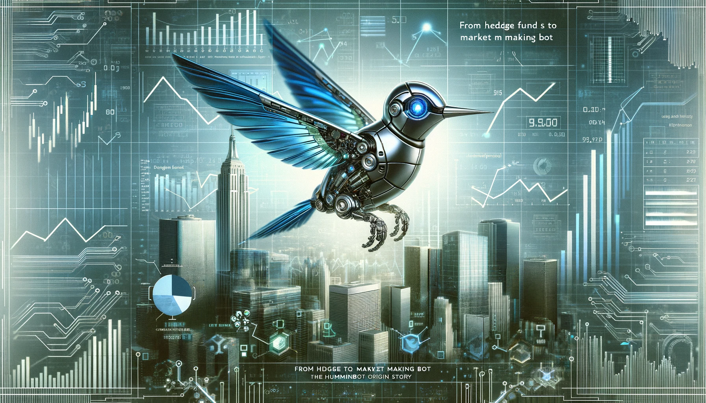

# From Hedge Fund To Market Making Bot: The Hummingbot Origin Story

Here's the story of how we created one of the first tokenized hedge funds, shut it down after reaching an SEC settlement, and are now building an open source market making bot!

This post is adapted from a 2019 podcast with Michael Feng, co-founder of Hummingbot.

<!-- more -->

<iframe style="width:100%; min-height:400px;" src="https://www.youtube.com/embed/3a4w5H1IZVA" frameborder="0" allow="accelerometer; autoplay; encrypted-media; gyroscope; picture-in-picture" allowfullscreen></iframe>

## Table of Contents
- [Feng’s road to Silicon Valley](#fengs-road-to-silicon-valley)
- [How did we start CoinAlpha?](#how-did-feng-and-his-co-founders-start-coinalpha)
- [Smart contract meets hedge fund](#smart-contract-meets-hedge-fund)
- [OMG, the SEC came after us](#omg-the-sec-came-after-us)
- [Reflections on blockchain-based funds](#reflections-on-blockchain-based-funds)
- [What is Hummingbot?](#what-is-hummingbot)
- [What problem does Hummingbot solve?](#what-problem-does-hummingbot-solve)
- [Why open source Hummingbot?](#why-open-source-hummingbot-rather-than-use-it-ourselves)
- [How easy is it to use Hummingbot?](#how-easy-is-it-to-use-hummingbot)
- [General advice for startups](#general-advice-for-startups)

## Feng’s road to Silicon Valley

After graduating from college in 2001, I started my career creating collateralized debt obligations (CDOs) at Citigroup and later at JPMorgan. At the time, most people hadn't heard of CDOs, but I was attracted to the field because unlike traditional investment banking, it was a chance to build something completely new.

My job was to structure CDOs backed by subprime mortgages and other residential real estate risk, so for better or worse, I ended up working on some of the now-infamous transactions that contributed to the 2008 financial crisis.

After the financial crisis, I was really disillusioned and depressed. What originally drew me into finance was the use of math, statistics and financial engineering to create better products that were more optimal than what previously existed, but instead the opposite had happened. I had spent my entire career thus far creating products that cost millions of people their homes and jobs. It was a horrible feeling.

I was fortunate to get into an engineering master's program at Stanford, so I quit my cushy finance job and went back to school. Meeting my Stanford classmates and taking classes in computer science and entrepreneurship really helped me make the transition from finance to tech.

My friend Max and I started a company called [doxIQ](https://www.crunchbase.com/organization/doxiq), which used computer vision to extract tables and other structured data from PDF files.  Eventually doxIQ was acquired by Nitro, a larger PDF company. After the acquisition, both Max and I joined Nitro, where I led product management and he led research engineering. In 2017, I caught the startup bug again and ended up leaving Nitro and started CoinAlpha.

## How did Feng and his co-founders start CoinAlpha?

I remember Max telling me in 2013, “Hey you gotta look into this Bitcoin thing!” I remember initially thinking that it was all pointless and just a scam; clearly I was very bearish. In fact, I think I posted on my Facebook feed something like *“How do I find a way to short this thing?”*

It wasn't until the Ethereum whitepaper came out in 2014 that I really started paying attention. I realized that smart contracts had the ability to put financial products like derivatives, loans and everything else on the blockchain, which could make a more efficient, transparent and open system. Having experienced the 2008 financial crisis firsthand, I knew that one of the things that exacerbated the collapse was the fact that no one knew what their exposure to Lehman Brothers truly was.

Every credit default swap is basically just a bilateral agreement between two parties, so when you have all of these private agreements between different banks, back-to-back agreements all chained together, there is no feasible way to trace anyone’s ultimate exposure to Lehman. Basically the whole financial world was frozen for a three-month period starting in about August of 2017.

**What really got me into crypto was the belief that eventually smart contracts would replace paper contracts, creating a more efficient and transparent financial world.** That's what led us to start CoinAlpha in the middle of 2017. I was fortunate enough to link up with my friend Carlo who had taken a similar path with me. We had gone to college together, he also spent a lot of time in investment banking structuring derivatives and now he had done a tech startup in Asia. Our other friend Martin, who had previously founded another startup, was working at Apple as a machine learning engineer. But his passion was trading Bitcoin, so in his spare time, he applied his engineering and machine learning experience to building a bot that would try to predict where the price of Bitcoin and Ether would go and automatically execute trades based on that.

We felt that investment funds were a good area to tackle because traditional funds are extremely opaque and inefficient. Small fund managers have a tough time getting started because the ongoing fixed operating costs of a running fund are so high that you need $10 million in capital before you're solvent as a fund manager. We felt that smart contracts would allow almost anyone, even if you only had a few thousand dollars, to create a vehicle that would allow you to earn management fees. So we decided to prove that it was possible.

## Smart contract meets hedge fund

We created an open source protocol for blockchain-based funds called [Fund Protocol](https://github.com/CoinAlpha/fund-protocol/wiki). But we also felt that it would be hard to get people to use it if we didn't know exactly how it would work. So we decided to also create the first application of that protocol and started a hedge fund called CoinAlpha Falcon, LP. We went through all the hoops that normal hedge fund managers go through, like registering it with the SEC, issuing a PPM (Private Placement Memorandum), and establishing processes to vet and onboard investors. **But the biggest difference was that rather than having a traditional administrator and auditor, we used a smart contract.**

I think we were one of the first tokenized funds, but because we couldn't accept retail investors, we never marketed it as such. Since fund regulations don't allow people to transfer their shares freely, we felt that calling it a “tokenized fund” would attract the wrong types of people, so we just called it a blockchain-based fund and emphasized the improvements efficiency and transparency. By not having a human administrator, we were able to have a really low minimum investment of 20 Ether ($6,000 at the time) as well as daily liquidity for subscriptions and redemptions, which no other hedge fund offered.

## OMG, the SEC came after us

One day, we received a letter from the US Securities and Exchange Commission (SEC) that said we may have violated securities laws by engaging in something called *"general solicitation"* of our hedge fund.

As background, like most hedge funds and startups, we utilized the Rule 506-b exemption, which means that you can market to accredited investors or people you with which have pre-existing relationships, but you cannot engage in general solicitation in "any advertisement, article, notice or other communication published in any newspaper, magazine, or similar media or broadcast over television and radio." [(source)](https://www.law.cornell.edu/cfr/text/17/230.502)

From our standpoint, we didn't fully grasp all the nuances around the general solicitation rules. We presented a lot of information in our website, [blog posts](https://medium.com/finance-3/how-a-blockchain-based-fund-works-f8dd4943341e), and media interviews because from our perspective, we were marketing the technology rather than the fund. We wanted our blockchain-based fund template to be something that the entire hedge fund industry would eventually adopt.

While we flew to Washington DC and explained to the SEC what we were trying to do, they ultimately believed that given the information we had made available publicly, they had a general solicitation case. Given how broadly that rule is defined, we felt that a settlement was the best way to close the matter so that we could concentrate on our core business of being a technology company.

**We learned a hard lesson: in finance, the *“move fast and break things”* approach doesn't work.** From this experience, I now advise other crypto startups to comply with the most conservative level of regulatory guidance possible rather than assume that you're going to fly under the radar because you're small.

## Reflections on blockchain-based funds

Even before the SEC settlement, we had realized that this initial direction of creating blockchain-based funds was probably a bit too early for the market. Since we had already decided to pivot, it was a natural outcome to close our hedge fund.

The reason was that we had a lot of trouble getting other fund managers to adopt our template. Even for ourselves, we ran into issues just keeping accounts open at different cryptocurrency exchanges and attracting institutional investors because they all wanted the rubber-stamp of a third party administrator.

As an example, I remember pitching Fund Protocol to a traditional equity long-short hedge fund manager. His response:

>“This is really interesting and I wish I could use it to save on administrator fees. But if I told my LPs who are traditional pension funds and endowments that we were trying to optimize fund structure using a smart contract, they would probably redeem because they would think we're not spending time on what really matters to them, which is strategy and performance.”

Fund Protocol struggled to capture the hearts and minds of established fund managers. We had a few new  managers who used our protocol, but they were individuals who are trying to start something. We still support them and our open-source protocol, but we felt that it would be hard to scale that model.

Revisiting our strategy in late 2018, we realized that our core competency wasn't writing smart contracts. Basically anyone who knows Javascript should be able to write a smart contract in Solidity, so it became a relatively fungible skill.

Creating a robust, performant and reliable trading bot that could trade across multiple exchanges like the one we had built for our quant hedge fund... that was much harder.

## What is Hummingbot?

I equate Hummingbot to a Bitcoin mining node. A mining nodes is a software client that runs either locally or in the cloud. It continually runs the Proof-of-Work algorithm that generates value, but only if you provide it with enough electricity.

Similarly, Hummingbot is a software client that also runs locally or in the cloud. Rather than a hashing algorithm, it runs a market making algorithm. Instead of electricity, it requires users to maintain inventory of tokens in different markets.

Market making is simply providing continual offers to buy and sell an asset. In traditional markets, market making has been the exclusive province of investment banks, broker dealers, quant hedge funds, high frequency trading shops and other very specialized organizations because only those firms have the right to trade on the exchange directly.

On the other hand, everyone has **direct market access** in crypto. Both individuals and funds are on a level playing field because they're accessing the same APIs. In addition, the highly competitive nature of crypto exchanges means that exchanges have to be open with their APIs in order to compete with one another. That opens up the possibility for anyone to run essentially a market making bot and profit from earning the bid-ask spread that exists on different exchanges.

In fact, most of our engineering over the past months has really been focused there because even though exchanges have APIs, they're all different, they all have weird edge cases like rate limits, error conditions for you to handle. In addition, we initially built our stack on Python; we realized after a while it was just too slow, so we converted everything to Cython, which is basically Python-like code compiled into low-level C. It made our infrastructure about 1000x faster than where it was previously.

## What problem does Hummingbot solve?

Basically, there are both large and small markets, but there are only large market makers currently. These are firms like Jump Trading and DRW Cumberland that focus on making markets in the top trading pairs, like BTC-USD on Coinbase or ETH-USDT on Binance. But once you start going to smaller token pairs and smaller exchanges, that liquidity drops off significantly.

Large market makers have balance sheets in the billions of dollars, so allocating the inventory and technical integration needed to trade small-cap token pairs on decentralized exchanges simply isn't worthwhile when they can focus their efforts on larger-volume higher-liquidity token pairs. **For these smaller markets, individuals and smaller firms are better suited to be market makers.**

This problem also exists in traditional markets. US equities markets are facing a "small cap liquidity crisis" in the US because fragmentation of liquidity due to the rise of dark pools and alternative trading systems (ATS) has caused small-cap stocks to suffer from lack of attention by market makers. If you can market make for Apple, why are you bothering with some small penny stocks that are trading on different exchanges? This effect is even more exaggerated in crypto because instead of 13 exchanges, there are hundreds of exchanges around the world, each with dozens to hundreds of token pairs.

We're cognizant that early Hummingbot users may not be experienced traders, so we're focusing on a strategy that should be lower risk, which we call **cross-exchange market making**. It's like a mix of arbitrage and market making.

Basically, you make a market on a wider (less liquid) exchange and hedge your risk on a tighter (more liquid) exchange. When your orders on the wider exchange are filled, you automatically enter an offsetting trade on the tighter exchange and capture the arbitrage profit. It still is more or less arbitrage but instead of being a taker/taker arbitrage, it's more like a maker/taker arbitrage. On top of that, you're porting liquidity from a more liquid venue to a less liquid venue, so there are benefits for the exchange itself. This is also why we focused initially on decentralized exchanges (DEX).

Since Hummingbot users can earn arbitrage profits by

 providing liquidity to DEXs, we think we can help them overcome the cold-start problem and attract traders from centralized exchanges. At scale, we believe that Hummingbot will allow any DEX to have the same liquidity as the most liquid centralized exchanges because theoretically anytime there is a bid-ask difference, market makers can arbitrage it using Hummingbot.

## Why open source Hummingbot rather than use it ourselves?

Hummingbot is an experiment; **no one has ever created an open-source market making bot of this scale before**, primarily because most quant funds and other professional trading firms are very secretive and for every bit of IP they produce, they want to keep it in-house.

The reason that we're doing this is because the actual algorithm itself is very straightforward; it's simply buy low and sell high. The hard part is more of an engineering challenge: you need sophisticated technical infrastructure to run the algorithm accurately, automatically, and quickly.

In addition, you still have the inventory constraint. For the cross-exchange market making strategy, you need to maintain inventory on both the wider and the tighter exchanges for the token pairs you’re going to market make. There's an infinite number of combinations of markets out there, so we think that it will be more valuable in the long-run to enable a community of market makers than to just have a closed-source software product that only we can use.

## How easy is it to use Hummingbot?

The first version of Hummingbot is best-suited for traders or developers, but over time we hope to make it much more user-friendly by adding graphical user interfaces and more powerful by connecting to every exchanges and decentralized finance protocol.

In the very beginning, we're optimizing for more of a power user persona since Hummingbot has a command line user interface and only supports a few exchanges. We're running a private alpha program with a few power users and crypto funds currently.

## General advice for startups

**One hard lesson we've learned is to be problem focused rather than technology focused.** When we first started CoinAlpha, we were very much enamored by the potential of smart contracts and all the myriad possibilities in which they could disrupt finance. In essence, we were focused on the end state where the market might reach, not on the value proposition that we needed to offer users today to get them to switch from the status quo.

People don't use new products because they’re decentralized or new; they use new products to solve some problems that couldn't be solved before. One of my favorite quote about startups is from Harvard Business School professor Theodore Levitt:

>"People don’t want to buy a quarter-inch drill. They want a quarter-inch hole."

In other words, what matters is the problem that matters to your customers, not the solution that you think they should use. After admitting to ourselves that Fund Protocol simply wasn't solving a problem that mattered to hedge fund managers, we spent a lot of time on research. We spoke to a lot of crypto traders, as well as crypto projects and exchanges.

This helped us learn that liquidity was a huge problem that could be solved by lowering the technical barriers to market making, which became the foundation for Hummingbot.
