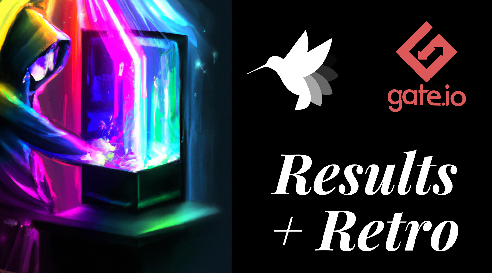
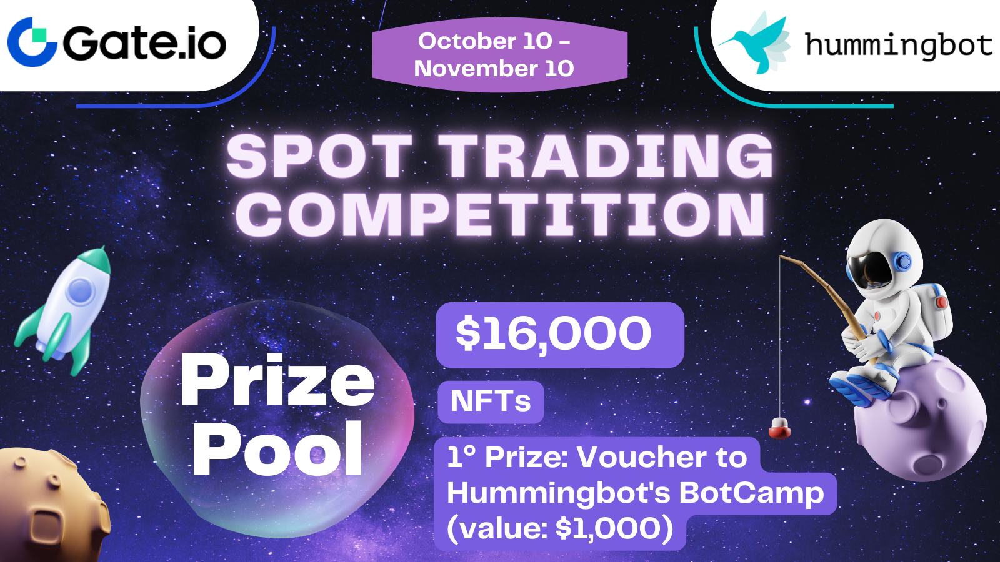

# Gate.io Trading Competition: Results and Retrospective

Last month, we partnered with [Gate.io](http://gate.io/) to organize a [Trading Competition](https://hummingbot-foundation.notion.site/Event-Gate-io-Oct-2022-dd02263e66a8467f9744866141087714) for the Hummingbot community. The goal was to conduct an experiment to see if these types of promotions would be mutually beneficial for the Hummingbot community and the exchange itself.

Here are the results of the competition, which ran for one month from October 10 to November 10:

* **408** average weekly participants
* **$10.2M** total traded volume
* **$4,991** in total fees to Gate.io

<!-- more -->

See [this spreadsheet](https://docs.google.com/spreadsheets/d/1FcpKl6O4tySLJChju8blo9nM_kj7XIo7c3Ubxyr6JuQ/edit?usp=sharing) for the trading competition data that we received from Gate.

**Congratulations to the 12 winners from the competition! You will receive an email from us shortly with next steps.**

---

However, there was a misunderstanding with Gate.io which led us to promoting a total prize pool of $16,000 in the banner announcement below.

After the competition had ended, Gate.io clarified to us that the $16,000 referenced was actually the maximum amount, and that the prize pool would actually be limited to **10% of fees generated by users** who participated in the competition, as described in the materials they provided to us below:

[Hummingbot co-marketing update](Hummingbot-co-marketing-update.pdf)

Trading competition terms provided by Gate.io
Hummingbot co—marketing update.pdf 51 KB
This cumulative prize pool amount turned out to be **$1,279.20** during the competition period, which Gate.io has sent to us for distribution.

---

As a not-for-profit open source foundation, earning and keeping the trust of the community is one of our top objectives. Therefore, we are concerned that  some participants in the trading competition may have done so under the impression that the actual prize pool would actually be $16,000, rather than "up to $16,000" as described in the Gate.io materials.

Therefore, Hummingbot Foundation has decided to supplement the prize pool by providing all 12 winners with a free voucher ($1000 value each, $12,000 value total) to attend [Hummingbot Botcamp](../../../botcamp/index.md), our new developer bootcamp.

Botcamp is a 4-week intensive course that aims to teach a small cohort of students practical, hands-on quant market making. The first cohort is already full and the waiting list is already filling up for future cohorts, so providing this additional compensation to the Gate.io competitions winners comes with substantial cost to us. However, we believe that it's the right thing to do.

In addition, we will allocate the total $1,279.20 cash pool provided to us by Gate.io, which equals 10% of fees generated over the period, to the 12 winners based on each person’s percentage of their total traded volume. Gate.io may issue additional rewards such as NFTs and other rebates on their platform to the winners.

**Each winner needs to follow the instructions sent by Gate.io, and contact us via email before December 31st, 2022, with your TRC 20 wallet address in order to receive their share of the prize pool, along with instructions for signing up for Botcamp.**

---

This incident served as important lesson for Hummingbot Foundation to be circumspect in running promotions with partners.

Extra vigilant in creating trading competitions with exchanges and communicating their terms to the community. While we are open to future initiatives, for now, we will pause all promotional partnerships with exchanges.

We want to thank our strong community for your understanding and support.