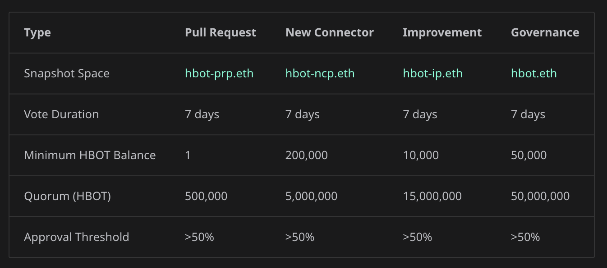
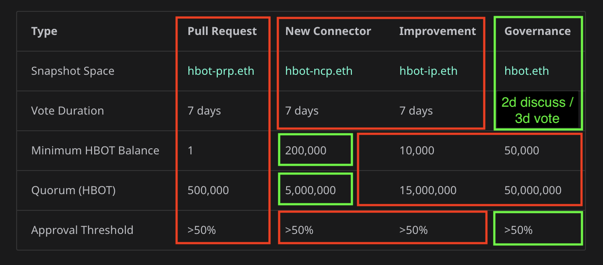

# Proposal: Simplifying Hummingbot Governance

*By [Michael Feng](https://x.com/fengtality), co-founder of Hummingbot*

The vesting period for all HBOT token holders has now ended, including all CoinAlpha investors, Foundation team members, and CoinAlpha team members. Fully vested, HBOT's circulating supply stands at 666,576,768 HBOT, with the Foundation holding the remaining 333.4M HBOT tokens in treasury. If you need to claim your tokens from the vesting contract, see [How to use your HBOT TokenVesting contract](https://hummingbot-foundation.notion.site/How-to-use-your-HBOT-TokenVesting-contract-1e653c0c510245a584b32f99ab347cd0).

From the start, the Hummingbot Foundation's goal has been to create a sustainable open source project that earns revenues from exchanges and pays community maintainers to build and maintain connectors to their platforms, as outlined in the original [Hummingbot Foundation whitepaper](../../../about/whitepaper.md).

The Foundation's primary role is to coordinate the ongoing maintenance and improvement of the open source Hummingbot codebase via a decentralized set of actors: **Exchanges**, **Contributors**, and **Users**.

<!-- more -->

## The Long Journey to Financial Sustainability

In [State of the Foundation 2024](../state-of-the-foundation-2024/index.md), I reported that the Foundation had not yet achieved financial sustainability, with net losses in both 2022 and 2023. However, our approach of keeping operational expenses low while improving the codebase to drive usage into exchange connectors is now bearing fruit.

| End of Year | Total Revenues | Total Expenses | Net Income |
|-------------|----------------|----------------|------------|
| 2022 | $423,392 | $612,052 | -$188,660 |
| 2023 | $309,466 | $415,078 | -$105,613 |
| 2024 | $389,908 | $421,423 | -$31,515 |
| 2025 (thru Oct) | $412,769 | $308,310 | +$104,459 |

2025 has been a strong year for the Foundation due to:

1. **Growing fee share from top exchanges**: Partner exchanges continue to generate increasing volumes through Hummingbot users, and the Foundation has integrated with new exchanges like Bitget
2. **Bounties management services**: The Foundation has expanded its services to help new exchanges manage connector development and maintenance via [bounties](../../../bounties/index.md)
3. **Platform maturation**: Hummingbot has migrated from a CLI client to an open source ecosystem for algorithmic trading, with [Hummingbot API](../../../hummingbot-api/index.md) as the command center running on a cloud server and [Condor](../../../condor/index.md) Telegram bot as the primary client. This makes Hummingbot's entire suite of exchanges and bot strategies more accessible than ever.

The Foundation is becoming a publicly-owned, sustainable non-profit organization. [HBOT Tracker](https://docs.google.com/spreadsheets/d/1UNAumPMnXfsghAAXrfKkPGRH9QlC8k7Cu1FGQVL1t0M/edit?usp=sharing) contains detailed financials for each year of operation, as well as other information about Foundation operations.

This financial stability provides the foundation to improve and simplify our governance system. The current system, while well-intentioned, has become overly complex with 4 proposal types, quarterly polls, and varying parameters that create confusion for HBOT holders.

## Current System Complexity

Currently, HBOT holders must navigate four different proposal types, each with their own Snapshot space, quorum requirements, and minimum balance thresholds:

As shown above, the Foundation currently maintains:

- **Pull Request Proposals (PRP)** - hbot-prp.eth
- **New Connector Proposals (NCP)** - hbot-ncp.eth
- **Improvement Proposals (HIP)** - hbot-ip.eth
- **Governance Proposals (HGP)** - hbot.eth

In addition, HBOT holders are expected to participate in quarterly Polls to determine which connectors are included in the codebase. Each quarter, there are three separate polls (CLOB CEX, CLOB DEX, and Gateway DEX), each lasting 14 days.

This fragmentation creates overhead for voters, makes governance harder to follow, and dilutes participation across multiple spaces.

## Proposed Changes

The diagram below illustrates the proposed simplification, with elements being removed outlined in red and elements being retained or modified highlighted in green:

### 1. Consolidate to Single Proposal Type (HGP)

The goal is to create a streamlined governance system that empowers the community to make key decisions efficiently. I propose eliminating PRPs, NCPs, and HIPs, leaving only **Hummingbot Governance Proposals (HGP)** as the single proposal type. All governance decisions would go through the main [hbot.eth](https://snapshot.org/#/hbot.eth) Snapshot space.

All major decisions that impact the Hummingbot Foundation and the open source Github repositories it maintains under [github.com/hummingbot](https://github.com/hummingbot), including but not limited to:

- **Adding a connector** for a new CEX, DEX, or blockchain network (proposal must include a link to the pull request). Example: [NCP-25: Add Foxbit Exchange Connector](https://snapshot.org/#/hbot-ncp.eth/proposal/0x01022a516c3536d015e21b28e90204a7dbc4a65b42c0e2d568847509f7531e6a)
- **Funding a bounty** to improve the codebase - fixing bugs, adding connectors, adding strategies, etc (may be retroactive). Example: [HIP-36: Bounty to Build OKX Perp connector](https://snapshot.org/#/hbot-ip.eth/proposal/0x750af518b682603bec2ca1ce597501d4bbad851eb9b8735da61efa4a50e0b2f4)
- **Removing a connector** for an existing exchange or blockchain network
- **Implementing programmatic $HBOT buy-backs** or other token-related initiatives.
- **Electing Board of Directors** annually.

| Parameter | Value |
|-----------|-------|
| Snapshot Space | [hbot.eth](https://snapshot.org/#/hbot.eth) |
| Discussion Duration | 2 days (in Discord) |
| Vote Duration | 3 days (in Snapshot) |
| Minimum HBOT Balance | 200,000 |
| Quorum (HBOT) | 5,000,000 |
| Approval Threshold | >50% |

This simplification means:

- One place to check for all proposals
- Consistent parameters across all votes
- Easier for new community members to participate
- Reduced administrative overhead

### 2. Structured Discussion + Voting Flow

Switch from a single 7-day voting window to a structured discussion + voting flow:

**Discussion Phase (2 days minimum)**

- The proposer must create a "temperature check" thread in the **#proposals** channel on Discord
- This thread must be posted at least 48 hours before the Snapshot vote goes live
- The community uses this time to comment, suggest revisions, or surface issues

**Voting Phase (3 days)**

- After at least 48 hours of discussion, the proposer may open the Snapshot vote
- Snapshot voting lasts 72 hours

**Total minimum time per proposal: ~5 days** (2 days discussion + 3 days voting, instead of the previous 7-day vote-only process)

**Rationale:**

- **Better proposals**: Encourages feedback and refinement before voting begins
- **Faster governance**: Reduces decision time from 7 days to 5
- **Higher participation**: Shorter voting periods reduce voter fatigue and increase the likelihood of timely participation
- **Clearer expectations**: Every proposal follows the same structured flow

### 3. Remove Quarterly Polls

The quarterly connector polls have served their purpose in establishing which connectors should be prioritized, but they add complexity to an already complex system. Going forward, connector inclusion and removal can be handled through standard HGP proposals.

**Rationale:**

- **More flexibility**: Enables the community to add/remove connectors at any time rather than waiting for a quarterly poll cycle
- **Less limitation**: Hummingbot should support as many exchanges as possible, not cap the number included per quarter
- **Simplifies governance**: A single, consistent proposal type is easier for contributors and voters to understand
- **No per-exchange maintenance budget needed**: Since users can propose HBOT bounties for any connector, a fixed per-exchange maintenance allocation is no longer necessary

### 4. Streamlined Board of Directors

Change Board of Directors meetings from **4x per year to at least once per year**.

The Board's main role would be approving an **annual budget** for Foundation operations (projected revenues vs expenses) once per year.

**Rationale:**

- **Clarifies Board role**: Currently, Board responsibilities are [unclear](../../../about/board.md). This change defines a clear, focused responsibility: annual budget approval
- **Unpaid positions**: Board members serve without compensation, so reducing meeting frequency respects their time commitment
- **Aligns with nonprofit norms**: Most nonprofit boards meet annually to approve budgets, providing proper oversight without excessive administrative burden

## Next Steps

I will present these proposed changes at the next monthly community call and create a discussion thread in the **#proposals** channel on [Discord](https://discord.gg/hummingbot). Following the 2-day discussion period, the proposal will be created on Snapshot for voting.

My goal is to build an easy-to-use governance system that empowers HBOT holders to steer the direction of Hummingbot. If this proposal passes, the current system with 4 proposal types, 4 Snapshot spaces, and quarterly polls would be replaced by a single **Hummingbot Governance Proposal (HGP)** type. HBOT holders would have the power to add or remove exchange and blockchain connectors, fund bounties to improve the codebase, implement programmatic buy-backs and other token initiatives, and elect the Board of Directors who approve the Foundation's annual budget.
