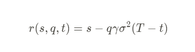
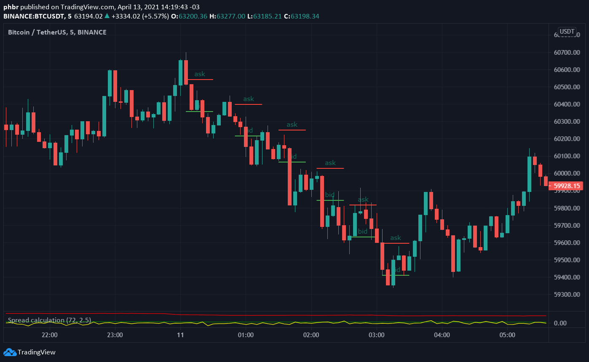
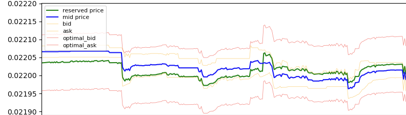
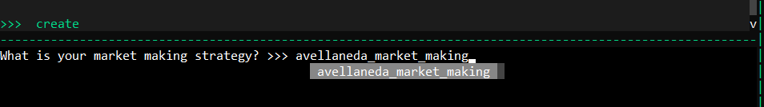
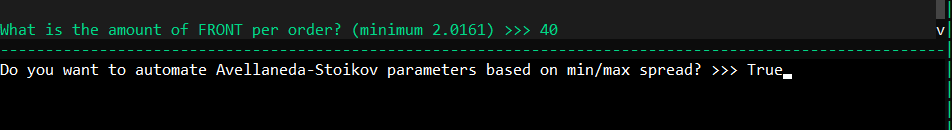
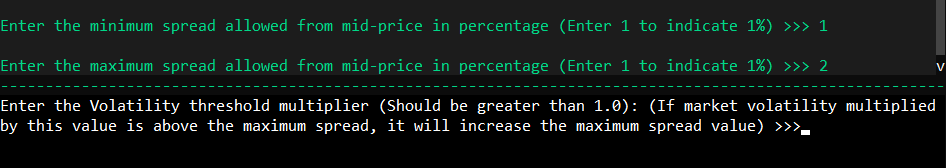
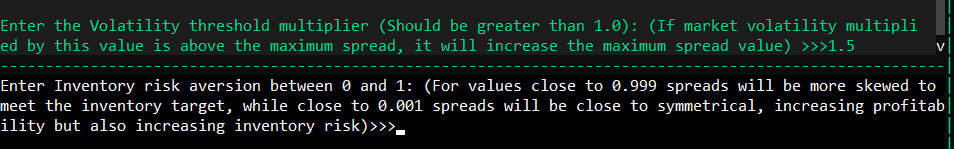
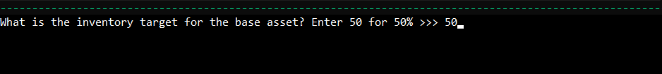
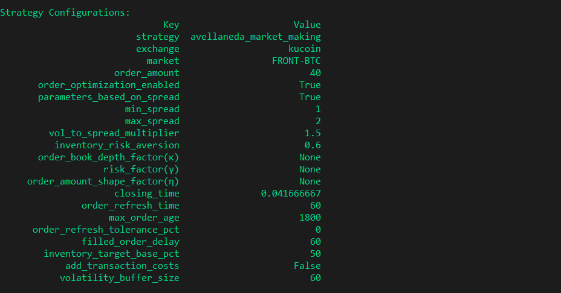

# Guide to the Avellaneda & Stoikov Strategy

Welcome back to the Hummingbot Academy!

The latest Hummingbot release (0.38) introduces an exciting strategy based on classical academic market-making models. This article will delve into the Avellaneda & Stoikov paper from 2008 and its implementation in Hummingbot.

For those who enjoy in-depth scientific papers, the original publication is readily accessible online or directly [here](https://www.researchgate.net/publication/24086205_High_Frequency_Trading_in_a_Limit_Order_Book).

<!-- more -->

Today we will explore:

*   The Avellaneda & Stoikov market-making model
*   Inventory risk management
*   Optimal bid & ask spread determination
*   Implementation in Hummingbot

## Understanding the Avellaneda & Stoikov Model

The model addresses two primary concerns of market makers:
* Inventory risk management
* Optimal bid and ask spread determination

Avellaneda & Stoikov propose formulas aiding market makers in addressing these challenges.

**Reservation price:**

**Optimal bid & ask spread:**

Where,

*   s = current market mid-price
*   q = inventory quantity of base asset (positive/negative for long/short positions)
*   σ = market volatility
*   T = normalized closing time (1)
*   t = current time as a fraction of T
*   δa, δb = symmetrical bid/ask spread
*   γ = inventory risk aversion parameter
*   κ = order book liquidity parameter

This article simplifies these formulas and their meanings. Stay tuned for an upcoming article with more technical details.

## Reservation Price Explained

Traditional market making involves symmetrical bid and ask orders around the market's mid-price. However, this can lead to inventory skewing, potentially putting the trader at risk if the asset value moves unfavorably.

For example, in a BTC-USDT downtrend using a symmetrical strategy, the market maker ends up accumulating BTC, decreasing the total inventory value.

Avellaneda & Stoikov's approach calculates a new reference price for order placement, considering:

#### Inventory Position Deviation (q)

The value of q in the formula represents the deviation from the target inventory. For example:
*   At q = 0, the reservation price equals the market mid-price;
*   At q < 0, the trader is short, raising the reservation price to favor buy orders;
*   At q > 0, the trader is long, lowering the reservation price to favor sell orders.

Hummingbot calculates q based on your specified target inventory percentage.

#### Inventory Risk Tolerance (γ)

This parameter, set by the trader, indicates willingness to take inventory risk. A near-zero γ means the reservation price is close to the market mid-price, similar to a symmetrical strategy. As γ increases, the reservation price adjusts more aggressively to match inventory targets.

In Hummingbot, γ can be manually set or automatically calculated.

#### Remaining Trading Session Time (T-t)

Considering traditional financial markets with defined trading sessions, this model adjusts the reservation price closer to the mid-price as the session end approaches, minimizing inventory risk.

Hummingbot allows setting the trading session duration, adapting the model for 24/7 cryptocurrency markets.

Note: Avellaneda & Stoikov also propose an infinite horizon model, more suitable for continuous markets, which we plan to include in future releases.

Market volatility (σ) also influences the reservation price but is not a trader-defined factor. Increased volatility widens the gap between the reservation and mid-prices.

## Determining the Optimal Spread

The model's second aspect focuses on the optimal order book positioning for profitability.

Here, the reservation price factors (γ and (T-t)) reappear, with the addition of:

#### Order Book Liquidity (κ)

While the paper delves into mathematical details, the key takeaway is that a high κ value indicates denser order books, requiring smaller spreads. Conversely, a low κ suggests less liquidity, allowing for wider spreads.

## Combining Reservation Price and Optimal Spread

The model's execution logic is straightforward:

1. Calculate the reservation price based on target inventory.
2. Determine the optimal bid and ask spread.
3. Place market orders around the reservation price:
    * Bid price = reservation price - half of optimal spread
    * Ask price = reservation price + half of optimal spread

This dynamic is illustrated below:

The calculated reservation price (green line) often deviates from the market mid-price (blue line). The reservation price adjusts based on inventory, influencing order placement relative to the mid-price.

## Parameter Calculations

The key factors in the Avellaneda-Stoikov model are:

1. Inventory position (q)
2. Remaining trading session time (T-t)
3. Risk factor (γ)
4. Order book depth (κ)

For each, the associated Hummingbot parameter is:

1. **Inventory Distance (q):** Reflects the difference between current and target inventory. In Hummingbot, set your asset inventory target percentage, and the bot calculates q.
2. **Session Time (T-t):** Adapts the model for the non-stop nature of cryptocurrency markets. Define your desired trading session duration in Hummingbot.
3. **Risk Factor (γ) & Order Book Depth (κ):** While the paper doesn't specify calculations for these, Hummingbot's "easy mode" automatically determines them based on desired spread limits. Alternatively, set `config parameters_based_on_spread` to `False` and manually input values using `config order_book_depth_factor` and `config risk_factor`.

## Configuring Hummingbot

Creating the strategy in Hummingbot involves the `create` command and specifying `avellaneda_market_making` as the strategy name.

After selecting the exchange and trading pair, decide whether to let Hummingbot calculate the risk factor and order book depth.

Set your maximum and minimum desired spreads, which define the limits for the calculated optimal spread.

The risk aversion parameter dictates your inventory risk preference. A value close to 1 indicates a conservative approach.

Finally, specify your inventory target percentage, determining how much of your total inventory should be in the base asset.

Additional configurations in Hummingbot include `closing_time` (session duration) and `volatility_buffer_size` (data timeframe for volatility calculation).

## Final Thoughts

Optimal market-making strategies have been a focus of academic research for decades. With high-frequency trading (HFT) playing a significant role in today's markets, there's much for our team to explore. If you have an intriguing model to suggest, join us on Discord!

## Join Our Community

Join our [Discord channel](https://discord.com/invite/hummingbot) to engage with fellow market makers and arbitrageurs. Follow us on [Twitter](https://twitter.com/hummingbot_io) and [Reddit](https://www.reddit.com/r/Hummingbot/) for updates and news. Don't miss our content on market making, including interviews with professional traders, on our [Youtube Channel](https://www.youtube.com/channel/UCxzzdEnDRbylLMWmaMjywOA?sub_confirmation=1).
