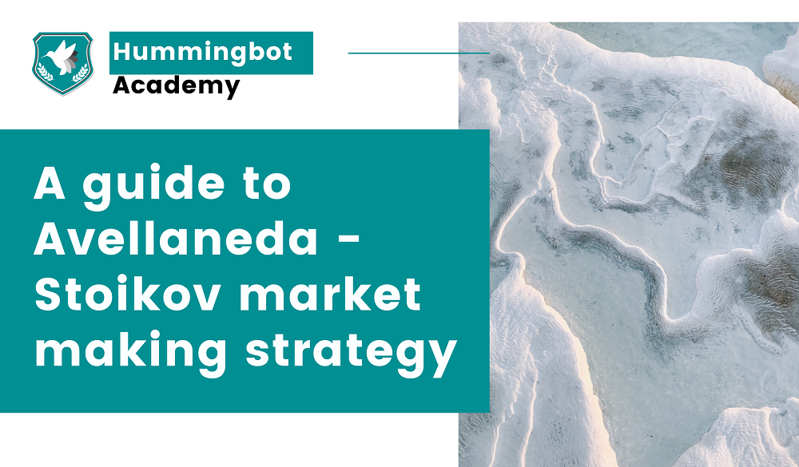

# Guide to the Avellaneda & Stoikov Strategy

Welcome back to the Hummingbot Academy!

A brand new strategy arrived with the latest Hummingbot release (0.38). It is fascinating for us because it is the first Hummingbot configuration based on classic academic papers that model optimal market-making strategies.

This article will explain the idea behind the classic paper released by Marco Avellaneda and Sasha Stoikov in 2008 and how we implemented it in Hummingbot.

But suppose you have fun reading intricate scientific papers (I do!). In that case, the original article is easy to find on a quick internet search, or you can find the original publication [here](https://www.researchgate.net/publication/24086205_High_Frequency_Trading_in_a_Limit_Order_Book).

<!-- more -->

Today we will be discussing:

*   What is the Avellaneda & Stoikov market-making model
*   How the model deals with inventory risk
*   What is the proposed optimal bid & ask spreads
*   How the strategy was implemented in Hummingbot

## A brief explanation about the model proposal

In their introduction, Avellaneda & Stoikov talk about a market maker's two main concerns:
* Dealing with inventory risk
* Finding the optimal bid and ask spreads.

After going through some mathematical modeling, they arrive at two formulas that help market makers solve these problems.

**Reservation price:**

**Optimal bid & ask spread:**

Where,

*   s = current market mid price
*   q = quantity of assets in inventory of base asset (could be positive/negative for long/short positions)
*   σ = market volatility
*   T = closing time, when the measurement period ends (conveniently normalized to 1)
*   t = current time (T is normalized = 1, so t is a time fraction)
*   δa, δb = bid/ask spread, symmetrical → δa=δb
*   γ = inventory risk aversion parameter
*   κ = order book liquidity parameter

If you don’t know what any of this means, don’t worry. This article will simplify what each of these formulas and values means.

But if you are looking for more information about how everything works backstage, stay tuned because we will also publish another article with more technical details.

## What is the reservation price?

The basic strategy for market making is to create symmetrical bid and ask orders around the market mid-price. 

But this kind of approach, depending on the market situation, might lead to the market maker inventory skewing in one direction, putting the trader in a wrong position as the asset value moves against him.

For example, if the BTC-USDT market price enters a downtrend and the trader uses the symmetrical approach, his buy orders will be filled more often than the sell orders. At the end of the day, the market maker will be loaded with BTC, and his total inventory will have a smaller value.

Avellaneda & Stoikov approach the inventory risk problem by calculating a new reference price where the buy and sell orders will be created around, based on three main factors:

#### How distant is the trader’s current inventory position is from the target position? (q)

The value of q on the formula measures how many units the market maker inventory is from the desired target. 

For example, if the trader’s target is to have a 50-50 inventory, the value of q will change every time the inventory moves in one direction or another:

*   When q = 0 (current inventory = target inventory), the reservation price will be equal to market mid-price; 
*   When q &lt; 0, the trader is short on the asset, and the reservation price will be higher than market mid-price, increasing the chance of a buy order is filled;
*   When q > 0, the trader is long on the asset, and the reservation price will be lower than market mid-price, increasing the chance of a sell order is filled;

On Hummingbot, the value of q is calculated based on the target inventory percentage you are aiming for.

#### How much inventory risk does the trader wants to take? (γ)

This parameter is a value that must be defined by the market maker, considering how much inventory risk he is willing to be exposed.

If γ value is close to zero, the reservation price will be very close to the market mid-price. Therefore, the trader will have the same risk as if he was using the symmetrical price strategy.

But as its value increases, the distance between the mid-price and the reservation price will increase when the trader inventory is different from his target.

On Hummingbot, you can set the value of γ by yourself or let the bot calculate in an automated way. 

#### Time until the trading session ends (T-t)

The model was created before Satoshi Nakamoto mined the first Bitcoin block, before the creation of trading markets that are open 24/7.

That way, Avellaneda & Stoikov added the trading session terminal time (T), and as they wrote themselves:

> _The agent’s objective is to maximize the expected exponential utility of his P&L profile at a terminal time T._

To put it simply, as the trading session is nearing the end, the reservation price will approach the market mid-price, reducing the risk of holding the inventory too far from the desired target.

On Hummingbot, you can define (in days or fraction of a day) how long the “trading sessions” will take.

> Note: Avellaneda & Stoikov also considers a model where the trading session has an infinite horizon. We agree that this infinite horizon model would make more sense for cryptocurrency markets, and we plan to add it to a future release.

You might have noticed that I haven’t added volatility(σ) on the main factor list, even though it is part of the formula. That is because volatility value depends on the market price movement, and it isn’t a factor defined by the market maker. If the market volatility increases, the distance between reservation price and market mid-price will also increase.

## What is the optimal spread?

The second part of the model is about finding the optimal position the market maker orders should be on the order book to increase profitability.

As you can see on the second formula, two of the factors incorporated on the reservation price formula (γ and (T-t)) also appears in the calculation of the best total spread (δa + δb), and a new factor is incorporated:

#### What is the order book liquidity/density (κ)

There is a lot of mathematical detail on the paper explaining how they arrive at this factor by assuming exponential arrival rates. There are many different models around with varying methodologies on how to calculate the value.

But for now, it is essential to know that using a significant κ value, you are assuming that the order book is denser, and your optimal spread will have to be smaller since there is more competition on the market.

On the other hand, using a smaller κ, you are assuming the order book has low liquidity, and you can use a more extensive spread.

## Combining reservation price and optimal spread

Here is where the magic happens. The execution logic of the model is pretty simple:

1. Calculate the reservation price based on what is the target inventory
2. Calculate the optimal bid and ask spread
3. Create market orders using the reservation price as reference:
    * Bid offer price = reservation price - optimal spread / 2
    * Ask offer price = reservation price + optimal spread / 2

You can see this dynamic on the graphic below:
 

It’s easy to see how the calculated reservation price (green line) is different from the market mid-price (blue line).

Another feature of the model that you can notice in the above picture is that the reservation price is below the market mid-price in the first half of the graphic. 

This happens because the market maker’s inventory is loaded with the asset that is being traded.

And as you can see, the ask offers will be created closer to the market mid-price since the optimal spread is calculated with the reservation price as reference.

The opposite happens in the second half. The inventory position is flipped, and now the bid offers are being created closer to the market mid-price.

## Calculating the parameters input

Going back a bit on this article, you will remember that we mentioned that there are three main factors the Avellaneda-Stoikov model uses to calculate the reservation price and the optimal spread:

1. Inventory position (q)
2. Time until the trading session ends (T-t)
3. Risk factor (γ)
4. Order book depth (κ)

For each input above, list the associated parameter name in the Avellaneda strategy

**1 and 2 are pretty straight forward: **

_(q) is the inventory distance from the desired inventory target._

This parameter is used to calculate what is the difference between the current inventory position and the desired one.

On hummingbot, you choose what the asset inventory target (set in percentage) is, and the bot calculates the value of q.

_(T-t) is the amount of  time left to the end of the trading session:_

The Avellaneda & Stoikov model was created to be used on traditional financial markets, where trading sessions have a start and an end. 

The reasoning behind this parameter is that, as the trading session is getting close to an end, the market maker wants to have an inventory position similar to when the one he had when the trading session started.

So, as the trading session is getting closer to the end, order spreads will be smaller, and the reservation price position will be more “aggressive” on rebalancing the inventory.

Cryptocurrency markets are 24/7, so there is no market closing time.

Inside hummingbot, you set how many hours you want it to consider as a trading session cycle, be it 1 hour or 24 hours.

**3 and 4 are a bit… complicated...**

Reading the paper, you won’t find any direct indication of calculating these two parameters’ values. This is because it isn’t the paper’s focus (but you could look at the article references to find out what is behind them).

But if you don’t want to figure out how to calculate them, we also added an “easy” mode to the strategy: You can tell the bot to automatically calculate these values based on the maximum and minimum spread values you want

If you are curious about how they are calculated, stay tuned for the article detailing what is happening behind the curtain.

This is the default mode when you create a new strategy, but if you have your model to determine these values, you can deactivate the “easy” mode by setting `config parameters_based_on_spread` to `False`.

After that, use `config order_book_depth_factor` and `config risk_factor` to set your custom values.

## Setting up Hummingbot

Time to create the strategy!

As usual, you can create a new strategy on Hummingbot using the `create` command. Since this is a market-making strategy, some configurations will be similar to the pure market-making strategy, so we will cover what is different in this article.

Starting with the strategy name, you have to enter `avellaneda_market_making` to use this new strategy.

After choosing the exchange and the pair you will trade, the next question is if you want to let the bot calculate the risk factor and order book depth parameter. If you set this to `false`, you will be asked to enter both parameters values.

You will be asked the maximum and minimum spread you want hummingbot to use on the following two questions.

This will set “boundaries” to the calculated optimal spread, so hummingbot will never create your orders with a spread smaller than the minimum nor bigger than the maximum.

The volatility multiplier is a trigger for extreme volatility situations. If the market volatility increases above the `maximum spread * volatility multiplier` value, the bot will “expand” your maximum spread to take advantage of the increased volatility.

With the risk aversion parameter, you tell the bot how much inventory risk you want to take. A value close to 1 will indicate that you don’t want to take too much inventory risk, and hummingbot will “push” the reservation price more to reach the inventory target.

The last question asks for your inventory target percentage. Note that this is how much % of the total inventory value you want to have allocated on the base asset. For example, if you are trading BTC-USD but want to focus on keeping your inventory 100% on BTC, you set this value to 100.

If you want to end the trading session with your entire inventory allocated to USDT, you set this value to 0.

After creating the strategy, here are a few other new configurations you can change on the bot:

`closing_time` - Here, you set (in days) how long each “trading session” will take. This affects the (T-t) parameter we mentioned earlier.

`volatility_buffer_size` - This indicates to hummingbot how many seconds will be used to populate the data to calculate market volatility. It is important to note that before the bot starts to create orders, it will take this many seconds to store the price data needed for the calculation.

## Final thoughts

Optimal strategies for market makers have been studied by academic researchers for a very long time now, with Thomas Ho and Hans Stoll starting to write about market dealers dynamics in 1980.

There are many exciting models out there with different approaches, and with HFTs dominating the market-making scene in the last years, there is a lot for our team to explore.

If you have an interesting model that could be interesting for our team to look at, just reach us on our Discord!

## Join our community

Our community is full of market makers and arbitrageurs who are willing to help each other make the best use of Hummingbot. You can join our [Discord channel](https://discord.com/invite/2MN3UWg) to talk about the hummingbot, strategies, liquidity mining, and anything else related to the cryptocurrency world and receive direct support from our team.

To keep up with the news and updates, make sure to follow us on [Twitter](https://twitter.com/hummingbot_io) and our Community on [Reddit](https://www.reddit.com/r/Hummingbot/).

You can find a lot of content about market making on our [Youtube Channel](https://www.youtube.com/channel/UCxzzdEnDRbylLMWmaMjywOA?sub_confirmation=1),  including interviews with professional traders and news about cryptocurrency-related events.