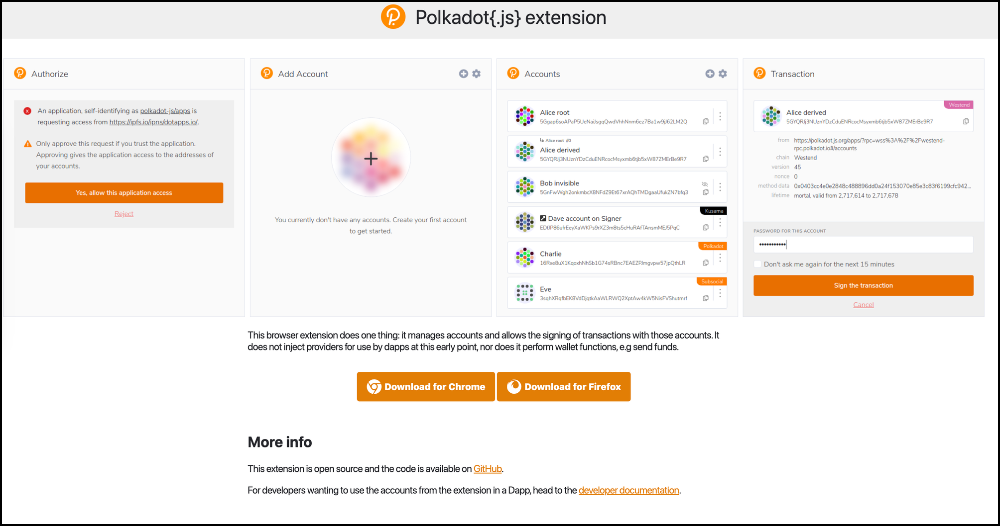
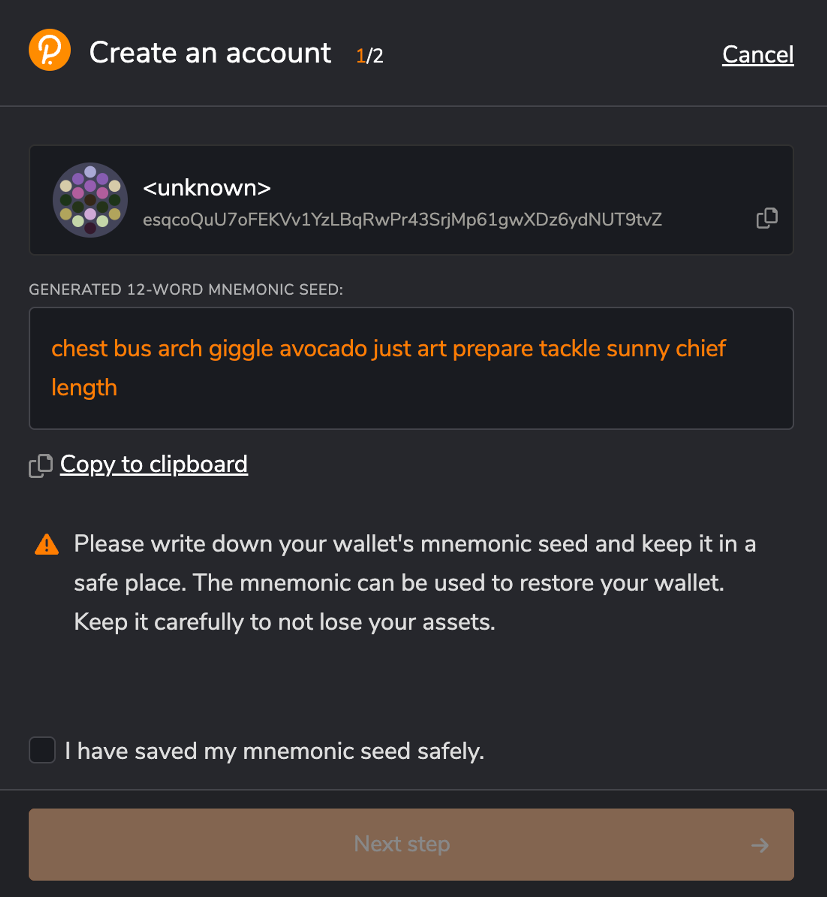
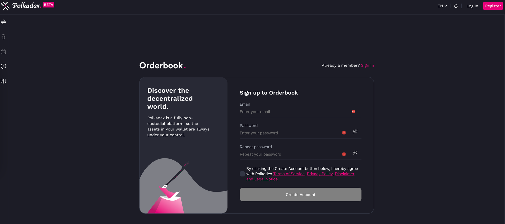
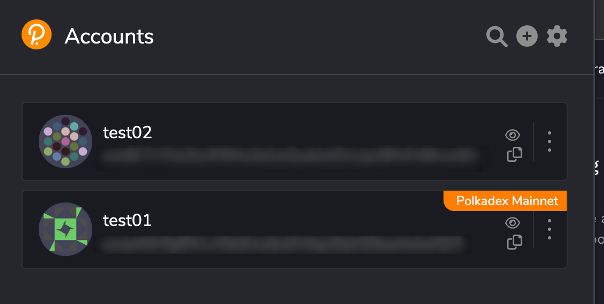
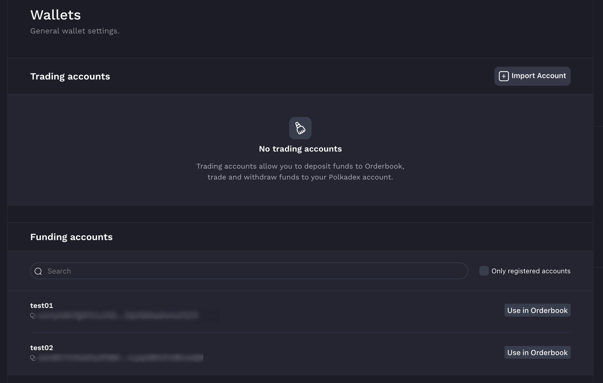
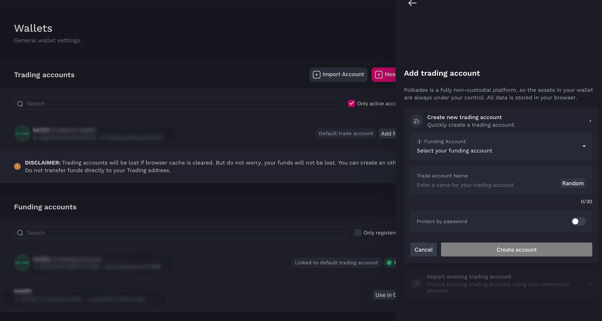
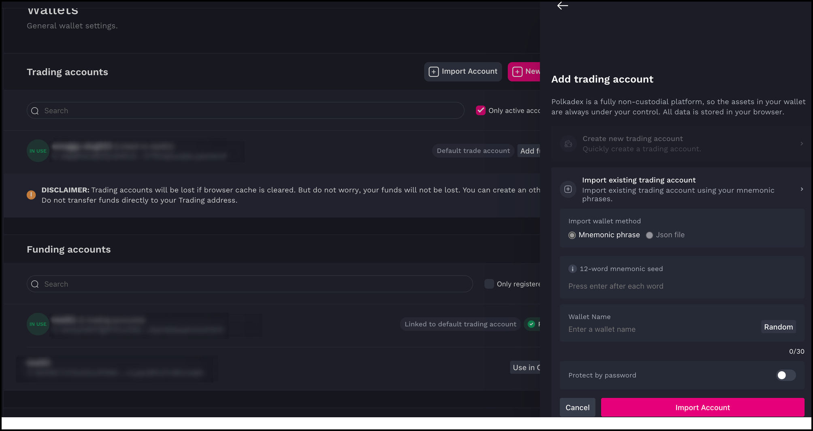
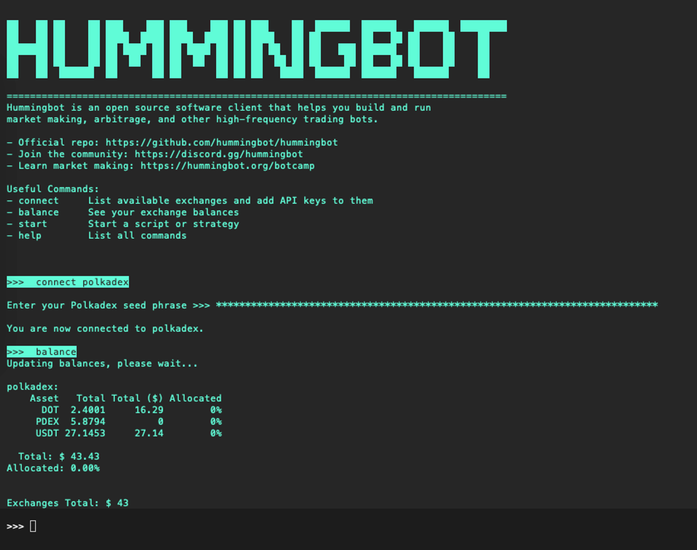

# User Guide: Using Polkadex with Hummingbot


## Introduction

Here's a step-by-step guide on how to create your Polkadex wallet and start your journey using Hummingbot!

<!-- more -->

## Prerequisites

## Install the Polkadex Extension

First things first, let's set up your Polkadex extension by visiting [polkadot.js.org/extension/.](https://polkadot.js.org/extension/)





Ensure the security of your wallet by keeping a copy of the mnemonic seed in a safe location.

## Register Your Account on Polkadex

Now, let's get you registered on Polkadex:

- Visit [orderbook.polkadex.trade/.](https://orderbook.polkadex.trade/)
- Create an account by providing the necessary details.



## Register Your Funding Account

Your Polkadex extension accounts will serve as your funding accounts. Here's how to set it up:

- Select your preferred account on the Polkadex extension.

  

  

- Your accounts will be visible on the Polkadex exchange. Click "Use in Orderbook" for the account you wish to select.

## Import Your Trading Account

Let's generate your trading account seed:

- Visit [orderbook-internal.polkadex.trade/.](https://orderbook-internal.polkadex.trade/)
- Create a new trading account, select the funding account, and provide a name.

  

- Once created, you'll receive a mnemonic passphrase. Go back to [orderbook.polkadex.trade/](https://orderbook.polkadex.trade/), import the account using the mnemonic phrase.

  


## Add Balances and Start Trading

You're almost there! Now, let's add some balances:

- Navigate to the "Balances" tab on [orderbook.polkadex.trade/.](https://orderbook.polkadex.trade/)
- Deposit your preferred tokens and get started with Hummingbot!


## Install Hummingbot


### Connect your Polkadex Wallet to Hummingbot



- Execute the following command to connect Hummingbot and add your Polkadex trading seed phrase

```
connect polkadex

```

- Execute "balance" command to check your assets 
- Launch your preferred trading strategy!


For more detailed information, check out [docs.polkadex.trade/polkadexOrderbookFAQHowToTransferDeposits.](https://docs.polkadex.trade/polkadexOrderbookFAQHowToTransferDeposits/)


Happy trading on Polkadex! 🚀