# How to Trade Crypto

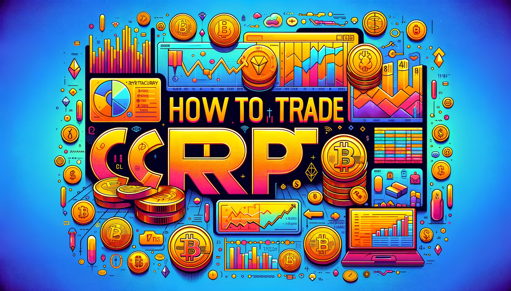

*by Tsalkapone*

Crypto trading has been in a frenzy lately and many investors are looking for ways to participate in the crypto market. There are several ways to gain profit from cryptocurrency and various methods to do so. If you exclude crypto mining from the equation, which is a whole different method of crypto-acquiring process, the steps that one would need to follow to enter the crypto market are the following:

- Make an account in a crypto exchange
- Determine your trading method
- Fund your account
- Pick a token to invest in
- Analyze marketing trends and indicators
- Choose your strategy

In this topic we will elaborate each of the steps mentioned above presenting the main aspects that a new trader should take into consideration before making a decision.

<!-- more -->

### **Step 1: Create an account in a crypto exchange**

Picking the right crypto exchange to open an account is a crucial factor for your crypto investment. Of course, the term “right” doesn’t apply to this choice as there is arguably no exchange that excels all others in all aspects to be considered.

When picking a crypto exchange you need to compare the following essential factors:

- Transparency
- Trading fees (taker and maker, altcoins and stablecoins)
- Funding and withdrawal fees
- Volume and exchange token discounts
- Total trading volume & liquidity
- Total crypto assets

When picking a crypto exchange it is important to pick a widely known exchange or at least a transparent one. Don’t pick an exchange due to its low fees. Make sure there is efficient support (not just chat bots), a way to communicate, a valid address mentioned in its site and do look it up for comments or reviews. Cryptocurrency attracts many scammers as well and you should be able to distinguish a possible one.

At this point you have to consider trading fees as a “taker” or “maker”.

A “taker” is a trader that places an order that is immediately filled in its entirety and you pay a “taker fee” for this. When you are a “taker” you take the price you want, right now, by buying or selling limit orders sitting on the books or market price. Usually a taker’s fee is higher than a maker’s.

A “maker” is a trader that places an order that doesn’t fill immediately (like a limit order). When you “make” an order you place an order and wait for it to be filled partially or fully. This terminology comes from the fact that placing limit orders on the books helps to “make the market”.

Also, beware to check for respective fees for altcoins and large market cap assets since many exchanges distinguish fees into these categories as well.

When it comes to fees you shouldn’t neglect the funding and withdrawal fees. You don’t want to see unexpected fees when you liquidate your profits.

Apart from fees, another essential factor for choosing an exchange is the average **liquidity** and trading **volume**. The higher the numbers of these two factors the better. High liquidity and trading volume mean more traffic, more trades and more volatility which conclude in a better market environment for someone who wants to trade.

Another variable for a better trading environment is the **variety of coins**. It goes without saying, that the more crypto assets (coins) an exchange offers for trading the more trading opportunities you have.

A nice spot place to check for these factors can be found in the following link:

[CoinMarketCap – Exchanges ranking](https://coinmarketcap.com/rankings/exchanges/?ref=blog.hummingbot.org)

As we live in the Age of Information I strongly recommend you do a deep research when it comes to exchanges. Read thoroughly, if possible, their terms and conditions of service, watch for the small print, check the supported funding methods of each exchange and whether the exchange offers a debit/credit card. Furthermore, verify the legitimacy of trading crypto assets in your country and whether the exchange has law limitations or your profits are susceptible to taxation. Take into consideration that some exchanges may require identification documents to allow you withdrawals or trading.

[Forbes – Best Crypto Exchanges](https://www.forbes.com/advisor/investing/best-crypto-exchanges/?ref=blog.hummingbot.org)

[Forbes – Cryptocurrency Taxes Advisor](https://www.forbes.com/advisor/taxes/cryptocurrency-taxes/?ref=blog.hummingbot.org)

### **Step 2: Determine your trading method**

Most would think that after you create an account the next step is to fund it and begin trading. Well, yes that’s the reasonable thing to do but the first question to pop up in somebody’s mind at this point would be: “How much money should I begin with?”. In order to answer this question you should determine what your trading method would be.

There two main trading methods. **Investing and trading**.

**Investing** is the process of buying a crypto asset (coin) and waiting for its price to rise. Investors are usually geared for the long-term and are not concerned with short-term price movements. In other words, an investor will bet on the long-term potential of a coin when investing in it, with the intention to sell it (and realize a profit) in a couple of years. An investment doesn’t require advanced marketing skills or thorough analysis on marketing indicators and it is the preferred way to trade crypto for many beginners.

**Trading** on the other hand, is the process of buying and selling crypto assets at a high or low frequency rate (minutes, hours, days or even weeks) depending on the price. The fundamental goal of a trader is to analyze marketing trends and indicators and determine whether to buy or sell a coin with the objective of short-term profits. Market volatility is a critical component of a trader’s decisions and thus they are looking for coins that their prices are extremely volatile in the market. A trader must be able to accept a loss during a trade in favor of a profit in an imminent trade.

There are two main aspects that separate an investor from a trader. One is technical knowledge. A trader requires more technical knowledge and depth in analysis than an investor which means more research, more study and more monitoring. The other factor is time. A trader needs to sacrifice several hours per day to track prices and trends in order to fulfill profitable trading orders while an investor may periodically (usually once or twice a day) check his investment balance to determine whether it’s the right time to sell his assets.

Before you decide whether you plan to be a trader or investor the main question you have to answer is how much time you are willing to spend on crypto trading on a daily basis and how deep you want to dive into technical analysis. If you strive to understand how the market works and how prices may change you should avoid crypto trading as it will result in time consumption and rapid losses.

An investor usually enters with a higher amount than a trader. As the investor expects to accumulate profit over time by waiting for the price to go up this may take a while to happen.

Let’s use XRP crypto asset as an example. XRP is a famous crypto asset that is being regarded as a one of the best crypto tokens to invest in nowadays. One year ago (March ’21) XRP was valued at 0.445 USD and its price when this article was written was 0.759 USD. The price over a period of a year went up by 70.49% which means that if someone had invested 100 USD back in March ’21, his XRP balance would be valued now at 170.49 USD. If someone had invested 1,000 USD he would now have a balance worthy of 1,704.9 USD. It goes without saying that the higher the amount someone invests the more USD he will gain (or lose) depending on the current price. In order to make a substantial profit as an investor you better start with a high amount.

On the contrary, a trader may enter the market with as low as 100 USD. As already mentioned the trader’s goal is to make a small profit from daily transactions. Small profit, though, can accumulate really nicely over time. A trader with a daily profit of 5% (a reasonable profit percentage) earns 5 USD per day. If we assume that he continues to trade with 100 USD value and doesn’t add up the daily profits to his investing portfolio this would end up in a 1.925 USD balance in a period of a year.

To sum up, if you plan to invest in crypto , better use a high amount to enter the market. If your aim is to trade on a daily basis, you may consider entering with a low amount.

### Step 3: Fund your account
After you decide what your trading method will be, you will have to fund your account. The most straightforward method to do so is to connect your bank account. But this may not always be the wisest method to do so as they are alternative methods (wire transfers, funding wallets) that the exchange may support and they usually have lower transaction fees.

Inspect the funding methods carefully and choose the one that will be the most beneficial for you. Watch out for fixed fees apart from percentage fees for every available funding method.

### Step 4: Pick a token to invest in
The first step before starting to make some profit is to pick a crypto asset to invest in. Not every crypto asset is suitable for every trader and strategy and no crypto asset is a golden ticket to guaranteed profit.

Picking a crypto is a process that needs searching and assessment. In the process, you may decide to change the token you are investing in, or invest in more than one type of token. Nevertheless, the process of picking requires some steps of evaluation.

If you decide to invest, rather than trade, in crypto you might consider taking some time and reading the **whitepaper** that accompanies it. A whitepaper is a document that is being released during every initial coin offering (ICO) and details a product’s concept, roadmap, and how it plans to grow in the future. In a few words, a whitepaper is a document that consists of the following information:

- The problem and solution
- Token information and marketplace consideration
- Technical description
- Project timeline
- Team and advisors

[Whitepaper](https://www.investopedia.com/terms/w/whitepaper.asp?ref=blog.hummingbot.org) is not a crypto terminology and is actually a marketing tool written as sales and marketing documents to entice or persuade potential customers to learn more about or purchase a particular product, service, technology, or methodology.

[Here](https://bitcoin.org/bitcoin.pdf?ref=blog.hummingbot.org) you will find the iconic Bitcoin’s whitepaper.

So, a whitepaper is a document presenting a coin’s purpose (problem and solution) and basically, its existence lies in persuading potential customers to invest in it. Is this more important than the market trend? Well, the whitepaper is important to evaluate how strong the purpose of the coin is in terms of attracting new investors. Also, it gives you critical information about the technology behind it, who is backing the project, and who is the creator. Remember talking about XRP previously? A part of its [popularity](https://www.forbes.com/advisor/investing/what-is-ripple-xrp/?ref=blog.hummingbot.org) is attributed to its [whitepaper](https://ripple.com/files/ripple_consensus_whitepaper.pdf?ref=blog.hummingbot.org).

When it comes to the market trend, an investor wants to see the market moving like this:

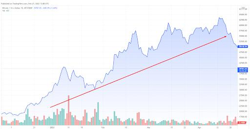

When tracking a coin, an investor should always pay attention to the big picture of the price. The price should be assessed in longer periods of time (3 months, 6 months, or a year) as the investor doesn't really care about the current price but whether the price is [uptrend](https://www.investopedia.com/terms/u/uptrend.asp?ref=blog.hummingbot.org) over time.

On the other hand, a trader uses more versatile techniques to “decipher” the market indicators of a coin. The trading technique is based on the strategy the trader uses.

Generally, a trader prefers a volatile market with uptrends and [downtrends](https://www.investopedia.com/terms/d/downtrend.asp?ref=blog.hummingbot.org) occurring during the day and tries to find the best time to sell or buy. A trader wants to see a market moving like this:

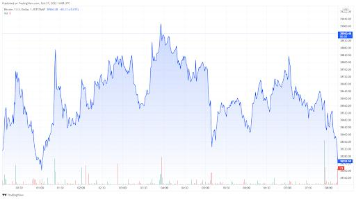

The trader speculates the price changes in shorter periods of time (often less than one hour) and makes decisions based on marketing indicators. Usually, he sells when the price is below the average price, based on historical data, and buys when the price is higher. Ideally, a trader should buy at the lowest point of a trough and sell at the highest point of a peak.

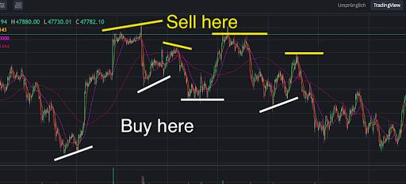

### Step 5: Analyze market trends and indicators

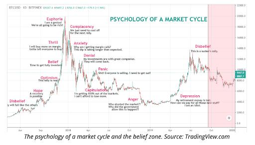

When trading, there is always the possibility of losing or winning. Anyone can sell high and buy low but what if a coin’s price keeps falling and never rises? What if you bought during an uptrend but the price has fallen since and still didn’t reach the initial price you bought at? How can you predict the best time to buy or sell?

Analyzing marketing indicators and trends may answer these questions and increase your profit or inform you that it may be the time to walk away from a coin minimizing your losses.

Generally speaking, the analysis is divided into two big categories: **Fundamental** and **Technical** analysis.

[Fundamental analysis](https://www.investopedia.com/terms/f/fundamentalanalysis.asp?ref=blog.hummingbot.org) looks at the intrinsic value of an asset by evaluating its financial statements and variables while [Technical analysis](https://www.investopedia.com/terms/t/technicalanalysis.asp?ref=blog.hummingbot.org) is the forecasting of future price movements by analyzing past market data, primarily prices and volume.

[Marketing indicators](https://www.investopedia.com/terms/m/market_indicators.asp?ref=blog.hummingbot.org) are a subset of technical indicators and are typically comprised of formulas and ratios. They are often represented in the form of lines, areas, or shapes in a diagram but can also be expressed via numbers. [Trend analysis](https://www.investopedia.com/terms/t/trendanalysis.asp?ref=blog.hummingbot.org) is the technique that attempts to predict future price movements based on historical observed data and depends on marketing indicators.

Whereas trend analysis is often criticized as a bad technical analysis from the aspect that history does not necessarily need to repeat itself and the past does not predict the future, it can come in handy when you are dealing with pricing movements in short periods of time.

Two of the most used indicators for trend analysis are [Relative Strength Index](https://www.investopedia.com/terms/r/rsi.asp?ref=blog.hummingbot.org) (RSI) and [Moving Average](https://www.investopedia.com/terms/m/movingaverage.asp?ref=blog.hummingbot.org) (MA).

The **relative strength index (RSI)** is a [momentum indicator](https://www.investopedia.com/investing/momentum-and-relative-strength-index/?ref=blog.hummingbot.org) used in technical analysis that measures the magnitude of recent price changes to evaluate overbought or oversold conditions in the price of a stock or other asset. The RSI is displayed as an oscillator (a line graph that moves between two extremes) and can have a reading from 0 to 100.

**Moving average** is a calculation used to analyze data points by creating a series of averages of different subsets of the full data set. Moving average (MA) is a stock indicator that is commonly used in [technical analysis](https://www.investopedia.com/terms/t/technicalanalysis.asp?ref=blog.hummingbot.org). In trend analysis, the most famous technique to assess moving averages is [Moving average convergence divergence](https://www.investopedia.com/terms/m/macd.asp?ref=blog.hummingbot.org) (MACD), that shows the relationship between two moving averages of a security’s price. Another essential marketing indicator based on moving averages is [Bollinger Bands](https://www.investopedia.com/terms/b/bollingerbands.asp?ref=blog.hummingbot.org), which is extremely popular among traders in the crypto market.

Most of the indicators are based on historical data and math equations derived from two simple data: **Price** and **trading volume**. When it comes to these two numbers things are easy. Higher trading volume means higher stability and credibility, and lower trading volume means higher volatility. Higher price means sell, and lower price means buy.

One of the most useful price charts is the [candlestick chart](https://www.investopedia.com/trading/candlestick-charting-what-is-it/?ref=blog.hummingbot.org). A candlestick chart displays the market’s open, high, low, and close price for a specified period of time, the lowest being one minute.

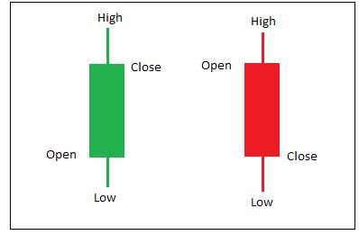

The candlestick has a wide part, which is called the “read body”. This part represents the price range between the open and the close price of a specific period of time. When the real body is filled in black (or green or other color), it means the close was lower than the open. If the real body is empty (or red or other color), it means the close was higher than the open. The colors may be altered by traders based on their trading platform.

The candlestick charts form patterns that may indicate bearish behavior (downtrend) or bullish behavior (uptrend). [Bearish and bullish](https://www.investopedia.com/insights/digging-deeper-bull-and-bear-markets/?ref=blog.hummingbot.org) are terms that are used to express a downtrend or an uptrend market behavior respectively and are widely used terms among market articles and traders. Learning how to break down [candlestick patterns](https://www.investopedia.com/articles/active-trading/092315/5-most-powerful-candlestick-patterns.asp?ref=blog.hummingbot.org) is a substantial criterion in understanding the market trends and putting you in a better trading position.

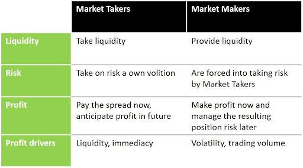

Market makers are the ones to provide liquidity in the market whereas market takers are the ones to take liquidity. Market makers make their profits by charging a spread on the buy and sell price of an asset. The takers pay the asking price for an asset, which is usually higher than the market price. Then, the trade is executed at a bid price. The difference between the market price and the bid-ask price is the spread, which is the profit that the market maker takes in.

Many traders out there are both market makers and takers. When they see a trading opportunity they seize it right away, thus being takers, and when they are awaiting for volatility to occur or expect the price to reach certain levels they place a limit order, thus making them market makers.

### Step 6: Choose your strategy
So, you have picked your trading pair, you have evaluated the indicators and assessed the trend analysis. The last step before you begin making or taking orders is to choose the strategy you plan to follow. Your strategy will vary based on the indicators of a certain period of time and change throughout your trading journey depending on market volatility and trends. But you should have a strategy structure made up in your mind and impose it when the circumstances are met. You don’t want to be that trader who doesn’t know what to do when a [flash crash](https://www.investopedia.com/terms/f/flash-crash.asp?ref=blog.hummingbot.org) occurs.

There are many strategies one may use to trade and anyone can build his own strategy. Some of the most popular strategies are the following:

- **Range trading**

Cryptomarket caps are small enough that they can be manipulated by a single big mover. These moves will systematically attempt to maneuver a coin price up or down causing increased market volatility. When you rage trading, RSI is the most essential indicator to rely on when you are trading. You have to pay attention to overbought and oversold zones in the RSI diagram which will guide you to decide whether to buy or sell. Overbought means that buyers have saturated their need and the stock will probably sell off. Oversold means the opposite.

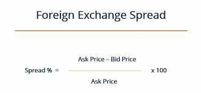

- **Scalping**

[Scalping](https://www.investopedia.com/articles/trading/05/scalping.asp?ref=blog.hummingbot.org) is a trading style that specializes in profiting off of small [price changes](https://www.investopedia.com/terms/p/price-change.asp?ref=blog.hummingbot.org) and making a fast profit off reselling. In day trading, scalping is a term for a strategy to prioritize making high volumes off small profits. A scalper may enter a market with one or many orders, make a profit and quickly exit before a fluctuation changes the market’s sentiment on a coin.

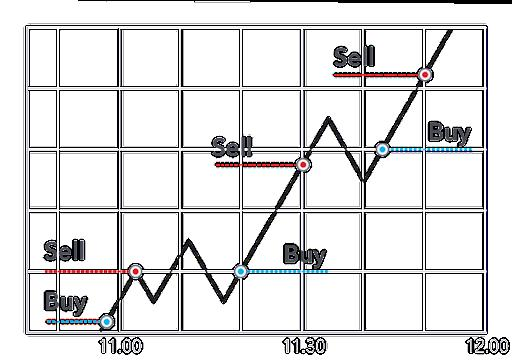

- **Arbitrage**

Arbitrage refers to the strategy under which a trader buys an asset in one market (exchange) and sells it in another. Owing to the difference in liquidity and trading volume, traders can find an opportunity to book profit. To adopt this opportunity, you must open accounts on at least two different exchanges and search for coins with considerable differences between prices.

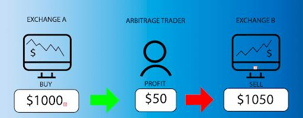

- **High-Frequency Trading (HFT) and trading bots**

[HFT](https://www.investopedia.com/terms/h/high-frequency-trading.asp?ref=blog.hummingbot.org) is a kind of algorithmic trading strategy used by [quant traders](https://www.investopedia.com/articles/active-trading/112614/steps-becoming-quant-trader.asp?ref=blog.hummingbot.org). The strategy involves developing algorithms that usually result in the creation of trading bots that help quickly enter, trade, and exit a crypto asset. Developing such bots needs an understanding of complex market concepts and a strong knowledge of mathematics behind market indicators and economics, as well as a certain level of coding skills. If you don’t qualify, though, to build a trading bot you may use a built one. There are many trading bots out there, free and paid, that do a decent job trading on your behalf. These bots are usually customizable to accommodate the user’s strategy. Once the user has completed the bot’s configuration he can use it to trade automatically, monitoring periodically its performance. [Hummingbot](https://docs.hummingbot.org/) is also an open source trading bot that runs on any crypto exchange, centralized or decentralized, offering the user the option to automatically trade using a large variety of strategies or the capability to build his own.

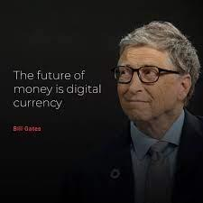

Crypto currency is attracting more and more investors each day, and although you may read stories about people accumulating huge amounts of profit through trading, you should realize the underlying risks and potential losses that come with crypto trading.

It’s being said that digital currency is the future of money and many people believe in that, but since only history will prove that right or wrong, you should understand the basics before entering the crypto market and make sure that when you find yourself in a hole, stop digging...
