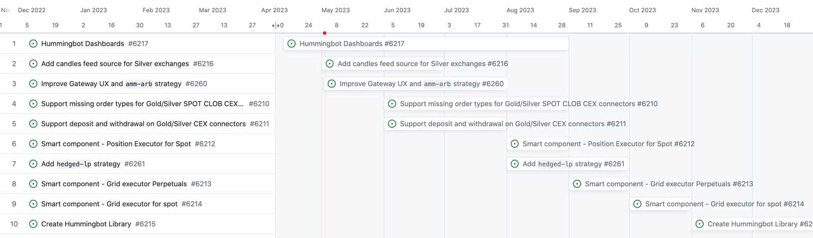

# Hummingbot 2023 Roadmap Update

In December, we shared our ambitious [technical roadmap](../hummingbot-roadmap-q2-2021/index.md) for 2023, detailing the features and improvements we planned to introduce throughout the year. Today, we are excited to provide an update on the progress we've made, the milestones we've reached, and the exciting plans we have for the remainder of the year.

## What's Been Shipped

We are proud to have completed several key items from our roadmap:

<!-- more -->

1. Expanded Hummingbot to directional strategies by introducing the [Candles Feed](../../../v2-strategies/candles-feed.md) OHLCV generator and the [PositionExecutor Smart Component](../../../v2-strategies/executors.md), enhancing the efficiency and flexibility of our trading algorithms
2. Introduced the [Orchestration Module](../../../installation/broker.md) to simplify the management of multiple trading bots and strategies, which is being developed by a community team
3. Revamped the installation process using Docker Compose and introduced the new [Deploy Examples](https://github.com/hummingbot/deploy-examples) repo
4. Grew the [library of custom Script examples](https://github.com/hummingbot/hummingbot/tree/master/scripts), providing users with more tools and resources to create their own custom trading strategies
5. Separated our DEX connector module Gateway into its own [dedicated repository](https://github.com/hummingbot/gateway), streamlining the development process and improving maintainability

## Upcoming Plans for 2023

To ensure transparency and keep our community informed, we have created a public GitHub project called [Hummingbot Roadmap](https://github.com/orgs/hummingbot/projects/12).

Here, you can track our progress and plans for the year. You can click on each card to expand it and see details about the tasks entailed.

Here are some highlights of what's to come:

1. **Hummingbot Dashboards**: One of the most commonly requested features has been better performance visualization and analysis tools. We are developing a companion dashboard for your running bots in our [Streamlit-Apps repo](https://github.com/hummingbot/dashboard). In addition, users will be able to deploy a running bot and the dashboard to track its performance in a single step using Docker Compose.
2. **Expanded API Support and Order Types**: We will add support for market orders and other order types, as well as deposit/withdrawal functionality for Gold and Silver exchanges, broadening the range of trading possibilities for our users.
3. **More Smart Components**: These self-executing, encapsulated logic components will enable users to create more complex and sophisticated strategies. Building on our first Smart Component (PositionExecutor for perpetual exchanges), we plan to introduce more components, such as PositionExecutor for spot exchanges and a GridExecutor designed to help users implement grid trading strategies.
4. **Hummingbot Library**: To make it easier for users to access Hummingbot and its connectors from more places, we will begin the process of converting Hummingbot to a Python library, so that it can be installed using `pip` and other package managers.

## Community Bounties

To further engage the community and drive the development of our roadmap, we are introducing the Community Bounties program, which will be described in detail in an upcoming post.

This initiative will fund bounties that incentivize community developers to contribute to the Hummingbot roadmap items, as well as fix bugs and build enhancements for other stakeholders in the Hummingbot ecosystem. By actively participating in the development process, our community can help shape the future of Hummingbot and ensure that it meets the needs of traders worldwide.

Stay tuned for more updates and exciting developments as we continue to work on our 2023 roadmap. We appreciate your support and look forward to making Hummingbot even more powerful and accessible to the trading community.