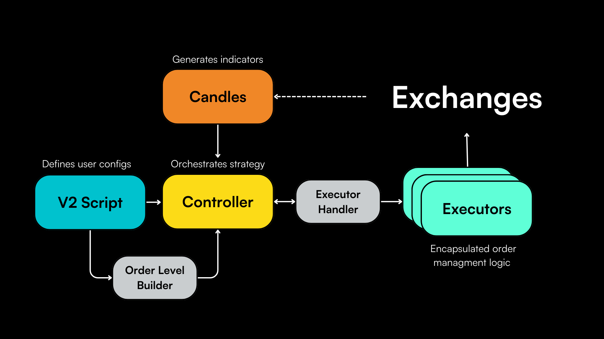

# Hummingbot 2024 Technical Roadmap: Innovating for the Future

After [a year of significant milestones in 2023](/blog/2023-a-year-of-innovation-at-hummingbot/), we're excited to announce the 2024 Hummingbot technical roadmap! Our plans are geared towards enhancing the usability, functionality, and scalability of our platform. Building on the emergence of the V2 framework, we are excited to introduce a range of innovative features that will redefine algorithmic trading for our users. 

Here what we expect to deliver from a technical standpoint in 2024:

<!-- more -->

## 1️⃣ Expand V2 Strategy Framework

The new [V2 Strategies](/v2-strategies/) framework has been a game-changer in strategy composability, and we are committed to expanding its capabilities.

### Make Scripts Configurable

The development of configurable scripts is already underway, as the initial [pull request](https://github.com/hummingbot/hummingbot/pull/6741) has been merged into `development`. This feature will allow for easier deployment and customization of complex strategies, significantly simplifying user configurability while maintaining the flexibility of [Scripts](/scripts/).

### Add More Strategy Components

Our focus will be on adding more smart components - which combine [Controllers](../../../v2-strategies/controllers/index.md) with Executor Handlers - into the V2 framework, which will offer increased flexibility in strategy implementation. Key additions should include:

- **XEMM Component:** This component will allow users to place a limit order on one exchange and, upon its fulfillment, hedge the order at market price on another exchange.
- **DCA Component:** Designed for dynamic trading, this component will manage multiple open orders with a global take profit and stop loss.
- **Statistical Arbitrage Component:** Utilizing two position executors, this component will close the compound position when it turns positive, optimizing the arbitrage opportunities.
- **Grid Component**: Using multiple position executors to create a grid strategy. The grid will offer configurable orders distributions using the Distributions module.

### Enable Controllers to Receive External Signals

We plan to introduce Controllers that can receive signals from external services. This enhancement will transform Hummingbot into a more extensive product suite capable of receiving streaming signals from various external platforms, thereby broadening the scope of trading strategies and market responsiveness.

## 2️⃣ Expand Bot Management System

Acknowledging the importance of an effective bot management system, we're undertaking a significant overhaul of our Dashboard and bot orchestration tools:

### Launch new Backend API service

This service will enable the deployment and control of bots using a broker and Docker, streamlining the orchestration process. Check out the initial [Github repo](https://github.com/hummingbot/backend-api).

### Launch new Condor Telegram bot

Condor will be a Telegram-based user interface that allows users to deploy and manage multiple Hummingbot instances conveniently using the Backend API service. Check out the initial [Github repo](https://github.com/hummingbot/condor).

### Enhance Dashboard

We see [Dashboard](https://github.com/hummingbot/dashboard) as an essential repo for community contributed dashboards and other companion apps that help users get the most out of Hummingbot. We plan to enhance Dashboard for in-depth analysis of trading activity, backtesting, and optimization

## 3️⃣ Update Foundational Architecture

To ensure that the Hummingbot codebase is set up well for the long-term, here are the basic architectural improvements we plan to undertake in 2024.

### Streamline Connector Maintenance

In our quest to continually refine Hummingbot, we're focusing on elevating our connectors' efficiency and functionality. This year, we plan to upgrade connectors using the new HBOT bounty allocation system implemented in [HGP-50](https://snapshot.org/#/hbot.eth/proposal/0xc13f3b9fdaded22d1ce0b5528c9146fb2a762c41deed88e6c64e798465414738). Going forward, HBOT holders can allocate bounties to each [connector](/exchanges/) which are used to align them with the latest spot and perpetual connector standards. 

Crucial to this initiative is the development of a detailed, configurable specification for all connectors. This specification will delineate key operational parameters such as the frequency of RESTful requests for updating orders, funding rates, and other vital data. By standardizing and optimizing these aspects, we aim to enhance the performance and reliability of Hummingbot connectors, ultimately providing a more robust and seamless trading experience for our users.

Additionally, we're excited to announce new bounties for upgrading and adding new connectors:

- Kraken, funded by [HIP-35](https://snapshot.org/#/hbot-ip.eth/proposal/0x021b7bd4b433182496c0288d8ed83001ddf0686a1f1e482f4dbf7ea972c0faf5)
- OKX, funded by [HIP-36](https://snapshot.org/#/hbot-ip.eth/proposal/0x750af518b682603bec2ca1ce597501d4bbad851eb9b8735da61efa4a50e0b2f4)
- ByBit, a private bounty funded by community members

### Upgrade Core Environment

As part of our commitment to maintaining a cutting-edge open source algo trading platform, we're undertaking a significant revamp to the Hummingbot core environment:

1. **Dependency Optimization:** We will meticulously review and eliminate any unnecessary dependencies, ensuring a streamlined and efficient environment.
2. **Upgrade Blockers Assessment:** A thorough analysis will be conducted to create a detailed summary of obstacles impeding the upgrade of our libraries to their latest versions. This proactive approach will facilitate a smoother transition during updates.
3. **Python 3.11 Migration:** In keeping with technological advancements, we plan to upgrade our systems to Python 3.11. This update will leverage the latest features and improvements offered by this new version, enhancing the performance and capabilities of Hummingbot.
4. **Library Dependencies Update:** To align with the latest standards, we will upgrade the dependencies of our libraries. This process includes modifying any deprecated code, ensuring compatibility, and harnessing the advancements in these libraries for optimal performance and security.

### 👨‍👩‍👧‍👦 Leverage Community Bounties

We plan to leverage bounties to enable community developers to help make some of these improvements to Hummingbot's basic modules. We are adopting a two-phase approach:

1. **Research Phase:** Initially, we will embark on an extensive research phase to identify all potential improvements across the fundamental modules of Hummingbot, which include configuration, client, Telegram integration, remote interface, security, and database models. This phase is crucial for understanding the current state of these modules and pinpointing areas where enhancements can yield significant benefits.
2. **Bounty Creation:** Following the research phase, we will systematically create bounties for each identified task. This approach not only allows us to tackle each improvement in a focused and efficient manner but also opens up opportunities for community involvement. By leveraging the collective expertise and creativity of the community, we can implement innovative solutions that align with our objectives of optimizing and securing Hummingbot.

## ⭐️ Stretch Goals

In addition, we have a few stretch goals to expand the technical limits of the Hummingbot ecosystem:

### Inject AI into User Experience

We are experimenting with incorporating LLMs to improve the Hummingbot user experience. We hope that AI-based agents will assist users in various aspects such as:

1. **Custom Codebase Explanations:** AI will provide tailored explanations of the codebase, making it more accessible to users of all skill levels.
2. **Error Log Analysis and Report Submission:** AI will review error logs, submit reports, and provide insights for troubleshooting.
3. **Script Configuration and Bot Deployment Assistance:** AI will guide users through the process of creating script configurations and deploying new bots, simplifying these complex tasks.

Check out the [Github repo](https://github.com/hummingbot/condor) and [this Youtube video](https://www.youtube.com/watch?v=JZfACS1v9H8).

### Add Custom Screeners

To provide users with more detailed market information, we will introduce custom screeners. These screeners will help identify the most attractive trading pairs, thereby enabling more strategic and informed trading decisions.

### Launch Community-Driven HUB

A new HUB is in the works where our community can upload and share scripts and configurations. This HUB will enable users to easily pull these resources into their bots and deploy them anywhere, fostering a collaborative and resource-rich environment.