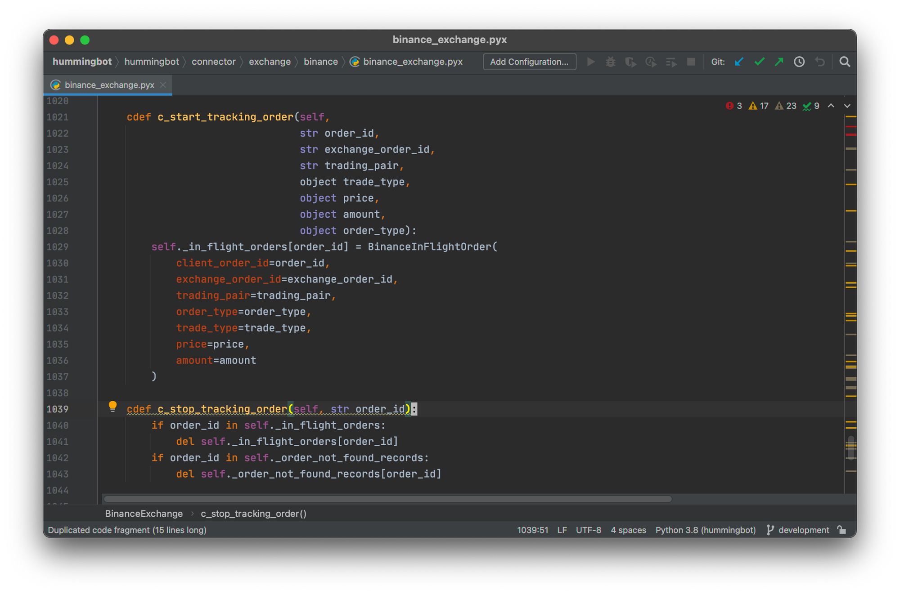
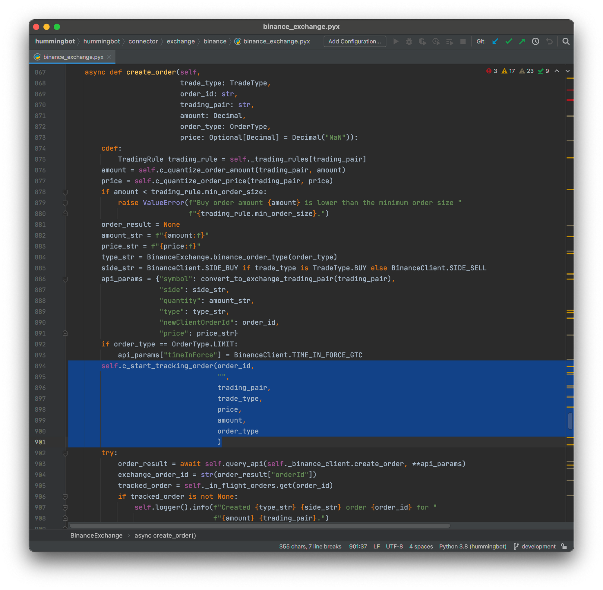
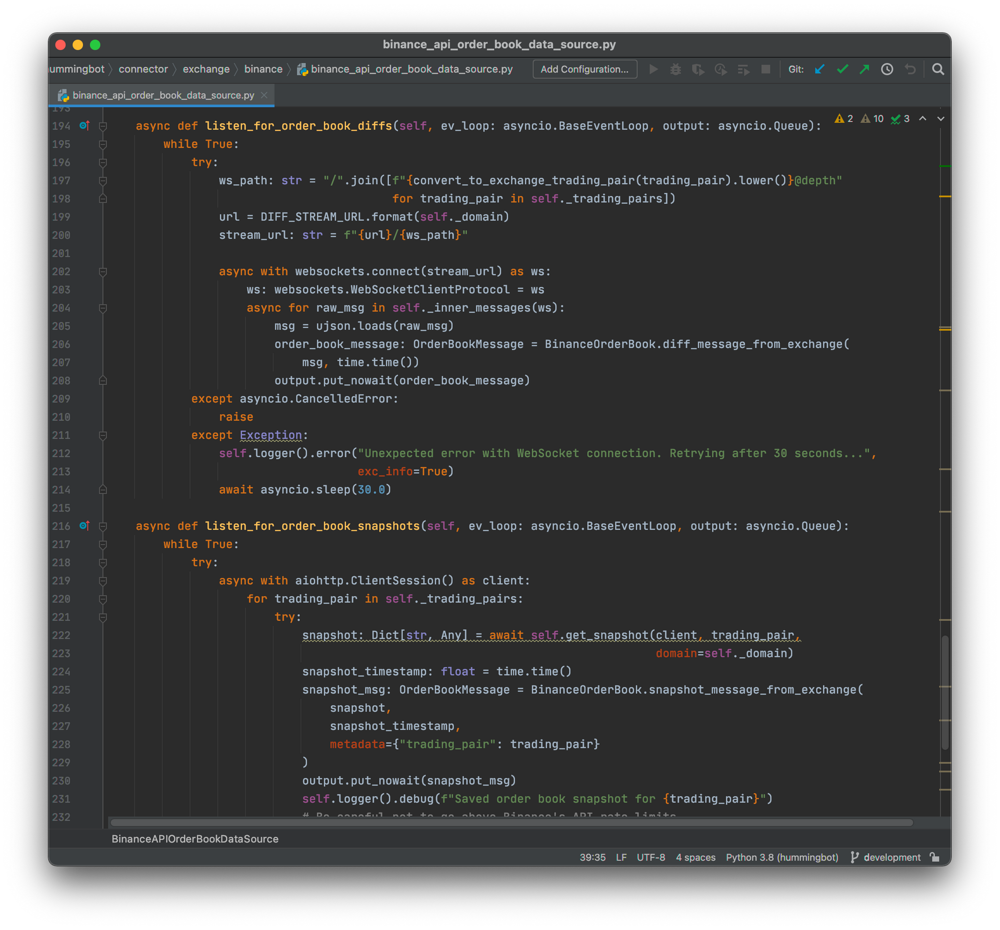
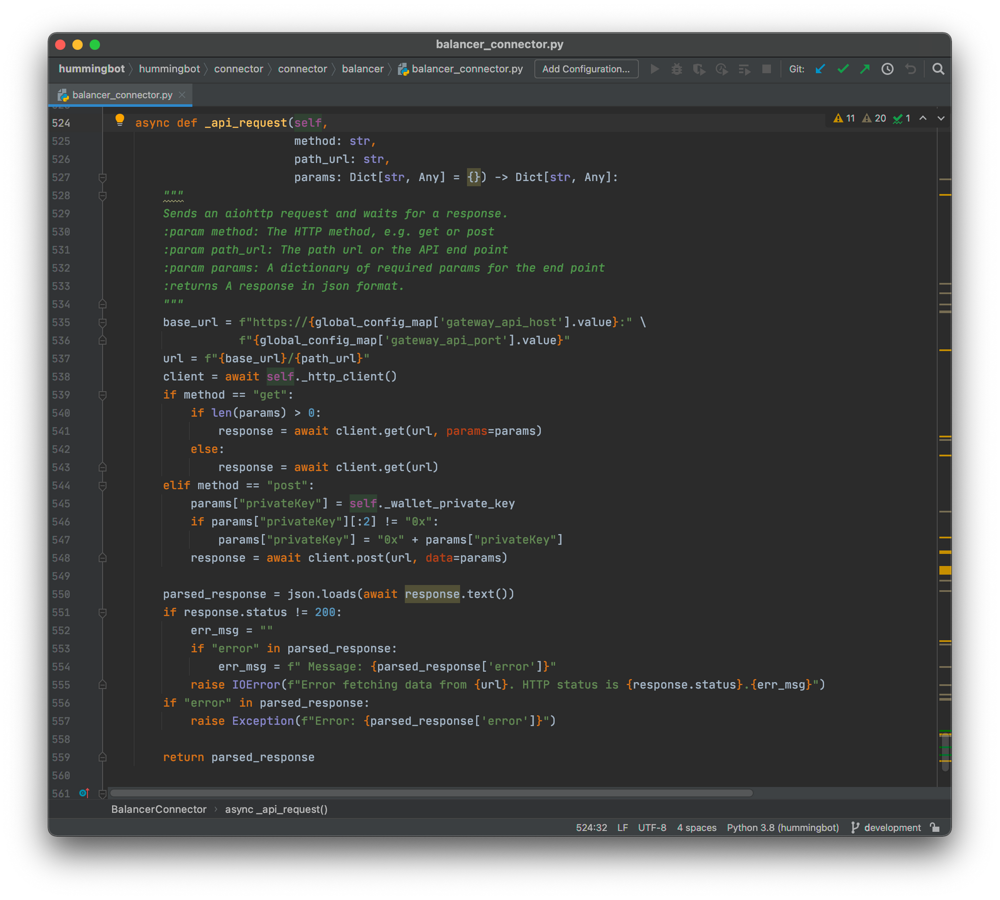
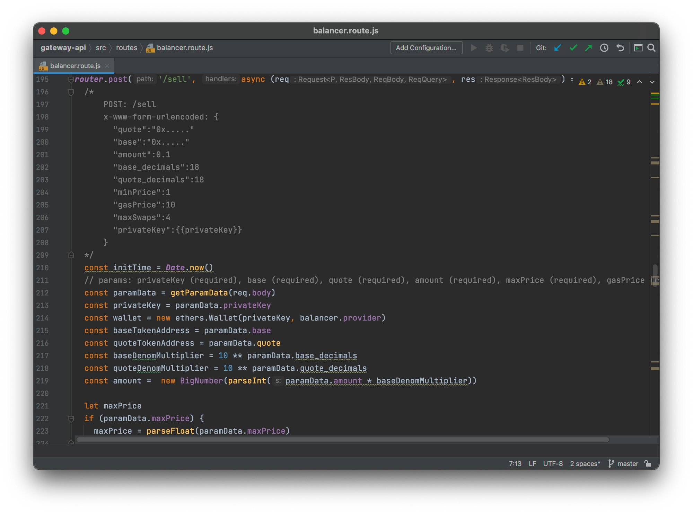

# Hummingbot Architecture - Part 1

## Introduction

Hummingbot is a modular framework for building highly reliable, and high performance trading bots. While the official Hummingbot package already allows you to run high frequency trading strategies on a number of cryptocurrency exchanges, the underlying framework is freely extensible for building custom strategies, custom market connectors, and more.

In this blog post, we will discuss some of the key architectural features in Hummingbot, and the rationales behind their designs.

<!-- more -->

## History and Motivation

Before Hummingbot became an open source project, it was a proprietary quant trading bot used for trading cryptocurrencies around 2017 and 2018, called Falcon. At that time, Falcon was built with off-the-shelf open source components. However, a few problems quickly surfaced with such an approach:

1. **Reliability**

    Cryptocurrency exchange APIs are often unreliable, frequently timing out or returning various errors. Beyond that, the dynamic behaviors of exchange APIs can also present problems. e.g.  after cancelling an order through a REST API call - an exchange API may still return that order as alive, cancelled, or non-existent if you immediately query the order with another REST API call.

    Novice builders of trading bots often think of trading bots as simply a combination of an exchange API wrapper and some strategy logic. In reality, there are many error cases and edge cases you need to deal with, before putting actual capital on the line.

    The most common problem that novice trading bot builders see is, they have got a naive trading bot that seems to work ok for a few hours - but the moment it meets the first API error, or the first unexpected dynamic behavior from the exchange - that trading bot would either crash or continue to trade incorrectly. In both cases, the user could stand to lose a lot of money if he's not actively monitoring the bot at all times - which nullifies the reason to use a trading bot to begin with.

    A production-quality should be able to keep running despite Internet or exchange disruptions, and should be able auto-heal once network and exchange functionalities are restored.

2. **Status tracking**

    Practical quant trading is a lot more than simply a matter of reading signals and making orders. You also need to do a lot of tracking on your current account and active orders before you can make sensible decisions.

    For example, the price of Bitcoin may be very attractive at a certain moment according to the signals - if my current position is already long Bitcoin - then my trading bot should not need to do anything. Naively emitting more buy orders may either simply cause API errors because there's not enough balance to buy more Bitcoin, or, it may cause unintended exposure to Bitcoin because the trader wasn't planning to have a 100% Bitcoin portfolio.

    Another example is what happens if I have active orders on the market, and the market conditions have suddenly become unfavorable to those orders. Let's say the trading bot made requests to cancel those orders. But maybe the exchange was too busy and those requests came back with errors. A naive trading bot that simply emits a cancel API request and forgets about the user's actual position on the market could cause huge capital loss to their users.

    A production-quality trading bot must track what happened to a user's overall position in the market, and should be able to decide what to do with those orders next (e.g. retry the cancellation later). 

3. **Latency**

    There are a lot of quant trading styles - some are high frequency, some are not. In cryptocurrency markets, however - there are often significant price movements (5% or more) that only lasts tens of seconds or less. So even for strategies that are typically not treated as "high frequency" - it is often still highly advantageous to be able to catch onto quick price movements and utilize them before the opportunity is gone.

    A naively made trading bot would often depend on polling exchange APIs for price, order book and balance updates. These can take multiple seconds or perhaps more than a minute, depending on things like API rate limits or the size of the REST API response.

    A production-quality trading bot should be able to utilize streaming APIs (e.g. WebSocket) whenever available, but retain the ability to use REST APIs as backup when streaming API has become unreliable or unavailable.

4. **Back-testing performance**

    Finally, for professional traders and hedge funds, being able to backtest strategies with high resolution data is often a critical concern.

    Many existing open source backtesting frameworks are either written with only low-resolution, daily candles in mind; or, are written in languages that do not integrate well with modern data science toolsets.

    Hummingbot is designed from the ground up to be able to process and simulate high resolution order book data with high performance; and is written in Python and Cython to allow access to Python's rich ecosystem of data science and machine learning tools.
    

## The Clock

The `Clock` class, from the `hummingbot.core.clock` module, is the central component that drives all activities and actions of other major Hummingbot components - such as the market connectors and strategies.

All major Hummingbot components, including market connectors and strategy classes, are derived from `TimeIterator` from the `hummingbot.core.time_iterator` module.

At every clock tick, which happens every second by default, the `Clock` would notify each of its children `TimeIterator` objects by calling their `c_tick()` method.

The order of the notifications for every clock tick is the same as the order the `TimeIterator` objects were added to the `Clock` via `Clock.add_iterator()`. This allows data dependencies between `TimeIterator` objects to be realized. e.g. if a strategy object depends on the most up-to-date market information from a market connector, then calling `Clock.add_iterator()` with the market connector before the strategy object will guarantee the market connector is always updated before the strategy object.

References:

[https://github.com/hummingbot/hummingbot/blob/master/hummingbot/core/clock.pyx](https://github.com/hummingbot/hummingbot/blob/master/hummingbot/core/clock.pyx)

[https://github.com/hummingbot/hummingbot/blob/master/hummingbot/core/time_iterator.pyx](https://github.com/hummingbot/hummingbot/blob/master/hummingbot/core/time_iterator.pyx)

## Market connectors

Market connectors handle all the network operations between cryptocurrency exchanges, and strategy objects on Hummingbot side that make trading decisions.

You can think of market connectors as automated stock brokers running inside Hummingbot. When the strategy object wants to get the newest price quote for a certain order size, it asks the market connector; how thick is the order book? Ask the market connector; what's my current assets balance on the exchange? Ask the market connector; want to make a limit bid order? Ask the market connector.

At the time or writing this article, there are a total of 23 market connectors built into Hummingbot. You can find them under the `hummingbot.connector` module. For example:

- `hummingbot.connector.exchange.binance.binance_exchange` is the market connector module for Binance;

- `hummingbot.connector.connector.uniswap.uniswap_connector` is the market connector module for Uniswap.

The base interface for all market connectors can be found as the class `ConnectorBase` in the module `hummingbot.connector.connector_base`. The base interface class contains a listing of the methods and properties that all market connectors must implement to make it usable to strategy objects in Hummingbot.

### Order Tracking

Unlike the market interfaces from similar open source trading libraries, Hummingbot market connectors are designed to track the states of orders created by strategy objects, in order to provide a coherent picture of all the trading actions and updates for strategy objects. 

You can compare this to trading libraries that don't provide order tracking - trading bot writers would either have to come up with the tracking logic on their own; or risk the bot making or cancelling more orders than is needed, when exchange API calls get delayed or outright failed during periods of busy trading activity on the exchange.

In the Binance exchange connector for example, you can find the order tracking logic in `BinanceExchange.c_start_tracking_order()` and `BinanceExchange.c_stop_tracking_order()`. These functions are typically called when orders are being created, cancelled, and also when order status updates arrive from the exchange API.

### Graceful Degradation and Reliability

In the previous section we've discussed how things may go wrong in poorly designed trading libraries, when API calls get delayed or failed. Hummingbot market connectors are designed to keep working reliably and degrade in functionality gracefully in the face of adverse market or networking conditions.

Let's say we are in a period of really busy trading in Binance, and Binance API servers are seeing heavy latencies, and occasionally is not responding to new API requests at all. Let's say a Hummingbot strategy object wants to create a limit bid order in this situation, what should the market connector do?

Since there is no guarantee the exchange API would give us a response to an order creation API call at the time - we have no reliable way of knowing whether the order has been placed or not in the  market. If you look into the `BinanceExchange.create_order()` function, you'll find that the exchange connector starts tracking the order before it is submitted to the exchange API.

This is done to make sure Hummingbot would not forget about the order in case the `self.query_api()` call (which follows immediately) times out or fails, but the order was actually placed into the exchange.

There are other similarly precautionary measures taken when the Binance market connector handles order cancellations and order status updates, to ensure the Binance market connector would not miss anything important about orders made by upstream strategy objects. This frees up the strategy objects such that they can focus only on trading decisions, while the market connector handles all the operational details behind making and tracking open orders on the market.

### Low Latency

Besides exchange instability and the need handle them gracefully, the other aspect of cryptocurrency trading is speed.

Hummingbot market connectors are designed to use the lowest latency data source, which is web socket on most centralized exchanges, that is available. Let's take a look at the Binance market connector as an example again. Specifically, let's take a look at the `BinanceAPIOrderBookDataSource` in `hummingbot.connector.exchange.binance.binance_api_order_book_data_source`.

The code above shows how the Binance market connector receives order book change messages from Binance via websocket for calculating order book depth and prices. This means strategy objects depending on the Binance market connector would be able to see real time prices and order book depth, as opposed to delayed market snapshots.

### Gateway API

Hummingbot is Python and Cython based, and that is generally good enough for interacting with centralized exchanges with web based APIs. Decentralized exchanges, however, often require (or are better supported with) the use of third party libraries for interacting with the exchange protocol. These libraries are not always available in Python.

Hummingbot solves this problem via the Gateway API architecture. The Gateway API is typically a Docker container running on the same computer as Hummingbot, which hosts the external libraries and / or network nodes required for interfacing with decentralized exchanges. It then exposes an encrypted, authenticated HTTPS API endpoint to allow the corresponding Hummingbot market connectors to interface with the decentralized exchange protocols.

Take the Balancer DEX connector for example. Almost all of the operations in the connector - whether it is getting market data like order prices, fetching the wallet balance or making orders - go through the `BalancerConnector._api_request()` method. When you look into the method, you'll find it's really just delegating all the work to a Gateway API endpoint.

The Gateway API source code can be found in our gateway-api repository (https://github.com/hummingbot/gateway). For example, here is how the balancer/sell API endpoint is implemented on the Gateway API side.

References:

[https://github.com/hummingbot/hummingbot/blob/master/hummingbot/connector/connector_base.pyx](https://github.com/hummingbot/hummingbot/blob/master/hummingbot/connector/connector_base.pyx)

[https://github.com/hummingbot/hummingbot/blob/master/hummingbot/connector/exchange/binance/binance_exchange.py](https://github.com/hummingbot/hummingbot/blob/master/hummingbot/connector/exchange/binance/binance_exchange.py)

[https://github.com/hummingbot/hummingbot/blob/master/hummingbot/connector/exchange/binance/binance_api_order_book_data_source.py](https://github.com/hummingbot/hummingbot/blob/master/hummingbot/connector/exchange/binance/binance_api_order_book_data_source.py)

[https://github.com/hummingbot/hummingbot/blob/master/hummingbot/connector/connector/balancer/balancer_connector.py](https://github.com/hummingbot/hummingbot/blob/master/hummingbot/connector/connector/balancer/balancer_connector.py)

[https://github.com/hummingbot/gateway-api/blob/master/src/routes/balancer.route.js](https://github.com/hummingbot/gateway-api/blob/master/src/routes/balancer.route.js)

## Conclusions

This concludes Part 1 of our Hummingbot Architecture series. So far, we have talked about:

- Why status checking, reliability, and low latencies are important for an automated trading bot.
- How the major components in Hummingbot work together in sync, via the `Clock`.
- How order status tracking, reliability and low latency features are implemented in Hummingbot market connectors.
- How we support DEX protocols via the Gateway API architecture.

In the next part of our Hummingbot Architecture series, we will do a deep dive into Hummingbot strategy classes - the brain of an automated trading bot. We will also discuss some of the features in Hummingbot that are useful for developers working to debug and inspect internal bot states, and how the Hummingbot community can contribute to the project.

Stay tuned.
