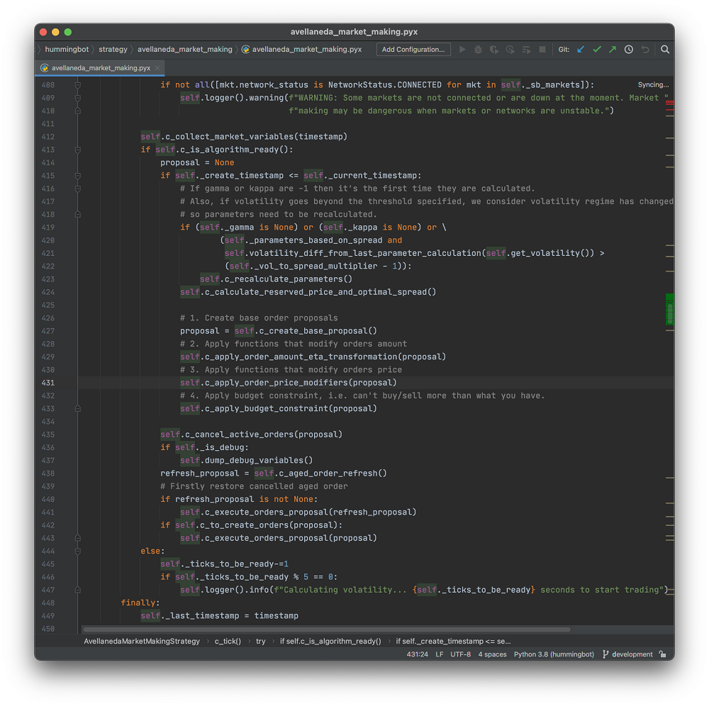
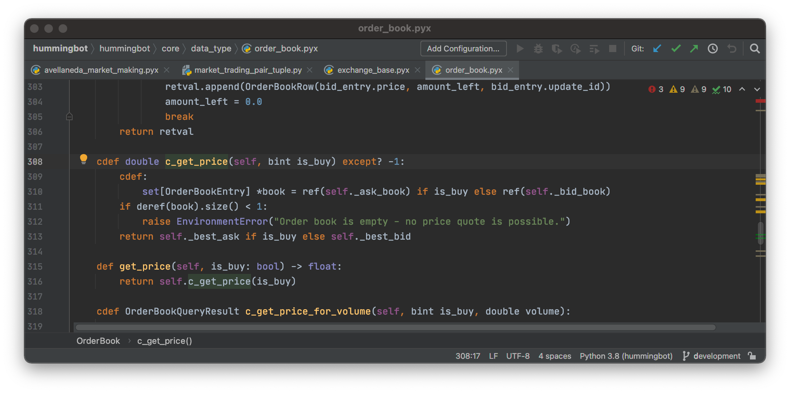
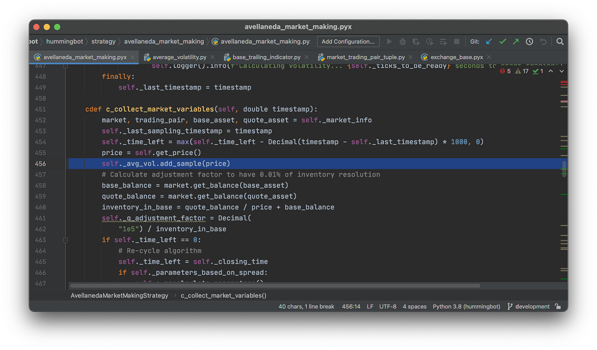
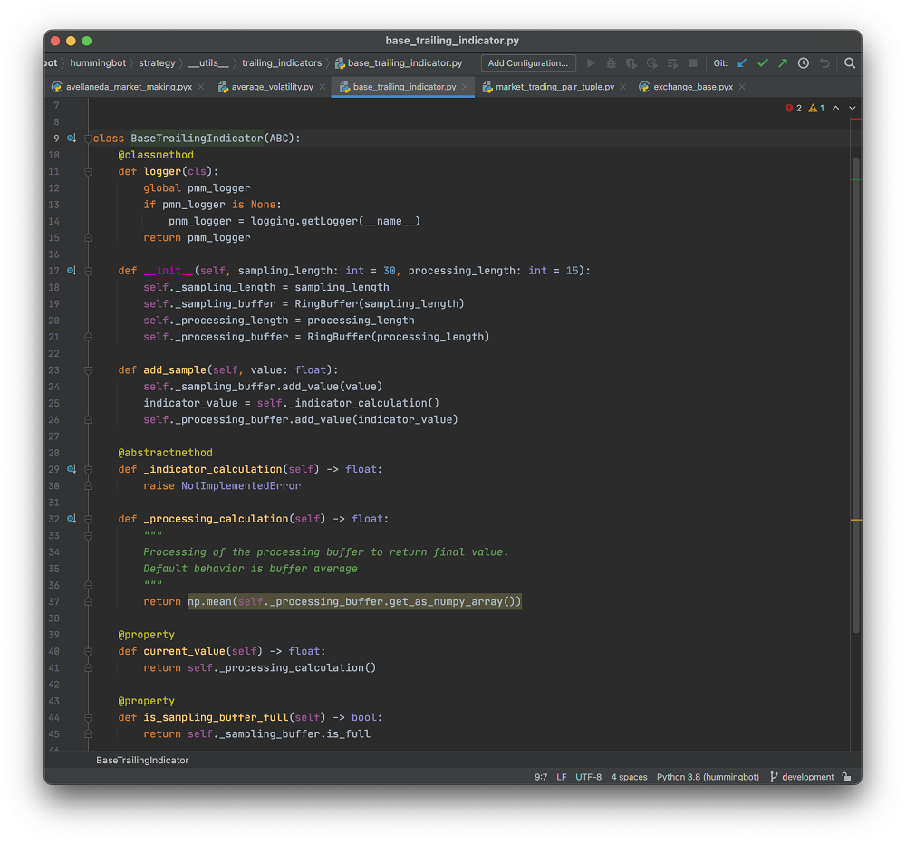
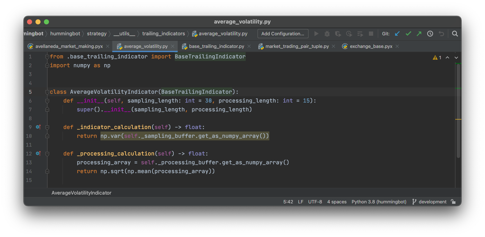
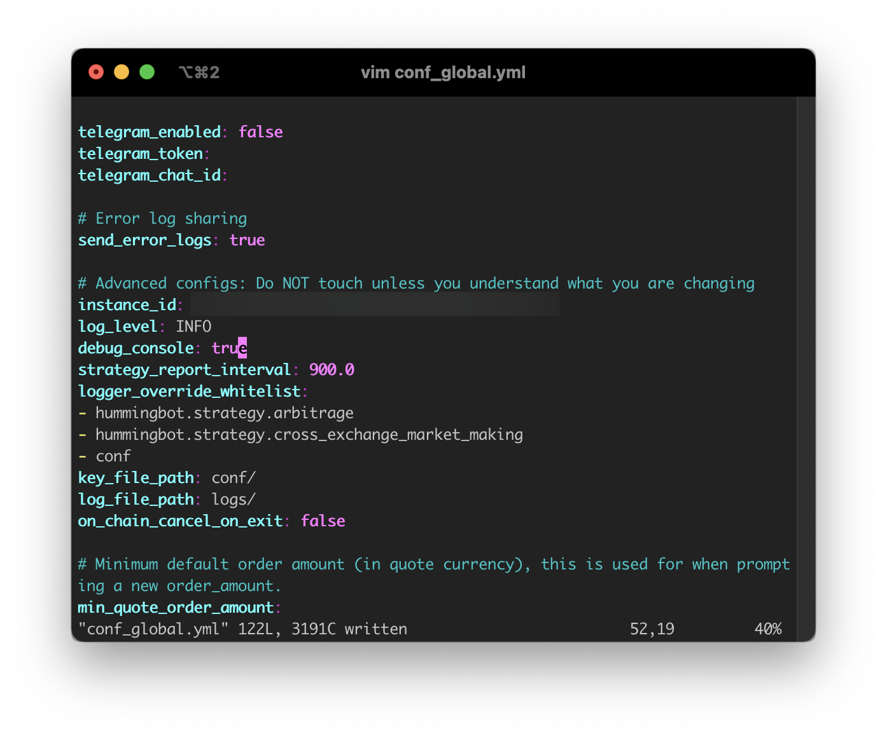
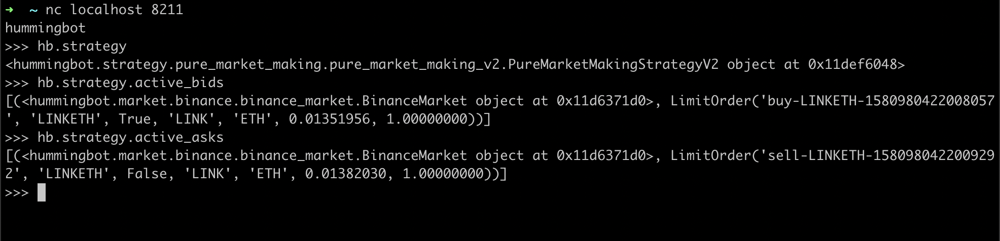
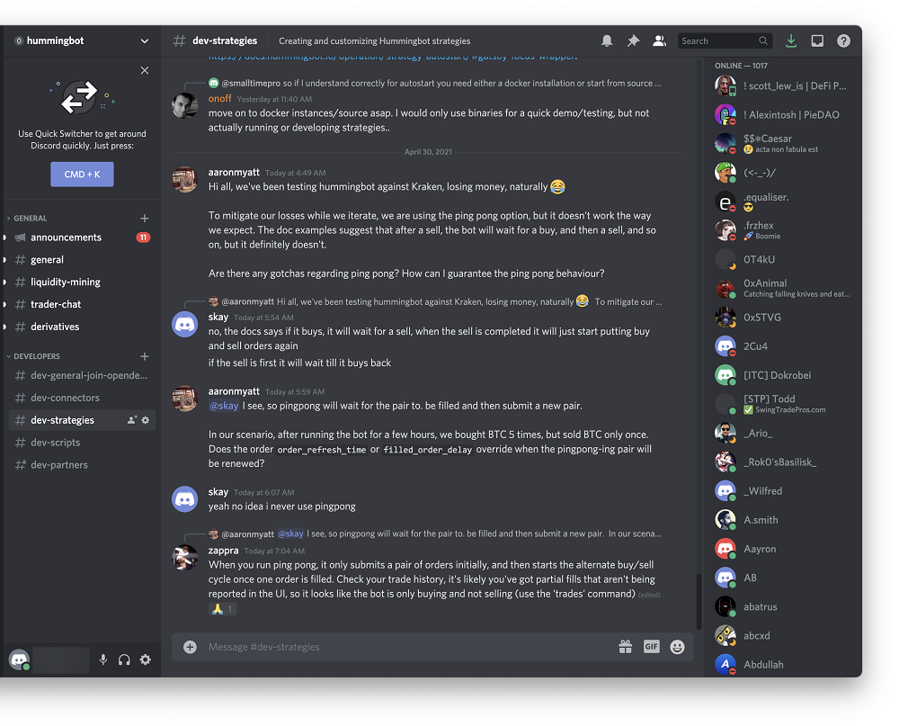

# Hummingbot Architecture - Part 2

## Introduction

In the last article - [Hummingbot Architecture - Part 1](/academy-content/hummingbot-architecture---part-1/) - of this series, we've discussed the design motivations behind Hummingbot, the clock and the market connectors. Today, we'll be discussing the architecture behind trading strategies - the very component that decides Hummingbot trades with your money. We will also discuss how you can diagnose problems and debug Hummingbot in live trading.

<!-- more -->

## Strategies

If market connectors are the hands and eyes of Hummingbot, then strategy is the brain of Hummingbot. Strategy objects process market signals, and decide when and what orders to create or remove on markets.

We will use the Avellaneda & Stoikov market making strategy as an example for our discussions.

### Watching the Market Like A Movie

Every strategy class is a subclass of the `TimeIterator` class - which means, in normal live trading, its `c_tick()` function gets called once every second. Each time `c_tick()` is called, the strategy object should be making observations on the latest market information, and decide what it should do.

You can imagine strategy objects are watching the markets like a movie, where each second is one frame of the movie - and it's constantly trying to decide what to do about any new developments from the movie.

Let's take a look at the `c_tick()` function of the Avellaneda & Stoikov market making strategy in Hummingbot, below:

Here is an overview of what the strategy is doing every second - after it's been properly initialized.

1. Line 412 - perform market observations and update indicators

    This function performs observations on both price actions on the market, and also the current inventory on the trader's account. Specifically, it updates the price volatility trailing indicator `_avg_vol`, and periodically updates the `_gamma`, `_kappa`, and `_eta` parameters as specified from the Avellaneda & Stoikov paper.

2. Line 415 - checking timestamps for creating new orders

    This line looks at the current wall clock time and determines whether it's time to create new orders on the market.

3. Line 424 - decide on the order prices, if creating order

    This line calculates the prices for creating market making orders, from the indicators and parameters just calculated above.

4. Line 426 to 433 - create an intermediate order proposal for creating orders later

    The intermediate order proposal specifies the price, amount and side of the orders to be created. However, they do not consider whether there are already similar active orders on the market.

5. Line 435 - cancel expired active orders, or if the new order proposal has different prices to the existing orders
6. Line 438 to 443 - execute order proposals

    These lines executes the order proposals generated from the logic above - sending  orders to the exchange and tracking them.

### Reading Prices and Order Book

If you do a manual trace of the `get_price()` or `get_mid_price()` functions in the Avellaneda & Stoikov strategy code, you'll find it leads to `OrderBook.c_get_price()` in the module `hummingbot.core.data_type.order_book`.

The `OrderBook` class tracks the real-time order book, including depth on both sides, trades and prices, on live exchanges. Each market pair in an exchange market will have one order book. Since trailing indicators often depend on price and order book depths as their fundamental inputs, order book information is often among first inputs to be read by a strategy in every `c_tick()` iteration.

### Trailing Indicators

Sophisticated strategies often need some trailing indicators from the market, in addition to the current prices or order book depth information, to make trading decisions. This includes most of the technical analysis indicators such as EMA, MACD and Bollinger Bands. In Avellaneda & Stoikov strategy example, the object `self._avg_vol`, which is an instance of `AverageVolatilityIndicator`, is a trailing indicator for recent price volatility.

Let's take a look at how it collects new samples from the strategy code. For every call to `c_tick()`, `c_collect_market_variables()` would send the newest price to `self._avg_vol` via `self._avg_vol.add_sample(price)`.

When you look into the relevant code for calculating the values of the trailing indicator, you'll find that ``AverageVolatilityIndicator`` stores a fixed number of samples of prices and outputs a smoothed standard deviation statistic of the prices in the window.

If you want to write your own custom indicators, you can do so by inheriting from ``BaseTrailingIndicator`` just like the above, and writing your own sampling and calculation logic.

## Community and Developer Friendliness

Hummingbot is designed from the ground up with developers in mind. Crypto markets are constantly changing. Whether it is the services and APIs offered by exchanges, the participants and the way the markets move - it's constantly in flux. Developers are uniquely suited to take advantage of this kind of environment, because they are able to modify and tune their strategy and connector code as the market evolves.

### Debug Console

When you are writing a new connector, or a new strategy - it is critical to be able to observe the detailed behavior of your code, and diagnose any problems as it is happening. The logging facility is one tool developers can use. The other tool in a Hummingbot developer's arsenal, is the debug console.

The Hummingbot debug console is disabled by default. It needs to be enabled by editing `conf/conf_global.py` and setting `debug_console` to `true`.

Once that has been set, you will be able to telnet to `localhost:8211` to access an interactive Python console that has access to the same memory space as the live Hummingbot instance. You can, for example, examine the live properties from the currently running strategy object and look at the active orders it has made and is tracking.

You can read more about the debug console from [Hummingbot documentation](../../../developers/debug.md).

### Discord Channels

Our [Discord server](https://discord.gg/hummingbot) is a good place you can find other Hummingbot developers, who, like you, may be creating their own strategies, indicators and market connectors. We have several developer oriented channels, where you can get community support on how to create your own modifications to Hummingbot.

### Contributing

Finally, if you would like to report issues in Hummingbot, or contribute code - our Github page can be found at [https://github.com/hummingbot/hummingbot](https://github.com/hummingbot/hummingbot).
