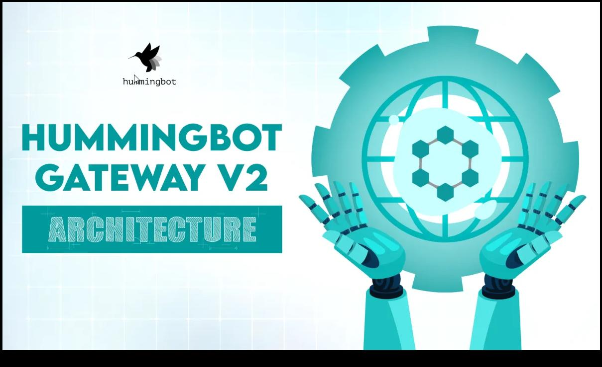

# Hummingbot Gateway Architecture - Part 2

*by Martin Kou*

**Update (February 2023):** Hummingbot Gateway v2 is now available as a standalone Github repository: [https://github.com/hummingbot/gateway](https://github.com/hummingbot/gateway?ref=blog.hummingbot.org). Most of the functionality listed in this post has now been implemented, and we welcome contributions from the community.

Introduction
------------

In [Part 1](../hummingbot-gateway-architecture-part-1/index.md) of this series, we have discussed the architectural changes we are making to Hummingbot Gateway v2 to improve its robustness and reliability, to bring it up to the service quality level expected of production trading systems.

<!-- more -->

In part 2 of this blog series, we will be talking about architectural changes that concerns Gateway v2 interacts with you. In particular, we will be discussion improvements we're going to make to first-time user experience, and also improvements to community developer experience.

User Experience
---------------

Hummingbot Gateway is a backend system, where the ideal user experience is it's easy to set up, and then it runs reliably in the background and let the user focus on trading. In occasion the user needs to reconfigure or upgrade the gateway, the documentations and instructions should be clear, and the configuration steps should be easy to carry out.

Gateway v2 is going to come with a series of improvements to bring its user experience more in-line with major production server software like Apache or MySQL. We will be focusing our efforts in the following major areas:

* Setting up Gateway (using Hummingbot)
* Setting up Gateway (standalone)
* Configuring Gateway
* User Documentation

### Setting up Gateway (using Hummingbot)

The current Hummingbot / gateway setup experience has a few usability issues:

1. Poor documentation: There are no coherent instructions on what the user needs to do to start trading on Uniswap.
2. Complexity: The user needs to set up the SSL certificates on Hummingbot first, and then either run another script (for Docker setup) or manually fill in the gateway configurations (for source setup) to get gateway working.
3. Little to no UX feedback: When gateway has been started, there is no UX feedback on Hummingbot to indicate it's been connected to a gateway.
4. None of the `gateway`commands come with `-h` help messages.

Here are the improvements we are going to add to Gateway v2 to make the Hummingbot setup workflow easier and more maintainable for users:

1. Automate the Gateway v2 Docker setup process with Docker Compose and other setup scripts.
2. Provision detailed, step-by-step documentations on the preparation steps, setup steps, and the configurations involved in gateway setup with Hummingbot to the Hummingbot documentation site.
3. Add Gateway status to top status bar in the Hummingbot client UI, to indicate whether Hummingbot is connected to a Gateway v2 instance.
4. Provision help messages for all `gateway`commands in Hummingbot.

### Setting up Gateway (standalone)

There is currently no documented way of setting up gateway in a standalone manner, and connecting non-Hummingbot clients to it. Since a standalone gateway requires a non-Hummingbot client, we can expect most of the people needing this to be trading system developers and system administrators.

Here are the improvements we are going to add to Gateway v2, targeting the standalone gateway setup workflow.

1. Developer reads an overview documentation on the overall architecture of gateway, how to set it up, and how to connect non-Hummingbot clients to it.
2. Developer sets up the gateway with `gateway-create.sh`, with the SSL certificates (including the CA certs and keys) generated.
3. Developer generates client certificates with `gateway-copy-certs.sh`
4. Developer connects a custom client to the gateway with the client certificate, and runs the "Hello World" sample script (e.g. getting the price of WETH-DAI on Uniswap on Ethereum Goerli) from the client.
5. Developer continues to develop trading client by following our gateway API documentation.

### Configuring Gateway

The configuration system in the original Hummingbot Gateway has a few major usability issues:

1. It exposes an overwhelming amount of configurable variables to a first-time user, which adds unnecessary friction to the initial setup process.
2. A first-time user needs to go to at least two places to configure the gateway (e.g. for Docker setup, first he needs to create the certificates in Hummingbot, then he runs `create-gateway.sh`).
3. It exposes the default configurations for all connector modules in the same global config file, which means it's not modular.

The requirements for maintaining a user-friendly set of configurations for Hummingbot gateway is really not too different from that of a web server like Apache or NGINX, or that of a NodeJS web application. We should reference how configuration sets are maintained in those servers, rather than trying to re-invent the wheel.

Here are some ideal user flows for a few important scenarios w.r.t. configurations:

1. **Hummingbot / Gateway setup**: from Hummingbot, the user can simply set up their wallet, input their Infura key, and start the gateway
2. **Standalone Gateway setup**: the user runs a script to create the SSL certificates and have them integrated to the gateway configs automatically, inputs their Infura key, and starts the gateway
3. **Inspecting configs from UNIX command line**: the user can edit a few well-defined, and easy-to-read configuration files (e.g. `local.yml`for local settings like Infura key or node URL, `ssl.yml`for things like SSL certificate and key phrase file paths)
4. **Inspecting configs from Hummingbot**: the user can use `gateway list-configs` and `gateway update`
5. **Adding or developing new connector module**: the developer should be able to add his own module-specific configs in his own module's files, without needing to modify the global configs. However, module-specific configs should still be override-able in local settings files, and discoverable / writable from Hummingbot gateway commands.

We are going to refactor the configuration system of Gateway v2 by splitting the configuration files into multiple files, and bringing it more in-line with common server software like Apache and NGINX.

1. Keep the default settings for different connectors without their own module directories, to allow for modularity.
2. Remove global config file, use purpose-specific config files instead.
3. `ssl.yml`- SSL certificate configurations.
4. `ethereum.yml`- Ethereum chain-wide configurations. e.g. which network to use? Infura node ID?
5. `local.yml`- user overrides.
6. Provide a directory with sample config files. (e.g. `./config/samples/`), with in-line documentation of what each configuration entry means.

### User Documentation

The original Hummingbot Gateway came with installation instructions for Docker and source code installations, and discussed some `gateway`commands from Hummingbot without mentioning. However, there is no coherent explanation at when the user should apply which step, and why certain steps (e.g. SSL certificate generation) are needed.

It also does not describe the minimal set of configurations (e.g. Ethereum node URL, network, etc.) the user needs to have to get gateway working. This means a first-time user compiling from source code would need to resort to trial-and-error to get the gateway working. Overall, the current state of documentations for first-time users is unsatisfactory.

The installation documentation for Gateway v2 will be greatly expanded, and we will also make sure it's written in a sensible order and narrated in a coherent manner for first time users. In particular, the new installation documentations will give clear instructions on what are the preparation steps (e.g. OS environment with Docker, Ethereum node URL / Infura account, etc.) and the minimal set of configurations required to get Gateway v2 running.

Developer Experience
--------------------

Hummingbot is an open source project. We expect that in the long term, community members will be making the majority of contributions for DEX connectors, feature requests and bug fixes.

This implies we will also need to account for the user experience from the point of view of community developers. For example, consider somebody who wants to develop a new DEX connector for Hummingbot Gateway - we will need to plan for things like documentations, community support, the process of proposing and adding new connectors, the acceptance standards on our side, etc.

### **Developer Documentation**

Documentation is typically one of the first stops for developers looking to add new features to a project. We are expecting most developers will be interested in adding connectors to new DEXes to our project, so we will pay extra attention to writing and testing new connectors. Below is an outline of the kinds of developer documentations we are going to include with Gateway v2:

**Quickstart**: This should be similar to the initial setup documentations in the User Experience workflows above, but with an emphasis of setting up gateway from source code rather than from Docker. It should include the following items:

**Setup and Configuration:** 

* OS and toolchain requirements. e.g. Linux / macOS, git, nvm, yarn, etc.
* Cloning from Hummingbot repository, `yarn`setup steps, etc.
* Generating the client SSL certificates for testing.
* Editing configuration files for things like Infura API key
* Verifying that the setup works
* Minimal configurations for Uniswap and Ethereum
* Provide a few `curl`commands that make some Uniswap API requests (e.g. getting asset prices) to the gateway, and the expected output.

**Adding Gateway connectors:** This will be a dedicated section for developers who are looking to develop new gateway connectors. The code walkthrough should capture the main logic pathways used in gateway, while running a Uniswap AMM strategy on Hummingbot.

**Things to watch out and test for:** It is relatively easy to write a DEX and blockchain connector that "mostly" works, "occasionally" works, or only works in a test net. The requirement for a new connector, however, is that it should be highly reliable and resilient against failures.

* Listing of common failure modes for DEX connectors. e.g. network disruption, stuck transactions, proper nonce management, etc.
* Listing of required unit test cases and fixtures against common error modes, in order for a connector to be certified by us.

### API documentation

This includes documentations for every available API endpoint in Gateway v2, with argument inputs, expected output format, and errors.

### **Feedback Loop**

After reading through the documentations, community developers will need guidance from the moment they got the first "Hello World"-style API working, to the moment the new connector is approved and accepted by the Hummingbot team.

This feedback to the developer can come in many forms in addition to community feedback and discussions. Test cases, documentations and certification standards are also useful for the community developer to pace himself and make sure he's on the right track.

Gateway v2 will come with the following documentations and support infrastructure, to act as guardrails for community developers looking to create new connectors and new features for Gateway v2.

**Instructions for running unit test cases, and interfacing with gateway**

One of the first type of feedback a developer gets on his code, is typically from test cases. This can come in the form of unit test cases, or manual test cases (e.g. invoking `curl`with special instructions). Documentations that target the use and creation of test cases would be useful here.

In particular, we are going to provision the following test-related documentations with Gateway v2:

* How to run the unit test cases included in Gateway v2 code;
* How to write new unit test cases, and have it included in the test suite;
* How to run manual tests with `curl`, and generated client certificates.

**Test fixtures to simulate common edge cases like dropped transactions and transaction failures**

We expect most of the new DEX connectors will be interfacing with EVM based blockchains - in which many of the same failure modes will apply. This means the test fixtures we constructed for testing Ethereum DEXes like Uniswap can likely be reused by our community developers.

Again, documentations on how to reuse and modify these test fixtures will be useful for community developers:

* Listing of common failure modes for DEX connectors. e.g. network disruption, stuck transactions, improper nonce management, etc.
* Documentations on the built-in test fixtures for testing EVM failure modes, and how they may be reused for testing new EVM based DEX connectors.

**Process for submitting and certifying new connectors**

The Hummingbot team will establish and publish a process, and a standard for certifying new DEX connectors. Any new DEX connectors must contain a required set of test cases to make sure it's reliable and resilient against common error cases. It should also pass through our code review and QA to ensure the test cases actually do what they claim to do, and that the connector actually works in our test environments.

**Community channels**

The Hummingbot team has established a Discord channel ****#dev-gateway-v2**** dedicated to Hummingbot gateway community developers. From our experience with Hummingbot, the community channel will likely need support from the initial Gateway v2 dev team at the beginning. Eventually, once there are more community developers who have gone through the whole process, they will increasingly be able to support themselves.

After the initial public release of Gateway v2, we will establish a rotating "office hour" schedule, where members from the Gateway v2 dev team will answer questions from the community in the Gateway v2 community channel.

### Availability and Timeline

**Update (February 2023):**Hummingbot Gateway v2 is now available as a standalone Github repository: [https://github.com/hummingbot/gateway](https://github.com/hummingbot/gateway?ref=blog.hummingbot.org). Most of the functionality listed in this post has now been implemented, and we welcome contributions from the community.

At the time this blog post is written, Gateway v2 is prototype, pre-alpha software, so our priority is to build a production-ready architecture that offers extensible support for Uniswap-style AMMs on EVM-compatible chains.

We are putting the architectural proposals detailed in this blog series into code as fast as possible. We expect the initial public release of Gateway v2 to be ready in Q1 2022, and we will start accepting pull requests from the community once the initial public release is ready.

In the meantime, we welcome feedback from the developer community. If you have any suggestions for Hummingbot Gateway v2, feel free to drop us a message in the **#developer-chat** channel in our Discord server. 

For projects and exchanges seeking to integrate with Gateway, please contact us to get access to a private **#gateway** channel for technical support from our developers.

