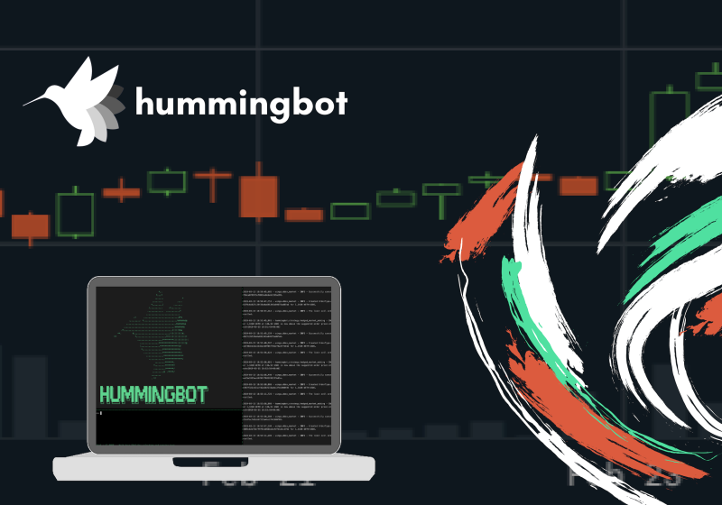
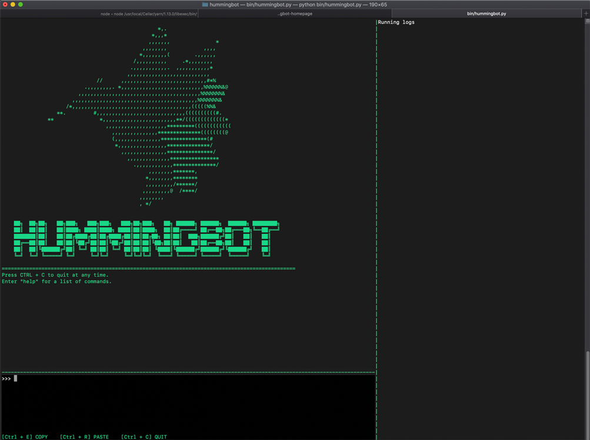
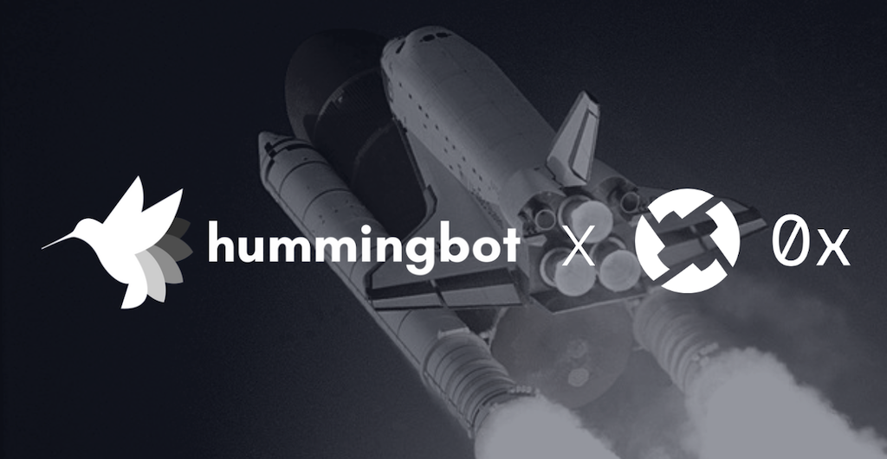

# Hummingbot is Live!

**Welcome to decentralized market making.**

Hummingbot is now public and open-source, and we’re beyond excited to bring this high-frequency market making trading bot to the masses.

The software is currently available on our [Github](https://github.com/hummingbot/hummingbot) and [Docker](https://hub.docker.com/r/hummingbot/hummingbot).

<!-- more -->

### What is Hummingbot?

Hummingbot is an open-source software client that allows users to create and customize automated, algorithmic trading bots for making markets on both centralized and decentralized digital asset exchanges.

Now, anyone can be a high-frequency trader and earn profits from market making, a trading strategy that was previously accessible only to algorithmic hedge funds. For our exchange partners, Hummingbot solves their liquidity challenges by turning their community into a decentralized army of market makers.

While Hummingbot is not the first publicly-available trading bot (in fact, we reviewed several), it was designed be to the simplest and easiest to use bot of its kind, enabling out-of-the-box high-frequency market making to users with limited technical expertise.

Like its hummingbird namesake, the elegant facade is only part of a highly-optimized machine.  Hummingbot was designed for institutional grade performance and reliability. Built on technologies such as Cython (Python compiled into C), Hummingbot utilizes low-level programming to optimize the speed and memory efficiency crucial for executing high frequency trading algorithms.

Hummingbot will serve as a base platform upon which users will be able to customize and build their own market making and trading strategies.

> Hummingbot's design philosophy: fuse simplicity and ease of use with performance and flexibility.

### Introducing the Hummingbot CLI

Users operate Hummingbot through an interactive command line interface:

#### Hummingbot's command line interface

For an explanation of the CLI and a summary of commands, visit the [Hummingbot documentation](../../../client/user-interface.md).

#### Initializing and configuring Hummingbot

Hummingbot is initialized and configured through a step-by-step command line interface (see [Client](../../../client/index.md) for a full example).

#### Automatically posting and adjusting orders

The above image shows Hummingbot automatically placing and adjusting orders on an exchange. Using the same Ethereum wallet, users can see their Hummingbot orders being placed and adjusted in the exchange's website.

### 0x Collaboration

Hummingbot has formed strategic alliances with several well-known decentralized finance (DeFi) projects. We received a development grant from [0x](https://0x.org), a leading open-source protocol for decentralized exchanges, to support the 0x ecosystem with Hummingbot.

>“We share 0x’s vision of a tokenized world, and we believe that solving the liquidity problem faced by decentralized exchanges will help make that vision a reality.” said Michael Feng, CEO and Co-Founder of CoinAlpha Inc, the company behind Hummingbot.

> “The 0x Core Team is very excited about the launch of Hummingbot. We believe it will lower the barriers to providing liquidity on the 0x network. Hummingbot has assembled a great team and we are thrilled to be working with them through our Ecosystem Acceleration Program.” said Will Warren, CEO and Co-founder of 0x.

### Become a Hummingbot partner 🤝

We’re establishing partnerships with additional cryptocurrency exchanges (both centralized and decentralized) to integrate with Hummingbot. We’re also seeking out crypto funds and token issuers who are interested in professional deployments of Hummingbot.

If this is you and you’d like to work with us, please contact: [partnerships@hummingbot.io](mailto:partnerships@hummingbot.io).

### About us

[CoinAlpha](https://coinalpha.com), the company behind Hummingbot, is a Mountain View-based startup founded in 2017 by a team with deep expertise in finance, machine learning, and blockchain engineering. Our mission is to build open source technologies that enable a more transparent, fair, and inclusive financial system. We are backed by Bain Capital Ventures, Ironfire Ventures, SharesPost, and the Stanford-StartX Fund.

### More Information

#### Get started
- [Install Hummingbot](../../../installation/index.md)
- [Join our official Discord server](https://discord.gg/hummingbot)
