# Hummingbot Miner: Year 1 Recap!

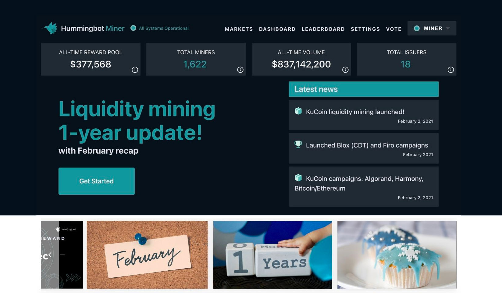

## Hummingbot Miner turns 1 year old!

The Hummingbot Miner platform has been live for one year!  When we launched Hummingbot Miner on March 3, 2020, we kicked off a new and sustainable way for issuers to source liquidity for their tokens. It was a data-driven approach for rewarding a decentralized group of market makers for providing liquidity and harnessing the collective trading power of communities.

We are thrilled that over the past year, the platform has provided liquidity for 18 different token issuers, with 1,622 unique miners participating and earning rewards.  Our decentralized market making community created order book depth and liquidity that resulted in $837mm of traded volume across the various liquidity mining campaigns!

<!-- more -->

## Year one summary stats

***March 3, 2020 to February 28, 2021***

- Liquidity campaigns for **18** token issuers:

    - Algorand, Ava Labs (Avalanche), Blox (CDT), COTI, Firo (Zcoin), Frontier, Hard (Kava), Mainframe/Hifi, NULS, Harmony (ONE), Phoenix Global, QuarkChain, iExec, Secret Network, Solana, Stratis Protocol, NEM, Zilliqa

- **$376k** equivalent paid out in total rewards

- **$837m** of traded, filled order volume

- **1,622** unique users have signed up, participated, made markets, and earned rewards

- Top ranked miner has earned $**66,092** equivalent in rewards, while the second place miner has earned **$21,941** equivalent 

## February 2021 highlights

- **Launch of liquidity mining on KuCoin!** We launched campaigns for **Algorand**, **Harmony (ONE)**, and our promotional campaign for **Bitcoin** and **Ethereum**

- Launch of campaigns on Binance.com for **Blox (CDT)** and **Firo** (the reincarnation of our long-time liquidity mining supporter, Zcoin!)

- February’s monthly traded volume totaled  **$362.1m**, an average of **$12.9mm daily traded volume**!

- **258** new users signed up and earned rewards on Hummingbot Miner in February, marking the largest monthly new user acquisition since the launch of the platform in March 2020

- Daily average of **39-48** bots per campaign/token issuers

- On average, users are deploying **$1,058** of assets per bot

- Weekly volume of **$91m** in the last week of February 2021

## KuCoin liquidity mining launch

We launched liquidity mining on our second exchange, KuCoin, at the beginning of February.  This was a major milestone for our company as we have worked to make the liquidity mining system stable and scalable to allow us expand to other exchanges.  We are planning to add support for at least 4 more exchanges this year, and this was just the start!

The KuCoin campaigns have been off to a great start in our initial “beta” period.  In total, **153 unique miners** participated and generated **$17.3m of filled trading volume** on KuCoin for Algorand, Harmony (ONE), and our promotional campaigns for Bitcoin and Ethereum:

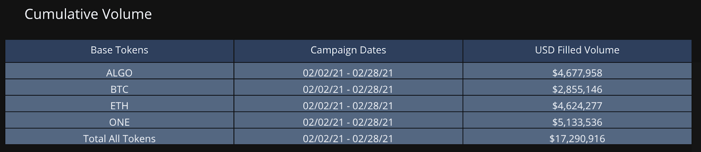

Hummingbot Miners were accounting for a meaningful amount of volume for Harmony ONE and Algo for the month, as much as 87% and 25%, respectively:

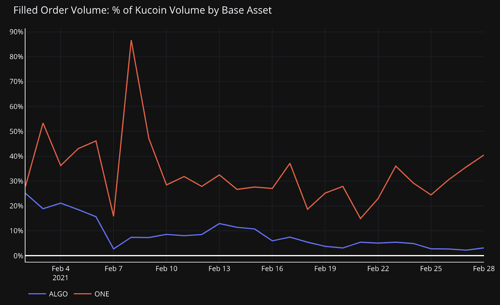

With the help of our early adopters and miners, we were able to uncover system issues and resolve them in the first month of the platform.  **We are also pleased to announce that the KuCoin liquidity mining platform is coming out of beta starting the month of March 2021!**

Bring on the new campaigns!!  Issuers with token listings on KuCoin, please contact us at [partnerships@hummingbot.io](mailto:partnerships@hummingbot.io) for more information.

New campaigns announcing and launching soon, stay tuned!

## Hummingbot Miner app updates

We are continually working to improve the [Humminbot Miner](https://miner.hummingbot.io) app and on providing users with a great experience that enables them to optimize their trading and participation in liquidity mining.  Below are some recent features we rolled out in February:

### More native token payout integrations

We enabled Avalanche (AVAX) payments in February, added Algorand USDC, and Firo (formerly Zcoin) native token payments.  We are currently working on adding Binance Chain BEP2 payments (for PHB) and Secret Network (SCRT) payments, coming soon!

### 24 hour volume stats

The app now shows the last 24h traded volumes generated by our miners. This metric shows the amount of our Hummingbot miners’ maker orders (order book depth) that have been filled.  This represents the amount of trading that has benefitted from the order book depth provided by Hummingbot miners.

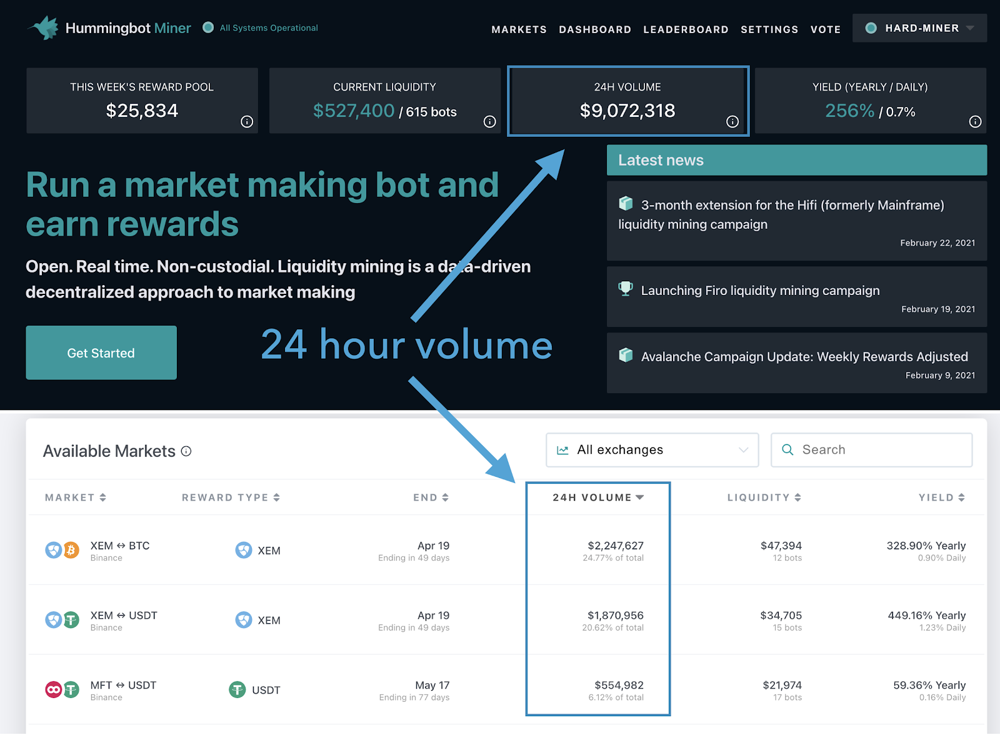

### Leaderboard trend

The leaderboard now shows each miner’s change in rewards ranking from the previous week.  Some users use this as a way to track how their bots are calibrated against other miners.  And, a little friendly competition never hurt anyone…. right??

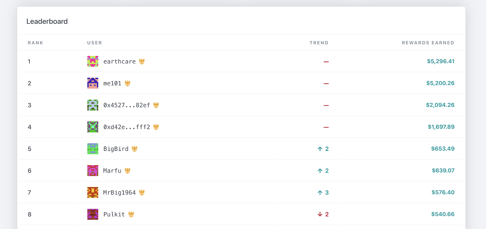

### Improved markets page layout and multiple exchange support

We have updated the market page table design, added search, as well as an exchange filter.  As we add on more and more trading pairs and exchanges, these features will help users to more easily navigate the various campaigns.

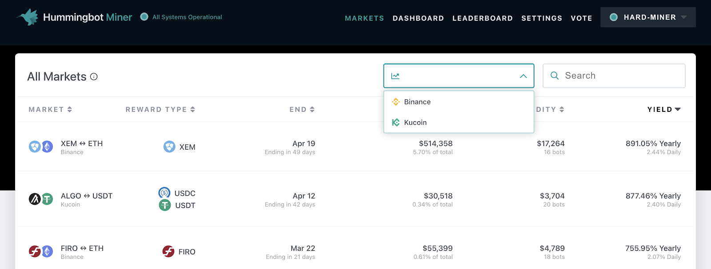

### Redesigned settings page layout

Improved navigation and design:

### Other updates on deck for the Miner app:

We have a number of improvements currently in the works:

- Redesign of individual market page to provide charting and improved data presentation to users to better enable trading and participation decisions

- Overhaul of miner performance page to better capture overall miner performance across all pairs that a miner is participating in

- Wallet and exchange API key validation and alerts to better inform users of any issues

- Public API: several of our users have commented that they would like access to campaign stats and rewards data, to enable them to integrate this data to their trading bots.  We are also integrating the Hummingbot client to interact with this data, to have a seamless integration for Hummingbot miners and bot users.  We already have the initial version of this deployed and will be releasing publicly in the near future!

**Do you have any suggested features or improvements?  Let us know!  Email our [Hummingbot miner team](mailto:miner@hummingbot.io) or chat with us on [discord](https://discord.hummingbot.io).**

## Platform stats

And now, on to our usual platform stats updates.

### 24h traded volume per $1 open order volume

We introduced this metric this past month, which demonstrates the capital efficiency of liquidity in the Hummingbot miner system.  This measure shows how many times, on average, Hummingbot miner orders are traded and turned over.  For example, the most recent figure of $25.90 means that for every $1 of orders placed in the most recent trading day (February 28), on average, those orders were traded 25.9x, resulting in $25.90 of traded order volume.

Taken in aggregate, there was $11.525mm of traded volume by miners on February 28, resulting from the day's average open order volume of $445k.  The $445k of orders were traded 25.9x ($11.525mm ÷ $445k) over the course of the February 28th 24 hour period.

### Daily traded volume

We have also added another metric showing the daily traded volume by miners.  The volume traded by Hummingbot miners has grown substantially in recent weeks, with an average of $10-15mm traded daily, reaching a peak of $33.3mm on February 23:

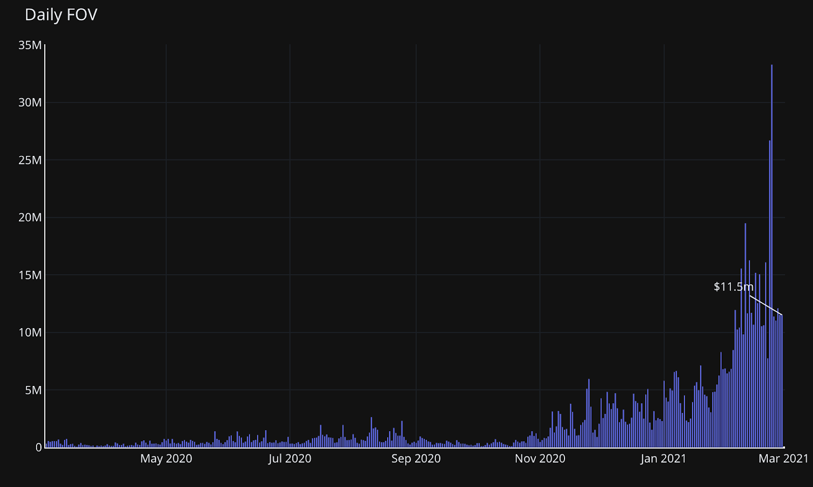

### Cumulative filled order volume

Since the launch of the Hummingbot Miner platform, miners have a cumulative trading volume of $837m ($819.8m on Binance and $17.3m on KuCoin):

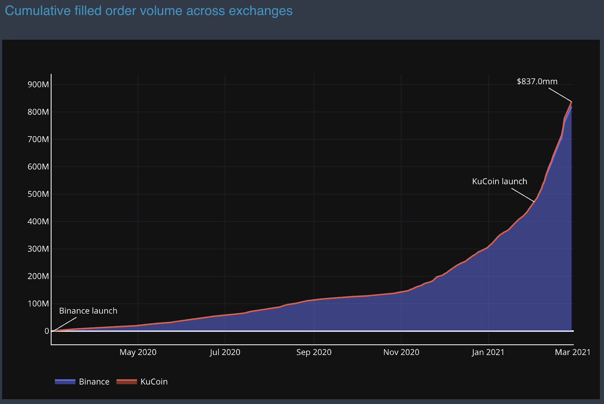

### Cumulative rewards payout to date

Miners have earned rewards in a combination of USDC, USDT, XEM, RLC, FIRO, USDT-TRON, ALGO, USDT ASA and USDC ASA (Algorand Standard Asset), STRAX, and AVAX. We continue to expand the capabilities of Hummingbot Miner to allow us to payout rewards in issuers’ own native tokens on their own blockchain.

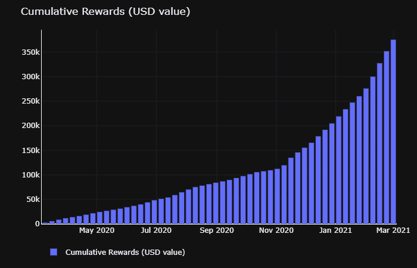

### Number of distinct miners

258 new users joined the platform and earned liquidity mining rewards in February. This was the largest monthly addition of new users since the launch of the platform, which extended the upward trend of recent months.

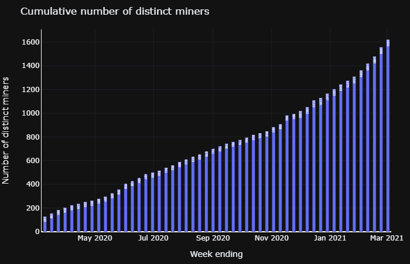

We saw 17% growth in the number of distinct miners in February.

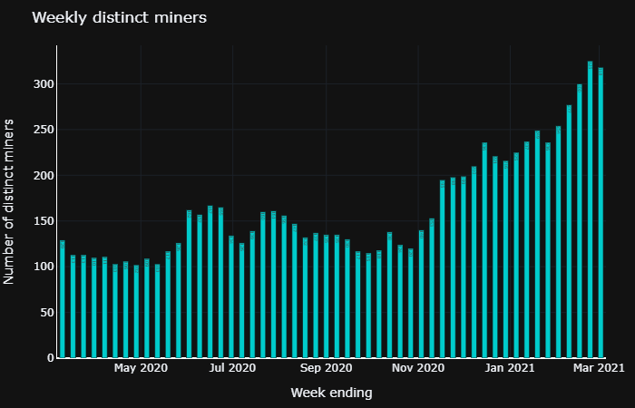

We saw 24.5% growth in the number of weekly active distinct miners in February.

### Total number of bots

Daily average active bots reached 526, an all-time high:

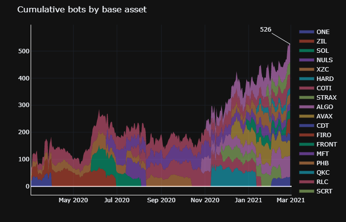

On average, for each issuer campaign, there are between 40-50 active bots participating:

### Open order volume

**“Total value locked”**
 
Average daily open order volume reached an all-time high of $560k this past month, and is currently $445k:

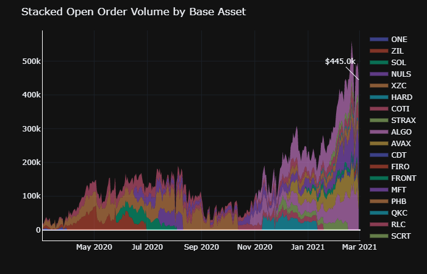

On average, miners are providing around $40k of liquidity per issuer campaign:

### Average amount of liquidity (open order volume) per bot

Currently, an average of **$1,058** of open order volume/liquidity is being created per bot.

Binance: filled order volume

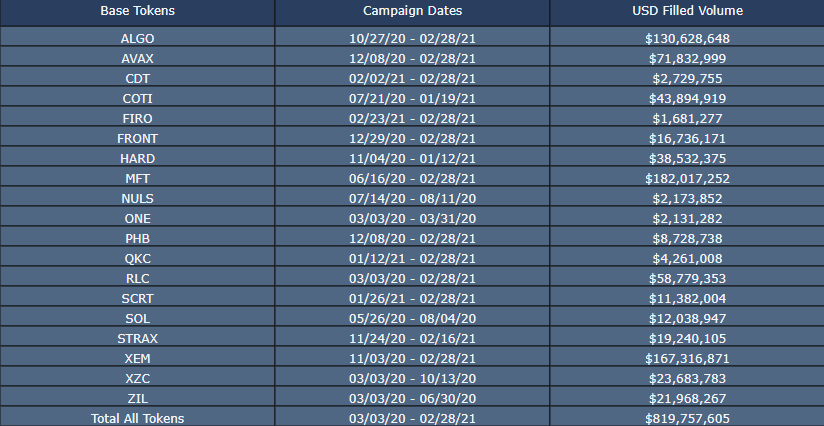

Filled order volume: March 3, 2020 to February 28, 2021

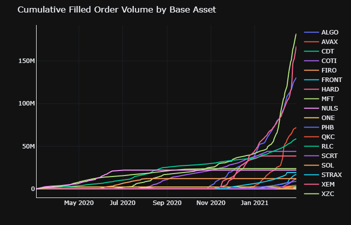

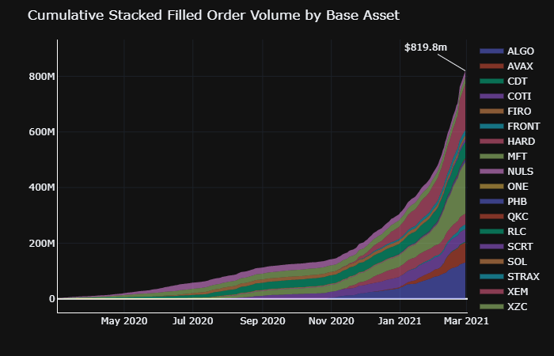

### Filled volume as % of Binance totals

### Filled order volume vs. reward pool

While liquidity mining does not compensate miners for traded volume, the increased liquidity and order book depth created by miners does translate into increased trading efficiently and, consequently, additional trading volume. Trading volume is important for issuers since exchanges typically use traded volume as a benchmark for deciding whether or not to maintain or remove token listings.

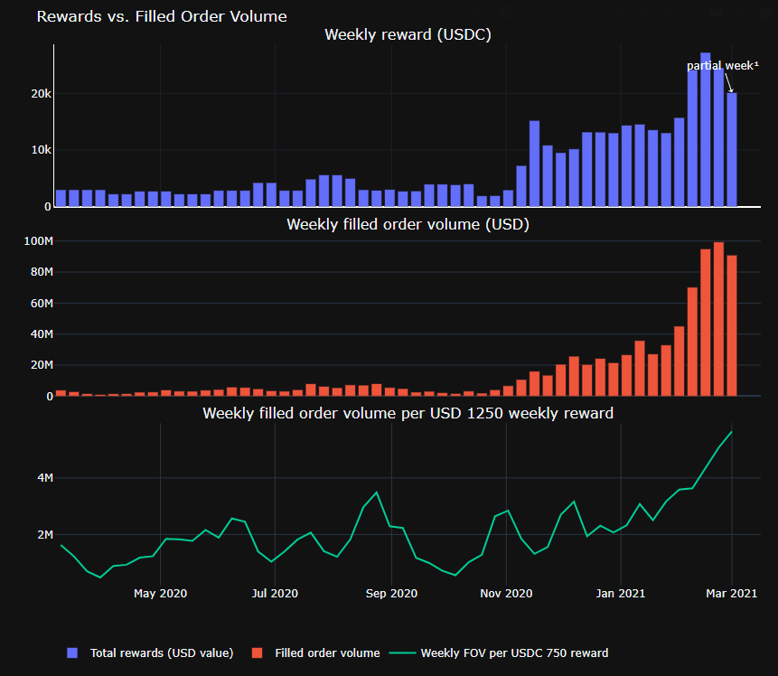

- A total reward pool of equivalent **$376k** yielded **$837 million** of traded volume across campaigns¹

- Over the past week, a weekly reward pool of equivalent **$1,250** (our minimum recommended amount for issuers for a campaign), resulted in weekly average of $5.7m filled order volume

***Note 1) Liquidity mining does not reward for filled order volume nor does it guarantee a certain amount of filled order volume. The above figures are based on historical data from currently running and historical liquidity mining campaigns.***

There was a range across campaigns, which can be seen in the following charts:

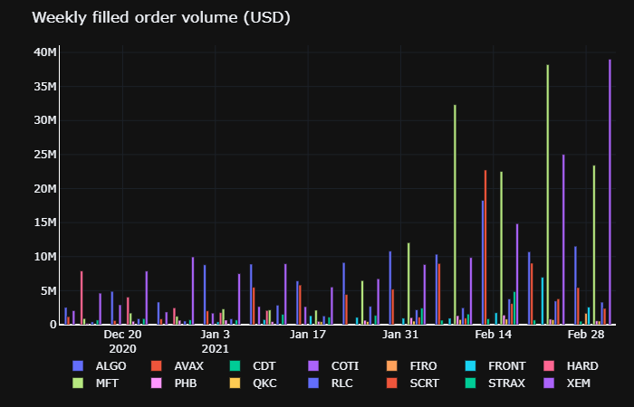

*(Note: Last data point is partial week data as of February 28, 2021 - 6 days)*

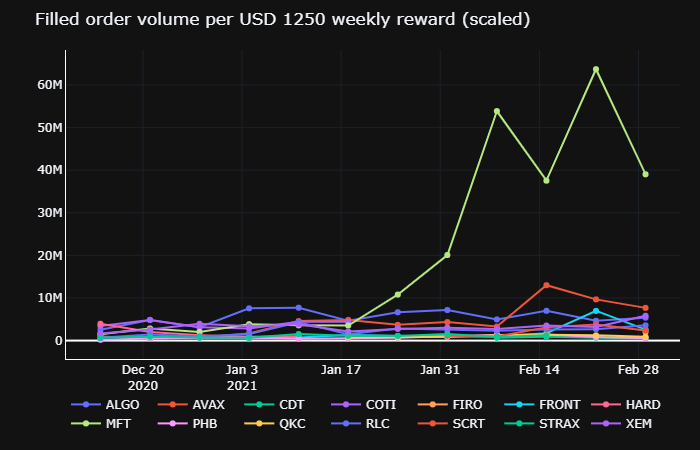

*(Note: last data point is partial week data as of February 28, 2021 - 6 days)*

🏛 **Token issuers**: contact the team at [partnerships@hummingbot.io](mailto:partnerships@hummingbot.io) to learn more about running liquidity mining campaigns on Kucoin, Binance.com, or to suggest the next exchange for us to integrate with!

🏦 **Exchanges**: contact [partnerships@hummingbot.io](mailto:partnerships@hummingbot.io) if you’d like to bring Hummingbot and liquidity mining to your exchange!

