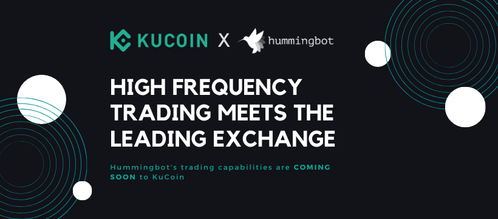

# Hummingbot Partners with KuCoin

**Hummingbot is thrilled to announce that it has partnered with leading crypto exchange [KuCoin](https://www.kucoin.com/) to bring Hummingbot’s trading capabilities to the exchange.**

#### KuCoin Exchange Connector

Integrating Hummingbot to KuCoin will enable KuCoin's account holders to deploy Hummingbot’s quantitative and algorithmic strategies to engage in high frequency, automated trading.  Currently available strategies include market making, arbitrage, liquidity mirroring, as well as trade execution strategies such as TWAP and VWAP execution.  Hummingbot also allows users to create their own custom strategies.

Development of the KuCoin exchange connector is already underway.  The connector is currently undergoing testing and we expect to release the integration by the end of January 2020.  

<!-- more -->

#### KuCoin Support of Hummingbot

As part of the partnership, KuCoin will be contributing a portion of the trading fees generated from Hummingbot users to the ongoing development of Hummingbot.  Hummingbot users can help support our project by using Hummingbot to trade on KuCoin.

#### About KuCoin

KuCoin is a leading centralized exchange that opened for cryptocurrency trading in September 2017 and has enjoyed steady growth into 2020. The KuCoin Exchange puts a high priority on the quality of the projects listed based on a well-trained research department that scours the blockchain industry for the highest quality projects. KuCoin provides an exchange service for users to conduct digital asset transactions securely and efficiently. Over time, KuCoin aims to provide long-lasting, increased value to its more than five million registered users, in over 100 countries. In November 2018, “The People’s Exchange” officially partnered with IDG Capital and Matrix Partners.

#### Additional Information

For additional information, please navigate to the following pages:

- [KuCoin](https://www.kucoin.com)
- [KuCoin’s telegram](https://t.me/KuCoin_Exchange)

> 🏛 **Token issuers**: if your token is listed on KuCoin or on [any of the exchanges](../../../exchanges/index.md) that Hummingbot is integrated with, please contact the team at [partnerships@hummingbot.io](mailto:partnerships@hummingbot.io) to learn more about our liquidity mining campaigns.

