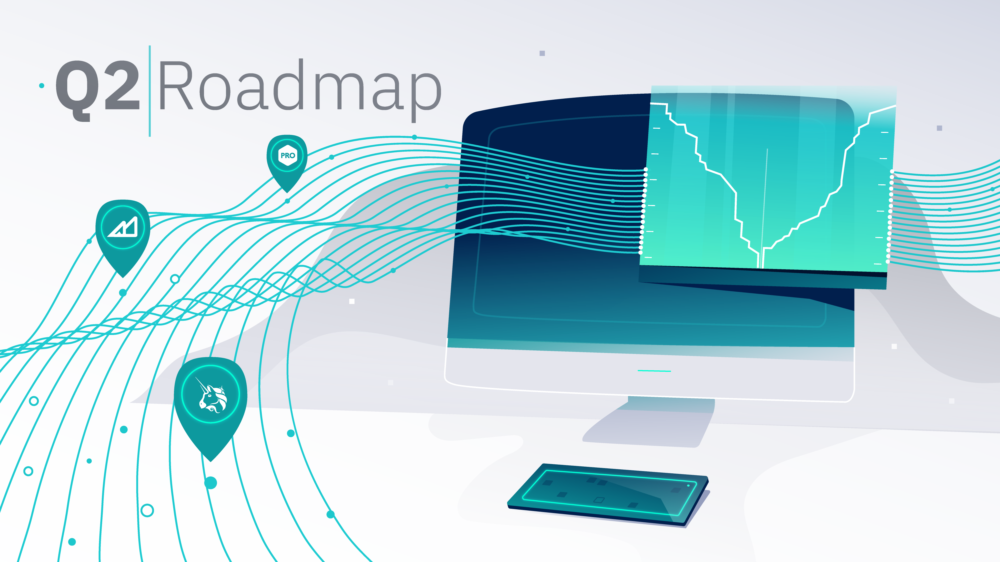
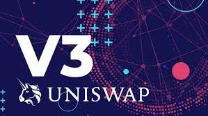
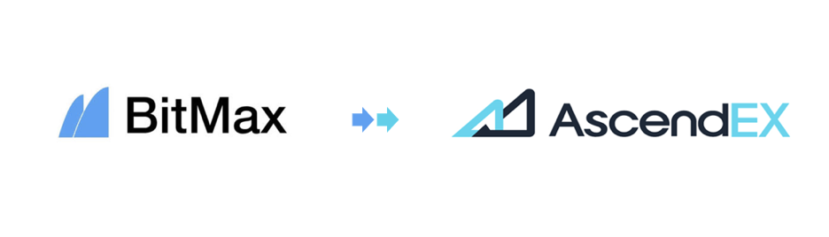
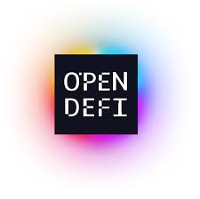

# Hummingbot Roadmap - Q2 2021 

Two years ago, we decided to open source the technology stack that powered our quant hedge fund and launch Hummingbot. Back then, everyone thought we were crazy, stupid, or both.

Today, [Hummingbot](https://github.com/hummingbot/hummingbot) has become the leading open source trading bot project in crypto, with 12,000+ Discord community members, 1,700+ stars, 700+ forks, and 80 contributors. With integrations to [20+ exchanges](../../../exchanges/index.md) and an expanding list of [protocols](/gateway/connectors/), Hummingbot helps both individual and professional quant traders all over the world skip the low-level drudgery of building and maintaining integrations to centralized and decentralized exchanges alike.

<!-- more -->

However, this is possible only because of [Hummingbot Miner](https://miner.hummingbot.io), the liquidity mining platform where Hummingbot users can run market making bots to earn token rewards. For token projects, Miner provides a more efficient, transparent, and community-based liquidity solution compared to hiring a market maker. For Hummingbot users, Miner allows them to earn higher yields than anywhere else in crypto. For us as a company, the fees earned from exchanges and projects who utilize the Miner platform sustain the development and maintenance of the Hummingbot open source project.

Since launch in March 2020, Hummingbot Miner has paid out $640k+ in rewards to 2000+ users. These users, which include both individual and professional market makers, earned these rewards by providing liquidity to top tokens like Avalanche (AVAX), NEM (XEM), Algorand (ALGO), and Solana (SOL).

**Since inception, Hummingbot liquidity miners have filled over $1.4 billion in trade volume.**

# What's next in 2Q

Despite this progress, the Hummingbot ecosystem still has a long road ahead to accomplish our mission of democratizing finance with open source software. We plan to scale the number of exchanges supported, improve support for custom strategies, and enhance our offerings for professional Hummingbot users. In addition, as a truly decentralized open source project that relies on external contributors, we plan to make the Hummingbot roadmap more transparent and give our community more influence in shaping it.

Please see below for more information on the initiatives we plan to ship over the rest of 2Q 2021 for both Hummingbot and Hummingbot Miner.

## New Hummingbot connector: Uniswap V3

We are excited to announce an upcoming new Hummingbot connector that supports [Uniswap V3](https://uniswap.org/blog/uniswap-v3/), along with a new strategy `uniswap_v3_lp` that lets Uniswap liquidity providers dynamically maintain their positions as market conditions change.

The new "range orders" in the design of Uniswap V3 give liquidity providers (LPs) greater control and enable them to be more capital efficient. Therefore, both we and Uniswap expect to see greater participation from professional market makers after V3 launches. However, since Uniswap V3 LPs will need to adjust their range orders as market prices change, a bot that automates order adjustment while taking into account fluctuations in gas prices, volatility, and other market data will be essential for LPs to stay competitive.

The first version of this connector and strategy, which we expect to ship shortly after Uniswap V3 launch in May, will likely be rudimentary and buggy, so please do not risk large amounts of capital with it. We plan to work with Uniswap to incrementally improve the design throughout the rest of this year.

## New Hummingbot Miner exchange: AscendEx

Since Hummingbot Miner has to collect and process large amounts of order book data coming from many different users simultaneously, supporting additional exchanges involves a large amount of engineering work. 

Currently, Miner supports [Binance.com](http://binance.com) and [KuCoin](http://kucoin.com), but we plan to scale Miner to support all major crypto exchanges over the next two years. We are excited to announce that the next exchange supported will be [AscendEx](https://ascendex.com/) (formerly known as BitMax)! 

With 250+ trading pairs and averaging $400M+ daily trade volume, AscendEx has become one of the top venues for new crypto tokens, and we have partnered with the AscendEx team for Miner to power liquidity for all of AscendEx's new listings for the remainder of 2021.

We expect AscendEx liquidity mining campaigns on Hummingbot Miner to start in June.

## Other Hummingbot initiatives in Q2

**Avellaneda market making**: We recently released [a new market making strategy](../../../academy-content/posts/guide-to-the-avellaneda-stoikov-strategy/index.md) based on the classic [Avellaneda-Stoikov market making paper](https://www.math.nyu.edu/~avellane/HighFrequencyTrading.pdf). Because this strategy has a more theoretically sound and academically rigorous foundation, we aim to make this strategy the initial strategy used by new Hummingbot market makers.

In the next few releases, we plan to port commonly used features from `pure_market_making` to `avellenada_market_making`, as well as move Avellaneda's inventory risk model into the `liquidity_mining` strategy.

**Connector refactoring and unit tests**: Over the past few months, we have added a number of new exchanges to Hummingbot, such as Ascendex, Beaxy, Blocktane, Digifinex, Probit, and Probit Korea. In addition, we've also started to add connectors to decentralized exchanges such as Uniswap, Balancer, Celo, and Terra. Yet we're still seeing increasing demand from new exchanges for connectors, and the current exchanges are continually updating their APIs and adding new derivatives products and trading pairs.

In order to continue adding exchanges, we need to refactor the existing connectors and improve their unit tests so that our QA and engineering teams can maintain the growing number of connectors supported by Hummingbot.

**Create your own Hummingbot strategy!**: We are placing a greater emphasis on creating documentation and guides that teach users how to create their own Hummingbot strategies. We have updated the [strategy creation documentation](../../../strategies/index.md), and we will be covering strategy creation in this Friday's edition of [Hummingbot Live](https://rebrand.ly/hummingbotlive).

We have partnered with Gitcoin to support the [OpenDeFi hackathon](https://gitcoin.co/hackathon/open-defi/onboard) going on now, so you can win bounties for creating Hummingbot strategies!

## Other Hummingbot Miner initiatives in Q2

**Improved payouts support**: Hummingbot Miner pays miners every week by sending their accrued token rewards to wallets that they select. Since these payouts occur on various blockchains, ensuring that these payouts go through smoothly is a challenging process. In addition, we also have to collect certain compliance forms from users who earn more than $600 in a calendar year. 

We are currently working to streamline and automate this process, which should result in a smoother payouts experience for both liquidity miners and our operations team.

**Miner API**: In June, we plan to formally launch a public Hummingbot Miner API, which will allow miners to programmatically incorporate real-time Miner metrics like rewards, yields, and liquidity into their bots. Similar to exchange APIs, the Miner API will include a **public API** which has public statistics for the overall system, as well as **private API** with miner-specific data. 

Some of these API endpoints are already being used by the `liquidity_mining` strategy in Hummingbot, and we plan to expand this support over time.

**App redesign**: Last but certainly not least, we're working on an extensive redesign of the Hummingbot Miner app. The redesign aims to make Miner more exchange-like from a design standpoint, as well as using charts and graphs to display data more visually. Users will also be able switch between light and dark modes!

Below is an early design of the new Market view:

