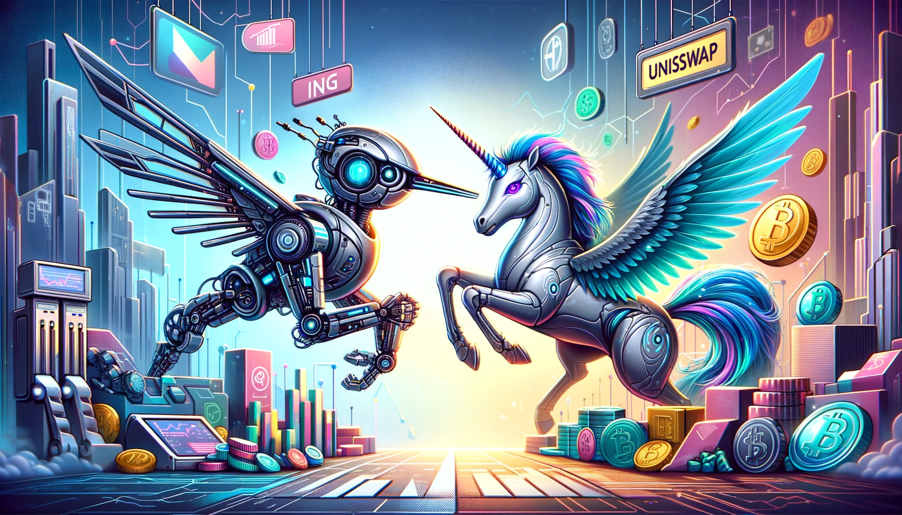
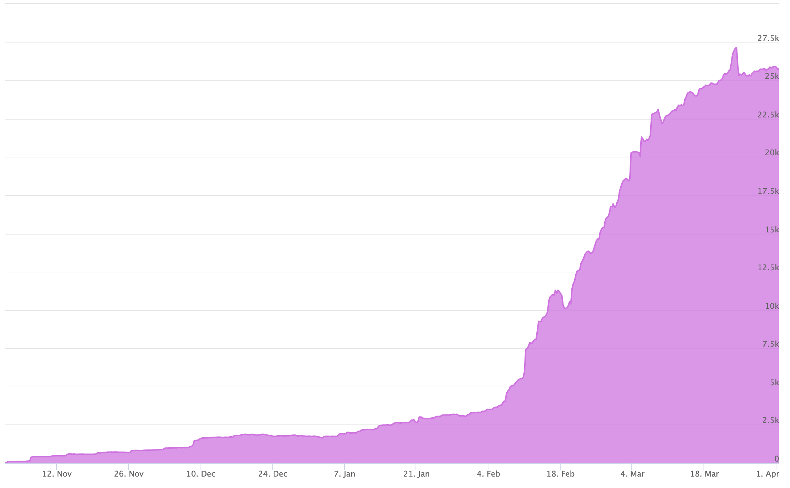
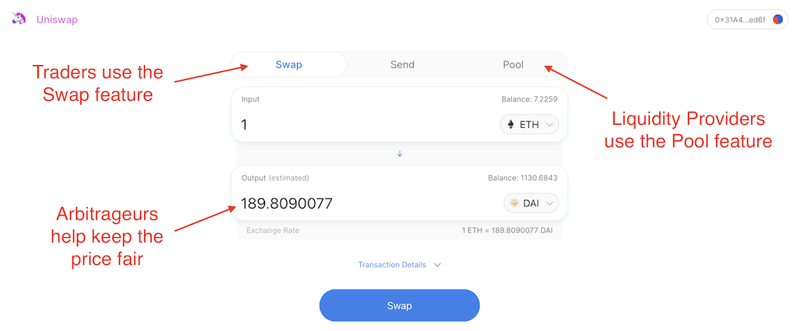
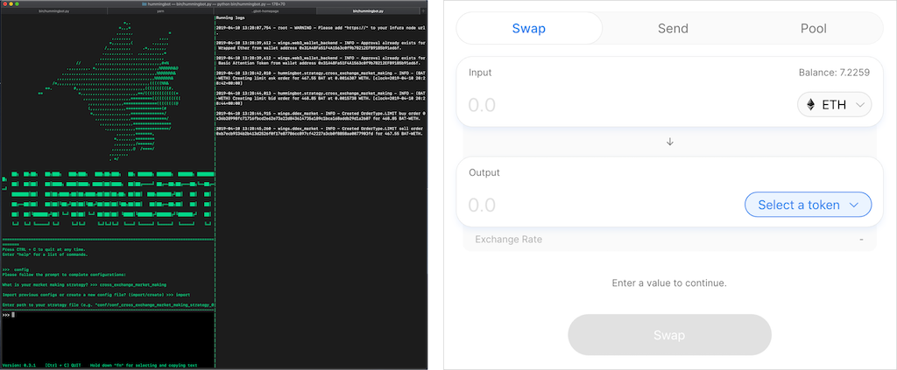

# Hummingbot vs Uniswap: Two Approaches to Liquidity

Since both Hummingbot and Uniswap are both open source projects that allow users to make money by providing liquidity, many people have asked how they compare to each other. 

Below, we shed more light on their similarities and differences and explain why the two projects are highly complementary.

<!-- more -->

### What is Uniswap?

[Uniswap](https://uniswap.exchange/) is an Ethereum-based automated market maker that uses an elegant "constant product" design which calculates the exchange rate for any trade such the value of its token reserves stays equivalent both before and after the trade transpires. 

Funded by an Ethereum Foundation grant, Uniswap is truly decentralized with no token or company behind it. Uniswap also boasts a simple yet intuitive user interface. Because of these factors, it has grown into an indispensable public utility within the Ethereum ecosystem:

Many great articles already [describe Uniswap](https://medium.com/scalar-capital/uniswap-a-unique-exchange-f4ef44f807bf), analyze its profitability, and explain the theory behind automated market makers. 

While rehashing those articles is outside the scope of this post, we note that there are three types of users in the Uniswap ecosystem:

* **Traders**: users who use Uniswap to swap tokens
* **Liquidity providers**: users who provide the token reserves used by Uniswap to facilitate trades. These users earn fees charged on each swap (currently 0.3%).
* **Arbitrageurs**: rather than an external price feed, Uniswap relies upon external market participants to keep its prices in line with other markets. When the Uniswap price for a trading pair deviates from other markets, arbitrageurs (mostly bots) can buy from the lower price market and sell in the higher price market, thereby making an arbitrage profit while helping to align prices.

### How are Hummingbot and Uniswap similar?

Both Hummingbot and Uniswap enable users to profit from providing **liquidity**, a huge problem for many crypto projects. In past blog posts, we've written about [why liquidity is beneficial](../../../blog/posts/how-to-think-about-liquidity-blockcrunch/index.md) and [what happens when liquidity is missing](../the-thin-crust-of-liquidity/index.md). 

Moreover, both Hummingbot and Uniswap users can provide liquidity for **decentralized, non-custodial trading venues**. Lack of liquidity currently prevents decentralized, non-custodial exchanges (DEX) from being a compelling alternative to centralized exchanges. As Hummingbot, Uniswap, and other projects improve liquidity for DEXs, we believe that more and more users will choose them over centralized exchanges that carry the risk of [hacks](https://www.coindesk.com/bithumb-exchanges-31-million-hack-know-dont-know) and [outright frauds](https://www.cbc.ca/news/canada/nova-scotia/quadrigacx-cryptocurrency-exchange-bankruptcy-1.5089539).

Finally, both Hummingbot and Uniswap are **open source**. In a world where malicious backdoor code can potentially wipe out a user's life savings, the transparency of an open source code base is critical. 

### How are Hummingbot and Uniswap different?

From a side-by-side comparison of the user interfaces, it's clear that Hummingbot and Uniswap target two different types of liquidity providers:
* Hummingbot is for **power users** (developers, quants, and active traders) who value configurability, flexibility, and control
* Uniswap is for **mainstream users** who want convenience, ease of use, and simplicity

Since Uniswap uses a pre-determined, immutable formula to calculate its buy and sell offer prices, its liquidity providers just need to deposit tokens in order to start earning fees. While it's dead simple to use, liquidity providers cannot alter the formula and may incur losses `depending on how prices change`.

On the other hand, Hummingbot is a highly configurable, open source algo trading platform that supports different strategies and exchanges, both centralized and decentralized. Because trading is a competitive sport, we encourage users to create and customize our strategy templates. In return for a steeper learning curve and a longer installation and configuration process, Hummingbot grants users the power to experiment with various strategies on different markets.

### Hummingbot 🐦 + Uniswap 🦄

Recall that Uniswap depends upon arbitrageurs to keep prices fair and aligned with the rest of the market. Meanwhile, Hummingbot's `arbitrage` strategy helps you create a bot that exploits price differences across different exchanges. Boom💥!

We're excited to announce an upcoming Uniswap connector for Hummingbot. Soon, Hummingbot users will be able to play the **Arbitrageur** role in the Uniswap ecosystem by running an arbitrage bot that monitors the price differences between Uniswap, Binance, Coinbase Pro, Radar Relay, DDEX, and other exchanges. 

When prices differ between Uniswap and other markets, the bot will automatically buy low and sell high, improving Uniswap market efficiency while earning arbitrage profits for Hummingbot users.

Both Hummingbot and Uniswap are open source projects that share the same mission: improving liquidity in decentralized finance. We target different user personas who have different needs, allowing both projects to better serve the entire market.